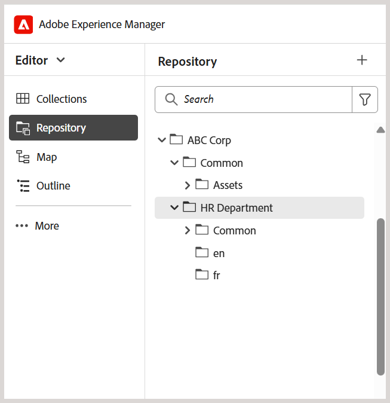

# Práticas recomendadas para configurar a estrutura de pastas

Este artigo fornece etapas essenciais e práticas recomendadas para administradores definirem estruturas de pastas no Adobe Experience Manager Guides. Uma hierarquia de pastas bem organizada garante fluxos de trabalho tranquilos de criação, publicação e tradução para conteúdo de aprendizado e treinamento.

## Configurar a estrutura de pastas

Para permitir o acesso a vários recursos de criação, publicação e tradução do Experience Manager Guides, configure as pastas na hierarquia correta, conforme explicado abaixo.

**Criar uma pasta de nível raiz**

Comece criando uma pasta raiz para sua organização. Isso serve como base para todas as pastas de nível de departamento e ativos compartilhados com frequência.

Exemplo: `/content/dam/ABC-Corp/`

Nesta pasta raiz, crie uma pasta dedicada para gerenciar ativos que serão usados em vários departamentos. Por exemplo, crie uma pasta **Comum** para incluir recursos compartilhados, como imagens, vídeos e muito mais.

**Criar pastas de nível de departamento**

Crie pastas separadas para cada departamento, como departamento de RH, financeiro e jurídico, para que eles possam gerenciar seu próprio conteúdo.

*Legenda: estrutura de pasta separada criada para o Departamento de RH na pasta raiz*

**Práticas recomendadas para definir pastas de nível de departamento**

- Crie uma pasta dedicada **Comum** > **ativos** em cada departamento para ativos comuns de nível de departamento (se necessário).
- Caso queira compartilhar o conteúdo para tradução, crie pastas específicas de idioma (por exemplo, en, de, fr). Os autores devem criar ou atualizar o conteúdo somente na pasta do idioma de origem (como en), já que o conteúdo fora da pasta do idioma de origem não está incluído no fluxo de trabalho de tradução. As outras pastas de idioma podem ser mantidas vazias como espaços reservados. Saiba mais sobre a [tradução de conteúdo](../user-guide/translation.md).
- As permissões podem ser usadas para limitar o acesso de departamentos ou usuários específicos à estrutura de pastas recém-criada. Por exemplo, atribua permissões para garantir que somente os usuários do departamento de RH possam criar ou modificar conteúdo na pasta designada.

Repita a mesma estrutura para outros departamentos, como Finanças, Jurídico etc.

## Configurar a estrutura da pasta de saída

A pasta `fm-ditaoutputs` serve como o local de armazenamento padrão para saídas geradas do conteúdo de Aprendizado e Treinamento. Normalmente, essas saídas incluem pacotes SCORM (arquivos ZIP) na pasta **alm** e PDFs na pasta **pdf**.Você pode alterar esse caminho de saída padrão no nível predefinido a partir do **Console do mapa**, se necessário.

Ao trabalhar com vários departamentos, considere criar pastas específicas do departamento dentro da estrutura de pastas do `fm-ditaoutputs` para garantir que os usuários em um departamento específico tenham acesso às pastas de saída relevantes.

## Criar usuários e atribuí-los aos grupos apropriados

Depois que a hierarquia de pastas for estabelecida, você poderá começar a criar usuários e adicioná-los a grupos para que eles tenham acesso a recursos relevantes no Experience Manager Guides. O Experience Manager Guides fornece três grupos prontos para uso - Autores, Revisores e Editores. Dependendo do grupo ao qual um usuário está associado, ele pode executar tarefas específicas. Por exemplo, a tarefa de publicação pode ser executada somente por um editor, mas não por um autor.

Para criar novos usuários e adicioná-los a grupos, navegue até **Ferramentas** > **Segurança** > **Usuários**.

Na página Gerenciamento de usuários, selecione **Criar** para criar um novo usuário. Adicione detalhes do usuário e atribua-os a um grupo.

Para obter mais detalhes, consulte [Administração e segurança do usuário](../cs-install-guide/user-admin-sec.md)

## Atribuir permissões para cada grupo de usuários

Depois que os usuários forem adicionados aos grupos apropriados, configure as permissões em nível de grupo para garantir que eles tenham acesso às pastas de criação e saída corretas no Repositório.

Para atribuir permissões, navegue até **Ferramentas** > **Segurança** > **Permissões**.

Essas permissões ajudam a garantir que os usuários possam criar ou modificar conteúdo somente em suas pastas designadas.

Para obter mais detalhes, consulte [Permissões no AEM](https://experienceleague.adobe.com/en/docs/experience-manager-65/content/security/security#permissions-in-aem).

