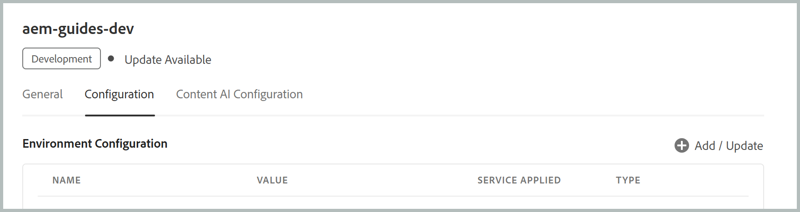
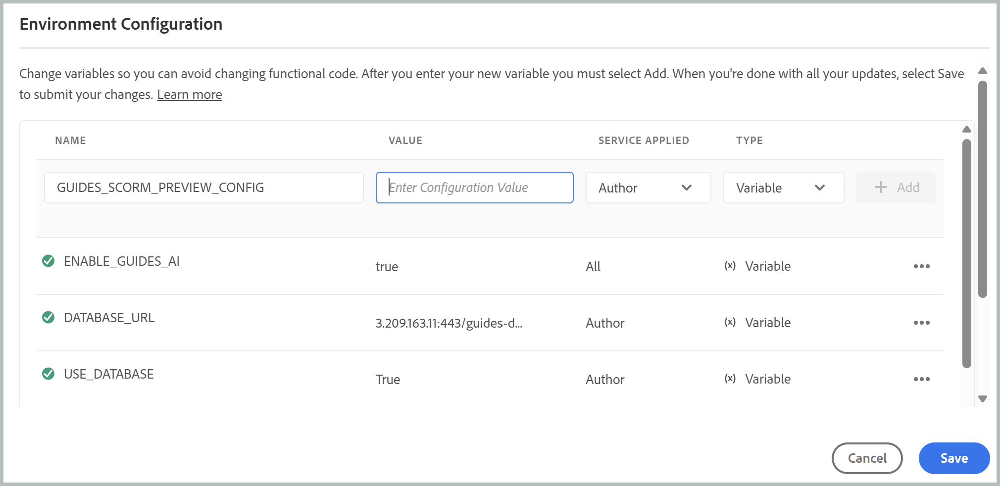

# Configurar a Política de segurança de conteúdo (CSP) para visualização de SCORM

A visualização do Experience Manager Guides SCORM é gerenciada por meio de uma variável de ambiente dedicada que controla a Política de segurança de conteúdo (CSP) aplicada à experiência de visualização. Depois que a configuração for ativada, os administradores poderão ampliá-la adicionando outras fontes confiáveis. Essas fontes podem incluir scripts, estilos, fontes, imagens, mídia, quadros e muito mais, necessários para que os pacotes SCORM carreguem e renderizem visualizações corretamente no Experience Manager Guides.

Este artigo explica como adicionar e configurar a variável de ambiente no Cloud Manager, detalha o que cada campo no valor JSON faz e mostra como atualizar o valor posteriormente, se as suas necessidades forem alteradas.

## Campos de configuração

A variável `GUIDES_SCORM_PREVIEW_CONFIG` aceita o objeto JSON como seu valor. Cada valor controla um aspecto específico da CSP aplicado durante a visualização de SCORM:

| Campos | Tipo | Descrição |
|---|---|---|
| `CSP_ENABLED` | Booleano | Ativa (`true`) ou desativa (`false`) a imposição de CSP para a visualização de SCORM. |
| `ALLOW_UNSAFE_EVAL` | Booleano | Permite o uso de `eval()` e de métodos de avaliação similares não seguros do JavaScript quando definido como `true`. |
| `ADDITIONAL_SCRIPT_SRC` | Matriz | Fontes confiáveis adicionais permitidas para servir o JavaScript. |
| `ADDITIONAL_STYLE_SRC` | Matriz | Fontes confiáveis adicionais permitidas para fornecer folhas de estilos. |
| `ADDITIONAL_FONT_SRC` | Matriz | Fontes confiáveis adicionais permitidas para fornecer fontes. |
| `ADDITIONAL_FRAME_SRC` | Matriz | Fontes confiáveis adicionais podem ser carregadas dentro de `<iframe>` elementos. |
| `ADDITIONAL_IMG_SRC` | Matriz | Fontes confiáveis adicionais permitidas para fornecer imagens. |
| `ADDITIONAL_MEDIA_SRC` | Matriz | Fontes confiáveis adicionais podem fornecer conteúdo de áudio/vídeo. |
| `ADDITIONAL_WORKER_SRC` | Matriz | Fontes confiáveis adicionais permitidas para servir trabalhadores da Web. |
| `ADDITIONAL_CONNECT_SRC` | Matriz | Fontes confiáveis adicionais às quais a visualização pode se conectar (por exemplo, chamadas XHR/fetch). |
| `ADDITIONAL_MANIFEST_SRC` | Matriz | Fontes confiáveis adicionais permitidas para servir manifestos de aplicativo Web. |
| `ADDITIONAL_OBJECT_SRC` | Matriz | Fontes confiáveis adicionais podem ser carregadas via `<object>`, `<embed>` ou `<applet>`. |


## Valores padrão para campos de configuração

```json
{
  "CSP_ENABLED": true,
  "ALLOW_UNSAFE_EVAL": false,
  "ADDITIONAL_STYLE_SRC": ["https://fonts.googleapis.com"],
  "ADDITIONAL_FONT_SRC": ["https://fonts.gstatic.com"],
  "ADDITIONAL_FRAME_SRC": ["https://www.youtube-nocookie.com", "https://www.youtube.com"],
  "ADDITIONAL_SCRIPT_SRC": [],
  "ADDITIONAL_WORKER_SRC": [],
  "ADDITIONAL_IMG_SRC": [],
  "ADDITIONAL_MEDIA_SRC": [],
  "ADDITIONAL_CONNECT_SRC": [],
  "ADDITIONAL_MANIFEST_SRC": [],
  "ADDITIONAL_OBJECT_SRC": []
}
```

Dependendo das suas necessidades, não é necessário preencher todos os valores; deixe qualquer tipo de origem como uma matriz vazia se não for necessário permitir origens adicionais para ela.

>[!NOTE]
>
> Se quiser desabilitar a imposição de CSP para visualização de SCORM, defina `"CSP_ENABLED": false` no valor JSON.

## Adicionar a variável no Cloud Manager

1. Faça logon no Cloud Manager e selecione o ambiente no qual deseja aplicar a configuração.
2. Navegue até a guia **Configuração** do ambiente.
3. Selecione **Adicionar/Atualizar** para adicionar uma variável de ambiente.

   {width="650"}

4. Insira o nome da variável (`GUIDES_SCORM_PREVIEW_CONFIG`) no campo **Nome**.

   {width="650"}

5. Insira a configuração JSON completa, incluindo as listas de permissões de origem de que seu curso precisa, no campo **Valor**.
6. Selecione o **Serviço aplicado** para escolher se a variável deve se aplicar a **Autor**, **Publicar** ou ambos. Para criação no Experience Manager Guides, selecione **Autor**.
7. Selecione **Variável** no campo **Tipo**.
8. Selecione **Adicionar**.
9. Selecione **Salvar**.

   {width="650"}

Depois de salvar, o Cloud Manager aplica a configuração ao ambiente selecionado. Normalmente, isso leva de 10 a 12 minutos para se propagar, portanto, aguarde até que a atualização seja concluída. Depois de concluída, a nova configuração estará ativa para a visualização de SCORM nesse ambiente.

## Atualizar os valores da variável

Se seus requisitos forem alterados, você poderá rever a variável `GUIDES_SCORM_PREVIEW_CONFIG` a qualquer momento na mesma guia Configuração do Cloud Manager. Localize a variável existente e selecione sua opção **Adicionar/Atualizar** para abri-la para edição e, em seguida, revise o valor conforme necessário.