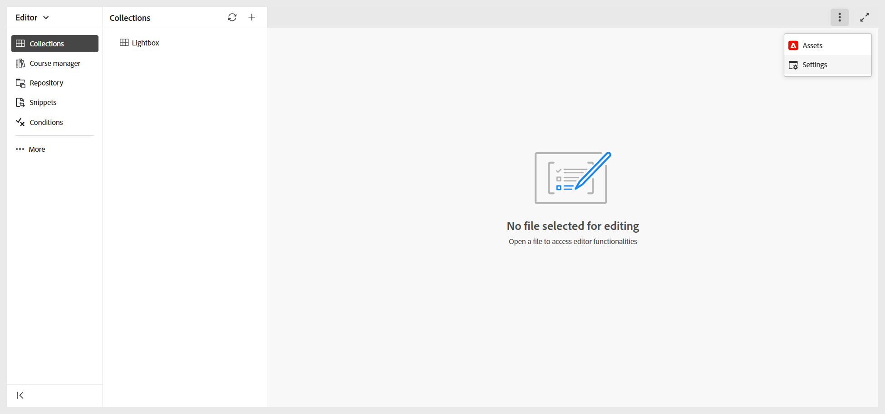
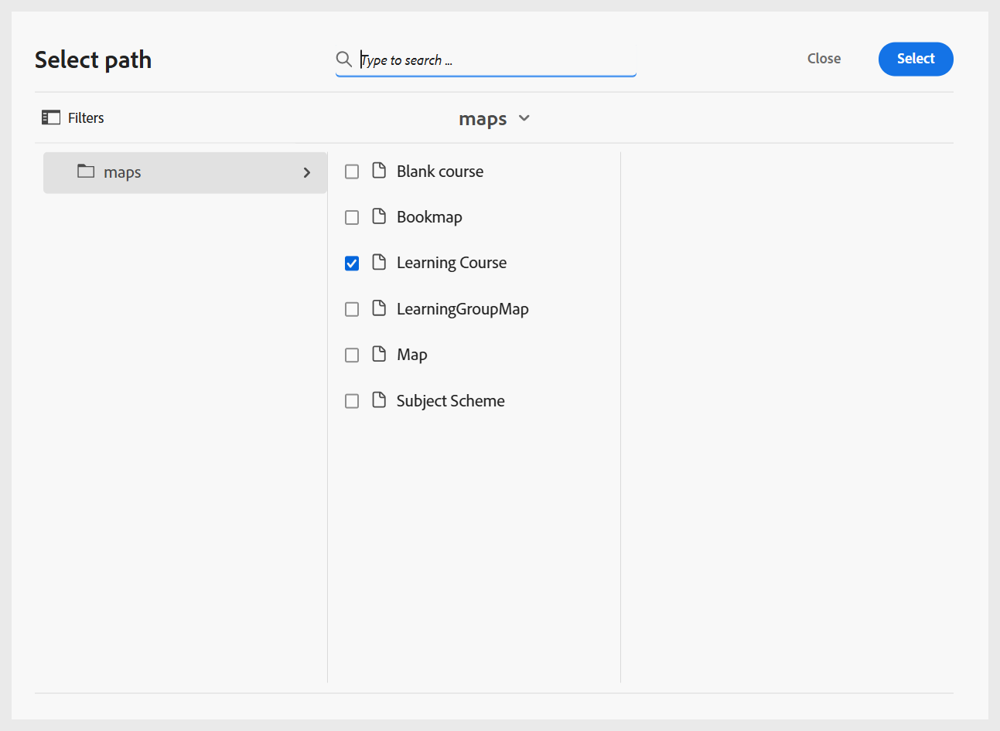
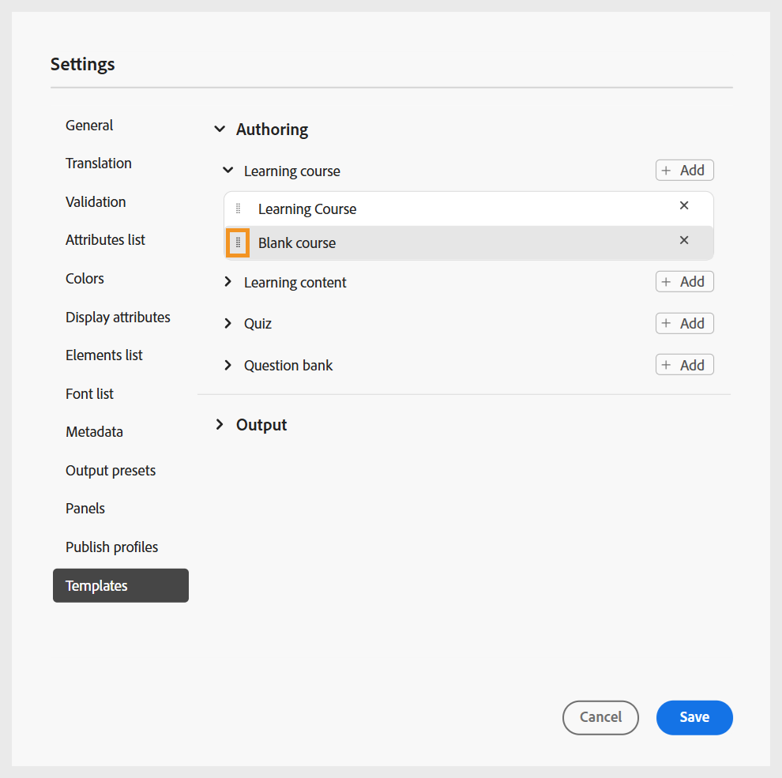

# Configurar perfis de pasta

É necessário um perfil de pasta para separar as configurações de diferentes departamentos ou produtos em sua empresa. Para conteúdo de aprendizado e treinamento, você pode criar e configurar um perfil no nível da pasta para gerenciar modelos de criação, modelos de saída, predefinições de saída e outras configurações no nível da pasta.

Saiba mais sobre [Práticas recomendadas para configurar a estrutura de pastas](best-practices-folder-structure.md).

Para começar a usar a configuração do perfil de pasta para o conteúdo de Aprendizado e Treinamento, é necessário:

1. **Crie pastas diferentes para gerenciar modelos de criação e saída**: você pode criar pastas para Autores e Editores que trabalham em diferentes departamentos ou produtos da sua empresa. Essas pastas podem ser mapeadas para perfis de pastas específicos, cada um configurado com diferentes modelos de criação e saída para suportar a criação de cursos de aprendizado específicos do departamento e a administração descentralizada.

   Você pode criar uma nova pasta no painel Repositório.

   {width="350"}
2. **Criar pastas de idioma para gerenciar a tradução**: se você traduzir conteúdo em idiomas diferentes, deverá criar pastas correspondentes a cada idioma. Cada uma dessas pastas de idioma conterá o conteúdo correspondente a esse idioma.

3. **Criar uma pasta para gerenciar o Assets**: assim como as pastas, você também pode criar diferentes pastas do Assets para atender às necessidades de diferentes departamentos. Dessa forma, você também garante que Autores e Editores tenham acesso ao CSS correto configurado em seus modelos, imagens e outros ativos.

   {width="350"}
4. [Crie um perfil de pasta](../cs-install-guide/conf-folder-level.md#create-and-configure-a-folder-level-profile) para mapear pastas diferentes.
5. **Selecione o perfil de pasta a ser configurado**: depois que o perfil de pasta for criado, você precisará selecionar o perfil de Pasta na página [Preferências do Usuário](../user-guide/intro-home-page.md#user-preferences) para garantir que os Autores e Publicadores tenham acesso aos modelos corretos.

   {width="650"}

6. **Definir configurações do perfil da pasta**: para conteúdo de Aprendizado e Treinamento, as seguintes configurações podem ser definidas no nível da pasta:
   - [Geral](#general)
   - [Painéis](#configure-panels)
   - [Modelos de conteúdo](#configure-content-templates)
   - [Predefinições de saída](#configure-output-presets)
   - [editor do HTML](#html-editor-settings)
   - [Publicar perfis](#manage-publish-profiles)

Para acessar essas configurações, alterne para o modo de exibição Editor e selecione **configurações do Workspace** no menu **Opções**, conforme mostrado abaixo:

## Geral

Na guia General, você pode definir as seguintes configurações específicas para o recurso Product Training and Learning Content:

{width="350"}

- **Conteúdo de aprendizado**: Use a opção **Habilitar conteúdo de aprendizado** para habilitar ou desabilitar o recurso no nível de perfil de pasta.
- **Editor do HTML**: essa configuração permite configurar o Editor para criação baseada no HTML. As principais opções de configuração presentes nessa configuração são as seguintes:

   - **Ocultar estilo em linha**: habilite esta opção para impedir que os autores apliquem formatação em linha ao conteúdo do curso. Quando ativado, todas as opções de estilo em linha, como Fontes, Borda, Layout, Plano de fundo e Colunas presentes no painel direito do Editor permanecem ocultas para Autores. No entanto, os Autores ainda podem usar as opções de estilo baseadas em classe global disponíveis no painel **Estilos**. Isso ajuda a manter a consistência com as diretrizes de estilo de sua organização.
   - **Ocultar o modo de exibição do Source para Autores**: habilite essa opção para restringir o acesso ao código-fonte do HTML. Isso é útil quando você deseja simplificar a experiência de edição ou evitar alterações acidentais no código subjacente.

## Configurar painéis

Esta configuração controla os painéis que são mostrados nos painéis esquerdo e direito do **Editor** e do **Console de mapas** no Experience Manager Guides. Você pode alternar o botão para mostrar ou ocultar o painel desejado.

Para o conteúdo de aprendizado e treinamento, verifique se apenas os seguintes recursos estão ativados para o editor e o console de mapa.

{width="350"}

### Editor

**Painel esquerdo**

- **Coleções**: permite que você organize e salve arquivos usados com frequência ou acesse rapidamente arquivos compartilhados.
- **Explorer**: permite que você visualize e acesse todos os seus mapas, tópicos, imagens e outros ativos armazenados no repositório de conteúdo.
- **Gerenciador de cursos**: fornece um espaço de trabalho dedicado para a criação e o gerenciamento de cursos.
- **Mapa**: fornece uma exibição de mapa do arquivo de mapa aberto no momento.
- **Estrutura de Tópicos**: exibe a hierarquia estrutural do tópico ou mapa aberto no momento, permitindo a navegação rápida e o acesso em nível de elemento.
- **Workfront**: fornece acesso a recursos robustos de gerenciamento de projetos além dos principais recursos do Experience Manager Guides CCMS.
- **Conteúdo reutilizável**: permite gerenciar e inserir elementos ou tópicos reutilizáveis para garantir a consistência e reduzir a duplicação no conteúdo.
- **Glossário**: permite criar e gerenciar termos de glossário e incluí-los em tópicos para manter a terminologia consistente.
- **Fragmentos**: permite criar e reutilizar pequenos fragmentos de conteúdo em vários tópicos em seus cursos de aprendizado.
- **Condições**: permite configurar atributos condicionais em nível global e de pasta.
- **Modelos**: permite que você crie e gerencie os modelos do curso.
- **Citações**: permite que você adicione e gerencie citações em conteúdo usando estilos de citação compatíveis.
- **Variáveis de idioma**: permite definir variáveis de idioma para saída publicada.
- **Variáveis**: permite criar e gerenciar variáveis para usar no conteúdo de aprendizado.
- **Modelos de saída**: permite que você crie e gerencie modelos de saída para gerar saída em vários formatos.
- **Localizar e substituir**: fornece opções para procurar e substituir texto entre arquivos em um mapa ou uma pasta no seu repositório. 
- **Fontes de dados**: permite que você se conecte a fontes de dados externas e reutilize os dados em seu conteúdo.
- **Avaliação**: permite criar e gerenciar fluxos de trabalho de revisão no Experience Manager Guides.
- **Relatórios do sistema**: permite criar e gerenciar relatórios.

**Painel direito**

- **Propriedades de conteúdo**: contém informações sobre o tipo e os atributos do elemento atualmente selecionado no Editor.
- **Propriedades do arquivo**: permite que você exiba e gerencie as propriedades do arquivo selecionado.
- **Estilos**: exiba as opções de estilo globais baseadas em classe para uso no seu conteúdo de aprendizado.
- **Filtros**: permite que você filtre o conteúdo com base nas condições aplicadas no modo de Visualização de um tópico.

### Mapear console

**Painel esquerdo**

- **Predefinições**: permite configurar as predefinições de saída para publicar o curso de aprendizado.
- **Tradução**: fornece opções para traduzir o conteúdo para vários idiomas.
- **Relatórios**: permite gerar e gerenciar relatórios para obter uma insight útil sobre a integridade geral do conteúdo do seu curso.
- **Predefinições de condição**: fornece opções para configurar predefinições de saída baseadas em condição para públicos-alvo, departamentos e muito mais.

**Painel direito**

- **Filtros**: permite que você use filtros ao trabalhar com relatórios e tradução.

## Configurar modelos de conteúdo

>[!NOTE]
>
> Esta configuração está disponível somente quando o recurso de conteúdo de aprendizado está habilitado nas **configurações do Workspace** > **Geral**.

Essa configuração permite gerenciar os modelos de criação e publicação presentes no [painel esquerdo do Editor](../user-guide/web-editor-left-panel.md). É possível adicionar, remover ou reordenar modelos de criação e saída, que estarão acessíveis a Autores e Editores.

{width="350"}

Os modelos de Criação estão disponíveis em quatro categorias - Curso de aprendizado, Conteúdo de aprendizado, Questionário e Banco de perguntas. Se houver modelos predefinidos configurados na instância, eles serão exibidos por padrão.

{width="350"}

### Adicionar modelos

Execute as seguintes etapas para adicionar um novo modelo:

1. Navegue até a categoria de modelo à qual deseja adicionar um modelo e selecione **Adicionar**.
2. Na caixa de diálogo Selecionar caminho, selecione o modelo desejado.
3. Escolha **Selecionar**.

   {width="350"}

O modelo é adicionado à respectiva categoria no painel Configurações.

Da mesma forma, é possível adicionar os outros templates de Criação e Saída. Depois de adicionados, esses modelos são disponibilizados para Autores e Editores nas respectivas caixas de diálogo do curso. Por exemplo, o modelo de curso de aprendizado adicionado pelo administrador estará disponível aos autores quando eles criarem um novo curso.

{width="350"}

### Trabalhar com novos modelos de criação e saída

Para usar um modelo diferente daqueles mostrados na caixa de diálogo **Selecionar caminho**, crie um modelo de criação ou saída personalizado.

**Criar novos modelos de criação**

Para usar um modelo de mapa ou tópico diferente, crie um novo modelo de criação no painel Modelos no Editor. Use modelos de mapa para criar cursos de aprendizado e modelos de tópico para conteúdo de aprendizado, questionário ou resumo de aprendizado.

Para obter detalhes, consulte [Criar modelos personalizados no Editor](../user-guide/create-maps-customized-templates.md).

{width="350"}

**Criar novos modelos de saída**

Execute as seguintes etapas para criar um novo modelo de saída para o conteúdo de aprendizado e treinamento:

1. No painel esquerdo no Editor, selecione **Mais** > **Modelos de saída**.

   O painel Modelos de saída é exibido.

   {width="350" height=""}
2. No painel Modelos de saída, selecione (+) para criar um novo modelo de saída.

   {width="350"}
3. Selecione um Modelo de saída no menu suspenso.

   {width="650"}
4. Com base no tipo de modelo de saída selecionado, uma caixa de diálogo é exibida onde você pode criar um novo modelo com base nos modelos disponíveis.

   {width="350"}

5. Selecione **Criar**.

   Um novo Modelo de saída é criado.

6. Para acessar e adicionar o Modelo de saída para editores, navegue até **Configurações** > **Modelos** > **Modelos de saída** e selecione **Adicionar**.

   {width="350"}

   O modelo de saída é exibido na caixa de diálogo Selecionar caminho.
7. Selecione o modelo e escolha **Confirmar**.

   {width="350"}

   O modelo de saída selecionado agora é adicionado ao painel Configurações.

   {width="350"}

### Configurar layouts de página para modelos de saída SCORM

Os modelos de saída SCORM permitem atribuir diferentes layouts de página a diferentes tipos de tópico em um curso. Isso permite personalizar a apresentação de lições, questionários, páginas de visão geral e outros tipos de conteúdo no pacote SCORM gerado.

Por exemplo, uma página de lição pode usar um layout que inclua cabeçalho, área de conteúdo e rodapé, enquanto uma página de questionário pode usar um layout simplificado sem rodapé. Você também pode criar layouts dedicados para páginas de visão geral ou qualquer outro tipo de tópico e mapeá-los de acordo.

As atribuições de layout estão configuradas no nível **Modelo de Saída**. Qualquer predefinição de SCORM que use o modelo de saída configurado aplicará os mapeamentos de layout selecionados ao gerar cursos.
Siga as etapas abaixo para configurar o layout da página para os modelos:

1. Navegue até **Modelos de saída** e abra o **Modelo de saída SCORM** necessário.

2. Selecione a guia **Configurações**.

3. Na janela **Layouts de página**, localize os tipos de tópicos disponíveis.

   {width="650"}

4. Para cada tipo de tópico, selecione o layout de página que será usado durante a geração do curso.

   **Exemplo:**
   - **Layout Padrão da Página**: Lição
   - **Questionário**: questionário
   - **Visão geral**: lição

5. Para usar um novo layout, crie o layout de página necessário no modelo de saída usando a opção **Novo Layout de Página** do menu de contexto do painel **Modelos de saída**.

   {width="650"}

6. Retorne à guia **Configurações** e atribua o layout recém-criado ao tipo de tópico apropriado.

7. Salve o layout da página para o modelo de saída usando o ícone Salvar no canto direito da barra de guias .

Quando um curso é gerado usando uma predefinição SCORM que usa o modelo de saída configurado, cada tópico é renderizado usando o layout atribuído ao seu tipo de tópico. Isso permite que diferentes tipos de conteúdo no mesmo curso tenham estruturas de página e apresentação visual personalizadas.

### Remover ou reordenar modelos

Depois de adicionado, é possível remover ou reordenar os modelos no painel Configurações.

Para remover um modelo, selecione o ícone **Remover** ao lado dele.

{width="350"}

Você também pode definir a ordem em que os modelos presentes em uma categoria são exibidos. Para alterar a ordem de exibição dos modelos, selecione as barras pontilhadas e arraste um modelo para a posição desejada.

{width="350"}

## Configurar predefinições de saída

>[!NOTE]
>
> Esta configuração está disponível somente quando o recurso de conteúdo de aprendizado está habilitado nas **configurações do Workspace** > **Geral**.

A guia Output presets permite definir quais formatos de saída estão disponíveis para publicar um curso. Ele contém duas seções: **Tipos de predefinição de saída permitidos** e **Predefinições de saída comuns**.

{width="350"}

- **Tipos de predefinição de saída permitidos**: esta seção lista todas as predefinições de saída com suporte na instância do Experience Manager Guides. Para publicação do curso, somente os formatos **SCORM** e **PDF** são aplicáveis. É possível selecionar uma ou ambas as opções. As predefinições selecionadas estarão disponíveis para os editores ao gerar a saída do curso.

  {width="350"}

- **Predefinições de saída comuns**: esta seção exibe as predefinições de saída criadas e adicionadas com frequência pelos Publicadores a um perfil de pasta específico. Também é possível remover qualquer predefinição que não seja mais necessária.

  {width="350"}

## Gerenciar perfis de publicação

Esta seção permite exibir, criar e gerenciar os perfis de publicação usados para publicar cursos na Nuvem SCORM ou no Adobe Learning Manager (ALM). Cada perfil define as configurações de conexão e os detalhes de configuração necessários para publicar um curso de aprendizado em um servidor de publicação selecionado.

É possível criar vários perfis para publicar conteúdo em diferentes contas do SCORM Cloud ou instâncias do ALM, fornecendo flexibilidade e controle sobre o fluxo de trabalho de publicação.

Para configurar um perfil de publicação, selecione o servidor de publicação desejado (SCORM Cloud ou Adobe Learning Manager) e forneça os detalhes de conexão necessários. Para a SCORM Cloud, insira as informações do servidor junto com a ID do cliente e o Segredo do cliente do aplicativo SCORM Cloud associado. Para o Adobe Learning Manager, forneça o servidor correspondente e os detalhes de autenticação necessários para seu ambiente ALM.

{width="350"}
