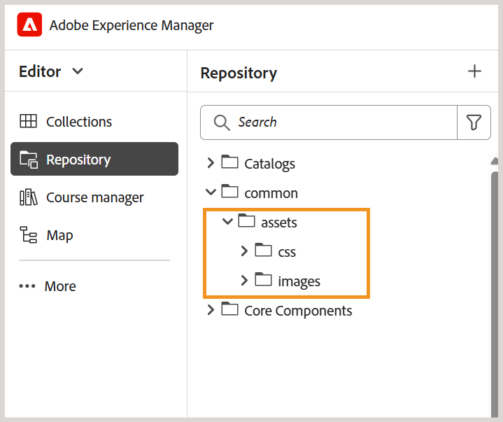

# Definir outras configurações

Como Administrador, você também pode definir as seguintes configurações para os Autores e Editores do curso de aprendizado:

- **Configurações de pasta**
   - **Criar pastas diferentes**: você pode criar pastas para Autores e Editores que trabalham em diferentes departamentos ou produtos da sua empresa. Essas pastas podem ser mapeadas para perfis de pastas específicos, cada um configurado com diferentes modelos de criação e saída para suportar a criação de cursos de aprendizado específicos do departamento e a administração descentralizada.

     Você pode criar uma nova pasta no painel Repositório.

     {width="350" align="left"}
   - **Criar pastas de idioma**: se você traduzir conteúdo para idiomas diferentes, deverá criar pastas correspondentes a cada idioma. Cada uma dessas pastas de idioma conterá o conteúdo correspondente a esse idioma.

     Para obter detalhes, consulte [Práticas recomendadas para tradução de conteúdo](../user-guide/translation-first-time.md).
   - **Gerenciamento de Assets**: assim como as pastas, você também pode criar diferentes pastas do Assets para atender às necessidades de diferentes departamentos. Dessa forma, você também garante que Autores e Editores tenham acesso ao CSS correto configurado em seus modelos, imagens e outros ativos.

     {width="350" align="left"}
- **Trechos**: você pode configurar trechos no nível da pasta para garantir que os autores tenham acesso aos trechos corretos. Somente administradores podem criar trechos no Experience Manager Guides, que podem ser usados pelos autores no editor.

  Você pode acessar Trechos no painel esquerdo do Editor.

  {width="350" align="left"}
- **Condições**: como administrador, você pode configurar atributos condicionais padrão compatíveis com DITA nos níveis global ou de pasta. Os autores usam as condições configuradas simplesmente arrastando e soltando a condição desejada em seu conteúdo.

  Você pode acessar Condições no painel esquerdo no Editor.

  {width="350" align="left"}
- **Variáveis**: você pode definir variáveis para tornar seu conteúdo mais portátil, consistente e fácil de atualizar. Durante a geração da saída, as variáveis são substituídas pelos valores do conjunto de variáveis selecionado, permitindo que você produza saídas personalizadas com eficiência.

  Para obter detalhes, consulte [Criar uma nova variável](../native-pdf/native-pdf-variables.md#create-a-new-variable)

- **Barra de ferramentas do editor**: você pode personalizar a barra de ferramentas do editor de acordo com suas necessidades organizacionais. Por exemplo, talvez você prefira alterar o nome de um botão da barra de ferramentas, alterar seu local e assim por diante.

  Para obter detalhes, consulte [Configurar e personalizar o Editor de XML](../cs-install-guide/conf-folder-level.md#configure-and-customize-the-xml-editor-id2065g300o5z).
