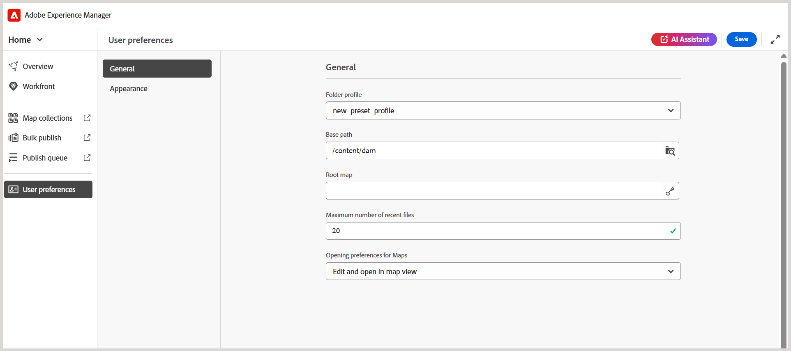

# Explorar a interface e os pré-requisitos

Este artigo explica como acessar a interface do usuário e configurar o Perfil de pasta e o Caminho base corretos para os cursos de aprendizado.

## Acessar e navegar na interface

Execute as seguintes etapas para acessar a interface do usuário:

1. Faça logon na sua instância do AEM.
2. Na página Navegação do AEM, selecione **Guias**.
3. Você está agora na **Página inicial do Experience Manager Guides**. Use o alternador de navegação para alternar para as seguintes exibições:

   - **Página inicial**: a página padrão exibida ao fazer logon no Experience Manager Guides. Ele permite definir várias configurações no nível da pasta.
   - **Editor**: um editor fácil de usar que permite criar conteúdo de cursos no Experience Manager Guides.
   - **Console de mapas**: oferece um espaço de trabalho dedicado para tratar de todos os aspectos da publicação do curso.

   Para obter detalhes, exiba a [experiência da página inicial do Adobe Experience Manager Guides](../user-guide/intro-home-page.md).

   {width="350" align="left"}

## Pré-requisitos

Para começar a usar a interface do usuário, primeiro você deve configurar o **Perfil de pasta** e o **Caminho base** corretos na configuração **Preferências do usuário** da página inicial do Experience Manager Guides.

Os perfis de pasta definem os modelos de criação, os modelos de saída, as predefinições de saída e outras configurações no nível da pasta. O Experience Manager Guides oferece suporte a vários perfis de pastas, permitindo que os administradores separem as configurações de diferentes departamentos ou produtos em sua empresa. O uso de um perfil de pasta incorreto pode resultar na ausência de modelos ou em funcionalidade limitada. Se não tiver certeza sobre qual perfil de pasta usar, entre em contato com o administrador antes de continuar.

A página Preferências do usuário consiste em duas guias:

- **Geral**: permite selecionar um perfil de pasta, um caminho base, um mapa raiz e muito mais.
- **Aparência**: fornece as opções para selecionar os temas do aplicativo e a exibição de origem do conteúdo de Aprendizado.

Para obter detalhes, consulte [Preferências do usuário](../user-guide/intro-home-page.md#user-preferences) no Experience Manager Guides.
