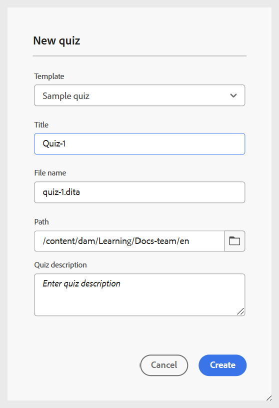

# Criar questionário

Execute as seguintes etapas para adicionar o questionário a um curso:

1. Abra um curso no **Gerenciador de cursos** e selecione **Adicionar novo** no menu **Opções**.

   {width="650" align="left"}

1. Selecione **Questionário**.\
   Uma caixa de diálogo **Novo questionário** é aberta para especificar os detalhes relevantes do questionário. Você pode selecionar o modelo no menu suspenso e especificar um título adequado para o mesmo.

   {width="350" align="left"}

1. Selecione **Criar**.

Um questionário é adicionado como parte do curso e é exibido no painel Gerenciador de cursos.

>[!NOTE]
>
>  Depois de criar um questionário, ele recebe automaticamente a versão 1.0.

