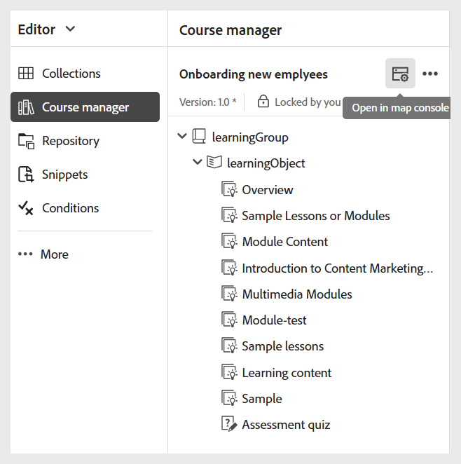

# Criar uma predefinição de saída SCORM

Execute as seguintes etapas para criar uma predefinição de saída SCORM:

1. Abra o curso no **Console de mapas**.

   {width="350" align="left"}

1. Na guia **Predefinições de saída**, selecione o ícone + para criar uma predefinição de saída.
1. Selecione **SCORM** na lista suspensa **Tipo** na caixa de diálogo **Nova predefinição de saída**.

   {width="350" align="left"}

1. No campo **Nome**, forneça um nome para esta predefinição.
1. Selecione **Adicionar**.
A predefinição SCORM é criada. Uma página de predefinição SCORM é aberta, onde você pode fazer as configurações necessárias.

   {width="800" align="left"}

