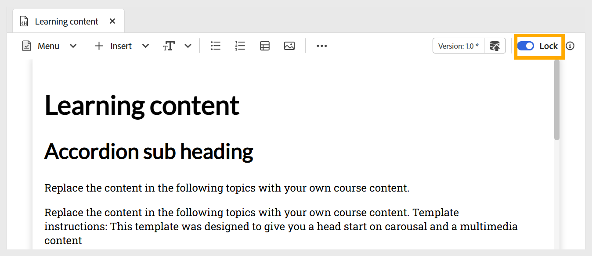

# Editar tópico

Execute as seguintes etapas para editar o Tópico:

1. Clique duas vezes no Tópico para abri-lo no painel Gerenciador de cursos.
1. Você deve **Bloquear** o tópico usando a opção como mostrado abaixo. Isso permite editar o conteúdo e ninguém mais pode fazer alterações neste tópico.

   {width="650"}

1. Para adicionar conteúdo a um tópico, você pode [adicionar blocos de construção básicos](./lc-basic-blocks.md), como texto, multimídia e vários [widgets interativos](./lc-widgets.md).
1. Para salvar seu trabalho, use **Salvar como nova versão** para criar uma nova versão, ou pressione `Ctrl+S` para substituir o arquivo existente.

   {width="650"}

1. Depois de salvar o conteúdo, você pode **Desbloquear** o tópico para outras pessoas editarem.
