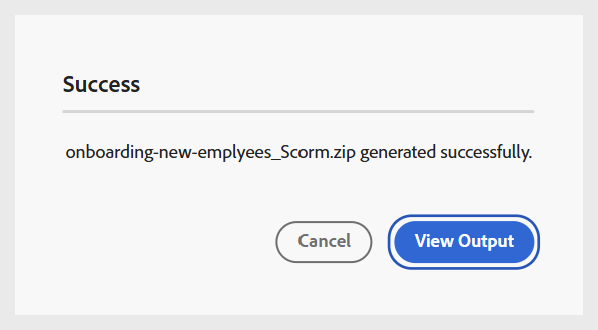
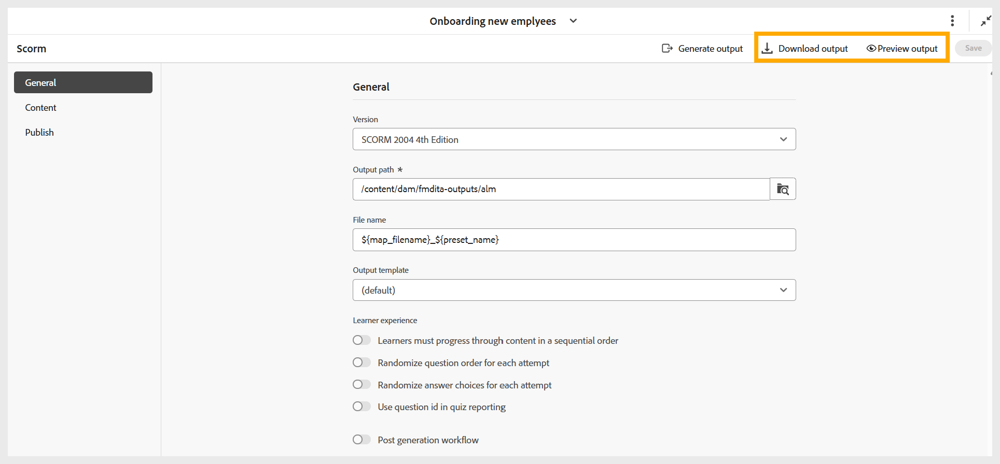

# Gerar saída SCORM

Execute as seguintes etapas para gerar uma saída SCORM:

1. Depois de definir todas as configurações necessárias para a saída SCORM com base em suas preferências, navegue até a barra de ferramentas da página de predefinições SCORM.
1. Selecione **Gerar saída**.

   {width="650" align="left"}

1. Quando a geração for concluída, uma mensagem de êxito será exibida confirmando que o arquivo **filename.zip** foi criado. Você pode visualizar a saída usando **Exibir saída** na mensagem de sucesso.

   {width="350" align="left"}

1. Você pode baixar ou visualizar a saída selecionando **Baixar saída** ou **Visualizar saída**, respectivamente.

   {width="650" align="left"}

Faça upload do arquivo ZIP no LMS para disponibilizar o curso aos seus alunos.
