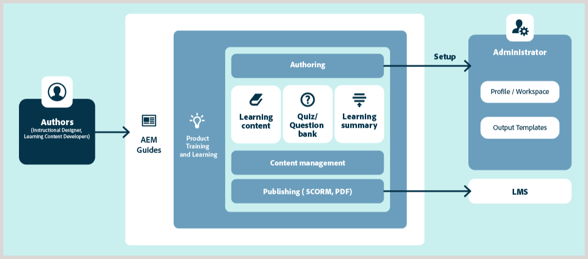

# Visão geral do conteúdo de treinamento e aprendizado do produto

O suporte ao conteúdo de treinamento e aprendizado de produtos facilita a criação e o gerenciamento de conteúdo de eLearning interativo em ambientes corporativos. Você pode criar cursos usando modelos, adicionar elementos interativos (como acordeões, carrosséis, multimídia e muito mais), adicionar testes usando diferentes tipos de perguntas ou por meio de um banco de perguntas e publicar o curso em formatos de saída compatíveis.

## Principais recursos num relance

Os principais recursos são os seguintes:

- Gerenciamento centralizado do conteúdo de aprendizagem
- Criação orientada por modelo
- Reutilização de conteúdo
- Criação e gerenciamento do questionário
- Gerenciamento de tradução líder do setor
- Fluxos de trabalho de revisão baseados na Web
- Publicação em vários canais usando formatos de saída prontos para uso SCORM e PDF
