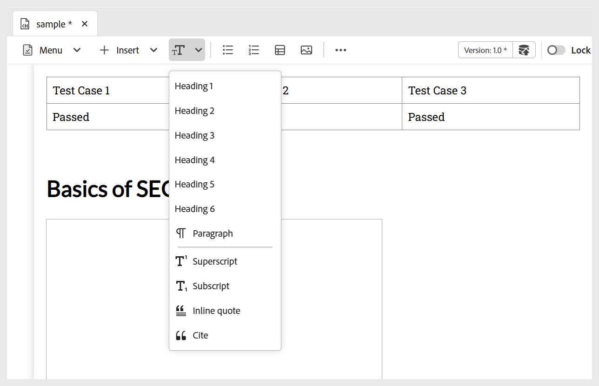

# Adicionar blocos fundamentais ao seu conteúdo de aprendizado

Você pode usar os recursos básicos de edição disponíveis na barra de ferramentas Conteúdo de aprendizado, conforme descrito abaixo:

- **Widgets**: adicione widgets como acordeão, carrossel, hotspots e muito mais ao seu conteúdo de aprendizado usando o menu **Inserir**, como mostrado abaixo. Para obter mais detalhes sobre widgets interativos, veja [Usar widgets interativos](./lc-widgets.md).

  {width="650" align="left"}

- **Componentes de texto**: adiciona cabeçalho/títulos, parágrafo, aspas embutidas, sobrescrito, subscrito e citação ao seu conteúdo.

  {width="650" align="left"}

- **Lista não ordenada**: adiciona uma lista não ordenada ao seu conteúdo.

  {width="650" align="left"}

- **Lista ordenada**: insere uma lista numerada dentro do seu conteúdo.

  {width="650" align="left"}

- **Tabela**: insere uma tabela de dimensões necessárias no conteúdo. É possível gerenciar ainda mais várias propriedades de tabela usando o painel **Propriedades de Conteúdo**, conforme mostrado abaixo.

  {width="650" align="left"}

- **Imagem**: insere imagens no conteúdo junto com texto alternativo e uma dica de tela. As imagens podem ser adicionadas a partir do repositório ou por meio de um URL externo. Além disso, as propriedades de imagem podem ser modificadas usando o painel **Propriedades de Conteúdo**.

  {width="650" align="left"}

- **Multimídia**: adiciona vídeo e áudio ao conteúdo do menu **Mais** da barra de ferramentas. Você pode personalizar suas propriedades usando o painel **Propriedades de Conteúdo**.

  {width="650" align="left"}

- **Símbolos**: adiciona símbolos de sua escolha ao conteúdo de uma lista, conforme mostrado abaixo. Você pode usá-lo no menu **Mais** da barra de ferramentas.

  {width="350" align="left"}

- **Hiperlinks**: adiciona hiperlinks ao local necessário em seu conteúdo. Você pode usá-lo no menu **Mais** da barra de ferramentas. Pode ser uma referência de arquivo, um URL da Web ou um link de email, conforme mostrado abaixo.

  {width="650" align="left"}

