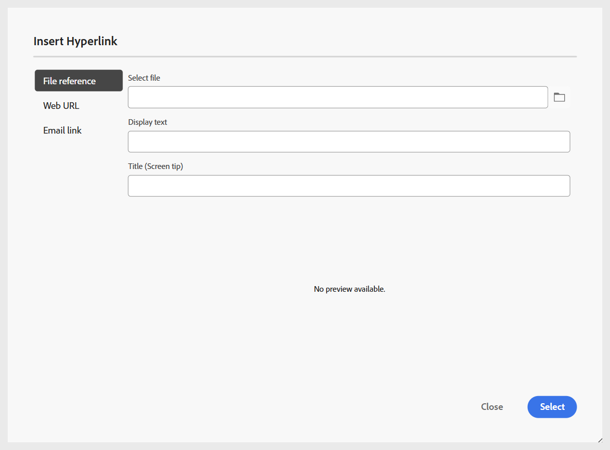

# Adicionar blocos de construção básicos ao seu Tópico

Para fornecer uma compreensão mais clara de como criar um Tópico de aprendizado e adicionar elementos básicos a ele, o vídeo a seguir oferece uma breve visão geral dos recursos disponíveis.

>[!VIDEO](https://video.tv.adobe.com/v/3469535/learning-content-aem-guides)

Você pode usar os recursos básicos de edição disponíveis na barra de ferramentas do Editor, conforme descrito abaixo:

- **Opções de inserção**: fornece opções para adicionar [Widgets interativos](./lc-widgets.md), como Acordeão, Carrossel, Ponto de acesso, Guias, Cartões invertidos e Clique para revelar, bem como [elementos estruturais](./lc-other-insert-options.md), como Iframe, Cotas de bloqueio, Bloco de código e muito mais. Use esse menu para adicionar funcionalidade e variedade ao seu conteúdo de aprendizado, tornando-o envolvente e bem estruturado.

  {width="650" align="left"}

- **Componentes de texto**: adiciona cabeçalho, parágrafo, citação embutida, sobrescrito, subscrito e citação ao seu conteúdo.

  >[!NOTE]
  >
  > Você também pode incluir um Título e subtítulo ao seu conteúdo de aprendizado. Para obter detalhes sobre como adicioná-lo ao conteúdo, consulte [Adicionar título e subtítulo ao conteúdo didático](#add-title-and-subtitle-to-learning-content).

  {width="650" align="left"}

- **Lista não ordenada**: adiciona uma lista não ordenada ao seu conteúdo.

  {width="650" align="left"}

- **Lista ordenada**: insere uma lista numerada dentro do seu conteúdo.

  {width="650" align="left"}

- **Tabela**: insere uma tabela de dimensões necessárias no conteúdo. É possível gerenciar ainda mais várias propriedades de tabela usando o painel **Propriedades de Conteúdo**, conforme mostrado abaixo.

  {width="650" align="left"}

- **Imagem**: insere imagens no conteúdo junto com texto alternativo e uma dica de tela. As imagens podem ser adicionadas a partir do repositório ou por meio de um URL externo. Além disso, as propriedades de imagem podem ser modificadas usando o painel **Propriedades de Conteúdo**.

  {width="650" align="left"}

- **Multimídia**: adiciona vídeo e áudio ao conteúdo. Você pode personalizar suas propriedades usando o painel **Propriedades de Conteúdo**.

  {width="650" align="left"}

- **Conteúdo reutilizável**: permite que você incorpore conteúdo existente de seus ativos ou repositório para reutilização. Execute as seguintes etapas para inserir um conteúdo reutilizável:

   1. Selecione **Conteúdo reutilizável** na barra de ferramentas.
A caixa de diálogo **Reutilizar conteúdo** é aberta.
   2. Navegue e selecione o tópico desejado para incluir seu conteúdo no curso atual.
   3. Selecione a ID do conteúdo que deseja adicionar; uma visualização será exibida junto com o para referência.

      {width="650" align="left"}

   4. Escolha **Selecionar**.

  O conteúdo é inserido. Por exemplo, a seção Estrutura do veículo é um conteúdo reutilizado e adicionado ao tópico do curso. O tipo é mostrado como **Reference**, e sua **ID** é refletida no painel **Content properties**.

  {width="650" align="left"}

- **Símbolos**: adiciona símbolos de sua escolha ao conteúdo de uma lista, conforme mostrado abaixo.

  {width="350" align="left"}

- **Hiperlinks**: adiciona hiperlinks ao local necessário em seu conteúdo. Pode ser uma referência de arquivo, um URL da Web ou um link de email, conforme mostrado abaixo.

  {width="650" align="left"}

Além disso, a lista suspensa **Menu** fornece acesso às ações de edição (Recortar, Copiar, Excluir), Localizar e substituir e ao rótulo Versão.

## Adicionar título e subtítulo ao conteúdo de aprendizado

Execute as seguintes etapas para incluir título e subtítulo ao seu conteúdo de aprendizado:

1. Abra o curso de aprendizado no console Mapa.
1. Abra o tópico, questionário ou qualquer outro componente do curso ao qual deseje adicionar um título ou subtítulo.
1. Navegue até o painel Propriedades do arquivo e selecione **Adicionar título**.

   
1. Quando solicitado, escolha se deseja usar o cabeçalho existente como o título.

   >[!NOTE]
   >
   > Se você não quiser usar o cabeçalho existente como o título, primeiro insira um cabeçalho usando o componente Texto na barra de ferramentas do Editor e selecione **Adicionar título**. Isso adiciona uma amostra do **Título** ao conteúdo, que pode ser editado conforme necessário.
1. Em Propriedades do arquivo, selecione **Adicionar subtítulo**.
Um exemplo de **Subtítulo** foi adicionado ao conteúdo.

   

Para remover um título, desmarque a opção **Adicionar título** nas propriedades do arquivo. Remover o título remove automaticamente o subtítulo associado.

