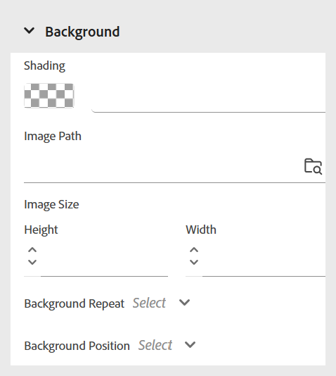

# Usar estilos em linha

Aplique estilos em linha para personalizar a aparência de um texto específico diretamente no conteúdo do curso. Isso permite ajustes rápidos de formatação, como tamanho da fonte, cor, alinhamento e muito mais. Você pode modificar os estilos embutidos para o texto selecionado usando o painel **Propriedades de conteúdo**.

>[!NOTE]
>
> Essas opções de estilo estarão visíveis somente se forem ativadas pelo administrador.

{width="350" align="left"}

As opções disponíveis são as seguintes:

- **Fonte:** permite personalizar a aparência do texto usando várias opções, como família de fontes, espessura da fonte, decoração do texto, tamanho da fonte e muito mais. Essas configurações ajudam a estilizar o conteúdo, como mostrado no exemplo abaixo.

  {width="350" align="left"}

- **Borda**: permite definir e personalizar a borda de um elemento usando opções como lado da borda, largura, estilo (sólido, tracejado, pontilhado e muito mais), cor. Essas configurações ajudam a separar visualmente ou destacar seções específicas do seu conteúdo.

  {width="350" align="left"}

- **Layout**: ajuda a controlar o posicionamento e o espaçamento dos elementos no conteúdo. Você pode ajustar propriedades como margem, preenchimento, alinhamento, tipo de exibição e muito mais. para organizar a estrutura do conteúdo de maneira eficaz.

  {width="350" align="left"}

- **Plano de fundo**: permite personalizar o plano de fundo de um elemento definindo opções como cor de plano de fundo, imagem, posição e estilo de repetição. Essas configurações ajudam a aprimorar o apelo visual e a clareza do seu conteúdo.

  {width="350" align="left"}

- **Coluna**: permite organizar o conteúdo em várias colunas. Você pode ajustar o número de colunas, o espaçamento entre elas, a largura da coluna e muito mais. para melhorar a legibilidade e a estrutura de layout em seu conteúdo.

  {width="350" align="left"}