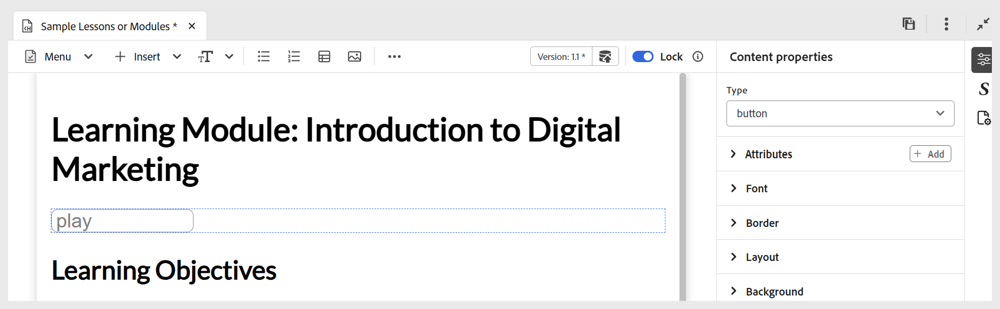

# Outras opções no menu Inserir

As outras opções disponíveis no menu Inserir na barra de ferramentas do Editor incluem:

- **Citações em bloco:** adiciona citações em bloco juntamente com citações ao seu conteúdo.

  {width="650" align="left"}

- **Blocos de código:** Adiciona um bloco de código ao seu conteúdo.

  {width="650" align="left"}

- **Iframes:** insere um iframe no conteúdo para incorporar páginas da Web externas ou recursos interativos. Você pode configurar as propriedades do iframe usando o painel **Propriedades de conteúdo**, incluindo a URL de origem, largura, altura, alinhamento e o título. Você pode visualizar o conteúdo adicionado no iframe alternando para o modo **Visualização**, conforme mostrado abaixo.

  Exibição de **Author**:

  {width="650" align="left"}

  Modo de **visualização**:

  {width="650" align="left"}

- **H5P:** Adiciona o pacote H5P interativo ao seu conteúdo de aprendizado. Para adicionar conteúdo H5P, coloque o cursor no local desejado e selecione **H5P** no menu Inserir. Na caixa de diálogo Inserir H5P, forneça uma referência ao arquivo H5P que você deseja adicionar ao conteúdo de aprendizagem.

  

  Se preferir usar o conteúdo H5P de seu sistema, primeiro [carregue o arquivo no DAM](../user-guide/authoring-upload-existing-files.md) usando a opção **Carregar ativos** e depois faça parte do modo de exibição de Repositório/Assets.

  

  Depois de concluído, revise o conteúdo H5P no modo de Visualização e na saída publicada.

  >[!NOTE]
  >
  > A edição ou criação de conteúdo H5P não é suportada no Adobe Experience Manager Guides. Prepare seu pacote H5P externamente antes de fazer upload.

- **Equação matemática:** insere equações do MathML ao seu conteúdo. Você pode criar uma equação do MathML e selecionar **Inserir** para adicioná-la ao seu documento.

  {width="350" align="left"}

  A equação é inserida com o plano de fundo cinza-claro. A qualquer momento, você pode atualizar uma equação clicando com o botão direito do mouse em uma equação existente e selecionando **Editar equação matemática** no menu de contexto. Para obter detalhes sobre a validação de equações do MathML no Experience Manager Guides, exiba [Validação de equações no editor do MathML](../user-guide/web-editor-other-features.md#validation-of-equations-in-the-mathml-editor).

- **Verificação de conhecimento:** permite adicionar perguntas nos formatos disponíveis (Correção Simples, Correção Múltipla, Verdadeiro/Falso, Corresponder ao Seguinte ou inserir do banco de perguntas) ao seu tópico para revisão e para confirmar a compreensão sem classificação ou relatório. Essas perguntas espelham formatos padrão e excluem a pontuação, tornando-as ideais para autoavaliação e adequadas como parte do conteúdo do curso ou de um tópico antes de um questionário ou avaliação posterior, conforme necessário.

  {width="650" align="left"}

  Você pode configurar as respostas corretas e outros campos obrigatórios por meio do painel **Propriedades de conteúdo**. Para obter mais detalhes, consulte [Tipos de pergunta](./quiz-insert-questions.md). É possível adicionar vários tipos de pergunta usando as opções de verificação de conhecimento, conforme mostrado abaixo.

  {width="650" align="left"}

- **Campo de entrada:** Adiciona um campo de entrada de texto junto com um botão ao seu conteúdo. Você pode usar essa combinação para capturar a entrada do usuário e acionar ações específicas. Um botão Reproduzir é adicionado ao conteúdo, conforme mostrado abaixo.

  {width="650" align="left"}

- **Mais opções:** você tem opções adicionais para aprimorar o conteúdo de aprendizado, incluindo a inserção de uma linha horizontal, quebra de linha, caixa de texto, caixa de texto posicionada e HTML inserido.

  {width="650" align="left"}
