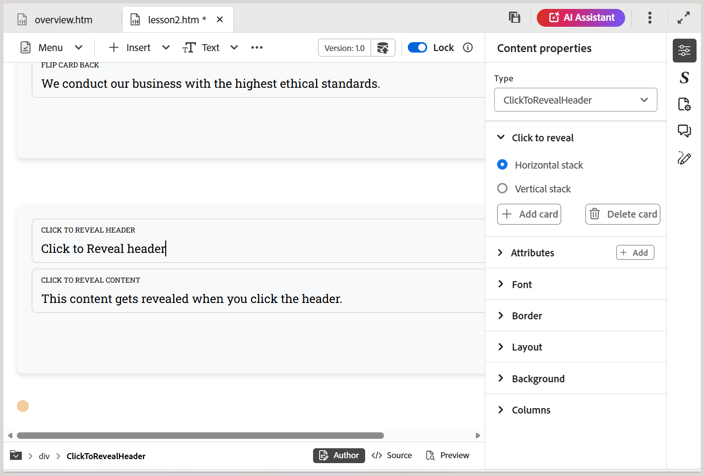

# Usar widgets interativos

Você pode aprimorar o conteúdo de aprendizado adicionando vários widgets para tornar o curso mais interativo. Este é um vídeo curto de apresentação dos vários widgets disponíveis.

>[!VIDEO](https://video.tv.adobe.com/v/3469531/learning-content-aem-guides)

Os widgets disponíveis criados para aprimorar a experiência do usuário e simplificar a entrega de conteúdo incluem:

- **Acordeão:** Adiciona um acordeão ao conteúdo. É possível inserir texto adequado tanto no cabeçalho do acordeão quanto no corpo. Suas propriedades podem ser gerenciadas usando o painel **Propriedades de conteúdo**, incluindo opções para permitir que acordeões únicos ou múltiplos sejam abertos simultaneamente, bem como para adicionar ou remover elementos. Para excluir um elemento ou item do widget, você também pode usar **Clique com o botão direito do mouse > Excluir item**.

  {width="650"}

- **Carrossel:** Adiciona um carrossel ao conteúdo. Você pode inserir texto adequado no título do Cartão e no corpo. Suas propriedades podem ser gerenciadas usando o painel **Propriedades de conteúdo**, incluindo opções para adicionar ou remover elementos. Para excluir um elemento ou item do widget, você também pode usar **Clique com o botão direito do mouse > Excluir item**.

  {width="650"}

- **Ponto de acesso:** Adiciona ponto de acesso a uma imagem selecionada. Comece escolhendo uma imagem e navegue até **Inserir > Ponto de acesso**. Isso abre a caixa de diálogo Ponto de acesso, onde é possível configurar várias opções, como definir diferentes tamanhos de pontos de acesso, adicionar links correspondentes e ajustar a disposição em camadas, trazendo as áreas para frente ou para trás. Para excluir um elemento ou item do widget, você também pode usar **Clique com o botão direito do mouse > Excluir item**.

  {width="650"}

- **Guia:** permite organizar o conteúdo em seções interativas.  Cada guia pode representar um tópico ou categoria distinta; os alunos podem clicar ou tocar nas guias para revelar o conteúdo correspondente. Coloque o cursor onde deseja que o widget Guia apareça no conteúdo e navegue até **Inserir > Widget > Guia**. Isso adiciona um contêiner de guia ao conteúdo. Agora, comece a adicionar conteúdo à guia, que inclui um título de guia e seu conteúdo correspondente.  Para excluir um elemento ou item do widget, você também pode usar **Clique com o botão direito do mouse > Excluir item**.

  

  Para adicionar, excluir e alternar o layout de guias (guias verticais ou horizontais), use a seção **Propriedades de conteúdo** no painel direito.
- **Inverter cartão:** Adiciona um cartão interativo ao seu conteúdo que inverte para revelar informações adicionais. Cada cartão tem dois lados - frontal e traseira, permitindo que os alunos explorem as informações de forma envolvente.  Para inserir um cartão Inverter, coloque o cursor no local desejado e navegue até **Inserir > Widget > Inverter cartão**, que adiciona um contêiner de Cartão Inverter ao seu conteúdo. Em seguida, você pode adicionar um título e uma imagem opcional ao lado frontal e inserir o conteúdo correspondente no verso. Para excluir um elemento ou item do widget, você também pode usar **Clique com o botão direito do mouse > Excluir item**.

  

  Para adicionar, excluir cartões ou alterar seu layout, use a seção **Propriedades de conteúdo** no painel direito.
- **Clique para revelar:** insere um widget interativo ao seu conteúdo que oculta o conteúdo até que os alunos cliquem para revelá-lo. Isso ajuda a reduzir a desordem e a incentivar a exploração. Insira o widget colocando o cursor no local desejado e selecionando **Inserir > Widget > Clique para revelar**. Depois de inserido, forneça o título para o cabeçalho do widget e defina o conteúdo oculto que aparece quando os alunos interagem.

  

  Para adicionar ou excluir o widget, ou gerenciar sua orientação, use a seção **Propriedades de conteúdo** no painel direito. Para excluir um elemento ou item do widget, você também pode usar **Clique com o botão direito do mouse > Excluir item**.