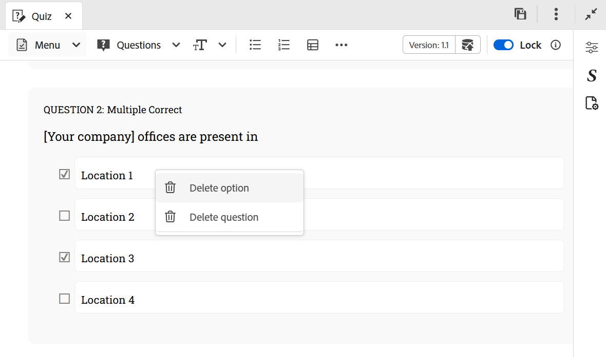

# Inserir perguntas em um questionário

Execute as seguintes etapas para inserir perguntas em um questionário:

1. Escolha o tipo de pergunta desejado no menu suspenso **Perguntas** da barra de ferramentas. Com base em suas necessidades, você pode adicionar perguntas usando qualquer um dos quatro formatos disponíveis: Verdadeiro ou Falso, Único correto, Múltiplo correto, Corresponder ao seguinte e Breve resposta, conforme mostrado abaixo. Para obter mais detalhes, consulte [Tipos de pergunta](#question-types).

   {width="650" align="left"}

   Ao inserir uma pergunta, se o cursor estiver em um bloco de perguntas, a nova pergunta será adicionada logo após ela por padrão.

   Para inserir uma pergunta entre as duas existentes, primeiro [insira um parágrafo](#insert-paragraph-within-the-quiz) e depois insira perguntas.

1. Uma pergunta é inserida no formato selecionado. É possível editar a pergunta com base nas suas necessidades.

1. Você pode selecionar qualquer pergunta e configurar suas propriedades usando o painel **Propriedades de conteúdo**.

   {width="650" align="left"}

1. Salve todas as alterações feitas no questionário.

## Propriedades da pergunta

Você pode configurar as perguntas usando as seguintes propriedades de pergunta do painel **Propriedades de conteúdo**:

{width="350" align="left"}

- **Opções**: especifique a resposta correta da pergunta
- **Id da Pergunta**: especifica a ID da pergunta para cada pergunta. Se uma id de pergunta não estiver presente, é recomendável sempre adicioná-la.
- **Pontos para resposta correta**: especifique os pontos a serem atribuídos para a resposta correta.
- **Multa por resposta incorreta**: especifique os pontos a serem deduzidos por uma resposta incorreta.
- **Rótulo da pergunta**: habilitar para adicionar um rótulo de pergunta.
- **Feedback**: habilite a fornecer o feedback para resposta correta ou incorreta.
- **Opção de fixação na posição**: quando uma opção específica para uma pergunta é fixada, ela permanece fixa na posição especificada na lista de opções, mesmo se **Randomizar opções de resposta para cada tentativa** estiver habilitada na configuração predefinida de SCORM, o que, de outra forma, reorganizaria as opções disponíveis. Você pode passar o mouse sobre a opção desejada de uma pergunta no painel Propriedades de conteúdo e fixá-la.

  {width="350" align="left"}

## Inserir parágrafo no questionário

Quando você coloca o cursor em uma pergunta específica ou em um espaço em branco entre as duas perguntas, uma linha horizontal azul é exibida com uma seta azul no canto superior direito da tela. Selecionar a seta azul permite inserir um parágrafo na interface de criação do questionário.

{width="650" align="left"}

- Quando usado em uma pergunta, permite adicionar mais elementos, como imagens, tabela, elementos de texto e muito mais na pergunta.
- Quando usado entre as perguntas, permite inserir outra pergunta ou adicionar outros elementos de criação, conforme mencionado acima.

## Excluir pergunta ou opção

Execute as seguintes etapas para excluir uma pergunta ou uma opção específica de um questionário:

1. Clique com o botão direito do mouse na pergunta ou opção que deseja remover.
1. No menu de contexto, selecione **Excluir pergunta** (para remover a pergunta inteira) ou **Excluir opção** (para remover apenas a opção selecionada).

{width="650" align="left"}

## Tipos de pergunta

Os seguintes tipos de perguntas são suportados em um questionário:

- **Única correção**: uma pergunta com várias opções em que apenas uma resposta está correta.

  {width="650" align="left"}

- **Verdadeiro/Falso**: uma pergunta baseada em instruções em que os alunos escolhem se é Verdadeiro ou Falso.

  {width="650" align="left"}

- **Correção múltipla**: uma pergunta com várias opções em que mais de uma resposta pode estar correta.

  {width="650" align="left"}

- **Corresponder ao seguinte**: permite que os alunos correspondam itens de duas listas para formar os pares corretos. Você pode adicionar novos conjuntos de opções a partir do painel **Propriedades de conteúdo**. Para aumentar a complexidade, você pode remover uma opção da primeira lista e incluir uma correspondência extra na coluna Correspondência. Isso cria um elemento de dificuldade ao exigir que os alunos pensem criticamente sobre qual opção não tem um par direto.

  {width="650" align="left"}

  Na saída publicada, a pergunta **Corresponder à seguinte** é exibida com o menu suspenso para cada item, permitindo que você selecione a correspondência correta dentre as opções disponíveis.

  {width="650" align="left"}

- **Resposta curta**: permite aos alunos responder usando uma breve entrada de texto. Aceita respostas alfanuméricas, corresponde respostas sem distinção entre maiúsculas e minúsculas e, para respostas muito longas, fornece uma barra de rolagem horizontal.

  {width="650" align="left"}
