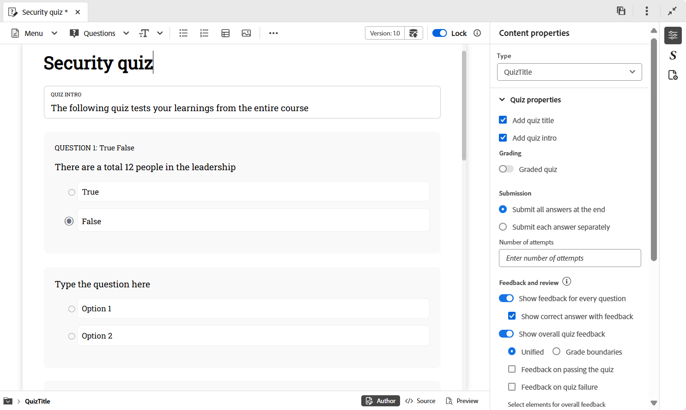

# Propriedades do questionário

Você pode configurar as propriedades do questionário usando as seguintes opções:

- Coloque o cursor no título do questionário ou na introdução ao questionário e abra o painel **Propriedades de conteúdo** no painel direito. Você pode editar as propriedades do questionário aqui.

  {width="650" align="left"}

- Certifique-se de que o título e a introdução do questionário não sejam deixados em branco durante a criação, pois aparecem no primeiro slide do questionário publicado. Se forem removidos por engano, você poderá restaurá-los selecionando as opções **Adicionar título do questionário** e **Adicionar introdução ao questionário**.
- Você pode habilitar a classificação para o seu questionário ativando a opção **Teste classificado**. Depois de ativado, você pode escolher o método de classificação, baseado em porcentagem ou absoluto, e definir os critérios de aprovação de acordo.

  {width="350" align="left"}

- Você também pode definir configurações adicionais, como opções de envio de resposta, opções de feedback e revisão, tempo do questionário e preferências de layout, conforme mostrado abaixo.

  {width="350" height="200" align="left"}

- Você pode usar a opção **Permitir nova visita de conteúdo** nas Propriedades do questionário para rever o conteúdo do curso durante um questionário em andamento; semelhante a um teste de livro aberto. No entanto, quando essa opção está ativada, não é possível configurar as opções de envio e o recurso de tempo do questionário está desativado.
  {width="350" height="200" align="left"}
