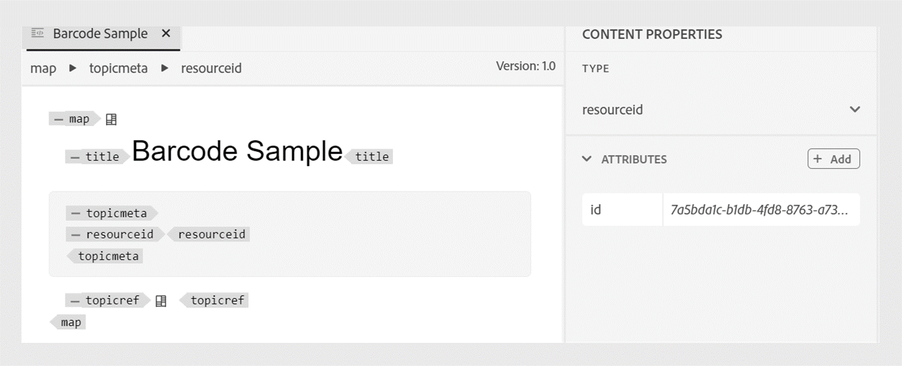

# Adicionar um código de barras à saída do PDF

Os códigos de barras são úteis para incluir informações que podem ser facilmente processadas por computadores. Da mesma forma, os códigos QR são usados para os links que os leitores podem abrir com seus dispositivos móveis.

Este tutorial ajuda você a adicionar códigos de barras na parte superior de cada página na saída do PDF.

## Etapas para gerar um código de barras

Para gerar um código de barras, execute as seguintes etapas:

### Adicionar uma ID de recurso ao mapa DITA

Adicione um elemento de ID de recurso ao mapa DITA. A ID do recurso serve como a entrada principal para gerar o código de barras.

```xml
<?xml version="1.0" encoding="UTF-8"?>
<!DOCTYPE map PUBLIC "-//OASIS//DTD DITA Map//EN" "technicalContent/dtd/map.dtd">
<map id="GUID-3c330691-4dac-4020-904a-d2d6246aeeb1-en">
  <title>Barcode Sample</title>
  <topicmeta>
    <resourceid id="7a5bda1c-b1db-4fd8-8763-a731e2e8abba">
    </resourceid>
  </topicmeta>
  <topicref href="GUID-139f6c64-bea3-4f17-8b22-ee131557e249-en.dita" type="topic">
  </topicref>
</map>  
```

Você também pode editar a ID do recurso no modo de criação.




### Adicionar um espaço reservado para código de barras no cabeçalho do modelo

Modifique o `Common.plt` arquivo no **Básico** modelo para adicionar um código de barras depois do título do projeto.

```html
...
  <div data-region="header">
    <p class="chapter-header"><span data-field="project-title" data-format="default">Project Title</span> </p>
    <p><span class="barcode" data-field="metadata" data-format="default" data-subtype="//resourceid/@id">Resource ID (barcode)</span></p>
  </div>
} 
...
```


### Atualizar o CSS do modelo para renderizar um valor de código de barras

Modifique o `content.css` arquivo para renderizar um código de barras durante a geração do PDF. Vários tipos de código de barras, como &quot;qrcode&quot; e &quot;pdf417&quot;, são compatíveis.  Para obter mais detalhes, consulte [Tipos de código de barras](#barcode-types).


```css
...
.barcode {
  -ro-replacedelement: barcode;
  -ro-barcode-type: code128;
}
...
```

Depois de executar as etapas anteriores, é possível gerar a saída de PDF com um código de barras.

A captura de tela a seguir exibe um exemplo de código de barras em uma saída de PDF.


## Tipos de código de barras {#barcode-types}

| Tipo | Atributo CSS | Atributos adicionais |
| ------------------------------- | ----------------------- | -------------------------- |
| Código QR | qrcode |                            |
| PDF417 | pdf417 |                            |
| DataMatrix | matriz de dados |                            |
| Código asteca | aztec-code |                            |
| Matriz de grade | grid-matrix |                            |
| Maxicode | maxicode mode-4 |                            |
| Micro QR | microqr |                            |
| Código um | code-one |                            |
| Codablock F | codablockf |                            |
| GS1 Databar Limited | limitado à barra de dados |                            |
| Barra de Dados GS1 Onidirecional | barra de dados omnidirectional |                            |
| EAN-13 | ean-13 |                            |
| GS1-128 (EAN-128) | code128 | -ro-código-de-barras: gs1; |
| ITF-14 | itf14 |                            |
| UPC-A | upc-a |                            |
| Código 128 | code128 |                            |
| Intercalado 2 de 5 | code2of5 intercalado |                            |
| POSTNET | postnet |                            |
| Dutch Post Kixcode | kixcode |                            |
| Korea Post | coreia-post |                            |
| Deutsche Post Leitcode | dp-leitcode |                            |
| Austrália Post | auspost |                            |
| Logmars | logmars |                            |
| Pharmacode | farmacode |                            |
| USPS OneCode (Email Inteligente) | usps-onecode |                            |


