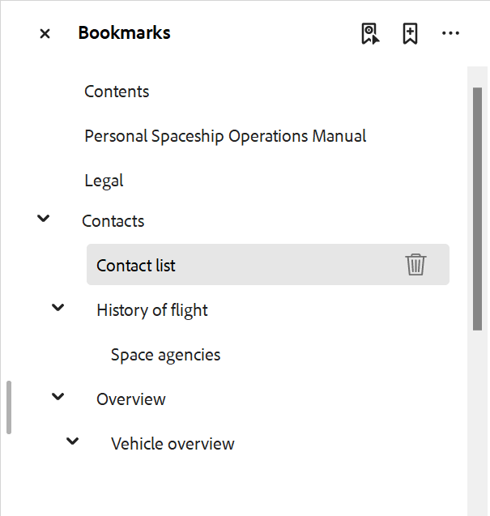

# Adicionar um marcador personalizado na saída do PDF

Geralmente, o índice em um mapa DITA é replicado como marcadores na saída final do PDF. Esse índice é criado a partir dos títulos do tópico ou da seção no mapa DITA. Às vezes, você pode querer adicionar um marcador personalizado em um conteúdo específico na saída do PDF para facilitar a navegação. Isso pode ser feito adicionando um atributo `outputclass` no elemento e aplicando o seguinte atributo a ele:

`bookmark-level: 3`

Aqui, o `bookmark-level` é um atributo e o número `3` é o valor que indica o nível na hierarquia de marcadores onde o marcador é adicionado. No exemplo a seguir, o tópico de primeiro nível &quot;Contatos&quot; tem uma tabela, &quot;Lista de contatos&quot;, na qual adicionamos um atributo `outputclass` com o valor de `custom-bookmark`.


A seguinte definição da classe `custom-bookmark` é adicionada ao arquivo CSS:

```css
…
/*Adding a custom bookmark*/
.custom-bookmark{
    bookmark-level: 2
}
…
```

Na saída PDF, a tabela *Lista de contatos* é adicionada no segundo nível da lista de marcadores PDF, conforme mostrado abaixo:



>[!NOTE]
>
>Você deve escolher o nível correto de adição do marcador personalizado. Se você especificar um número menor que o marcador do tópico pai, o marcador personalizado assumirá a posição do marcador pai e todos os outros marcadores serão exibidos como filhos. Isso pode levar a uma estrutura inesperada de marcadores.
