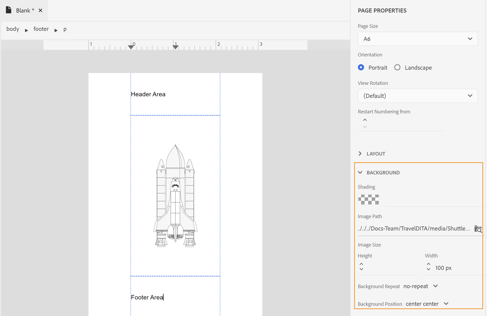

# Criar um layout de página {#design-page-layout}

Ao criar um documento PDF, você teria diferentes seções para apresentar diferentes tipos de informações. Por exemplo, um documento PDF começaria em uma página frontal ou de capa, que teria o logotipo, o título do livro ou as informações da versão da sua empresa. Em seguida, haveria capítulos, apêndices ou páginas de glossário. Cada seção em um documento do PDF é diferente, o que é obtido ao criar e personalizar o layout da página.

Ao projetar o layout da página, é possível definir os vários elementos que compõem uma página. Por exemplo, você pode definir o tamanho da página, margens, cabeçalho e rodapé, orientação e outras especificações de página em uma página. O recurso Publicação de PDF nativo permite criar a página de acordo com as [Padrões de mídia de página](https://www.w3.org/TR/css-page-3/). A maioria das configurações cobertas pelos padrões de Mídia paginada pode ser facilmente personalizada usando a interface de usuário do recurso Publicação PDF nativa. Para alguma outra formatação de nível avançado, você pode usar a visualização Código-fonte para escrever seu próprio código CSS.

Depois de criar os layouts de página, é necessário associar esses layouts às respectivas seções nas configurações de Layout da página de PDF. Consulte a [Criar e personalizar layouts de página](components-pdf-template.md#create-customize-page-layout) para obter detalhes sobre como criar e abrir um layout de página para personalização.

## Tipos de layouts de página {#types-of-page-layout}

Um documento PDF geralmente contém as seguintes seções:

* Folha de rosto
* Índice
* Aumento de números
* Aumento de tabelas
* Páginas de capítulo ou tópico
* Glossário
* Índice
* Voltar à página

Essas seções precisariam de um layout de página correspondente para apresentar as informações em um formato específico. Além disso, também é possível ter uma página em branco usada como um preenchimento para iniciar um novo capítulo a partir de uma página ímpar ou par. Nesse caso, você pode usar o layout de página padrão ou criar um layout de página para uma página em branco. Consulte [Criar um novo layout de página](components-pdf-template.md#create-page-layout) para obter mais detalhes.

As configurações de Layouts de página no **Modelo>Configurações** seção permitem definir qual layout de página deve ser usado para diferentes seções do seu PDF. Cada layout de página pode ter diferentes variantes de página na primeira página, direita ou esquerda.

### Criar as primeiras variantes de layout de página, direita ou esquerda {#page-layout-variants}

Diferentes layouts de página no seu modelo de PDF podem ser personalizados ainda mais por terem diferentes variantes de layout de página, primeira, direita ou esquerda. É possível criar essas páginas de forma diferente usando o designer de layout de página.

>[!NOTE]
>
>Se quiser ter um layout de página única para uma seção do livro, não será necessário criar os layouts de página Primeira, Direita ou Esquerda.

Considere os seguintes pontos ao criar os layouts de página:

>[!NOTE]
>
>Os pontos a seguir tomaram o layout da página Capítulo como exemplo. No entanto, esses pontos também são válidos para outros layouts de página.

* Se você quiser usar um layout de página único para todas as páginas em um capítulo, criará apenas um layout de página de capítulo único sem qualquer variante.

* Se você quiser ter uma aparência diferente para a primeira página dos capítulos do livro, será necessário criar uma variante de layout de Primeira página para os capítulos.

* Se você quiser ter uma aparência diferente para cada página do lado esquerdo e direito do livro, será necessário criar as variantes do lado esquerdo e direito para o layout da página do capítulo.

* Se quiser que os capítulos comecem a partir de uma página ímpar ou par, poderá optar por criar um layout de página para a página em branco. Esse layout de página é usado para preencher a lacuna entre dois capítulos para garantir que o capítulo comece a partir da página par ou ímpar desejada.

  >[!NOTE]
  >
  >Se você não criar um layout de página em branco separado, o layout de página padrão será usado. Para criar um layout de página, consulte [Criar um novo layout de página](components-pdf-template.md#create-page-layout).

O exemplo a seguir o guiará pelo processo de criação de variantes de um layout de página:

1. Crie um layout de página de &quot;Capítulo&quot; usando as etapas fornecidas em &quot;Criar um novo layout de página&quot;.

   Um layout de página de capítulo em branco é criado e adicionado em Layouts de página.

   Por padrão, ao criar um layout de página, ele também é aberto para edição. A captura de tela a seguir exibe um layout de página em branco (padrão):

   

   O cabeçalho, rodapé e área de conteúdo em um modelo são criados por padrão. É possível personalizar facilmente essas áreas usando as propriedades de página, propriedades de conteúdo e várias ferramentas (como inserir imagens, campos e muito mais) fornecidas na interface do usuário.

   >[!NOTE]
   >
   >Para configuração avançada, você pode usar a visualização Código-fonte e adicionar seu HTML personalizado e código CSS.

1. Passe o mouse sobre o **Capítulo** e clique em **Opções** para exibir o menu de contexto.

1. Clique ou passe o mouse sobre **Adicionar variante de layout** e escolha o layout de página desejado (Primeira, Esquerda ou Direita) que deseja criar.

O layout de página selecionado é criado usando uma cópia do layout base do Capítulo. Isso significa que, se você tiver alterado o layout padrão da página de capítulo, as mesmas alterações serão replicadas no layout da página variante no momento da criação do layout da página.

## Trabalhar com as propriedades de página de um layout de página {#page-props-page-layout}

Ao projetar um layout de página, é essencial ter controle sobre várias propriedades de página. O recurso Publicação de PDF nativo encapsula todas as principais propriedades de página no painel Propriedades da página. O painel Propriedades da página fornece acesso a várias propriedades nas seguintes seções:

>[!NOTE]
>
>O painel Propriedades da página encapsula as propriedades e segue as regras definidas na [Padrões de mídia de página](https://www.w3.org/TR/css-page-3/).

* **Tamanho da página** : especifique o tamanho de página que deseja usar para o layout de página. A lista suspensa Tamanho da página permite escolher entre mais de 15 tamanhos de página. Também é possível criar um layout de página usando um tamanho de página personalizado, consulte [Definir o tamanho da página](#set-page-size) para obter mais detalhes.

* **Orientação** : especifique a orientação da página a ser usada para o layout da página. Você pode escolher entre as orientações de página Retrato ou Paisagem. Observe que você pode optar por ter diferentes orientações aplicadas a diferentes variantes de página em um layout de página. Por exemplo, se o conteúdo contiver uma tabela ampla ou uma imagem grande, você poderá criar um layout de página de paisagem e aplicar esse layout à tabela ou imagem mais ampla.

* **Exibir rotação** : especifique o lado ou a direção em que o lado superior original é representado após a rotação. Você pode escolher entre 90 e 90 graus no sentido horário ou 180 graus no sentido anti-horário. Isso é muito útil em uma situação em que você deseja usar uma combinação de layouts Retrato e Paisagem na saída. Por exemplo, você pode usar retrato como o layout de página genérico e pode definir um layout de página paisagem para renderizar tabelas largas. Nessa situação, você pode definir a exibição do conteúdo da tabela no sentido horário em 90 graus. Dessa forma, a página será orientada em paisagem e o conteúdo será girado 90 graus para manter a continuidade da exibição. Veremos como isso é feito, como exemplo, posteriormente nesta seção.

* **Numeração de páginas** : A numeração de páginas, por padrão, é contínua em um PDF. Por exemplo, um PDF de 100 páginas pode ter números de página contínuos de 1 a 100. Você também pode reiniciar a numeração a partir de um número específico em todas as diferentes seções ou na primeira ocorrência de uma seção.
   * **Reiniciar a partir de** : especifique o número da página de onde a numeração deste layout de página será iniciada. Por exemplo, você pode definir o número de página a ser reiniciado para cada capítulo. Nesse caso, você precisa definir a propriedade restart from como 1 na variante de layout First page do layout da página do capítulo. Por padrão, a numeração de páginas continua a partir da página anterior.

   * **Aplicar somente à primeira ocorrência**: também é possível começar com um número específico somente para a primeira ocorrência de uma seção. Por exemplo, você pode iniciar somente o primeiro capítulo de 1 e continuar os números de página de outros capítulos.

* **Layout** : especifique as margens da página junto com o preenchimento para os lados superior, inferior, esquerdo e direito. A ilustração a seguir explica como as margens, o preenchimento e as bordas são renderizados em torno do conteúdo. Observe que a margem na parte superior e inferior de uma página contém o cabeçalho e o rodapé.

  

* **Histórico** : inclua uma imagem ou uma cor como o plano de fundo do layout da página. Para uma imagem, você pode especificar a altura e a largura da imagem junto com as propriedades de repetição e posição.

* **Nota de rodapé** : especifique as propriedades para exibir notas de rodapé na saída. Você pode optar por especificar as margens e as propriedades de preenchimento junto com um estilo de borda.

### Definir o tamanho da página {#set-page-size}

A primeira coisa que você precisa definir em um layout de página é o tamanho da página. Nas Propriedades da página, há mais de 15 tamanhos de página que você pode escolher para um layout de página. Você também pode criar um tamanho de página personalizado executando as seguintes etapas:

1. Abra o layout de página desejado para edição.

   >[!NOTE]
   >
   >Consulte [Personalizar um layout de página](components-pdf-template.md#customize-page-layout) seção para abrir um layout de página para personalização ou edição.

1. No painel direito, clique em **Propriedades da página**.
1. No **Tamanho da página** selecione **Personalizado**.

   Os campos Largura da página e Altura da página são exibidos.

1. Insira as dimensões de página desejadas na **Largura da página** e **Altura da página** campos.

   >[!NOTE]
   >
   >Algumas das unidades mais usadas são px (pixels), pt (pontos), rem, em, % (porcentagem) e in (polegadas).

### Usar orientação de página e rotação de exibição {#page-orientation-rotation}

Vamos analisar um exemplo em que uma combinação de orientação de página de retrato e paisagem e propriedades de rotação de visualização são usadas. Neste exemplo, criaremos um PDF com orientação de retrato padrão, mas uma tabela será renderizada na orientação paisagem com conteúdo na exibição de 90 graus no sentido horário. A saída final será semelhante a:


Na saída acima, as informações da Lista de contatos são apresentadas no modo paisagem com conteúdo também girado em 90 graus. O conteúdo restante é exibido no modo retrato normal.

Para alcançar esse tipo de saída, precisamos executar as seguintes tarefas principais:

1. Crie um layout de página com orientação Paisagem.

1. Altere o **Exibir rotação** para renderizar o conteúdo em 90°.

1. Crie um estilo personalizado para usar o novo layout de página.

1. Adicione o estilo na definição da classe de saída da tabela que queremos renderizar no layout da página paisagem.

Execute as seguintes etapas para realizar as tarefas acima:

1. Crie um layout de página com orientação Paisagem.
   1. Crie um layout de página &quot;Paisagem&quot; usando as etapas fornecidas em &quot;Criar um novo layout de página&quot;.

   1. No painel direito, clique em **Propriedades da página**.

      
   1. Altere o **Orientação** para **Paisagem**.

1. Altere a propriedade Rotação de exibição para renderizar o conteúdo em 90° no sentido horário.

   1. Selecionar **90° no sentido horário** na lista suspensa Exibir Rotação.
   

   1. Clique em **Salvar tudo** para salvar as propriedades atualizadas do layout da página.

1. Crie um estilo personalizado para usar o novo layout de página.
   1. Expanda a barra lateral esquerda e clique duas vezes no template no qual deseja criar o estilo.

   1. Expanda a seção Folhas de estilos.

   1. Passe o mouse sobre a folha de estilos de layout e clique no botão _Opções_ ícone) ... e escolha Editar.

      A folha de estilos de layout é aberta para edição.

   1. Clique com o botão direito do mouse em **Outros estilos** e escolha **Novo estilo**.
      

   1. No pop-up Adicionar estilo, digite **estilo paisagem** no **classname**.
      

   1. Clique em **Concluído**.

      Um novo estilo chamado `.landscape-style` é criado e adicionado ao final da lista Outros estilos.

   1. Clique duas vezes na guia `.landscape-style` estilo para abri-lo para edição.

   1. Expanda a **Paginação** propriedade.

   1. Enter `Landscape` no **Layout da página** propriedade.

      

   1. Clique em **Salvar tudo** para salvar as propriedades de estilo atualizadas.

1. Adicione o estilo no `outputclass` definição da tabela que queremos renderizar no layout de página paisagem.
   1. Em um editor de arquivo DITA, abra o arquivo no qual deseja aplicar o novo layout de página.

   1. Localize o `<table>` elemento, que deve ser renderizado no modo Paisagem.

   1. Na navegação estrutural, clique no elemento de tabela para selecionar a tabela.

      

   1. No painel direito, clique e abra o painel Propriedades de conteúdo.

   1. No painel Propriedades de conteúdo, adicione um novo **classe_saída** propriedade com **estilo paisagem** como valor de propriedade.

      

1. Clique em **Salvar tudo** para salvar o arquivo atualizado.
1. Gere a saída do PDF.

O PDF final terá o conteúdo da tabela renderizado no modo paisagem, como mostrado no início do exemplo.

### Adicionar uma imagem de plano de fundo {#add-bg-image}

Com base em suas necessidades, você pode adicionar uma imagem de fundo que aparece em cada primeira página de uma saída de capítulo (PDF). As propriedades de Plano de fundo nas Propriedades da página permitem adicionar facilmente uma imagem de plano de fundo. Você pode optar por replicar essa imagem em uma página e posicioná-la em qualquer lugar na área superior, inferior ou central da página.

Por exemplo, para inserir uma imagem de plano de fundo na parte central da área de conteúdo, execute as seguintes etapas:

1. Abra o layout de página desejado para edição.

   >[!NOTE]
   >
   >Consulte [Personalizar um layout de página](components-pdf-template.md#customize-page-layout) seção para abrir um layout de página para personalização ou edição.

1. Clique em qualquer lugar na área de conteúdo.

1. No painel direito, clique em **Propriedades da página**.

1. Expanda a **Histórico** seção.

1. Clique no botão Procurar na **Caminho da imagem** campo de localização.

1. Procure e selecione a imagem que deseja usar como imagem de plano de fundo.

   A imagem é inserida e replicada para cobrir a página inteira.

1. Altere o tamanho da imagem ajustando as propriedades de altura e largura.

   >[!NOTE]
   >
   >É possível inserir qualquer uma das propriedades height ou width, já que a imagem é dimensionada automaticamente para manter a proporção.

1. Defina as outras propriedades para ajustar a forma como deseja que a imagem do plano de fundo apareça.

   * **Repetição em segundo plano** : especifique se deseja que o plano de fundo seja repetido ou não.

   * **Posição do plano de fundo** : especifique uma posição para a imagem de fundo na página.

A captura de tela a seguir exibe a imagem de fundo com a propriedade Repetição de plano de fundo definida como _sem repetição_ e Posição do Plano de Fundo definida como _centro centro_.



## Trabalhar com o cabeçalho e o rodapé da página {#work-header-footer}

Ao incluir informações em um cabeçalho ou rodapé em um layout de página, essas informações são repetidas em todas as páginas que usam esse layout de página. Normalmente, a área do cabeçalho é usada para título de capítulo ou tópico e a área do rodapé é usada para mostrar números de página.

Ao criar um novo layout de página, a área de cabeçalho e rodapé é criada por padrão. É possível fazer muitas personalizações na área de cabeçalho e rodapé de um layout de página. Por exemplo, você pode inserir uma imagem (como um logotipo), variáveis (contendo informações dinâmicas) ou conteúdo estático.

### Alterar as margens e linhas do cabeçalho e do rodapé {#header-footer-margins}

Por padrão, as margens do cabeçalho e do rodapé estão definidas como 1 polegada. Você pode alterar esse valor padrão alterando a configuração Margem no painel Propriedades da página. Execute as seguintes etapas para alterar o tamanho do cabeçalho e do rodapé:

1. Abra o layout de página desejado para edição.

   >[!NOTE]
   >
   >Consulte [Personalizar um layout de página](components-pdf-template.md#customize-page-layout) seção para abrir um layout de página para personalização ou edição.

1. No painel direito, clique em **Propriedades da página**.
1. Expanda a **Layout** seção.
1. Clique no ícone de bloqueio ao lado da **Margem** propriedade.
1. Para alterar o tamanho do cabeçalho, informe o valor desejado no campo Margem superior.

   >[!NOTE]
   >
   >Algumas das unidades mais usadas são px (pixels), pt (pontos), rem, em, % (porcentagem) e in (polegadas).

1. Para alterar o tamanho do rodapé, insira o valor desejado no campo Bottom margin.

Você pode projetar a área de cabeçalho e rodapé para conter várias linhas. Para fazer isso, adicione um \&lt;p> usando a tag Inserir elementos de HTML () na área de cabeçalho ou rodapé.

| _Canto do desenvolvedor_:  |
|---|

Se você quiser trabalhar diretamente com o CSS e o código HTML, poderá alterar os valores de margem conforme mostrado no seguinte fragmento de código:

```css
…

<meta name="page-style" content="size:A4 portrait;margin-top:3cm;margin-right:30pt;margin-bottom:1in;margin-left:90px;" />

…
```

>[!NOTE]
>
>No exemplo acima, unidades diferentes são usadas para especificar os valores de margem.

### Remover cabeçalho e rodapé {#remove-header-footer}

A sobreposição do cabeçalho e do rodapé nas margens superior e inferior. Tecnicamente, isso significa que, se você quiser ter um cabeçalho e um rodapé no layout da página, deverá reservar o espaço necessário nas margens superior e inferior.

Se você não quiser que um layout de página tenha um cabeçalho e um rodapé, há duas maneiras de fazer isso:

* Se desejar manter as margens superior e inferior, deixe a área de cabeçalho e rodapé em branco.
* Se você não quiser reter as margens superior e inferior (como projetar a capa frontal e traseira de um depósito), poderá remover as margens definindo as propriedades de margem superior e inferior como 0. Isso não deixa espaço para o cabeçalho e rodapé.

### Adicionar uma imagem ou um logotipo no cabeçalho {#add-image-header}

Com base em suas necessidades, você pode adicionar uma imagem que aparece na área de cabeçalho (ou em qualquer outra parte) do layout da página. Há duas maneiras de adicionar uma imagem ao layout de página:

* Use uma imagem dos Recursos do modelo.
* Use o \&lt;add image=&quot;&quot;> no editor de layout de página.

>[!NOTE]
>
>É recomendável usar a pasta Recursos para gerenciar todos os ativos do modelo, como imagens ou fontes.

Para inserir uma imagem como o logotipo da empresa na área de cabeçalho, execute as seguintes etapas:

1. Abra o layout de página desejado para edição.

>[!NOTE]
>
>Consulte [Personalizar um layout de página](components-pdf-template.md#customize-page-layout) seção para abrir um layout de página para personalização ou edição.

1. Clique no cabeçalho de edição () para trazer o cursor para a área do cabeçalho.

   Ou clique dentro da área de cabeçalho.

1. Para adicionar uma imagem, escolha qualquer um dos métodos a seguir:
1. Clique em **Inserir imagem** () na barra de ferramentas; no campo **Selecionar caminho** , navegue até o local da imagem e clique em **Selecionar** para inseri-lo na área de cabeçalho.
1. Arraste e solte uma imagem da pasta Recursos na área de cabeçalho.

A captura de tela a seguir mostra uma imagem de exemplo adicionada à área do cabeçalho.


Depois que uma imagem é inserida, você pode modificar seus atributos para dar a aparência desejada. A maneira mais fácil de alterar a aparência de uma imagem ou de qualquer outro elemento no layout da página é usar o painel Propriedades de conteúdo. Consulte [Trabalhar com o painel Propriedades de conteúdo](#work-with-content-props) para as várias propriedades que estão disponíveis por meio da interface do usuário para personalização.

### Adicionar campos e metadados {#add-fields-metadata}

Os campos são muito úteis quando você deseja inserir informações predefinidas. Por exemplo, você pode incluir um campo Título de capítulo na área de cabeçalho do capítulo, que é substituído pelo título do capítulo real quando publicado.

Há as seguintes categorias para campos que você pode inserir no layout da página:

* Metadados
* Título do tópico
* Título do capítulo
* Título do mapa
* Número da página
* Número do capítulo
* Total de páginas
* Data
* Hora


Cada uma dessas categorias de campo contém diferentes variações nas quais as informações de campo podem ser inseridas. Por exemplo, um campo Data pode ter variações diferentes, como `YYYY-MM-DD`, `MM/DD/YY`, `MM/DD/YYYY` e assim por diante. Da mesma forma, o Número de página pode ter variações na forma de formatos romanos, decimais ou até mesmo específicos do local, como _Árabe_, _Devanágari_, _Hebraico_ e muito mais.


Além dos campos predefinidos, também é possível adicionar informações de metadados como variáveis ou campos no layout da página. Esses metadados são armazenados no DITA de origem **Mapear conteúdo** ou ele pode ser retirado do DITA **Mapear propriedades do arquivo** ou o **Propriedades do arquivo de tópico** e facilmente inserida no layout da página.

Você pode selecionar os metadados nas seguintes opções:

* **Mapear conteúdo** inclui os metadados definidos na variável `<topicmeta>` elemento do mapa DITA.
* **Mapear propriedades do arquivo** inclui os metadados, que podem ser acessados no **Propriedades** página de um mapa DITA.
* **Propriedades do arquivo de tópico** inclui os metadados, que podem ser acessados no **Propriedades** página de um Tópico.


É possível combinar metadados de **Mapear propriedades do arquivo** e **Propriedades do arquivo de tópico** num único documento. Por exemplo, você pode publicar um PDF com o título do mapa na página de capa e o título do tópico no cabeçalho de outras páginas. Para fazer isso, é possível adicionar os metadados do título do mapa do **Mapear propriedades do arquivo** para o layout da página de capa. Em seguida, adicione os metadados do título do tópico da **Propriedades do arquivo de tópico**  ao cabeçalho no layout da página Capítulos e tópicos.

Se um tópico terminar em uma página enquanto o outro começar na mesma página, os metadados do primeiro tópico serão escolhidos. Você também pode adicionar propriedades personalizadas e inseri-las como campos no layout da página.


>[!NOTE]
>
> Os campos de metadados são exibidos de acordo com a seleção de ativo ou mapa no **De** lista suspensa.


<!--For more information, see [Add fields and metadata](design-page-layout.md#add-fields-and-metadata).-->

No exemplo a seguir, inseriremos um número de página e um título de capítulo na área de rodapé de um layout de página.

1. Abra o layout de página desejado para edição.

   >[!NOTE]
   >
   >Consulte [Personalizar um layout de página](components-pdf-template.md#customize-page-layout) seção para abrir um layout de página para personalização ou edição.

1. Clique em **Editar Rodapé** () para trazer o cursor para a área do rodapé.

   Ou clique dentro da área do rodapé.

1. Insira um elemento de parágrafo clicando no **Inserir Elementos de HTML** () e selecionando Parágrafo na lista de elementos.

1. Clique em **Inserir campos** () ícone.

   O pop-up Campos é exibido.

1. Selecione o **Número da página** categoria da lista Campo, a variável **padrão(1)** formato de número de página na lista Formato e clique em **Inserir**.

   

   >[!NOTE]
   >
   >Também é possível editar o formato de todos os campos, exceto o formato padrão. Para fazer isso, clique no ícone Edit ao lado do formato que deseja editar, faça alterações e clique em OK. Para obter mais informações, consulte [Adicionar campos e metadados](#add-fields-metadata).

   O campo de número de página padrão é inserido na área de rodapé do layout da página.

   

   A navegação estrutural superior lista os elementos nos quais as informações são armazenadas.

1. Insira um espaço em branco após o campo de número da página e clique no **Inserir campos** ícone.

1. Selecione o **Título do capítulo** categoria da lista Campo, a variável **Título do capítulo** formato na lista Formato e clique em **Inserir**.

   A variável _Título do capítulo_ O campo, que é preenchido com o título do capítulo no momento da publicação, é inserido na área do rodapé. Nesse momento, os campos de número da página e título do capítulo são separados por um espaço.

   

1. Para alinhar à direita o Título do capítulo, execute as seguintes etapas:

   1. Clique no elemento Campo na navegação estrutural para selecionar o campo Título de capítulo.

   1. No painel direito, clique na guia **Propriedades de conteúdo** () ícone.

   1. Expanda a **Layout** propriedades e defina a **Flutuante** valor da propriedade para **direita**.
      

      O campo Título de capítulo é alinhado à direita do rodapé da página.
      


| _Canto do desenvolvedor_:  |
|---|

Se você gosta de trabalhar diretamente com o CSS e o código HTML, também é possível fazer isso indo para a Visualização de código-fonte do layout da página e fazendo alterações no código. O trecho de código a seguir mostra a mesma configuração de rodapé feita pelo código:

```css
…
<p>

<span data-field="page-number" data-format="default">1</span>

<span data-field="chapter-title" data-format="default" style="float: right">Chapter Title</span>

</p>
…
```

## Trabalhar com a área de conteúdo {#content-area}

A área de conteúdo é a maior área em termos de espaço de conteúdo. A área de conteúdo é preenchida com o conteúdo do tópico. Em alguns casos especiais, é possível adicionar conteúdo padrão na área de conteúdo. Esse conteúdo é publicado no local especificado no layout da página. Por exemplo, o cabeçalho no sumário, glossário e índice pode ser adicionado como conteúdo padronizado, que é publicado &quot;como está&quot; na saída final. Outro exemplo é o índice do capítulo, que normalmente é adicionado na primeira página de cada capítulo.

Uma das personalizações mais usadas na área de conteúdo é o layout de várias colunas. Com o avançado designer de layout de página, é possível personalizar páginas específicas para renderizar em várias colunas, mantendo o conteúdo em outras páginas em uma única coluna.

Nas seções a seguir, abordaremos vários cenários para personalizar a área de conteúdo.

### Adicionar um índice de capítulo {#add-chapter-toc}

Um sumário de capítulo serve como uma referência rápida para os leitores saberem o que está no capítulo. Normalmente, um sumário de capítulo é adicionado no início de um capítulo. Portanto, se você quiser usar um sumário de capítulo, poderá adicioná-lo à área de conteúdo do layout da página do capítulo principal ou à primeira variante de layout de página de um capítulo.

No exemplo a seguir, um índice de capítulo será inserido no layout da primeira página de um capítulo:

>[!NOTE]
>
>Para esse procedimento, presume-se que você tenha criado a variante de Primeira página para um layout de página de capítulo. Para obter instruções sobre como criar uma variante de página, consulte [Criar as primeiras variantes de layout de página, direita ou esquerda](#page-layout-variants).

1. Abra o layout de página desejado para edição.

   >[!NOTE]
   >
   >Consulte [Personalizar um layout de página](components-pdf-template.md#customize-a-page-layout) seção para abrir um layout de página para personalização ou edição.

1. Coloque o cursor na área de conteúdo do layout da página.

1. Clique no ÍNDICE do capítulo () ícone.

   O sumário de capítulo padrão é inserido na área de conteúdo.

   

   >[!NOTE]
   >
   >O sumário de capítulo padrão contém os cabeçalhos 1 a 4. Aqui, o Cabeçalho 1 é o próprio Título do capítulo. Portanto, talvez você não queira ter o título do capítulo novamente no índice, ou talvez queira aumentar o nível de cabeçalhos desejado no índice. Você pode personalizar o índice alterando as propriedades.

1. Abra o painel Propriedades de conteúdo para personalizar os níveis de cabeçalho do índice.

   Por exemplo, se você deseja começar a partir do Cabeçalho 2, altere a primeira lista suspensa para começar a partir de 2.

   

   Da mesma forma, se você quiser ter cabeçalhos até o nível 5, altere a segunda lista suspensa para 5. O índice atualizado será exibido conforme mostrado abaixo:

   

   >[!NOTE]
   >
   >O PDF publicado final mostrará apenas as entradas do índice com base no conteúdo dos capítulos. Se você não tiver títulos de nível 5 em um capítulo, eles não serão exibidos na saída final.

A aparência do índice padrão pode ser personalizada usando as folhas de estilos. O estilo que começa com `chaptoc-level-#` (como `chaptoc-level-1`, `chaptoc-level-2`e assim por diante) são usados para personalizar os estilos do índice do capítulo. <!--For more details on the stylesheet elements used in the TOC and how to customize them, see _Customize default chapter TOC_-->.

>[!IMPORTANT]
>
>Atualmente, se você fizer atualizações de estilo em uma folha de estilos, elas poderão não refletir na pré-visualização do conteúdo. No entanto, a saída é renderizada com os estilos atualizados.

### Trabalhar com layout de página de várias colunas {#multi-column-layout}

Layouts de página de várias colunas são muito comuns em publicações de revistas ou índices em um livro. O recurso Publicação nativa em PDF permite dividir facilmente o documento em várias colunas. Usando diferentes layouts de página, você pode optar por manter apenas uma seção específica dividida em várias colunas, mantendo as outras seções em um layout de coluna única (ou normal).

Para criar um layout de página com várias colunas, execute as seguintes etapas:

1. Abra o layout de página desejado para edição.

   >[!NOTE]
   >
   >Consulte [Personalizar um layout de página](components-pdf-template.md#customize-a-page-layout) seção para abrir um layout de página para personalização ou edição.

1. Como o layout de várias colunas é aplicado ao conteúdo, excluindo a área de cabeçalho e rodapé, é necessário selecionar o elemento de conteúdo na navegação estrutural.

   Depois de selecionar a navegação estrutural do conteúdo, o painel Propriedades de conteúdo mostrará as propriedades de Várias colunas.

   

1. Use as propriedades de várias colunas para personalizar o layout de página com várias colunas:

   * **Contagem de colunas:** Especifique o número de colunas para dividir a página. Use os ícones de seta para cima e para baixo ou insira um número para definir o número de colunas.

   * **Largura da coluna:** Especifique a largura de uma coluna em um layout de várias colunas. Por padrão, o tamanho é definido em pixels (px). Também é possível especificá-lo em pt, rem, em, % ou em unidades.

     >[!NOTE]
     >
     >Se você não especificar um tamanho, as colunas serão divididas uniformemente para caber na página especificada. Na maioria dos casos, não é necessário especificar esse valor.

   * **Lacuna da coluna** : especifique o espaço entre colunas individuais.

   * **Extensão da coluna** : se quiser que qualquer elemento no layout da página ocupe colunas, é necessário usar essa propriedade. Isso é feito modificando o estilo do elemento desejado usando as Folhas de estilos. <!--for more information see _Section explaining style customization_-->.

   No layout da página, se você quiser que um determinado texto seja exibido na primeira página de todos os layouts de página do capítulo, poderá adicioná-lo à variante de Primeira página do layout da página do Capítulo.

   Como mostrado no exemplo a seguir, a propriedade Span Column do texto do cabeçalho é definida como all. Isso garante que, mesmo que o documento tenha várias colunas, o cabeçalho se estenderá pelas colunas.

   

   >[!IMPORTANT]
   >
   >Você pode aplicar a propriedade Span Column a qualquer elemento DITA usando o atributo outputclass.

   * **Preenchimento de coluna** : especifique como o conteúdo preenche as colunas. Por padrão, é definido como Saldo, que preenche cada coluna com a mesma quantidade de conteúdo.

   * **Regra de coluna** : se quiser ter uma linha entre colunas, use essa propriedade para definir os estilos de linha ou de regra. Especifique os valores para Estilo, Cor e Largura da regra para adicionar uma linha entre as colunas.

## Trabalhar com o painel Propriedades de conteúdo {#work-with-content-props}

O painel Propriedades de conteúdo permite atualizar facilmente a aparência dos elementos no layout de página. As propriedades no painel Propriedades de conteúdo são divididas nas seguintes seções:

* **Fonte** : contém propriedades relacionadas ao texto. É possível definir a Família da fonte, Peso, Tamanho, Decoração do texto (como sublinhado, linha sobreposta, passagem de linha), Estilo do texto (como Negrito, Itálico e muito mais), Alinhamento do texto (como esquerda, direita, centro ou justificado), manipular Espaços em branco (como formato predefinido, sem quebra automática, espaço livre e muito mais), Altura da linha, Espaçamento entre letras e Recuo do texto.

* **Borda** : contém propriedades para adicionar e formatar uma borda a um elemento no layout da página. Você pode definir Lado da borda (como tudo, superior, inferior, direita ou esquerda), Estilo da borda (como sólido, tracejado, linhas pontilhadas ou mais), Cor da borda, Largura e Raio para ter uma borda curva. No exemplo a seguir, uma borda curva foi adicionada à área de cabeçalho da página.

  

* **Layout** : contém propriedades para configurar o layout de um elemento no layout da página. Você pode definir Altura, Largura, Margens e Preenchimento (para cima, baixo, esquerda ou direita), Alinhamento horizontal ou vertical, Flutuação (como Esquerda, Direita ou nenhum), Limpar (como esquerda, direita, ambos ou nenhum), Posição do elemento (como absoluto, fixo, relativo ou mais), Exibição (como bloco, conteúdo, correção ou mais), Índice Z, Transparência, Transformação (por rotação ou dimensionamento) e Transformar Origem (por deslocamento X e Y).

* **Histórico** : contém propriedades para incluir uma imagem de plano de fundo ou sombra de cor. Você pode definir o Tamanho da imagem (definindo Altura ou Largura), Repetição do plano de fundo (como repetição, sem repetição, arredondado ou mais) e Posição do plano de fundo (como parte superior esquerda, centro direito, parte inferior central ou mais).
* **Várias colunas** : contém propriedades para configurar propriedades de várias colunas para a página ou qualquer elemento específico, como o índice do capítulo. Para obter mais detalhes sobre as propriedades e como usá-las, consulte [Trabalhar com layout de página de várias colunas](#multi-column-layout).
