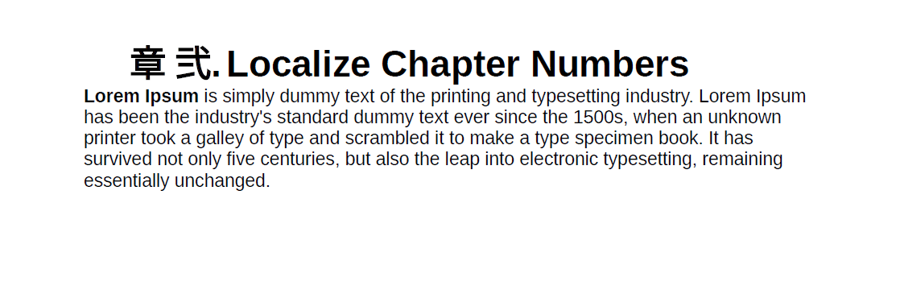

# Suporte para variáveis de idioma

O Guia AEM fornece o recurso para usar variáveis de idioma. Você pode usar variáveis de idioma para definir strings localizadas na saída de PDF ou para localizar qualquer texto estático nos templates de saída. Você pode usar estilos CSS para localizar as cadeias de caracteres provenientes de um CSS.

## Usar variáveis de linguagem na saída do PDF

Você pode usar variáveis de idioma para definir uma versão localizada dos rótulos prontos para uso como Observação, Cuidado e Aviso ou texto estático na saída de PDF. O nome da variável é o mesmo para todos os idiomas, mas pode ter valores diferentes para os vários idiomas. Você pode atualizar o valor dessas variáveis em um ou mais idiomas e, em seguida, o valor localizado é escolhido automaticamente na saída do PDF.

Por exemplo, você pode ter as seguintes maneiras de apresentar o rótulo `Note` na saída do PDF:

- Inglês: Note

- Francês: Remarque

- Alemão: Hinweis


*Uma nota de amostra nos idiomas inglês, francês e alemão.*

>[!NOTE]
>
> Se o valor de qualquer variável não estiver definido em um idioma específico, o AEM Guides escolhe a string do idioma da interface do usuário (interface do usuário do aplicativo) como um mecanismo de fallback.
>
> Se você não tiver definido o valor no idioma da interface do usuário, ele procurará por inglês (`en_us`), ou então escolhe o inglês (`en`) e exibe o mesmo na saída do PDF.

## Tipos de variáveis de idioma

O Guia AEM suporta dois tipos de variáveis: Variáveis de aplicativo e de usuário.

### Variáveis do aplicativo

Os Guias do AEM fornecem um conjunto de variáveis de aplicativo predefinidas ou prontas para uso. Você pode usar essas variáveis predefinidas para adicionar informações sobre um documento específico aos Guias do AEM. Por exemplo, a variável `chapter-number` se incluída em uma página, exibe o número do capítulo ao qual a página pertence. A variável `author-label` exibe o nome do autor do documento.

>[!NOTE]
>
> É possível substituir o valor de uma variável do aplicativo.


### Variáveis do usuário

Você também pode criar novas variáveis de idioma. Por exemplo, você pode criar uma variável de usuário Editor para o rótulo do editor do documento.

>[!NOTE]
>
>  Você deve ter privilégios administrativos para criar variáveis de usuário e editar as variáveis do aplicativo.


*Adicione e exiba as variáveis de idioma para um idioma selecionado.*

## Adicionar uma nova variável de idioma

1. No Editor da Web, vá para a guia Saída.
1. Selecionar **Variáveis de idioma**  no painel esquerdo.
1. Selecionar **Editar** para abrir o **Variáveis de idioma** janela. O aplicativo e as variáveis de usuário presentes no idioma selecionado são listados em ordem alfabética. Os valores são exibidos de acordo com o idioma selecionado. Por exemplo, se você selecionar o idioma francês, &quot;Dica&quot; será exibida como &quot;Conseil&quot;.
1. No **Idioma** selecione o idioma desejado no qual deseja editar uma variável.

   >[!NOTE]
   >
   > Se você não exibir os idiomas desejados, habilite o idioma desejado na **Configurações da variável de idioma**. Selecionar configurações   para abrir o **Configurações de variáveis de idioma** diálogo.

1. Insira o nome da variável nas **Nome** e seu valor na variável **Valor** coluna.

   >[!NOTE]
   >
   >Você pode usar qualquer conteúdo HTML como um valor de variável para exibir o valor da variável em formatação específica. Por exemplo, é possível adicionar `<b>` para exibir o Editor em negrito.

1. Selecionar **Adicionar variável de idioma**  para adicionar uma nova variável de idioma ao idioma selecionado. Adicionar uma variável a um idioma a adiciona automaticamente a todos os idiomas. Não é possível criar uma variável com o mesmo nome de uma variável existente. Um erro é exibido.

>[!NOTE]
>
> Se você não selecionar **Adicionar variável de idioma**, a variável não é criada e adicionada à lista

## Exportar e importar variáveis de idioma

Os Guias do Experience Manager fornecem suporte para exportar e importar as variáveis de idioma presentes no idioma selecionado. É possível exportar facilmente todas as variáveis de idioma juntamente com os valores definidos. Isso inclui as variáveis de aplicativo e usuário. Use o arquivo exportado para fazer as alterações desejadas nos valores ou localizá-las em outros idiomas.

Você também pode importar o arquivo XML, que contém as variáveis de idioma. Os Guias do Experience Manager importam apenas as variáveis de idioma já definidas, incluindo as variáveis de aplicativo e usuário. Ela não importa nenhuma variável que ainda não esteja definida.

### Exportar variáveis de idioma

Para exportar as variáveis de idioma para um idioma, selecione o idioma na lista suspensa e **Exportar** .
Ele cria um arquivo XML com o formato `language_variable_<ln>` onde `<ln>` é o código do idioma selecionado. Por exemplo, `language_variable_en.xml` para inglês e `language_variable_fr.xml` para o francês.

>[!NOTE]
> 
>Se você tiver alterações não salvas nas variáveis de idioma, não poderá exportá-las. Salve as alterações para visualizar o **Exportar**  ícone.

### Importar variáveis de idioma

Para importar as variáveis de idioma:

1. Selecione um idioma na lista suspensa e selecione **Importar** .
2. Procure e selecione o XML, que contém as variáveis de idioma. Por exemplo, language_variable_en.xml.
Você pode importar arquivos XML no seguinte formato:

```
<?xml version="1.0" encoding="UTF-8"?>
<variables>    
<variable id="note-important">Important: </variable>    
<variable id="note-caution">Avertir: </variable>    
<variable id="image-with-text">Text and image &lt;img src=&quot;/content/dam/assets/images/image_with_text.png&quot; /&gt; </variable> 
</variables> 
```

As variáveis com a mesma ID são importadas após a importação do arquivo. Os valores das variáveis no idioma selecionado são atualizados com aqueles no arquivo XML.  Uma mensagem sobre o número de variáveis atualizadas é exibida.

>[!NOTE]
> 
><ul><li>Se o arquivo não for um arquivo XML ou se contiver um formato incorreto que não mapeie com as variáveis de idioma, você verá um erro de que há um problema com o arquivo XML. 
&gt;<li>Se o arquivo não contiver variáveis com a mesma ID, você verá um aviso de que nenhuma variável de idioma correspondente é encontrada no arquivo importado.

### Opções para uma variável de idioma

Passe o mouse sobre a variável para visualizar o **Opções** para ele.


*Use o **Opções**para excluir, visualizar ou duplicar uma variável de idioma.*

Você pode visualizar as variáveis do aplicativo e do usuário. Para exibir como o valor da variável é exibido na saída, selecione **Visualizar** do **Opções** da variável selecionada.
Você também pode optar por **Excluir** ou **Duplicar** as variáveis de usuário. A exclusão de uma variável de um idioma a exclui automaticamente de todos os idiomas.

### Editar ou reverter as variáveis do aplicativo

Também é possível editar os valores de uma variável de aplicativo. Posteriormente, é possível reverter uma variável do aplicativo para o valor original. **Reverter variável**   é exibida para uma variável de aplicativo com um valor alterado.

## Usar variáveis de idioma nos modelos de saída

Você deve adicionar variáveis de idioma nos documentos localizados. Você pode inserir essas variáveis de idioma no layout de página que aparece em páginas diferentes nos documentos localizados. Por exemplo, é possível adicionar a variável de idioma para o `author-name` que aparece na área de cabeçalho do layout da página (ou em qualquer outra parte, como o rodapé ou o corpo).


*O autor e o nome da marca localizados na saída de PDF gerada para o idioma francês.*

Para inserir uma variável de idioma como a `copyright-label` na área de cabeçalho, execute as seguintes etapas:

1. Abra o layout de página desejado para edição.

   >[!NOTE]
   >
   > Exibir [Personalizar um layout de página](../native-pdf/components-pdf-template.md#customize-a-page-layout-customize-page-layout) seção para abrir um layout de página para personalização ou edição.

1. Selecione o cabeçalho para torná-lo ativo e inserir uma variável.
1. Selecionar **Inserir variável**   na barra de ferramentas.
1. No **Inserir variável** selecione o nome da variável de idioma a ser inserida e clique em **Inserir** para inseri-lo na área de cabeçalho.

   >[!NOTE]
   >
   > Você também pode inserir a string de pesquisa na caixa de texto. Os nomes das variáveis que contêm a cadeia de caracteres fornecida são filtrados e exibidos na lista.
   > A variável de idioma selecionada é inserida na área de cabeçalho.


*A variável `copyright-label` adicionado na área de cabeçalho.*

### Aplicar estilo de conteúdo a variáveis de idioma

Além do valor atribuído a uma variável de linguagem, também é possível usar tags HTML para exibir o valor da variável em formatação específica. Por exemplo, é possível exibir o valor de `publisher-label` em negrito.

- Também é possível formatar os estilos dos valores usando <span> tag. Por exemplo, usando a variável de idioma page-number, é possível exibir o número da página no formato de número romano em inglês e especificar o formato para outros idiomas.

  Valor para inglês:
  `<span data-field="page-number" data-format="upper-roman">1</span>`

  Valor para tâmil:
  `<span data-field="page-number" data-format="tamil">1</span>`

Da mesma forma, é possível adicionar variáveis de idioma e formatar outros campos listados no recurso Inserir campos dos layouts de página. Para obter mais detalhes sobre a adição de campos, consulte [Adicionar campos e metadados](../native-pdf/design-page-layout.md#add-fields-metadata).

- Também é possível adicionar imagens localizadas nos valores. Por exemplo, você pode adicionar um ícone de imagem na linguagem de número de capítulo e obter imagens localizadas do ícone na saída do PDF.

  Em inglês, o valor da variável de uma imagem pode ser como ``, e para a mesma variável em alemão, pode ser ``. Então, ele pega as imagens dependendo da linguagem.

## Localizar as cadeias de caracteres usando estilos CSS

Usando estilos CSS, você também pode localizar as cadeias de caracteres usadas na Numeração automática, como Capítulo, Seção, Figura e Tabela. Como essas cadeias de caracteres vêm de arquivos CSS, não é possível localizá-las usando variáveis de idioma. Para traduzir essas cadeias de caracteres, você pode criar estilos de CSS para cada idioma em que deseja localizá-las.
Por exemplo, você pode usar o CSS a seguir para exibir o prefixo do capítulo e o formato de número correspondente em vários idiomas.
Por exemplo, você pode usar o CSS a seguir para exibir o Chapter como Hoofdstuk em alemão e o número do capítulo no formato decimal. No caso do japonês, é possível usar o formato de número japonês para mostrar os números de capítulo no índice.

```
// for English
h1:before {
  counter-increment: h11;
  content: "Chapter " counter(h11, decimal)".";
}

// for German
:root:lang(de) h1:before {
  content: "Hoofdstuk " counter(h11, decimal)".";
}

// for Japanese
:root:lang(ja) h1:before {
  content: "章 " counter(h11, japanese-formal)".";
}
```

As capturas de tela a seguir exibem as cadeias de caracteres localizadas na saída em PDF alemão e japonês.





### Formatar os prefixos

Usando estilos CSS, você também pode formatar os prefixos. Por exemplo, é possível formatar o rótulo `Note` para aparecer em vermelho na saída em PDF de vários idiomas.

```
.note .prefix-content 
{
color: red;
} 
```
