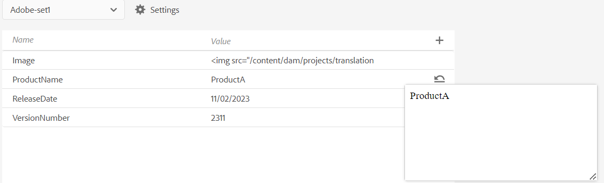

# Variáveis na saída PDF

Um variável é um par de dados nome-valor que serve como uma informação reutilizável. Isso torna seus conteúdo portáteis e fáceis de atualizar. Quando você modifica uma variável ou seu valor, cada ocorrência dessa variável ou valor é atualizada.

## Criar uma nova variável

Execute as seguintes etapas para criar uma variável:

{width="800" align="left"}

*Crie variáveis e defina valores para elas.*

1. No Editor da Web, vá para a **Output** guia.
1. Selecionar **Variáveis**  no painel esquerdo.
1. Selecionar **Editar**  para abrir o **Variáveis** editor.
As variáveis estão listadas em ordem alfabética.
1. Insira o nome variável na **coluna Nome** e seu valor na **coluna Valor** .
   >[!TIP]
   >
   >Você pode usar qualquer conteúdo HTML como um valor de variável para exibir o valor da variável em formatação específica. Por exemplo, é possível adicionar um `<b>` para o valor da variável para exibir o valor **Guias do Experience Manager** em negrito. Você também pode adicionar imagens do repositório como valores.

1. Selecionar **Adicionar variável**  para adicionar uma nova variável. Não é possível criar uma variável com o mesmo nome de uma variável existente. Um erro é exibido.

   >[!NOTE]
   >
   >Se você não selecionar **Adicionar variável** , a variável não é criada e adicionada à lista.

Dessa forma, você pode criar variáveis com valores padrão. Por exemplo:
* Nome do produto: Guias do Experience Manager
* VersionNumber: 2300
* Data de lançamento: 01/01/2023

### Editar uma variável

É possível editar uma variável de duas maneiras:

**No painel Variáveis à esquerda**

1. Selecione uma variável no **Variáveis** painel.
1. Passe o mouse sobre a variável para visualizar o **Opções** e selecione o **Editar** opção.
1. No **Editar variável** é possível editar o valor padrão da variável selecionada.
1. Clique em **Concluído**.

**No editor de variáveis**

1. Selecionar **Variáveis**  no painel esquerdo.
1. Selecionar **Editar**  para abrir o **editor Variáveis** .

1. **Na editor Variáveis**, é possível editar o valor dos variável selecionados.

É necessário salvar as alterações feitas nas **Variáveis** editor para visualização-las no **painel Variáveis** no lado esquerdo.

>[!NOTE]
>
> Se você editar qualquer valor de variável, o Adobe Experience Manager Guias atualizará simultaneamente todas as referências sempre que aplicável.

### Search e pré-visualização uma variável

É possível pesquisar e pré-visualizar o valor de uma variável. Insira uma string na caixa de pesquisa do **Variáveis** painel. Ela faz a pesquisa com base no nome da variável e em seu valor.
É possível visualizar uma variável de duas maneiras:

A pré-visualização da variável exibe o valor padrão. Por exemplo, se você tiver definido o valor padrão da variável ProductName como &quot;Guias do Adobe Experience Manager&quot;, ele exibirá esse valor na visualização.

**No painel Variáveis à esquerda**

1. Selecione uma variável no **Variáveis** painel.
1. Passe o mouse sobre a variável para visualizar o **Opções** e selecione o **Visualizar** opção.

{width="550" align="left"}

*Visualize o valor padrão de uma variável.*

**No editor de variáveis**

1. Passe o mouse sobre a variável na lista para visualizar as **Opções** menu.
1. Selecionar **Visualizar**.

### Duplicar uma variável

É possível duplicado um variável e modificar o valor de acordo com seus requisitos.

1. Passe o mouse sobre as variável no lista para visualização no **menu Opções** .
1. Selecione **Duplicar**.

O nome padrão da variável é `<selected variable name>` (como &quot;exemplo&quot;). Você pode alterar o nome de acordo com suas necessidades.

### Excluir uma variável

É possível excluir uma variável de duas maneiras:

**No painel Variáveis à esquerda**

1. Selecione uma variável no **Variáveis** painel.
1. Passe o mouse sobre a variável para visualizar o **Opções** e selecione o **Excluir** opção.

**No editor de variáveis**

1. Passe o mouse sobre a variável na lista para visualizar as **Opções** menu.
1. Selecionar **Excluir** opção.

A variável é excluída de todos os conjuntos de variáveis.

## Conjuntos de variáveis para as predefinições de saída

Adobe Experience Manager Guias também suporta conjuntos de variável, que permitem atribuir valores alternativos às suas variáveis. Por exemplo, uma empresa pode vender dois produtos, A e B. Ela tem especificações diferentes para cada uma delas. Essas especificações podem incluir o nome do produto, o número da versão e a data de lançamento. Pode haver outras diferenças na identidade visual. Usando conjuntos de variáveis, você define um conjunto diferente de valores para as variáveis. Ao gerar a saída, você escolhe o conjunto de variáveis apropriado e produz a saída necessária.

### Configurar conjuntos de variáveis

É necessário configurar conjuntos de variáveis antes de adicionar variáveis a eles.

1. Selecionar **Configurações**  para abrir o **Configurar conjuntos de variáveis** caixa de diálogo.
   {width="550" align="left"}
1. Insira o nome do conjunto de variáveis no campo **Nome** coluna.
1. Selecionar **Adicionar variável**  para adicionar um novo conjunto de variáveis. Os conjuntos de variáveis são listados em ordem alfabética.
1. É possível selecionar **Excluir** para remover um conjunto de variáveis.

### Operações de conjunto de variáveis

Todos os conjuntos de variáveis têm as mesmas variáveis, mas podem ter valores diferentes.

É possível exibir, editar e visualizar os valores de um conjunto de variáveis específico. Selecione um conjunto de variáveis na **Conjuntos de variáveis** lista suspensa. Os valores são exibidos de acordo com o conjunto de variáveis escolhido.
Ao editar os valores das variáveis em conjuntos de variáveis específicos, os valores padrão são substituídos e os valores do conjunto de variáveis selecionado são alterados.
Por exemplo, é possível definir os seguintes valores para os conjuntos de variáveis, *Adobe-set1* e *Adobe-set2* .

**Conjunto de variáveis 1**: *Adobe-set1*

* Nome do produto: ProductA
* VersionNumber: 2311
* Data de lançamento: 02/11/2023

**Conjunto de variáveis 2**: *Adobe-set2*

* ProductName: ProductB
* VersionNumber: 2310
* Data de lançamento: 07/09/2023

Cada nova variável é adicionada a todos os conjuntos de variáveis. Quando você exclui ou duplica uma variável, ela é atualizada para todos os conjuntos de variáveis.

Também é possível visualizar os valores de um conjunto de variáveis.
Por exemplo, para o conjunto de variáveis *Adobe-Set1*, você definiu o valor da variável ProductName como &quot;ProductA&quot; e, em seguida, ele exibe esse valor na pré-visualização no editor de Variáveis.

{width="550" align="left"}

*Visualize o valor definido no conjunto de variáveis selecionado.*

### Redefinir o valor de uma variável

Se você editou o valor, também é possível redefinir uma variável para o valor padrão.
Redefinir  é exibida para uma variável com um valor alterado.
Por exemplo, é possível redefinir o valor da variável ProductName com o valor padrão Experience Manager Guides.

## Usar variáveis nos modelos de PDF nativo

Você pode adicionar variáveis enquanto gera a saída dos documentos do produto para torná-las portáteis e fáceis de atualizar. Você pode inserir essas variáveis no layout de página que aparece nas diferentes páginas dos documentos. Por exemplo, você pode adicionar a variável ProductName que aparece na área de cabeçalho do layout da página (ou qualquer outra parte, como o rodapé ou o corpo).

Para inserir uma variável como o Nome do produto na área de cabeçalho, execute as seguintes etapas:
1. Abra o layout de página desejado para edição.

   >[!NOTE]
   >
   > Exibir [Personalizar um layout de página](../native-pdf/components-pdf-template.md#customize-a-page-layout-customize-page-layout) seção para abrir um layout de página para personalização ou edição.

1. Selecione o cabeçalho para torná-lo ativo e inserir uma variável.

1. É possível inserir o variável de duas maneiras:

   **No painel Variáveis, no lado esquerdo**

   * Arraste um variável do **painel Variáveis** e solte-o na área de cabeçalho.

   **Da barra de ferramentas**

   1. Selecionar **Inserir Variável/Campos** .
   1. No **Variável** , selecione o nome da variável para inseri-la na área de cabeçalho.
   1. Você também pode inserir a string de pesquisa na caixa de texto. Os nomes das variáveis que contêm a cadeia de caracteres fornecida são filtrados e exibidos na lista. A variável selecionada é inserida na área de cabeçalho. É possível visualizar o valor padrão da variável.
   1. Para substituir uma variável, clique duas vezes no valor da variável e selecione outra variável na **Variável** caixa de diálogo. A variável é substituída.

## Gerar saída de PDF com variáveis

Você pode gerar a saída de PDF com os valores de variáveis diferentes. Antes de gerar o layout, escolha um conjunto de variáveis em uma predefinição de saída **Conjunto de variáveis** para escolher seus valores.

{width="550" align="left"}

*Selecione uma variável definida na lista suspensa da predefinição de saída que deseja usar para gerar a saída PDF.*

>[!NOTE]
>
> Você também pode selecionar (Padrão) na lista suspensa para publicar os valores padrão de todas as variáveis.

Dependendo do conjunto de variáveis escolhido, você obterá uma saída correspondente aos valores de variáveis definidos no conjunto de variáveis. Por exemplo, se você selecionar o conjunto de variáveis *Adobe-set1*, sua saída exibe os valores das variáveis conforme definido neste conjunto.

*Gere a saída do PDF usando variáveis no layout da página.*

Você também pode atualizar rapidamente os valores de qualquer conjunto de variáveis sempre que necessário e gerar novamente a saída. Por exemplo, se você precisar atualizar os detalhes de uma versão, é possível atualizar o valor da versão na variável VersionNumber e gerar novamente a saída.

