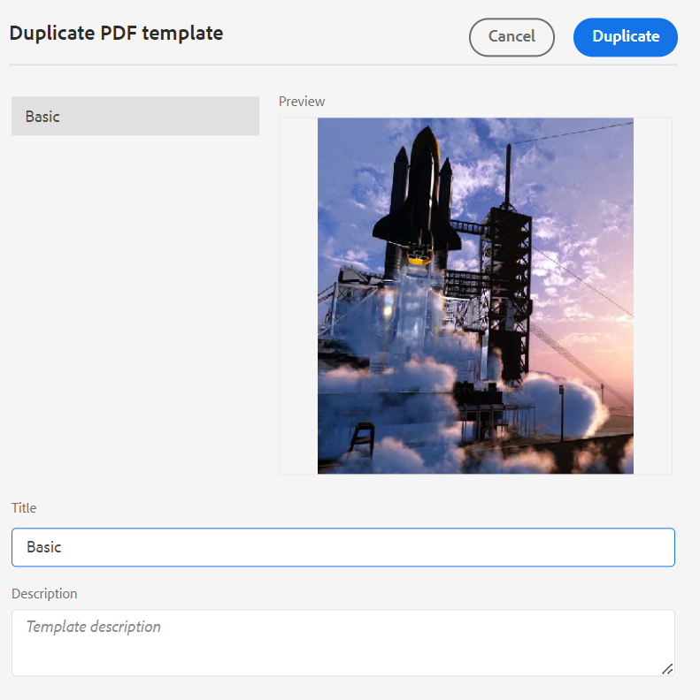

# modelo PDF {#PDF-template}

O uso de um modelo garante a consistência do layout e da estrutura do conteúdo. Como os modelos são predefinidos, você pode evitar retrabalho em problemas de formatação que surgem para cada novo projeto ou atualização. Os modelos permitem criar layouts de página, conteúdo de estilo e aplicar várias configurações para personalizar o PDF.

## Modelos de PDF de fábrica e personalizados

Há alguns modelos de fábrica de amostra enviados imediatamente, que os desenvolvedores podem usar como modelos base para criar modelos personalizados de acordo com seus requisitos organizacionais.

## Criar um novo modelo de PDF {#create-pdf-template}

Você pode criar modelos de PDF personalizados com layouts de página específicos e definir a formatação de componentes de layout de página (como índice, glossário) ou componentes DITA (como cabeçalho, parágrafo, lista) usando folhas de estilos.

Para criar um novo modelo de PDF, execute as seguintes etapas:
1. No Editor da Web, vá para a **Output** guia.
1. Selecionar **Modelos**  no painel esquerdo.

1. Na janela **Modelos**, selecione o ícone **+** ao lado de **Modelos** e escolha **Modelo de PDF**.
1. Na caixa de diálogo **Novo modelo de PDF**, selecione um modelo de fábrica que você deseja usar como base para criar o modelo personalizado. Você também pode usar a caixa de pesquisa para procurar um template.
1. Especifique um título para o modelo.

>[!NOTE]
>
>  Você também pode visualizar uma miniatura do modelo ao criar e duplicar um modelo. Editar ou excluir a miniatura usando [**Propriedades**](#properties-option) no **Opções** depois de criar o modelo.

1. Clique em **Criar**.

   O novo modelo é criado e adicionado na variável **Modelos** painel.

## Duplicação de um modelo de PDF {#duplicate-pdf-template}

Para criar um novo modelo com os mesmos layouts e formatação de página de um modelo existente, é possível criar uma cópia. Depois que um modelo for duplicado, você poderá personalizar ainda mais seus componentes conforme necessário.

Para duplicar um template de PDF existente, siga as etapas abaixo:
1. No Editor da Web, vá para a **Output** guia.
1. Selecionar **Modelos**  no painel esquerdo. Isso abre o **Modelos** janela.
1. Passe o mouse sobre o template que deseja duplicar e selecione o **..** *Opções* e escolha **Duplicar** no menu de contexto.

   Isso abre o **Duplicar modelo de PDF** diálogo.

   

   *Selecione um modelo para duplicar, visualize a miniatura e atualize o título no campo **Duplicar modelo de PDF**diálogo.*

1. Especifique um título para o modelo.

   A variável **Título** O campo é pré-preenchido como uma cópia do mesmo título do modelo de origem. Você visualizará uma mensagem de erro se existir um modelo com o mesmo título.

1. Para especificar um título preferencial, remova o título preenchido previamente e especifique um título.
1. Clique em **Duplicar**.

   Um modelo duplicado é criado e adicionado em **Modelos**.

## Outras operações nos modelos

Você também pode executar as seguintes operações nos modelos da **Opções** menu:

### Excluir

Selecione a opção Excluir para excluir o modelo selecionado. Em seguida, selecione Yes no prompt de confirmação.
A predefinição é removida da variável **Modelos**.

### Propriedades{#properties-option}

Selecione esta opção para exibir e editar as propriedades do modelo. Você pode visualizar a miniatura existente do modelo. Também é possível editar ou excluir a miniatura. Também é possível alterar o título e a descrição do template.

### Exibir na interface do usuário do Assets

Selecione esta opção para exibir o modelo na interface do usuário do Assets. Ao abrir o local raiz do modelo, você pode visualizar todos os recursos do modelo.

Depois de criar o modelo personalizado, você pode escolhê-lo nos Layouts de página na predefinição de saída PDF.
Saiba como [publicar uma saída de PDF](https://experienceleague.adobe.com/docs/experience-manager-guides-learn/tutorials/user-guide/output-gen/web-editor/native-pdf-web-editor.html?lang=en).

>[!NOTE]
>
>Se a pasta tiver um Perfil de pasta configurado, você visualizará somente os modelos de PDF configurados no Perfil de pasta.

Com base na sua configuração, o administrador pode configurar os modelos:

 Cloud Services 

Para obter detalhes sobre a configuração de perfis globais e de nível de pasta, consulte [Configurar modelos](../cs-install-guide/conf-folder-level.md#id1889D0IL0Y4) no guia de instalação e configuração do Cloud Service.

    

  Software local 

Para obter detalhes sobre a configuração de perfis globais e de nível de pasta, consulte [Configurar modelos de criação](../install-guide/conf-folder-level.md#create-custom-authoring-template-id1917d0eg0hj) no guia de instalação e configuração no local.

## Personalizar um modelo de PDF {#customize-pdf-template}

É possível personalizar modelos ajustando os componentes do modelo e aplicando formatos de estilo usando folhas de estilos.

Para personalizar um modelo de PDF, execute as seguintes etapas:
1. No Editor da Web, vá para a **Output** guia.
1. Expanda a barra lateral esquerda e selecione **Modelos**.

   Isso abre o **Modelos** painel.
1. Para exibir os componentes de um modelo, siga um destes procedimentos:

   * Selecione o ícone > ao lado de um modelo ou clique duas vezes no nome do modelo.
   * Passe o mouse sobre qualquer modelo e selecione o ... (**Opções** ícone) e escolha **Editar** no menu de contexto.

     Por padrão, isso abre a variável **Configurações** no editor de modelos.
   

   >[!NOTE]
   >
   >  O administrador pode baixar os modelos mais recentes no caminho a seguir e substituir os existentes:
   >
   > `/libs/fmdita/pdf`

   Os vários componentes do modelo que você pode personalizar são categorizados nas seguintes seções:
   * Layouts de página: um PDF típico contém páginas diferentes, como uma capa ou página de título, índice, capítulo, índice, citações e muito mais. A seção Layouts de página permite que você crie a aparência de páginas diferentes que formariam seu PDF. Para obter mais detalhes, consulte [Layouts de página](../native-pdf/components-pdf-template.md#page-layouts).

     Além da aparência, também é possível definir a organização dos elementos da página, como o cabeçalho, o rodapé e as áreas de conteúdo em uma página. Para saber mais sobre como personalizar o layout de uma página, consulte [Criar e personalizar layouts de página](components-pdf-template.md#create-customize-page-layout).

   * Folhas de estilos: as configurações na seção Folhas de estilos permitem personalizar a aparência dos componentes de layout da página, como índice, glossário, citações e muito mais. Além disso, também é possível personalizar os estilos do conteúdo DITA, como cabeçalhos, parágrafos, listas e muito mais. Para saber mais sobre como usar as folhas de estilos, consulte [Usar folhas de estilos para personalizar o PDF](components-pdf-template.md#stylesheet-customization).
   * Recursos: armazene arquivos de ativos que você precisaria personalizar ou criar modelos de PDF. Ativos como logotipos, fontes personalizadas, imagens de fundo e muito mais são armazenados em Recursos.
Você também pode usar os recursos presentes em qualquer outro local no repositório. Não é necessário criar recursos duplicados para cada modelo, e você pode mantê-los em uma pasta compartilhada e usá-los em todos os modelos de PDF nativos.

     Para saber mais sobre a utilização de recursos, consulte [Trabalhar com recursos](components-pdf-template.md#work-with-resources).
   * Configurações: defina as configurações de saída para gerar um PDF usando o modelo. Esta seção permite definir o mapeamento de modelo para várias páginas em um PDF, página inicial de capítulo, marcadores de impressão, citações e muito mais.
Você também pode organizar a ordem em que eles devem aparecer na saída final do PDF.
Para obter mais informações sobre como aplicar configurações, consulte [Configurações avançadas de PDF](components-pdf-template.md#advanced-pdf-settings).

1. Para personalizar um componente de modelo, clique duas vezes em um componente de modelo ou selecione o ícone > antes dele.

   Por exemplo, clique duas vezes em *Layouts de página* ou selecione o *>* ícone antes *Layouts de página* para visualizar os layouts de página disponíveis.

   >[!NOTE]
   >
   >Também é possível atualizar uma miniatura e a descrição do modelo usando o [**Propriedades**](#properties-option) no **Opções** menu.

1. Depois de fazer as alterações desejadas, selecione *Salvar tudo* (ou `Ctrl+S`).
