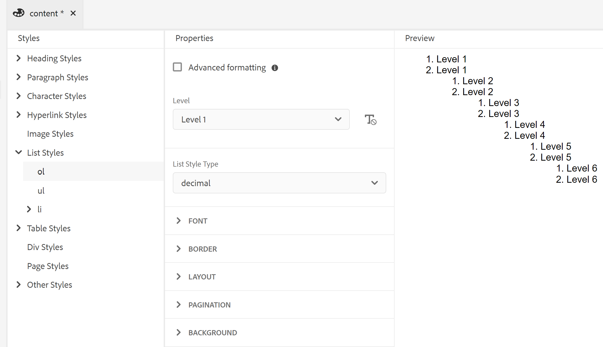

# Trabalhar com os estilos de conteúdo comuns {#work-with-common-styles}

Uma folha de estilos contém as definições de estilos para os elementos usados na saída do PDF. Você pode optar por trabalhar com as folhas de estilos de amostra ou criar novas. Na maioria dos casos, criar uma cópia da folha de estilos de amostra do OOTB ajudará você a começar rapidamente.

O editor de estilos é um editor WYSIWYG que oculta todas as complexidades de um código CSS por trás da interface do usuário. Usando o editor de estilos, é possível personalizar estilos fácil e rapidamente para os elementos de sua escolha. Os estilos são classificados nos seguintes cabeçalhos:

* Estilos de cabeçalho
* Estilos de parágrafo
* Estilos de caractere
* Estilos de Hiperlink
* Estilos de imagem
* Estilos de lista
* Estilos de Tabela
* Estilos Div
* Estilos de página
* Outros estilos

Ao trabalhar com conteúdo DITA estruturado, o mapeamento de estilos da maioria dos elementos DITA está em vigor na folha de estilos padrão. Se você estiver trabalhando com elementos DITA padrão, é possível alterar a aparência diretamente fazendo alterações na definição do estilo. Essas definições de estilo estão disponíveis na categoria Outro estilo. Para obter mais detalhes, consulte [Trabalhar com outros estilos](#other-styles) mais adiante neste tópico.

As seções a seguir abordam as configurações de estilo usadas com mais frequência na forma de exemplos.

>[!NOTE]
>
>Nos exemplos a seguir, presume-se que você esteja trabalhando com a folha de estilos de amostra enviada com o produto.

## Trabalhar com Estilos de Título {#heading-styles}

Os estilos de cabeçalho encapsulam todos os estilos de base para os cabeçalhos usados no conteúdo. OOTB você terá seis estilos de cabeçalho base e um estilo de cabeçalho para o tópico/capítulo e cabeçalho de título do apêndice. Em um documento estruturado, o H1 representa o título do tópico ou capítulo e H2 a H6 são usados para subtópicos ou seções dentro de um tópico/capítulo. Essa hierarquia de cabeçalhos é aplicada automaticamente ao seu conteúdo sempre que o cabeçalho correspondente é encontrado.

>[!NOTE]
>
>Você pode criar seus próprios estilos de cabeçalho personalizados e eles podem ser usados no conteúdo usando a classe de saída. Para obter mais detalhes, consulte a Etapa 4 em [Usar orientação de página e rotação de exibição](design-page-layout.md#page-orientation-rotation) exemplo.

### Criar cabeçalhos personalizados no nível do capítulo {#create-chapter-level-heading}

Em um livro (ou um mapa), você trabalha com Capítulos. Os estilos de cabeçalho básicos são projetados de forma a serem aplicados em seus cabeçalhos de nível de capítulo sem nenhuma personalização. No entanto, se você quiser criar cabeçalhos especializados para seu conteúdo, será necessário criar esses cabeçalhos. Por exemplo, o padrão `h1.chapter` o cabeçalho é aplicado ao título do capítulo. Se quiser que o título do capítulo apareça em um estilo diferente, é necessário personalizar o `h1.chapter` estilo. Da mesma forma, você pode criar estilos personalizados para subcabeçalhos no capítulo. Por exemplo, se você deseja criar um estilo personalizado para todos os 2nd e 3rd cabeçalho de nível no capítulo, será necessário criar um novo estilo como `h2.chatper` e `h3.chatper`.

Como o recurso Publicação PDF nativa contém as definições de estilo base para os estilos mais comuns, mesmo que você exclua acidentalmente um estilo, o estilo padrão é aplicado no conteúdo. Por exemplo, se não houver uma definição de estilo para o estilo h2 na folha de estilos, o recurso Publicação de PDF nativo aplicará algum estilo base no conteúdo h2.

Neste exemplo, criaremos um estilo de cabeçalho de capítulo de segundo nível:

1. Abra a folha de estilos necessária para edição.
   >[!NOTE]
   >
   >Consulte [Personalizar um estilo predefinido ou novo](components-pdf-template.md#customize-style) seção para abrir uma folha de estilos para personalização ou edição.

1. No **Estilos** , expanda a **Estilos de cabeçalho**.
1. Clique com o botão direito do mouse em **Estilos de cabeçalho** estilo e escolha **Novo estilo**.
1. No *Adicionar estilo* , mantenha a **Tag** nomear como `h2` e insira `chapter` no **Classe** campo do nome.
1. Clique em **Concluído**.

Um novo estilo de cabeçalho chamado `h2.chapter` é criado e adicionado na lista Estilos de cabeçalho.

Depois de criar um estilo, você pode personalizar as propriedades necessárias do estilo usando o editor de estilos.

### Criar cabeçalhos de numeração automática {#auto-number-heading}

Um dos estilos de saída mais usados é o cabeçalho com numeração automática. Esses cabeçalhos representam o número do capítulo, o tópico e os números do subtópico. Os cabeçalhos de numeração automática são diferentes dos estilos de lista em que uma lista de itens em um tópico recebe numeração automática.

Neste exemplo, vamos personalizar os cabeçalhos do nível 1 para o nível 3 para usar números automáticos em diferentes formatos.

1. Abra a folha de estilos necessária para edição.

   >[!NOTE]
   >
   >Consulte [Personalizar um estilo predefinido ou novo](components-pdf-template.md#customize-style) seção para abrir uma folha de estilos para personalização ou edição.

1. No **Estilos** , expanda a **Estilos de cabeçalho**.

1. Selecione o **h1** estilo na lista.
As propriedades do estilo h1 são mostradas no painel Propriedades junto com sua Visualização.

   >[!NOTE]
   >
   >O painel Visualizar fornece uma visualização em tempo real de qualquer atualização de estilo aplicada em qualquer elemento.

1. Selecione o **Numeração Automática** propriedade.

   Os estilos que podem ser aplicados na lista de numeração automática são mostrados abaixo da propriedade Numeração automática.

1. Defina as seguintes propriedades:
   * **Estilo**: selecione em uma grande variedade de estilos de numeração genéricos ou específicos de localidades. Você pode escolher estilos como indo-arábico, devanágari, georgiano, decimal, Alpha inferior e muito mais. Para o exemplo atual, selecione `upper-alpha`.

   * **Formato**: o formato padrão é definido como `<x>`, em que o `x` é substituído pelo Estilo de numeração selecionado na propriedade Style. Por exemplo, se você selecionou `decimal` (1) estilo, depois o valor de `x` incrementos automáticos para cada instância do `h1` estilo e vai como 2, 3 e assim por diante. Também é possível adicionar texto personalizado no campo para formatar o estilo do cabeçalho. Por exemplo, se você quiser que todos os cabeçalhos h1 tenham um prefixo de `Chapter`, é necessário definir esse campo como `Chapter <x>`.

   * **Inserir caractere**: Se quiser adicionar um caractere especial no Formato, clique no botão Inserir caractere () ícone. Selecione o caractere desejado que deseja adicionar no formato de estilo e clique em Inserir. Há diferentes tipos de caracteres especiais que você pode escolher na lista suspensa Selecionar categoria. Para o nosso exemplo, selecione a opção Aspas angulares à direita na categoria Pontuação.

     

   * **Iniciar numeração de**: se quiser que a numeração comece a partir de um número específico, forneça esse valor. Para o nosso exemplo, mantenha o valor padrão de 1.

   * **Recuar**: Se quiser recuar o cabeçalho, será necessário definir o valor de Recuo. Para o nosso exemplo, defina-o como 0 px.

     >[!NOTE]
     >
     >É possível inserir o valor em px (pixels), pt (pontos), rem, em, % (porcentagem) ou em unidades (polegadas).

   * **Largura do prefixo**: esta é a área ocupada pelo formato de numeração automática. Ele é automaticamente definido para um tamanho que possa acomodar facilmente o formato de estilo selecionado. Se quiser aumentar o tamanho, você poderá substituir o valor padrão.

     Ao definir esse valor manualmente, tente alterar as outras propriedades que terão impacto na largura. Por exemplo, altere o tamanho da fonte, o formato com prefixo (Capítulo) ou um sufixo (:), defina o valor máximo na variável *Iniciar numeração de* e as várias propriedades de fonte para obter o tamanho ideal.

     Para o nosso exemplo, mantenha o valor padrão.

   * **Espaçamento**: especifique o espaçamento horizontal e vertical. Para o nosso exemplo, mantenha os valores padrão.

     Com as personalizações acima, o estilo é personalizado conforme mostrado abaixo:

     

   * **Aplicar formatação a**: as propriedades na categoria Autonumeração ajudarão você a definir o estilo de numeração. Para aplicar mais personalizações ao estilo de numeração ou ao conteúdo do formato de cabeçalho, você pode escolher Numeração ou Parágrafo nesse campo. Se você escolher &#39;Numeração&#39;, quaisquer alterações feitas em &#39;Fonte&#39;, &#39;Borda&#39;, &#39;Layout&#39; e outras categorias serão aplicadas somente ao estilo de numeração no cabeçalho. No entanto, se você escolher &#39;Parágrafo&#39;, as alterações serão aplicadas ao conteúdo do cabeçalho, não ao estilo de numeração.

   Use as configurações a seguir para gerar uma saída mostrada na seguinte captura de tela:

   | **Estilo do título** | **Propriedade** | **Valor** | **Comentários adicionais** |
   | :- | :- | :- | :- |
   | h1 | Estilo | Decimal | Essas propriedades estão na categoria Autonumeração |
   |  | Formato | `Capter <x>:` |  |
   |  | Largura do prefixo | 160px |  |
   |  | Fonte > Alinhamento de texto | Esquerda | Certifique-se de que &#39;Aplicar formatação a&#39; esteja definido como &#39;Numeração&#39; |
   | h2 | Estilo | Decimal | Essas propriedades estão na categoria Autonumeração |
   |  | Formato | `Section <x>:` |  |
   |  | Largura do prefixo | 125 px |  |
   |  | Fonte > Alinhamento de texto | Esquerda | Certifique-se de que &#39;Aplicar formatação a&#39; esteja definido como &#39;Numeração&#39; |
   | h3 | Estilo | Decimal | Essas propriedades estão na categoria Autonumeração |
   |  | Inserir Nível | 2 |  |
   |  | Formato | `Section <2>.<x>:` |  |
   |  | Largura do prefixo | 125 px |  |
   |  | Fonte > Alinhamento de texto | Esquerda | Certifique-se de que &#39;Aplicar formatação a&#39; esteja definido como &#39;Numeração&#39; |
   |  |

   

## Trabalhar com estilos de parágrafo {#paragraph-style}

Um estilo de parágrafo pode ser criado para aplicar formatação especial a um parágrafo inteiro. Entretanto, usando a pseudoclasse, você pode aplicar um estilo a apenas uma parte específica do texto. No exemplo a seguir, criaremos um estilo de parágrafo para usar o estilo de capitular.

### Criar o estilo de capitular {#drop-cap-style}

Um estilo capitular (ou capitular) é usado em revistas e documentos literários nos quais o primeiro caractere de um parágrafo ou seção recebe um estilo especial. Você pode obter o mesmo efeito usando o recurso Publicação de PDF nativo.

No exemplo a seguir, criaremos um estilo de capitular:

1. Abra a folha de estilos necessária para edição.

   >[!NOTE]
   >
   Consulte [Personalizar um estilo predefinido ou novo](components-pdf-template.md#customize-style) seção para abrir uma folha de estilos para personalização ou edição.

1. No **Estilos** , expanda a **Estilos de parágrafo**.

1. Clique com o botão direito do mouse no **Estilo de parágrafo** e escolha **Novo estilo**.

1. No *Adicionar estilo* , mantenha a **Tag** nome como p e no campo **Pseudo** **Classe** selecione `::first-letter`.

1. Clique em **Concluído**.

   Um novo estilo de parágrafo chamado `::first-letter`  é criado e adicionado na seção **Estilos de parágrafo** lista.

1. Selecionar `::first-letter` no estilo p, e defina as seguintes propriedades:

   * **Fonte**: Defina a fonte desejada para a primeira letra do parágrafo. Para o nosso exemplo, defina a Família da fonte como cursiva, espessura da fonte para 500, tamanho da fonte para 30 pt e escolha uma cor de fonte.

   * **Layout**: Defina o alinhamento vertical do texto ao redor do estilo de capitular. Para o nosso exemplo, definiremos o Alinhamento vertical como Inferior.

Como a variável `p` é mapeada com a tag `
` elemento no DITA, não é necessário adicionar explicitamente esse estilo usando o atributo outputclass. Onde quer que em seu conteúdo `
` for usado, o estilo de capitular será aplicado automaticamente a ele. Na captura de tela a seguir, o título do capítulo, a descrição curta e os elementos da lista de definição não foram formatados com o estilo de capitular. Somente o estilo de parágrafo é formatado com o estilo de capitular:

## Trabalhar com estilos de caractere {#char-style}

Com os estilos de caractere, é possível criar estilos para formatar caracteres ou palavras no conteúdo. Por exemplo, você pode criar um estilo de caractere para código incorporado ou nome de arquivo, ou pode criar um estilo que use vários formatos de estilo no conteúdo selecionado.

### Criar um estilo de caractere incorporado {#inline-char-style}

A formatação de caracteres ou palavras incorporadas em um parágrafo é um estilo muito comum. O processo de criação de um estilo em linha envolve duas tarefas: primeiro, crie um novo estilo na folha de estilos e, segundo, aplique o estilo no conteúdo usando o `outputclass` atributo.

No exemplo a seguir, criaremos um estilo de caractere em linha:

1. Abra a folha de estilos necessária para edição.

   >[!NOTE]
   >
   Consulte [Personalizar um estilo predefinido ou novo](components-pdf-template.md#customize-style) seção para abrir uma folha de estilos para personalização ou edição.

1. No **Estilos** , expanda a **Estilos de caractere**.

1. Clique com o botão direito do mouse no **Estilo de caractere** e escolha **Novo estilo**.

1. Na caixa de diálogo Adicionar estilo, mantenha **Tag** nomeie como span e digite `BoldItalic` no **Classe** campo do nome.

   

1. Clique em **Concluído**.

   Um novo estilo de caractere chamado código é criado e adicionado na lista Estilos de caractere.

1. Selecionar `span.BoldItalic` do **Estilo de caractere** e defina as seguintes propriedades:

   * **Fonte**: todas as propriedades relacionadas à fonte podem ser personalizadas nesta seção. Por padrão, há algumas fontes agrupadas com o produto. Você pode escolher a fonte desejada para o estilo de caractere. Para o nosso exemplo, defina a Família da fonte como *Serif,* e selecione *Negrito* e *Itálico* na propriedade Estilo da fonte. Você também pode personalizar outras propriedades de fonte, como Espessura da fonte (como negrito, mais claro), Decoração do texto (como sublinhado, linha sobreposta), Tamanho da fonte, Cor da fonte, Alinhamento do texto e muito mais.

     >[!NOTE]
     >
     Também é possível adicionar fontes ao modelo, que são armazenadas na seção Resources do modelo. Para obter mais detalhes sobre como adicionar fontes e trabalhar com Recursos, consulte [Trabalhar com recursos](components-pdf-template.md#work-with-resources).

   * **Layout**: você pode definir as propriedades relacionadas ao layout, como Altura e Largura, Margem, Preenchimento, Alinhamento e muito mais.

   * **Histórico**: as propriedades Background permitem formatar a cor do plano de fundo de um estilo específico. É possível definir a cor ou a imagem do plano de fundo para qualquer estilo.

Depois de criar o estilo de caractere incorporado, é necessário aplicá-lo ao conteúdo. Para aplicar o estilo de código em linha, vá para a exibição de código-fonte e adicione o `outputclass` no conteúdo desejado:

`outputclass="BoldItalic"`

O exemplo a seguir mostra o formato Negrito Itálico sendo aplicado em locais diferentes no texto em execução:

## Personalizar estilo da lista {#custom-list-style}

Os Estilos de lista contêm as configurações de estilo padrão para as listas ordenadas e não ordenadas. É possível personalizar facilmente esses estilos de lista para atender aos requisitos de documentação.

No exemplo a seguir, vamos personalizar o estilo de lista numerada ou ordenada:

1. Abra a folha de estilos necessária para edição.

   >[!NOTE]
   >
   Consulte [Personalizar um estilo predefinido ou novo](components-pdf-template.md#customize-style) seção para abrir uma folha de estilos para personalização ou edição.

1. No **Estilos** , expanda a **Estilos de lista**.

1. Selecione o **ol** estilo na lista.

   As propriedades do estilo antigo são mostradas no painel Propriedades junto com a opção Visualizar.

   

1. Selecione o **Formatação avançada** opção.

   Uma mensagem de confirmação é exibida.

1. Clique em **Sim** no *Confirmação* mensagem para abrir o **Formatação avançada** propriedades.

   As seguintes propriedades estão disponíveis por padrão:

   * **Nível**: Por padrão, há seis níveis de listas numeradas. O nível selecionado nesta lista suspensa controla as alterações de estilo no nível selecionado e em todos os níveis subsequentes. Por exemplo, se você selecionar nível 4, todas as alterações de estilo aplicadas serão definidas nos níveis 4, 5 e 6.

   * **Tipo de estilo de lista**: há vários estilos de numeração de lista que você pode escolher. A lista contém estilos de numeração genéricos e específicos do local usados para criar uma lista numerada. Alguns dos tipos de estilo de lista são árabe, cambojano, devanágari, etíope, hangul, hebraico, japonês, coreano, chinês simples, urdu e muito mais.

   Além disso, você pode trabalhar com as seguintes propriedades de Formatação avançada:

   * **Formato de número**: o formato padrão é definido como `<x>`, em que o `x` é substituído pelo Estilo de numeração selecionado na propriedade Tipo de estilo de lista. Por exemplo, se você selecionou `decimal` (1) estilo, depois o valor de `x` incrementos automáticos para cada instância do elemento da lista, vai como 2, 3 e assim por diante. Você também pode adicionar texto personalizado no campo para formatar o estilo da lista. Por exemplo, se você quiser que todos os estilos de lista de primeiro nível tenham um sufixo &quot;`)`&quot;, então é necessário definir esse campo para o estilo de lista de primeiro nível como &quot;`<x>)`&quot;.

   * **Inserir caractere**: Se quiser adicionar um caractere especial no Formato de Número, clique no botão Inserir Caractere () ícone. Selecione o caractere desejado que deseja adicionar no formato de estilo e clique em Inserir. Há diferentes tipos de caracteres especiais que você pode escolher na lista suspensa Selecionar categoria.

   * **Inserir Nível**: Você pode incluir o número de qualquer um dos níveis anteriores no formato de número. Por exemplo, se você quiser incluir o formato de número do 5º nível no formato de número do 6º nível, escolha 5 na lista suspensa Inserir nível. Observe que a lista suspensa Inserir nível mostra apenas os números dos níveis anteriores e não o nível seguinte. Por exemplo, enquanto você estiver no Nível 3, a lista Inserir Nível mostrará apenas os níveis 1 e 2.

     

     Você também pode alterar o Formato de número para apresentar os valores da lista conforme necessário. Por exemplo, quando estiver usando um estilo de numeração aninhado para o nível 3, você poderá formatá-lo como &quot;`<2>.<x>))`&quot;. Isso mostrará o número de lista 2, seguido por um ponto, seguido pelo número de lista 3 e depois dois colchetes, como `2.3))`.

   * **Recuar**: Se quiser recuar a lista, será necessário definir o valor de Recuo. Quaisquer alterações no recuo podem ser revisadas no painel Visualização e ajustadas.

     >[!NOTE]
     >
     É possível inserir o valor em px (pixels), pt (pontos), rem, em, % (porcentagem) ou em unidades (polegadas).

   * **Largura do prefixo**: esta é a área ocupada pelo Formato de número. Ele é automaticamente definido para um tamanho que possa acomodar facilmente o formato selecionado. Se quiser aumentar o tamanho, você poderá substituir o valor padrão.

     Ao definir esse valor manualmente, tente alterar as outras propriedades que terão impacto na largura. Por exemplo, altere o tamanho da fonte, o formato com prefixo ou um sufixo e as várias propriedades da fonte para obter o tamanho ideal.

   * **Espaçamento**: especifique o espaçamento horizontal entre o formato do número da lista e o conteúdo. O espaçamento vertical controla o intervalo entre os dois itens da lista.

     A captura de tela a seguir mostra a lista ordenada personalizada para cada nível:

     

## Trabalhar com estilo de tabela {#table-styles}

Usando as folhas de estilos, é possível criar *n* número de estilos de tabela. Com os estilos de tabela, é possível criar o modo como a tabela inteira, uma linha ou coluna específica será criada. Com o controle no estilo de nível de célula, é possível criar estilos de tabela muito apresentáveis.

No exemplo a seguir, vemos como criar um estilo de tabela e as várias opções de estilo de tabela que você pode personalizar:

1. Abra a folha de estilos necessária para edição.

   >[!NOTE]
   >
   Consulte [Personalizar um estilo predefinido ou novo](components-pdf-template.md#customize-style) seção para abrir uma folha de estilos para personalização ou edição.

1. No **Estilos** clique com o botão direito do mouse na **Estilo de tabela** e escolha **Novo estilo**.

1. No *Adicionar estilo* , mantenha a **Tag** nomear como `table` e insira `double-border` no **Classe** campo do nome.

1. Clique em **Concluído**.

   Um novo estilo de tabela chamado `table.double-border` é criado e adicionado na lista Estilos de tabela.

1. Selecionar `table.double-border` do **Estilos de Tabela** e defina as seguintes propriedades:

   * **Aplicar formatação a**: é possível optar por aplicar a formatação de estilo à tabela inteira, às linhas ou colunas ímpares/pares ou à primeira/última linha ou coluna.

     >[!NOTE]
     >
     As seguintes configurações estão disponíveis no **Geral** seção quando **Aplicar formatação a** está definida como **Tabela inteira**.

   * **Quebra de texto**: selecione como quebrar texto em torno da tabela. Isso é útil quando a tabela está dentro de outro elemento de nível de bloco e a tabela deve ser renderizada juntamente com outro conteúdo no elemento de bloco. As opções de quebra automática são *left* ou *direita* alinhado, ou *nenhum*.

   * **Recolher Borda**: selecione a aparência da borda da tabela. Se você selecionar recolher, apenas uma única linha de borda será desenhada entre as células da tabela. No entanto, para estilos separados, a borda é visível ao redor de cada célula com preenchimento adicional.

     

   * **Espaçamento de Borda**: essa configuração só estará disponível quando o Recolhimento de borda estiver definido como Separado. Com essa configuração, você pode especificar o espaçamento vertical e horizontal entre as bordas da célula.

     

     >[!NOTE]
     >
     As seguintes configurações estão disponíveis no **Célula** seção quando **Aplicar formatação a** está definida como **Tabela inteira**.

   * **Preenchimento**: especifique o preenchimento entre as células da tabela. Você pode especificar diferentes valores de preenchimento para os lados superior, inferior, esquerdo e direito.

   * **Alinhamento vertical**: especifique o alinhamento vertical para o conteúdo da célula. As opções disponíveis são: Superior, Meio e Inferior.

   * **Lado da borda, estilo, cor, largura, raio:** Especifique as propriedades relacionadas à borda. Você pode optar por ter bordas somente em lados específicos, como Esquerda ou Direita. O Estilo da borda lista os estilos de borda disponíveis como Sólido, Tracejado, Linha dupla e muito mais. Especifique a cor da borda usando a paleta de cores. Você pode especificar a largura da borda em px, pt, rem, em, % e em unidades. O Raio define a curva para fazer cantos circulares.

   As outras propriedades em Fonte, Borda, Layout, Paginação e Plano de Fundo são explicadas em outros exemplos neste tópico. Dependendo da sua seleção na caixa **Aplicar formatação a** você pode aplicar esses valores a toda a tabela ou a linhas ou colunas selecionadas.

   Uma visualização de uma tabela de amostra com linhas diferentes formatadas de forma diferente é mostrada abaixo:

   

## Trabalhar com outros estilos {#other-styles}

Se estiver trabalhando com conteúdo estruturado (DITA), você notará que quase todos os elementos DITA têm um mapeamento de estilos na folha de estilos padrão. Por exemplo, uma variável `<shortdesc>` o estilo do elemento é definido em **Outro estilo** > **.shortdesc** definição de estilo. É possível personalizar facilmente qualquer um desses estilos e eles são aplicados automaticamente na saída de PDF gerada a partir do conteúdo estruturado. Isso significa que, diferentemente de outros estilos personalizados, não é necessário adicionar um `outputclass` atributo no conteúdo para esses estilos.

Caso deseje criar uma definição de estilo para qualquer elemento que não esteja disponível por padrão ou tenha um elemento personalizado, é possível criá-lo facilmente na folha de estilos. O único ponto que você deve considerar é criar o estilo com o mesmo nome do nome do elemento estruturado.

No exemplo a seguir, criaremos um novo título de janela (`wintitle`) estilo:

1. Abra a folha de estilos necessária para edição.

   >[!NOTE]
   >
   Consulte [Personalizar um estilo predefinido ou novo](components-pdf-template.md#customize-style) seção para abrir uma folha de estilos para personalização ou edição.

1. No **Estilos** listar, expandir **Outros estilos**.

1. Clique com o botão direito do mouse no **Outro estilo** e escolha **Novo estilo**.

1. No *Adicionar estilo* , mantenha a **Tag** nomear como *blank* e insira `wintitle` no **Classe** campo do nome.

   Como `wintitle` é um nome de elemento DITA reconhecido, sua definição de estilo é mapeada automaticamente para o `<wintitle>` elemento na sua origem.

1. Clique em **Concluído**.

   Um novo estilo chamado `.wintitle` é criado e adicionado na seção **Outros estilos** lista.

1. Selecione .wintitle na **Outros estilos** e defina as propriedades conforme necessário.

A captura de tela a seguir exibe o estilo wintitle que está sendo aplicado ao texto &quot;Controle principal&quot;.

