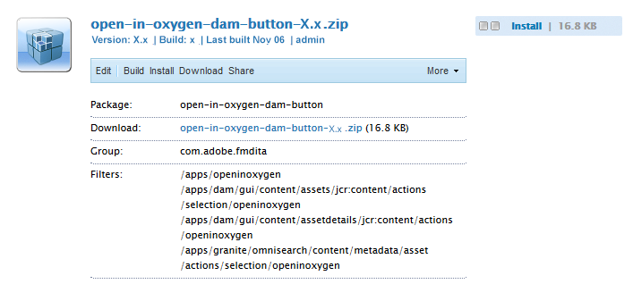
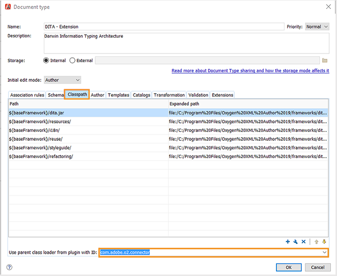
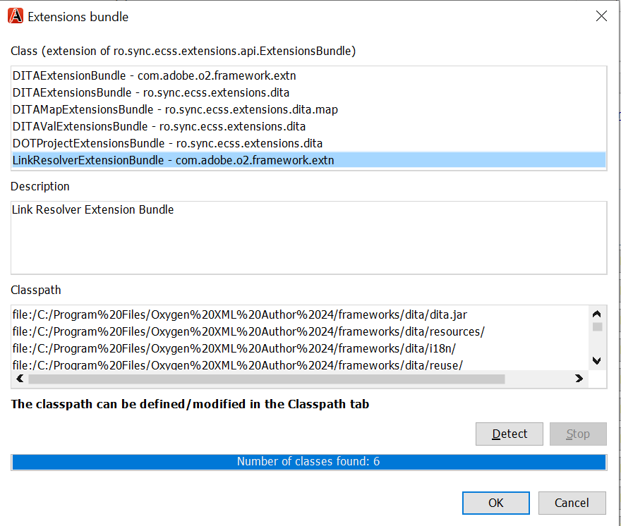
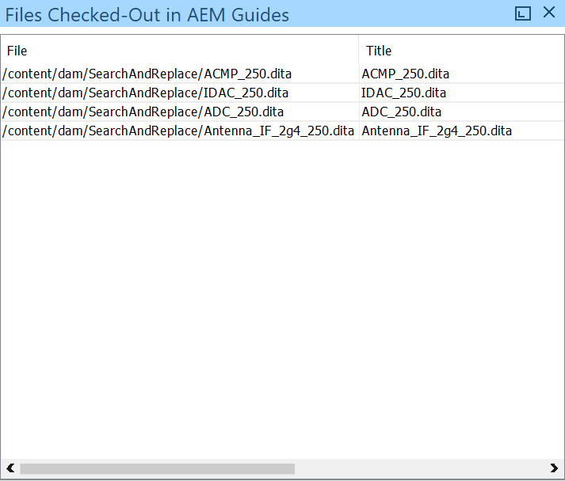
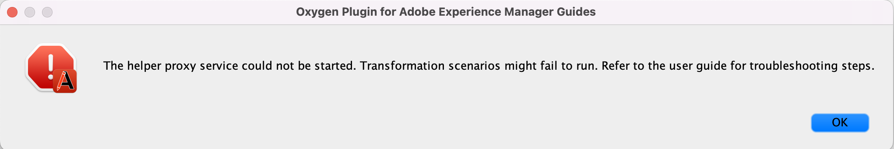

# Plug-in Oxygen para Adobe Experience Manager Guides {#id1645H6010Q5}

O Plug-in do Oxygen para o Adobe Experience Manager Guides \(mais tarde conhecido como Plug-in do Oxygen para o AEM Guides no guia\) permite conectar o Oxygen XML Author ao repositório Adobe Experience Manager \(AEM\) para a criação e gerenciamento de conteúdo. Você pode usar o plug-in para procurar, pesquisar e abrir arquivos; arquivos de check-out e check-in; carregar pastas e arquivos no repositório AEM. O painel AEM Guides no aplicativo de desktop permite marcar as pastas desejadas \(do repositório AEM\) para a lista de pastas favoritas para acesso rápido. Além disso, você pode instalar um pacote na interface da web do AEM e abrir seus arquivos DITA no Oxygen XML Author diretamente da interface da web do AEM.

## Baixar e instalar {#id1826M0L0PUI}

O plug-in Oxygen para AEM Guides é disponibilizado por meio do Portal de distribuição de software Adobe. Procure por &quot;oxigênio&quot; na guia Experience Manager e baixe o instalador de plug-in do [Portal de distribuição de software Adobe](https://experience.adobe.com/#/downloads/content/software-distribution/en/general.html).

>[!NOTE]
>
>Verifique a compatibilidade da versão do Conector Oxygen nas notas de versão do Adobe Experience Manager Guides específico.

Depois de ter o instalador, instale-o no computador local onde o Oxygen XML Author está instalado. Antes de começar o processo de instalação, você deve garantir que seu sistema atenda aos requisitos técnicos para instalar o Plug-in Oxygen para AEM Guides.

### Requisitos técnicos

- Oxygen XML Author versão 26.1

- Adobe Experience Manager Guides versão 4.6 ou superior

- Adobe Experience Manager versão 6.5 com Service Pack 21, 20 e 19

- Sistema operacional compatível com o Oxygen XML Author versão 26.1

- Java Development Kit
   - Oracle SE 8 JRE 1.8

### Instalar o plug-in no Windows

>[!IMPORTANT]
>
>Se você tiver uma versão mais antiga do plug-in instalada em seu sistema, desinstale-a antes de iniciar o processo de instalação. Consulte a seção **Desinstalando Pacotes** no artigo [Como trabalhar com pacotes](https://helpx.adobe.com/experience-manager/6-4/sites/administering/using/package-manager.html) para obter instruções de desinstalação.

Execute as seguintes etapas no sistema em que o Oxygen XML Author está instalado:

1. Inicie o arquivo `.exe` do instalador.

   A tela de boas-vindas do assistente de instalação é exibida.

1. Clique em **Avançar** e navegue até o local onde o arquivo .exe do Oxygen XML Author está disponível.

1. Selecione o arquivo e clique em **Abrir**.

   O local do arquivo selecionado é adicionado no assistente de instalação.

1. Clique em **Avançar**.

1. Clique em **Instalar**.

1. Clique em **Concluir** para fechar o assistente de instalação.
1. Inicie o Oxygen XML Author.

   O painel AEM Guides é exibido no Oxygen XML Author.

   {width="800" align="left"}

   >[!NOTE]
   >
   >Se você não vir o painel do AEM Guides, consulte as soluções alternativas na seção de solução de problemas—[Painel do AEM Guides ausente](#id192BH200ZAX).


### Instalar o plug-in no Mac

>[!IMPORTANT]
>
>Se você tiver uma versão mais antiga do plug-in instalada em seu sistema, desinstale-a antes de iniciar o processo de instalação. Consulte a seção **Desinstalando Pacotes** no artigo [Como Trabalhar com Pacotes](https://helpx.adobe.com/experience-manager/6-4/sites/administering/using/package-manager.html) para obter instruções sobre como desinstalar.

Execute as seguintes etapas no sistema em que o Oxygen XML Author está instalado:

1. Localize o arquivo .dmg do plug-in no seu sistema.

1. Clique duas vezes no arquivo .dmg para abrir o conteúdo do arquivo.

   O arquivo .dmg contém uma pasta aem-connector-x.x e um arquivo aem-connector-x.x-setup.

   >[!NOTE]
   >
   >x.x nos nomes de arquivo é o número da versão do plug-in.

1. Copie a pasta aem-connector-x.x na pasta plugins do Oxygen XML Author.
1. Clique duas vezes no arquivo aem-connector-x.x-setup para iniciar o instalador.

1. Inicie o Oxygen XML Author.

   O painel AEM Guides é exibido no Oxygen XML Author.

    {width="800" align="left"}

   >[!NOTE]
   >
   >Se você não vir o painel do AEM Guides, consulte as soluções alternativas na seção de solução de problemas—[Painel do AEM Guides ausente](#id192BH200ZAX).


### Instale o pacote para ativar o recurso de edição de documentos a partir da interface web AEM {#id182CE0Q0TY4}

Como autor, você pode abrir e editar seus mapas ou tópicos DITA no Oxygen XML Author diretamente da interface da web do AEM. Para ativar esse recurso na interface da web do AEM, o administrador do AEM precisa instalar um pacote na instância de criação do AEM.

Como administrador do AEM, execute as seguintes etapas para instalar o pacote:

1. Obtenha o arquivo .zip do pacote com sua equipe de TI.
1. Faça logon na instância do AEM *\(como administrador\)* e navegue até o Gerenciador de pacotes da CRX. O URL padrão para acessar o gerenciador de pacotes é

   `http://<server name>:<port>/crx/packmgr/index.jsp`

   O Gerenciador de pacotes gerencia os pacotes na sua instalação local do AEM. Para obter mais informações sobre como trabalhar com o Gerenciador de Pacotes, consulte [Como trabalhar com pacotes](https://experienceleague.adobe.com/docs/experience-manager-cloud-service/content/implementing/developer-tools/package-manager.html?lang=en) na documentação do AEM.

    {width="650" align="left"}

1. Para carregar o pacote Oxygen, clique em **Carregar pacote**.
1. Na caixa de diálogo Fazer upload do pacote, navegue até o arquivo de pacote do Oxygen que você baixou na Etapa 1 e clique em OK.

   O pacote é carregado na sua instância do AEM.

1. Para iniciar o processo de instalação, clique em **Instalar**.

   {width="650" align="left"}

1. Na caixa de diálogo Instalar Pacote, clique em **Instalar**.
1. Após concluir a instalação, clique no botão Início no canto superior esquerdo do Gerenciador de pacotes do CRX.
1. Selecione um arquivo DITA na pasta de assets.

   A opção **Editar no Oxigênio** está disponível na barra de ferramentas. Para obter mais informações sobre como usar esta opção, consulte [Abrir tópico DITA no Autor de XML de Oxigênio da interface Web do AEM](#id182CE0I905Z).

   >[!NOTE]
   >
   >A opção **Editar no Oxygen** fica visível ao selecionar um tópico DITA. Se você selecionar vários tópicos, a opção não estará visível.


## Configurar o plug-in Oxygen para o AEM Guides {#id1826KF00AHS}

Depois de baixar e instalar o plug-in, é necessário configurar o seguinte para funcionar com o plug-in:

- **Configurações de autenticação da Web**: configurações para autenticação SSO no plug-in do AEM Guides.
- **Configurações Gerais**: configurações de conexão para o plug-in, como a URL do servidor AEM, detalhes de logon etc.
- **Preferência para a personalização do atributo de criação de perfil e nomes de arquivo em referências cruzadas**: essa configuração é necessária para os esquemas de atributo de criação de perfil dos conjuntos de documentação.

### Configurações de autenticação da Web

O JxBrowser é usado para autenticação SSO pelo plug-in do conector Oxygen. É um navegador com base em chromium. Para o java 9+, é necessário o acesso a APIs não públicas, e você deve conceder explicitamente esse acesso ao JxBrowser. Para obter mais detalhes, consulte [Solução de problemas do JxBrowser](https://jxbrowser-support.teamdev.com/docs/guides/troubleshooting/issues.html).

Atualize os arquivos fornecidos para definir as configurações de autenticação da Web no Plug-in Oxygen para AEM Guides:

>[!NOTE]
>
>Faça backup do arquivo antes de atualizá-lo.

**Para Mac e Oxygen 26.1**

Adicione as seguintes linhas em env.sh

```java
--illegal-access=permit\
--add-opens=java.desktop/javax.swing.plaf.basic=ALL-UNNAMED\
--add-exports=javafx.controls/com.sun.javafx.scene.control=ALL-UNNAMED\
--add-exports=javafx.graphics/com.sun.javafx.stage=ALL-UNNAMED\
--add-exports=javafx.graphics/com.sun.javafx.scene=ALL-UNNAMED\
--add-exports=javafx.graphics/com.sun.javafx.scene.traversal=ALL-UNNAMED\
--add-exports=javafx.graphics/com.sun.javafx.tk=ALL-UNNAMED\
--add-exports=javafx.graphics/com.sun.glass.ui=ALL-UNNAMED\
--add-opens=javafx.graphics/com.sun.glass.ui=ALL-UNNAMED\
--add-opens=javafx.graphics/javafx.stage=ALL-UNNAMED\
--add-opens=javafx.graphics/com.sun.javafx.tk.quantum=ALL-UNNAMED\
--add-exports=java.desktop/sun.awt=ALL-UNNAMED\
--add-opens javafx.swing/javafx.embed.swing=ALL-UNNAMED
```

Adicione as seguintes linhas no OxyAuthor.sh

```java
-Djdk.module.illegalAccess=permit\-Djava.ipc.external=true\
```

**Para Windows e Oxygen 26.1**

Adicione as seguintes linhas no env.bat

```java
--illegal-access=permit --add-opens=java.desktop/javax.swing.plaf.basic=ALL-UNNAMED --add-exports=javafx.controls/com.sun.javafx.scene.control=ALL-UNNAMED --add-exports=javafx.graphics/com.sun.javafx.stage=ALL-UNNAMED --add-exports=javafx.graphics/com.sun.javafx.scene=ALL-UNNAMED --add-exports=javafx.graphics/com.sun.javafx.scene.traversal=ALL-UNNAMED --add-exports=javafx.graphics/com.sun.javafx.tk=ALL-UNNAMED --add-exports=javafx.graphics/com.sun.glass.ui=ALL-UNNAMED --add-opens=javafx.graphics/com.sun.glass.ui=ALL-UNNAMED --add-opens=javafx.graphics/javafx.stage=ALL-UNNAMED --add-opens=javafx.graphics/com.sun.javafx.tk.quantum=ALL-UNNAMED --add-exports=java.desktop/sun.awt=ALL-UNNAMED --add-opens javafx.swing/javafx.embed.swing=ALL-UNNAMED
```

Adicione as seguintes linhas no OxyAuthor.bat

```java
-Djdk.module.illegalAccess=permit -Djava.ipc.external=true
```

>[!NOTE]
>
>Você precisa executar o oxigênio do OxyAuthor.sh para o Mac e OxyAuthor.bat para o Windows como administrador.

### Configurações gerais

Execute as seguintes etapas para definir as configurações de conexão no Plug-in Oxygen para Adobe Experience Manager Guides:

1. No painel AEM Guides, clique no ícone de configurações e selecione **Configurações**.

   {width="800" align="left"}

1. Especifique os seguintes detalhes:
   - **URL do Servidor**: URL do servidor AEM, por exemplo:

     ```http
     http[s]://<host>:<port>
     ```

     No URL acima, especifique o nome do host e a porta do servidor onde o servidor AEM está implantado.

     >[!IMPORTANT]
     >
     >Se o servidor AEM for implantado na porta 80 ou 443, não será necessário especificá-lo no URL.

   - **Autenticação:** Escolha entre **Básico \(Nome de Usuário/Senha\)** ou **Autenticação da Web**. Caso você selecione a autenticação **Básica**, é necessário inserir o **Nome de Usuário** e a **Senha** na caixa de diálogo Preferências.

     Se você selecionar Autenticação da Web, será exibida a tela de logon AEM. Insira suas credenciais de logon e clique no botão **Entrar**. Ao fazer logon com êxito, a tela de Logon AEM é fechada e o painel AEM Guides exibe a lista de arquivos do servidor AEM.

   - **Tempo limite de conexão**: especifique o tempo em segundos que o cliente aguardará uma resposta do servidor AEM. Caso nenhuma resposta do servidor seja recebida dentro do tempo especificado, a solicitação será encerrada. O valor padrão é de 20 segundos.

   - **Pasta Local**: local no computador local onde os arquivos do repositório AEM são armazenados após o check-out. Se você especificar um local que não existe na unidade, o plug-in criará esse local.
   - **Abrir arquivo com check-out**: se selecionado, abre os arquivos no check-out.
   - **Fechar arquivo ao fazer check-in**: se selecionado, fecha os arquivos no check-in. Antes de fechar o arquivo, você verá uma janela pop-up na qual poderá especificar os comentários da versão.
   - **Mostrar Caixa de Diálogo de Check-in sobre o Fechamento de Arquivo**: Se selecionada, você verá um pop-up ao fechar um arquivo. Na janela pop-up, você pode optar por fazer check-in do arquivo ou fechá-lo sem fazer check-in.
   - **Arquivo de Check-out Automático quando Aberto**: se selecionado, clicar duas vezes em um arquivo automaticamente faz o check-out dele e o abre para edição. Caso o arquivo já esteja com check-out, ele será simplesmente aberto para edição. Se essa opção não estiver selecionada, abrir um arquivo no qual você não tem um bloqueio o abrirá no modo somente leitura.
1. Clique em **OK**.

### Preferência para a criação de perfil da personalização de atributos e nomes de arquivo em referências cruzadas {#id1827K0D0OHT}

Você precisa configurar as preferências no Oxygen XML Author para usar o atributo de criação de perfil associado aos tópicos DITA no repositório do AEM. Você também precisa configurar a preferência para exibir nomes de arquivo no lugar de GUIDs nas referências cruzadas.

Execute as seguintes etapas para configurar os atributos de criação de perfil e as referências cruzadas:

1. No Oxygen XML Author, clique em **Opções** \> **Preferências**.
1. Na guia **Associação de Tipo de Documento**, selecione **DITA** e clique em **Estender**.

   {width="650" align="left"}

1. Na guia **Classpath**, selecione `com.adobe.o2.connector` no menu suspenso **Usar carregador de classe pai do plug-in com ID**.

   {width="650" align="left"}

1. Na guia **Extensões**, faça as seguintes alterações:

   - Clique em **Escolher** ao lado do **Pacote de extensões** e selecione   `LinkResolverExtensionBundle - com.adobe.o2.framework.extn` na lista **Classe**. Clique em **OK**.

      {width="650" align="left"}
   - Clique em **Escolher** ao lado de **Ouvinte de Estado de Extensão do Autor** em **Extensões Individuais** e selecione `CustomAuthorExtensionStateListener - com.adobe.o2.framework.extn` na lista **Classe**. Clique em **OK**.
   - Clique em **Escolher** ao lado do **Editor de Valor de Atributo Personalizado de Autor** em **Extensões Individuais** e selecione `CustomValueEditor - com.adobe.o2.framework.extn` na lista **Classe**. Clique em **OK**.
   - Clique em **Escolher** ao lado do **Manipulador de inserção de objeto externo do autor** em **Extensões individuais** e selecione `CustomURLInsertionHandler - com.adobe.o2.ui ` na lista **Classe**. Clique em **OK**.


   A captura de tela a seguir mostra a guia **Extensão** configurada para tópicos DITA:
   
1. Clique em **OK** em todas as caixas de diálogo para salvar suas alterações.

### Configurar extensão do mapa DITA

A configuração da extensão de mapa DITA é necessária para habilitar a abertura de arquivos de mapa no Oxygen XML Author diretamente da interface da web do AEM. Essas configurações são semelhantes às configurações para criar o perfil dos atributos feitas no procedimento anterior.

Execute as seguintes etapas para configurar a extensão do mapa DITA:

1. No Oxygen XML Author, clique em **Opções** \> **Preferências**.
1. Na guia **Associação de Tipo de Documento**, selecione **Mapa DITA** e clique em **Estender**.
1. Na guia **Classpath**, selecione com.adobe.o2.connector no menu suspenso **Usar carregador de classe pai do plug-in com ID**.
1. Na guia **Extensões**, faça as seguintes alterações:
   - Clique em **Escolher** ao lado do **Pacote de extensões** e selecione   `com.adobe.o2.framework.extn.LinkResolverDITAMapExtensionBundle` na lista **Classe**. Clique em **OK**.

   - Clique em **Escolher** ao lado de **Ouvinte de Estado de Extensão do Autor** em **Extensões Individuais** e selecione `CustomDITAMapAuthorExtensionStateListener - com.adobe.o2.framework.extn` na lista **Classe**. Clique em **OK**.

   - Clique em **Escolher** ao lado do **Manipulador de inserção de objeto externo do autor** em **Extensões individuais** e selecione `CustomURLInsertionHandler - com.adobe.o2.ui ` na lista **Classe**. Clique em **OK**.

   - Clique em **Escolher** ao lado do **Editor de Valor de Atributo Personalizado de Autor** em **Extensões Individuais** e selecione `CustomValueEditor - com.adobe.o2.framework.extn` na lista **Classe**. Clique em **OK**.

   - Clique em **Escolher** ao lado do **Resolvedor de referências** em **Extensões individuais** e selecione `CustomDITAMapReferenceResolver - com.adobe.o2` na lista **Classe**. Clique em **OK**.
   - *\(Opcional\)* Se você não deseja resolver referências ao abrir um arquivo de mapa, é necessário executar a seguinte configuração adicional:

   A captura de tela a seguir mostra a guia **Extensão** configurada:
   

1. Clique em **OK** em todas as caixas de diálogo para salvar suas alterações.

## Trabalhar com plug-in Oxygen para AEM Guides {#id1826JG00WY4}

### Painel AEM Guides

A tela a seguir mostra o painel AEM Guides.

{width="550" align="left"}

**A**\) Mostra a barra de Pesquisa.

**B**\) Mostra a pasta Favoritos. Por padrão, está vazio. Você pode adicionar pastas do repositório AEM como favorito, e as pastas favoritas serão exibidas aqui.

**C**\) A pasta do DAM mostra o repositório AEM. Você pode expandir e recolher a visualização de pastas.

**D**\) O ícone Configurações \(engrenagem\) com as seguintes opções:

- **Conectar**: selecione esta opção para se conectar ao servidor AEM. A opção é desativada quando o Oxygen XML Author está conectado ao servidor AEM.
- **Atualizar**: selecione essa opção para obter o status mais recente dos arquivos e pastas do repositório AEM.

  >[!NOTE]
  >
  >Salve os arquivos antes de atualizá-los. Ao selecionar a opção **Atualizar**, você receberá um aviso para salvar seus arquivos antes de atualizá-los. Se você não tiver salvo seus arquivos, clique em **Cancelar** e salve-os.

- **Configurações**: você pode usar esta opção para abrir a caixa de diálogo Preferências gerais do Plug-in.
- **Logout**: selecione essa opção para fechar a conexão do servidor AEM. Essa opção só estará disponível se você estiver usando o modo de Autenticação da Web.

### Funções do menu de contexto

As funções do plug-in Oxygen para AEM Guides estão disponíveis ao clicar com o botão direito do mouse em uma pasta ou arquivo no repositório AEM. As funções disponíveis para as pastas são diferentes dos arquivos. Esta é uma lista completa das funções no menu de contexto do Plug-in Oxygen para AEM Guides:

- **Abrir**: abre o arquivo selecionado ou expande a pasta selecionada.
- **Abrir em**: você pode optar por abrir o arquivo selecionado no Editor da Web do AEM Guides, no Painel de Mapas ou no Editor de Mapas. Para obter mais informações sobre essas opções, consulte [Abrir arquivo no editor do AEM Guides](#id195GH0V30KX).
- **Check-out**: faz o check-out de um arquivo do repositório AEM. Para obter mais detalhes, consulte [Arquivos de check-out](#id195HC020TS4).
- **Check-out com dependentes**: faz check-out de um arquivo com suas referências diretas. Para obter mais detalhes, consulte [Arquivos de check-out](#id195HC020TS4).
- **Fazer check-out com dependentes somente leitura**: faz check-out do arquivo selecionado junto com seus dependentes. Não é possível fazer alterações nos arquivos dependentes. Para obter mais detalhes, consulte [Arquivos de check-out](#id195HC020TS4).
- **Cancelar check-out**: cancela o arquivo com check-out, fecha o arquivo do editor e reverte as alterações para a última versão do arquivo salvo no servidor.
- **Atualizar**: no caso de um arquivo, busca a cópia mais recente do arquivo no repositório AEM. Para uma pasta, ele busca a estrutura da pasta e o status do arquivo. Isso significa que um arquivo foi adicionado e, em seguida, ele será mostrado na Exibição do AEM Guides. Além disso, se o check-out de um arquivo for feito no servidor AEM, fazer uma atualização no Oxygen Author mostrará o arquivo como check-out. No entanto, isso não atualiza a lista de arquivos na Exibição *Arquivos com Check-out no AEM Guides*.
- **Atualizar Arquivos com Check-out**: atualiza a lista de arquivos com check-out na exibição *Arquivos com Check-out no AEM Guides*. Se o check-out de um arquivo for feito no servidor AEM, a atualização atualizará a lista de arquivos com check-out no modo de exibição *Arquivos com Check-out no AEM Guides*. No entanto, se um novo arquivo tiver sido adicionado ou o status de um arquivo tiver sido alterado, ele não o atualizará na exibição em árvore do AEM Guides. Para atualizar o status dos arquivos no AEM, é necessário fazer uma Atualização.
- **Check-in**: faz o check-in de arquivos que você fez check-out. Para obter mais detalhes, consulte [Fazer check-in de um arquivo](#id182CF0J0FHS).
- **Check-in com dependentes**: se você tiver feito check-out de arquivos com dependentes, essa opção fará check-in no arquivo principal junto com seus dependentes. Para obter mais detalhes, consulte [Fazer check-in de um arquivo](#id182CF0J0FHS).
- **Criar pasta**: cria uma pasta no repositório AEM. Essa opção está disponível somente no nível da pasta.
- **Carregar arquivo\(s\)**: carrega um ou vários arquivos. Para obter mais detalhes, consulte [Fazer upload de arquivos e pastas](#id195HC03F03J).
- **Carregar com dependentes**: carrega arquivos DITA \(XML, DITA, Book map ou DITA map\) com seus dependentes. Para obter mais detalhes, consulte [Fazer upload de arquivos e pastas](#id195HC03F03J).
- **Pasta de Carregamento**: carrega uma pasta no repositório AEM. Para obter mais detalhes, consulte [Fazer upload de arquivos e pastas](#id195HC03F03J).
- **Adicionar aos Favoritos**: adiciona uma pasta à pasta *Favoritos* no painel do AEM Guides. É recomendável adicionar sua pasta de trabalho aqui, o que facilita a sincronização de arquivos e o status do arquivo do AEM.
- **Remover dos Favoritos**: remove uma pasta dos *Favoritos*. Para obter mais detalhes, consulte [Adicionar ou remover Favoritos](#id195HC04405P).
- **Exibir Metadados**: mostra os metadados como Classe DITA, Título do documento, Tipo, UUID e outras informações associadas a um arquivo. Para obter mais detalhes, consulte [Exibir metadados de um arquivo](#id195GHN0H05C).
- **Exibir Versões**: mostra o histórico de versões de um arquivo. Para obter mais detalhes, consulte [Exibir o histórico de versões de um arquivo](#id195GI000D5Q).

### Abra um arquivo no Oxygen XML Author {#id195GHJ0A0UB}

Depois de se conectar ao repositório AEM, você pode abrir arquivos para edição no Oxygen XML Author. Execute as seguintes etapas para abrir um arquivo para edição no Oxygen XML Author:

1. Clique com o botão direito do mouse em um arquivo no painel AEM Guides que deseja abrir para edição.

1. Selecione **Abrir** no menu de contexto. Ou você pode clicar duas vezes no arquivo para abri-lo.

   O arquivo é aberto no editor do Oxygen XML Author.

    {width="800" align="left"}

   Ao passar o ponteiro do mouse sobre a guia de um arquivo, é exibido o caminho do servidor junto com a UUID. Na captura de tela acima, a UUID do documento é realçada.

>[!NOTE]
>
>Passar o mouse sobre as imagens ou vídeos em um tópico no editor do Oxygen XML Author mostra apenas a UUID do item selecionado. Para localizá-lo no repositório, clique com o botão direito do mouse na imagem exibida ou na tag de objeto (somente no caso de vídeos, áudios e outros arquivos de mídia) e selecione **Mostrar no Repositório**.


Se você selecionou a opção **Arquivo de Check-out Automático quando Aberto** \(na caixa de diálogo Preferências\), ao abrir um arquivo, ele será automaticamente submetido a check-out e estará disponível para edição. Para abrir um arquivo, clique duas vezes em um nome de arquivo ou clique com o botão direito do mouse no nome do arquivo e escolha **Abrir** no menu de contexto. Se essa opção não estiver selecionada, o arquivo será aberto no modo somente leitura.


### Abrir arquivo no editor do AEM Guides {#id195GH0V30KX}

Se quiser usar os editores disponíveis no AEM Guides, selecione a opção necessária no menu de contexto. Execute as seguintes etapas para usar o editor do AEM Guides no lugar do editor do Oxygen XML Author:

1. Clique com o botão direito do mouse em um arquivo no painel AEM Guides que deseja abrir para edição.

1. Selecione **Abrir em** no menu de contexto e escolha entre as seguintes opções:

   - **Editor de Tópicos da Web**: se o arquivo que você está abrindo for um arquivo .xml ou .dita, poderá abri-lo para edição no Editor da Web. Escolha a opção **Editor de Tópicos da Web** para abrir o arquivo selecionado para edição no Editor da Web.

   - **Painel de Mapa**: você pode optar por editar um arquivo .ditamap no painel de mapa no qual é possível executar várias operações no arquivo de mapa. Essas operações dependem da função/grupo ao qual você pertence.

   - **Editor do Mapa DITA da Web**: se você quiser abrir o arquivo .ditamap para edição no Editor de Mapa, escolha esta opção. Usando a opção Editor de mapa DITA, você pode adicionar ou remover tópicos, adicionar tabelas de relacionamento e executar outras operações no mapa.


### Fazer check-out de arquivos {#id195HC020TS4}

Ao fazer check-out de um arquivo, ele é armazenado localmente no sistema e bloqueado para edição no repositório AEM. Execute as seguintes etapas para fazer check-out de um arquivo:

1. Você pode fazer check-out dos arquivos de uma das seguintes maneiras:
   - Clique com o botão direito do mouse em um arquivo no painel AEM Guides.
   - Clique com o botão direito do mouse na guia do mapa no painel Gerenciador de mapas DITA.
   - Clique com o botão direito do mouse em um arquivo no painel Gerenciador de mapas DITA.
   - Clique com o botão direito do mouse na guia do arquivo ao abrir um mapa ou tópico no Editor.

1. Selecione uma das seguintes opções:
   - **Check-out:** faz o check-out de um arquivo do repositório AEM e o disponibiliza para edição.
   - **Check-out com dependentes**: faz check-out de um arquivo com suas referências diretas. É possível fazer alterações em páginas pai e filho usando essa opção. O plug-in Oxygen para AEM Guides oferece suporte à verificação de um nível de dependentes. Por exemplo, o Mapa A faz referência ao Tópico A e o Tópico A faz referência ao Tópico B. Fazer check-out do Mapa A finalizará o Tópico A, independentemente do seu nível na hierarquia do índice. No entanto, ele não verificará o Tópico B porque não está diretamente vinculado do Mapa A.
   - **Check-out com dependentes somente leitura**: faz o check-out de um arquivo e baixa seus dependentes para o computador local como cópias somente leitura. Não é possível fazer alterações nos arquivos dependentes.

Se você selecionou a opção \(na caixa de diálogo Preferências\) **Abrir arquivos no check-out** e, ao fazer check-out de um arquivo, ele será aberto automaticamente para edição.

Se você selecionou a opção **Arquivo de check-out automático quando aberto** \(na caixa de diálogo Preferências\), ao abrir o arquivo, ele será automaticamente submetido a check-out e disponibilizado para edição. Para abrir um arquivo, clique duas vezes em um nome de arquivo ou clique com o botão direito do mouse no nome do arquivo e escolha **Abrir** no menu de contexto.

Quando um arquivo é submetido a check-out, o ícone do arquivo muda para mostrar o status bloqueado.

{width="650" align="left"}

Na captura de tela acima, um arquivo com check-out feito por outro usuário é mostrado com um ícone de cadeado preto \(A\). O check-out do arquivo pelo usuário atual é mostrado com um bloqueio de cor verde \(B\).

>[!NOTE]
>
>Se o arquivo com check-out for excluído ou movido para qualquer outra pasta no AEM, você receberá uma mensagem de erro ao fazer check-in do arquivo. Certifique-se de que o arquivo com check-out não seja movido ou excluído usando a interface da Web AEM.

### Fazer check-in de um arquivo {#id182CF0J0FHS}

Ao fazer check-in de um arquivo, a cópia local do sistema é armazenada no repositório AEM e o bloqueio do arquivo é removido. Execute as seguintes etapas para fazer check-in de um arquivo:

1. Salve o arquivo clicando em **Arquivo** \> **Salvar**.

1. Clique com o botão direito do mouse em um arquivo ou mapa com check-out em um dos seguintes locais:
   - Painel AEM Guides
   - Painel Gerenciador de mapas DITA
   - A guia Arquivo quando você abre um mapa ou tópico no Editor.
   - A guia Mapa no painel Gerenciador de Mapas DITA.

1. Escolha entre as duas opções a seguir:

   - **Check-in**: faz o check-in do arquivo selecionado do sistema local no repositório AEM.
   - **Check-in com Dependentes:** Se você tiver feito check-out de um arquivo junto com seus dependentes, use esta opção para fazer check-in de todos os arquivos dependentes em uma única operação. Ao selecionar essa opção, você verá a caixa de diálogo Check-in com todos os arquivos dependentes. Clique em OK para fazer check-in de todos os arquivos de uma só vez.

   Se você não tiver feito check-out de arquivos dependentes e escolher essa opção, então somente os arquivos dependentes aos quais você \(separadamente\) fez check-out serão submetidos a check-in. Você verá uma lista de arquivos que não puderam ser verificados:

   {width="800" align="left"}

   É altamente recomendável não mover um arquivo com check-out. No entanto, se um arquivo com check-out for movido para um local diferente, você deverá cancelar o check-out desse arquivo. Se você quiser fazer atualizações nesse arquivo, faça check-out novamente, faça alterações e, em seguida, faça check-in novamente. Se você tentar fazer check-in de um arquivo que foi movido de seu local original, então você receberá um erro.

   Se um arquivo dependente for submetido a check-out no AEM, o Check-in com Dependentes não mostrará o arquivo dependente na caixa de diálogo Check-in. Para obter uma lista de arquivos dependentes que estão check-out no AEM, você deve fazer uma Atualização de pasta.

   Da mesma forma, se você tiver feito o check-in de um arquivo dependente por meio do AEM, a lista de arquivos não será atualizada no Oxygen Author até que você faça uma pasta Atualizar e atualizar arquivos com check-out. Se você fizer um Check-in com Dependentes com alguns arquivos verificados por meio do AEM, você receberá um erro listando os arquivos que não puderam ser verificados.

1. \(Opcional\) Na caixa de diálogo **Check-in** ou **Check-in com Dependentes**, adicione um comentário na caixa de texto **Comentários da Versão**.

   >[!NOTE]
   >
   >Este comentário é exibido no histórico de versões AEM do arquivo.

1. Adicionar rótulo(s) na caixa de texto **Rótulo** do **Check-in** ou da caixa de diálogo **Check-in com Dependentes**. Insira um rótulo e pressione Enter. Por exemplo, *2307 Versão*.

   Se o administrador tiver predefinido uma lista de rótulos e os carregado no arquivo `label.json`, esses rótulos serão exibidos como uma lista suspensa. Você pode escolher um ou mais rótulos na lista suspensa.

   {width="550" align="left"}

   Você pode adicionar vários rótulos (separados por vírgulas) à mesma versão de um tópico.  Por exemplo, *Adobe*, *AEM*, *Guias*.
No entanto, não é possível adicionar o mesmo rótulo às diferentes versões de um tópico. Se você adicionar um rótulo já adicionado a uma versão anterior, ele será adicionado à versão mais recente e removido da versão anterior.

   >[!NOTE]
   > 
   > Esses rótulos são exibidos no histórico de versões AEM do arquivo.


1. Clique em **OK**.

>[!NOTE]
>
>Se o arquivo com check-out for excluído ou movido para qualquer outra pasta no AEM, você receberá uma mensagem de erro ao fazer check-in do arquivo. Certifique-se de que o arquivo com check-out não seja movido ou excluído usando a interface da Web AEM.

### Arquivos com check-out na exibição do AEM Guides

Quando você tem arquivos em várias pastas, não é fácil descobrir quantos arquivos foram submetidos a check-out em uma visualização. O AEM Guides fornece Arquivos com check-out na exibição do AEM Guides, que fornece um instantâneo completo dos arquivos com check-out no momento. Usando essa visualização, você pode descobrir facilmente quais arquivos foram verificados por você no repositório AEM usando o AEM Guides. Execute as seguintes etapas para acessar e trabalhar com essa visualização:

1. Clique em **Janela** \> **Mostrar Exibição** \> **Arquivos com Check-out no AEM Guides**.

   A exibição Arquivos com check-out no AEM Guides é exibida.

   {width="550" align="left"}

1. Clique com o botão direito do mouse em um arquivo nesta exibição para obter as seguintes opções:

   - [Abrir](#id195GH0V30KX)
   - [Abrir em](#id195GH0V30KX)
   - Cancelar check-out
   - [Check-in](#id182CF0J0FHS)
   - [Check-in com Dependentes](#id182CF0J0FHS)
   - [Exibir metadados](#id195GHN0H05C)
   - [Exibir versões](#id195GI000D5Q)

**Observações sobre Arquivos com Check-out no Modo de Exibição AEM Guides:**

- O Check-out de *Arquivos na Exibição do AEM Guides* mantém sessões do usuário. Isso significa que os arquivos com check-out feito pelo usuário atual são armazenados e mantidos na visualização nas mesmas sessões do usuário \(ou cache\).

- Se o usuário alterar as credenciais de logon ou o servidor AEM, os dados do arquivo com check-out \(ou cache\) na exibição serão redefinidos. O usuário deve executar manualmente um comando *Atualizar Arquivos com Check-out* em cada pasta de onde os arquivos tiveram check-out anteriormente. Para simplificar, é recomendável adicionar suas pastas de trabalho a *Favoritos*, de onde você pode atualizar rapidamente as pastas.

- Você pode classificar a lista de arquivos com base nos nomes de arquivo, Título ou Caminho. Se for feito o check-out de um novo arquivo, ele aparecerá na ordem de classificação na exibição.


### Fazer upload de arquivos e pastas {#id195HC03F03J}

Execute as seguintes etapas para fazer upload de arquivos ou pastas:

1. Clique com o botão direito do mouse em uma pasta no painel AEM Guides.
1. Selecione uma das seguintes opções:
   - **Carregar arquivo\(s\)**: selecione essa opção para carregar um ou vários arquivos para a pasta selecionada no repositório AEM. Na caixa de diálogo Selecionar arquivos \(s\) para upload, selecione os arquivos e clique em **Abrir**.
   - **Carregar com dependentes**: selecione esta opção para carregar um arquivo DITA com seus dependentes. Na caixa de diálogo Selecionar arquivo para carregamento, selecione os arquivos e clique em **Abrir**.
   - **Carregar pasta**: selecione essa opção para carregar uma pasta no repositório AEM. Na caixa de diálogo Escolher, selecione a pasta e clique em **Escolher**.

**Observações adicionais sobre o trabalho com arquivos baseados em UUID**:

Os seguintes pontos devem ser considerados ao mover ou copiar o conteúdo do seu sistema local para o repositório do AEM:

- Ao carregar um ou mais arquivos, um novo UUID é gerado para arquivos que não têm UUID. Esta UUID é adicionada no `topic id` de um arquivo DITA.

- Ao copiar uma pasta, as referências aos arquivos \(dentro da pasta\) são atualizadas automaticamente em todos os mapas DITA que fazem referência aos arquivos nessa pasta.

- Ao copiar um arquivo de mapa DITA, as referências UUID no arquivo de mapa não são alteradas.

- Se um arquivo ou uma pasta tiver um conflito ou uma duplicata, um nome de arquivo exclusivo será gerado para o novo arquivo que está sendo copiado ou movido.

- Dois arquivos não podem ter a mesma UUID. Um UUID exclusivo é atribuído a todos os novos arquivos.

- Se um arquivo estiver sendo carregado por dois usuários diferentes ao mesmo tempo, o arquivo processado posteriormente substituirá o arquivo anterior. No entanto, tal prática deve ser evitada.

- Ao fazer check-out do conteúdo do repositório AEM e fazer alterações no sistema local, verifique se o nome do arquivo não foi alterado no momento do upload do arquivo.

- Ao inserir uma referência no Gerenciador de mapas DITA ou no Editor, ela exibe o título do arquivo e não a UUID. Se o título não estiver presente, ele exibirá o nome do arquivo.

### Adicionar ou remover Favoritos {#id195HC04405P}

Execute as seguintes etapas para adicionar ou remover uma pasta da pasta Favoritos no painel AEM Guides:

- Clique com o botão direito do mouse em uma pasta e selecione **Adicionar a Favoritos**. Você pode adicionar uma pasta aos favoritos se ela não estiver em Favoritos.
- Você pode remover uma pasta dos favoritos das seguintes maneiras:
   - Clique com o botão direito do mouse em uma pasta da pasta **Favoritos** e selecione **Remover dos Favoritos**.
   - Clique com o botão direito do mouse em uma pasta no repositório AEM na pasta **DAM** que já foi adicionada como favorita e selecione **Remover dos favoritos**.

### Exibir o histórico de versões de um arquivo {#id195GI000D5Q}

Execute as seguintes etapas para visualizar o histórico de versões de um arquivo:

1. Clique com o botão direito do mouse em um arquivo no painel AEM Guides.

1. Selecione **Exibir versões** no menu de contexto.

   O histórico de versões do arquivo é exibido na caixa de diálogo Versões.

   {width="550" align="left"}


### Visualizar os metadados de um arquivo {#id195GHN0H05C}

Execute as seguintes etapas para exibir os metadados de um arquivo:

1. Clique com o botão direito do mouse em um arquivo no painel AEM Guides.

1. Selecione **Exibir Metadados** no menu de contexto.

   Os metadados do arquivo, como Classe DITA, Estado do documento, data de modificação, tamanho, Título e UUID são exibidos na caixa de diálogo Metadados.

   {width="550" align="left"}


## Pesquisar um tópico no repositório AEM {#id1826J20405Z}

Você pode pesquisar tópicos no repositório AEM usando a barra de Pesquisa no painel AEM Guides. Pesquise em toda a pasta do DAM ou selecione uma pasta e procure um tópico nessa pasta. O resultado da pesquisa mostra os tópicos que têm texto correspondente à sua consulta de pesquisa.

Execute as seguintes etapas para pesquisar tópicos:

1. Selecione uma pasta no repositório AEM em que deseja pesquisar um tópico.
1. Insira a consulta de pesquisa \(por exemplo, `introduction`\) na barra de Pesquisa do Plug-in Oxygen para AEM Guides.
1. Clique no botão de pesquisa ou pressione Enter.

   O resultado é exibido na guia Resultados da pesquisa como uma lista com o caminho do arquivo. Se não houver nenhum resultado correspondente para a consulta de pesquisa, nenhum resultado encontrado na mensagem &lt;path of the seleted folder\> será exibido.

   {width="550" align="left"}

1. \(Opcional\) Clique duas vezes em um arquivo no resultado da pesquisa para abri-lo no Oxygen XML Author.
1. Para voltar para a exibição do Repositório AEM, siga um destes procedimentos:
   - Para exibir o Repositório AEM sem limpar os resultados da pesquisa, clique na guia **Procurar**.
   - Para limpar os resultados da pesquisa e exibir o Repositório AEM, clique em Excluir ícone de pesquisa.

## Abrir tópico DITA no Oxygen XML Author da interface da web do AEM {#id182CE0I905Z}

Você pode abrir e editar seu tópico DITA no Oxygen XML Author da interface da web do AEM. É necessário instalar um pacote no AEM para habilitar essa opção. Para obter mais informações sobre a instalação do pacote, consulte [Instalar o pacote para habilitar o recurso de edição de documentos da interface Web AEM](#id182CE0Q0TY4).

>[!NOTE]
>
>A opção **Editar no Oxygen** pode ser acessada de vários locais no AEM: quando um tópico é selecionado, quando um tópico é visualizado ou na guia Tópicos e Relatórios do console de mapa DITA. Se você selecionar vários tópicos, a opção não estará visível na barra de ferramentas.

**Abrir um tópico DITA**

Execute as seguintes etapas para abrir um tópico DITA no Oxygen XML Author:

1. Selecione um tópico em seus ativos e clique na opção **Editar no Oxigênio** na barra de ferramentas.

   >[!NOTE]
   >
   >Se o tópico não tiver sofrido check-out, ele será primeiramente submetido a check-out e, em seguida, aberto no Oxygen no modo de edição.

1. Selecione Oxygen XML Author *&lt;version\>* na caixa de mensagem **Launch Application**. Você pode selecionar a opção **Lembrar minha escolha para links AEM** para salvar sua preferência.

**Editar um tópico DITA**

Execute as seguintes etapas para editar um tópico DITA no Oxygen XML Author:

1. Selecione e faça check-out de um tópico em seus ativos.
1. Clique na opção **Editar no Oxigênio** da barra de ferramentas.

   >[!NOTE]
   >
   >Se o tópico não tiver sofrido check-out, ele será primeiramente submetido a check-out e, em seguida, aberto no Oxygen no modo de edição.

1. Selecione Oxygen XML Author *&lt;version\>* na caixa de mensagem **Launch Application**. Você pode selecionar a opção **Lembrar minha escolha para links AEM** para salvar sua preferência.
1. Edite o tópico no Autor de XML do Oxygen.
1. Acesse o tópico do Plug-in Oxygen para AEM Guides.

   Para obter mais informações sobre o check-in de um tópico usando o Plug-in Oxygen para AEM Guides, consulte [Fazer check-in de um arquivo](#id182CF0J0FHS).

   >[!NOTE]
   >
   >Certifique-se de fazer check-in do tópico usando o Plug-in Oxygen para AEM Guides. Se você fizer check-in a partir da interface da Web AEM, as alterações feitas no Oxygen XML Author não serão salvas na versão de check-in do tópico.

**Inserir uma referência a um tópico do repositório do Experience Manager Guides**

Você também pode arrastar e soltar um tópico para inserir a referência em um tópico ou mapa DITA.
>[!NOTE]
>
> É necessário fazer check-out de um arquivo antes de adicionar qualquer referência a ele.

Os seguintes elementos são adicionados com base no tipo de referências:

Se você soltar no Editor com um tópico aberto:
- Uma referência é adicionada com o elemento `<image>` para as imagens.
- Um elemento de objeto é adicionado para um vídeo ou áudio.
- O elemento `<xref>` é adicionado para todas as outras referências, como topic, map, DITAVAL, PDF, ZIP e XML.

Se você soltar no Editor ou no Gerenciador de mapas DITA com um Mapa aberto:
- O elemento `<mapref>` é adicionado para referências de mapa, que incluem um mapa DITA, um mapa ou um Esquema de assunto.
- O elemento `<topicref>` é adicionado para todas as outras referências, como topic, map, DITAVAL, PDF, ZIP e XML.


## Trabalhar com perfis de atributo {#id1827JA002YK}

O AEM Guides permite criar e associar facilmente atributos condicionais usando os atributos DITA relevantes. Você pode definir atributos condicionais no nível global ou no nível da pasta. As condições definidas globalmente são visíveis em todos os projetos e as condições no nível da pasta são visíveis somente em projetos criados na pasta especificada. Os autores de conteúdo podem usar esses atributos condicionais para condicionar o conteúdo em seus tópicos ou mapas DITA que eles criam ou usam. Para saber mais sobre como criar atributos condicionais no AEM usando a AEM Guides, consulte a seção *Configurar atributos condicionais para perfis globais ou de nível de pasta*, em Instalar e configurar o Adobe Experience Manager Guides.

>[!NOTE]
>
>Verifique se você adicionou os atributos condicionais no AEM e definiu [Preferência para a personalização do atributo de criação de perfil](#id1827K0D0OHT) antes de adicionar atributos condicionais ao seu conteúdo.

Execute as seguintes etapas para adicionar atributos condicionais ao seu conteúdo no Oxygen XML Author:

1. Confira e abra um tópico do *Plug-in Oxygen para AEM Guides*.
1. Selecione a parte do conteúdo na qual deseja aplicar os atributos condicionais.
1. Clique duas vezes no atributo condicional no painel Atributos do Oxygen XML Author.

   {width="300" align="left"}

1. Na coluna **Disponível** da caixa de diálogo Editar Atributo, selecione o atributo\(s\) e clique em **Adicionar**.

   A tela a seguir mostra `audience` atributos.

   {width="550" align="left"}

1. Clique em **OK**.

   Os atributos são adicionados ao conteúdo.


## Solução de problemas comuns {#id188ABC00RY4}

Este tópico aborda alguns dos problemas mais comuns que você pode enfrentar ao trabalhar com o plug-in, juntamente com suas soluções.

### Painel AEM Guides ausente {#id192BH200ZAX}

**Problema** - Se você não vir o painel do AEM Guides no Oxygen XML Author, tente as seguintes soluções:

Solução 1:

1. No Oxygen XML Author, ative o plug-in.

   Clique em **Opções** \> **Preferências** \> **Plug-ins** e selecione **Plug-in Oxygen para Adobe Experience Manager Guides.**

1. Reinicie o Oxygen XML Author.


Solução 2:

1. Se ainda não vir o painel AEM Guides, ative a janela AEM Guides.

   No Autor do Oxygen XML, Clique Em **Janela** \> **Mostrar Exibição** \> **AEM Guides**.

Solução 3:

1. Desinstale e reinstale o plug-in Oxygen para Adobe Experience Manager Guides.

   - No Windows, desinstale o plug-in da lista **Adicionar ou remover programas**. Em seguida, reinstale o plug-in.

   - No Mac, acesse a pasta aem-connector-x.x na pasta plugins do Oxygen XML Author e mova-a para **Lixeira**. Em seguida, esvazie a pasta **Lixeira**.


### Configurar porta para transformação DITA-OT

**Problema** - Quando você executa qualquer transformação DITA-OT em arquivos processados pelo Plug-in, a transformação falha com o seguinte erro:

{width="800" align="left"}

**Solução** - Esse problema foi corrigido com a adição de um servidor proxy entre o DITA-OT e o Plug-in. Esse servidor proxy processa e compartilha todos os arquivos solicitados pelo DITA-OT para transformações. A porta padrão na qual este servidor foi configurado é: `5972`. Se estiver usando essa porta para algum outro servidor, você poderá especificar uma porta diferente para o servidor proxy.

Execute as seguintes etapas para alterar a porta padrão do servidor proxy:

1. Navegue até o diretório inicial \(do usuário\).
1. Crie um arquivo chamado aem\_connector\_proxy.
1. Abra o arquivo em qualquer editor de texto e adicione um número de porta disponível na primeira linha do arquivo.
1. Salvar e fechar o arquivo.
1. Reinicie o Oxygen XML Author e execute a transformação DITA-OT.


### O painel AEM Guides não navega até o local do arquivo aberto

Problema: Quando você opta por abrir um arquivo para edição no Oxygen XML Author do servidor AEM, o arquivo é aberto para edição no Oxygen XML Author. No entanto, o painel AEM Guides não mostra o local do arquivo na árvore de navegação.

Solução: esse problema foi observado em cenários em que o caminho do arquivo contém /content/dam duas vezes nele. Por padrão, todos os ativos no AEM são armazenados na pasta /content/dam. Se você fizer upload ou criar uma estrutura de pastas que também contenha /content/dam, esse problema será observado. Você pode executar todas as operações normais nesses arquivos, no entanto, o local na árvore de navegação não é mostrado por padrão. Para acessar esse arquivo na árvore de navegação, é necessário navegar manualmente até o local do arquivo. Observe que na árvore de navegação, o caminho /content/dam duplicado é substituído por /content/assets.

### Configurar registro

Problema: por padrão, o plug-in Oxygen para AEM Guides não gera nenhum registro, o que dificulta a depuração de qualquer cenário de erro.

Solução: execute as seguintes etapas para configurar os registradores para o Xygen e JxBrowser:

1. Fechar autor de XML do Oxygen

1. Crie um arquivo chamado `logback.xml` com o seguinte conteúdo:

   ```xml
   <configuration>
       <appender name="R2" class="ch.qos.logback.core.rolling.RollingFileAppender">
           <file>${user.home}/Desktop/oxygenLog/oxygen.log</file>
           <rollingPolicy class="ch.qos.logback.core.rolling.FixedWindowRollingPolicy">
               <fileNamePattern>${user.home}/Desktop/oxygenLog/oxygen%i.log.gz</fileNamePattern>
               <minIndex>1</minIndex>
               <maxIndex>20</maxIndex>
           </rollingPolicy>
           <triggeringPolicy class="ch.qos.logback.core.rolling.SizeBasedTriggeringPolicy">
               <maxFileSize>100MB</maxFileSize>
           </triggeringPolicy>
           <encoder>
               <pattern>%r %marker %p [ %t ] %c - %m%n</pattern>
           </encoder>
       </appender> 
   
       <root level="debug">
           <appender-ref ref="R2" />
       </root>
   </configuration>   
   ```

1. Salve o arquivo no diretório `Oxygen Author 26`. (Por exemplo, o caminho seria: `C:\Program Files\Oxygen XML Author 26\logback.xml`)

1. Feche o arquivo. Isso habilitará logs Xygen, que estarão disponíveis no caminho: `${user.home}/Desktop/oxygenLog/oxygen.log`
1. Abra o arquivo `oxygenAuthor.bat` em um editor de texto.
1. Configure logs relacionados ao JxBrowser adicionando o parâmetro
   `-Denable.aem.jx.log=true`. Isso habilita logs relacionados ao JxBrowser, que você pode exibir no caminho: `${user.home}\AppData\Local\Temp\Oxygen_Plugin_Javax_Log.log`:


   ```java
   SET OXYGEN_JAVA=java.exe
   if exist "%JAVA_HOME%\bin\java.exe" set OXYGEN_JAVA="%JAVA_HOME%\bin\java.exe"
   if exist "%~dp0\jre\bin\java.exe" SET OXYGEN_JAVA="%~dp0\jre\bin\java.exe"
   rem Set environment variables
   call "%~dp0\env.bat"
   %OXYGEN_JAVA% -XX:-OmitStackTraceInFastThrow -XX:SoftRefLRUPolicyMSPerMB=10 -Djdk.module.illegalAccess=permit -Djava.ipc.external=true 
   -Denable.aem.jx.log=true -Dsun.java2d.noddraw=true -Dsun.awt.nopixfmt=true -Dsun.java2d.dpiaware=true -Dsun.io.useCanonCaches=true -Dsun.io.useCanonPrefixCache=true 
   -Dsun.awt.keepWorkingSetOnMinimize=true -Dcom.oxygenxml.app.descriptor=ro.sync.exml.AuthorFrameDescriptor
    -Dcom.oxygenxml.ApplicationDataFolder="%APPDATA%" -cp %CP% ro.sync.exml.Oxygen %*
   ```


Com as etapas anteriores, os logs serão ativados e você poderá usá-los para depurar os problemas.
