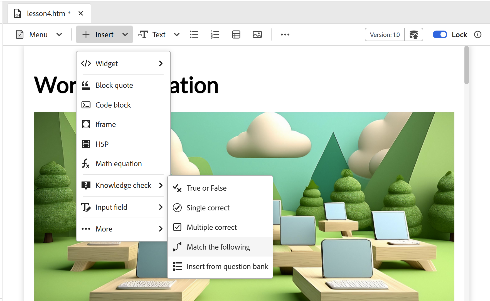

# Versão de dezembro de 2025 do conteúdo de treinamento e aprendizado do produto

Esta nota de versão aborda os recursos novos e aprimorados introduzidos na versão de dezembro de 2025 do conteúdo de treinamento e aprendizado do produto. Além disso, todos os problemas e bugs relatados foram resolvidos nesta versão, garantindo estabilidade e desempenho aprimorados.

## Criação

- **Novas opções no menu Inserir**: Introdução de novas opções no menu Inserir da barra de ferramentas Editor para enriquecer seu conteúdo de aprendizado:

   - **Equação do MathML**: insira equações do MathML facilmente para tópicos técnicos ou científicos.
   - **Verificação de conhecimento**: adicione testes rápidos e não graduados aos tópicos de aprendizado para validar a compreensão do aluno.
   - **H5P**: incorpore pacotes H5P interativos para obter uma experiência de aprendizado aprimorada.

  Para obter mais detalhes, consulte [Outras opções no menu Inserir](../learning-content/lc-other-insert-options.md).

  {width="650"}

- **Novos widgets interativos**: você pode envolver alunos com alguns novos widgets interativos que tornam o conteúdo mais imersivo: **Clique para revelar**, **Inverter cartão** e **Guia**.

  Para obter detalhes, consulte [Usar widgets interativos](../learning-content/lc-widgets.md).

  {width="350"}

- **Corresponder ao seguinte**: um novo tipo de pergunta, **Corresponder ao seguinte**, está disponível para testes. Os alunos podem combinar itens de duas listas para conectar ideias relacionadas, incentivando o pensamento crítico.

  Para obter detalhes, consulte [Tipos de perguntas do questionário](../learning-content/quiz-insert-questions.md#question-types).

  {width="650"}

## Revisar

- **Criar tarefa de revisão**: agora você pode criar uma tarefa de revisão para seu curso de aprendizado e atribuí-la ao Revisor para receber seus comentários. Isso garante a qualidade do conteúdo, simplifica a colaboração e facilita o rastreamento das revisões.

  Para obter detalhes, exiba [Criar tarefa de revisão](../learning-content/manage-course.md#create-review-task).

  {width="650"}

## Gestão de conteúdo

- **Conteúdo reutilizável**: você pode reutilizar conteúdo existente em vários cursos. Esse recurso ajuda a manter a consistência e reduz a duplicação.

  Para obter mais detalhes, consulte [Adicionar blocos de construção básicos](../learning-content/lc-basic-blocks.md).

  {width="650"}
