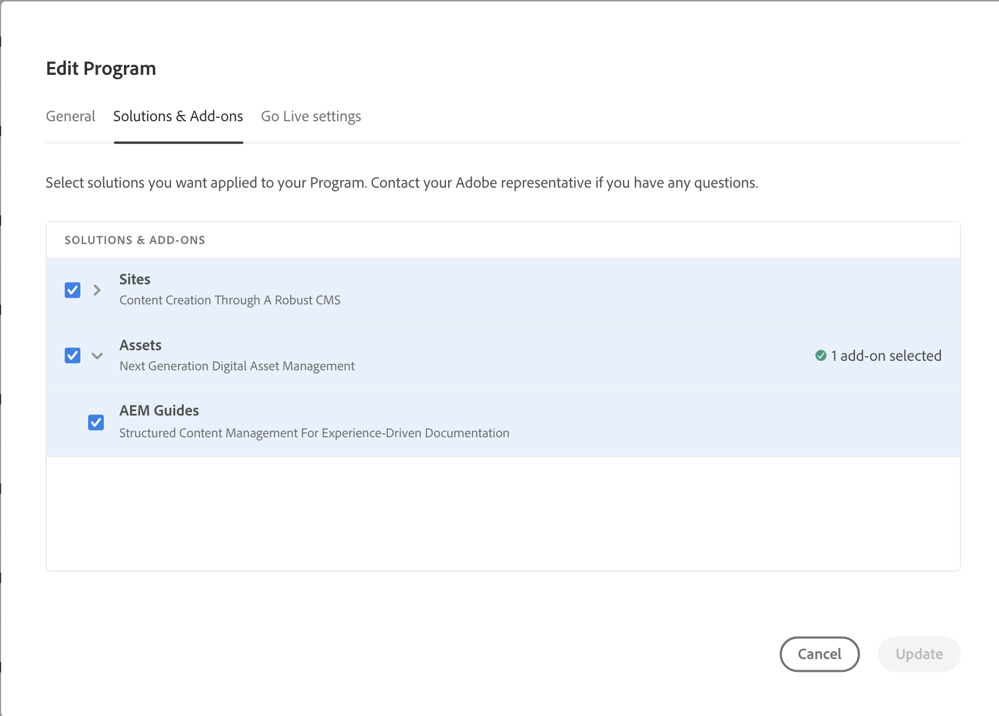

# [!DNL AEM Guides] implantação as a Cloud Service

Saiba como adicionar [!DNL Guides] ao seu [!DNL AEM as a Cloud Service] ambiente.

## Implantação manual por meio do pipeline Git do Cloud Manager

Se você comprou [!DNL AEM Guides] as a Cloud Service antes de 29 de março de 2022, siga estas instruções de implantação:

* Se você estiver iniciando do zero, é possível substituir o código gerado automaticamente pelo [!UICONTROL Cloud Manager] com o código do repositório abaixo que já tem o plug-in XML integrado: https://github.com/Adobe-TCS/XML-documentation-for-AEMaaCS

* Se você já tiver feito check-in das personalizações em [!UICONTROL Cloud Manager] git repo, você pode consultar o repositório abaixo para obter instruções sobre como adicionar o plug-in XML ao código existente: https://github.com/Adobe-TCS/DoX-Installer-for-AEMaaCS

## Implantação Via Cloud Manager

Se você for um cliente que comprou [!DNL AEM Guides] as a Cloud Service em ou após 29/03/2022, siga estas instruções para adicionar [!DNL Guides] ao seu [!DNL AEM as a Cloud Service] ambiente:

1. Fazer logon em [!UICONTROL Cloud Manager].

1. Edite o programa para o qual deseja configurar [!DNL AEM Guides].

1. Alternar para **[!UICONTROL Soluções e complementos]** guia.

1. No **[!UICONTROL Soluções e complementos]** tabela, clique em **[!UICONTROL Assets]**.

1. Selecionar **[!UICONTROL Guias]** e selecione **[!UICONTROL Salvar]**.

Seu programa foi configurado com êxito para provisionamento automático da solução Guias do AEM.

>[!NOTE]
>
>Para instalar [!DNL AEM Guides] em qualquer ambiente no programa integrado, você deve executar o pipeline associado ao ambiente. Nenhuma configuração adicional é necessária na base de código Git do CM para instalar o [!DNL AEM Guides].
