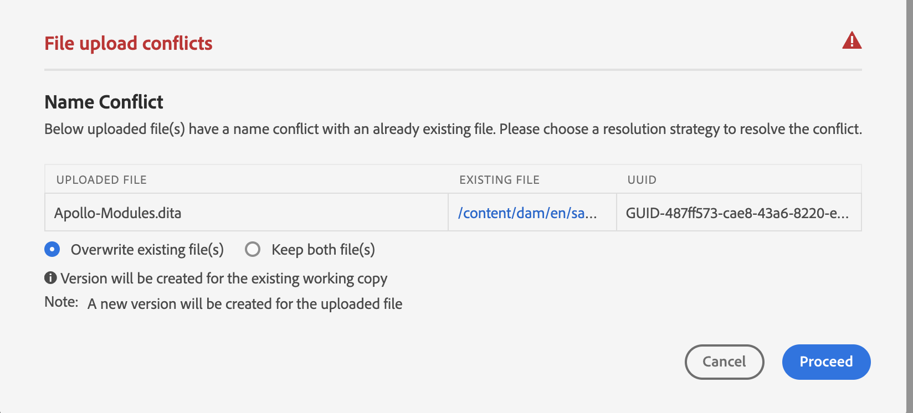
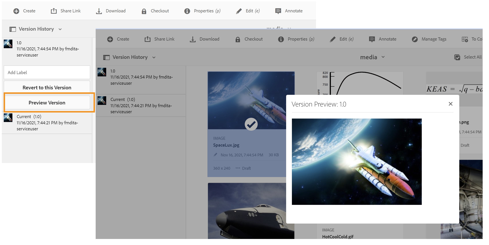

# Versão de janeiro do [!DNL Adobe Experience Manager Guides] as a Cloud Service

## Atualização para a versão de janeiro

As a Cloud Service Atualize sua configuração atual do [!DNL Adobe Experience Manager Guides] (mais tarde chamada de as a Cloud Service do [!DNL AEM Guides]) executando as seguintes etapas:
1. Confira o código Git do Cloud Service e alterne para a ramificação configurada no pipeline Cloud Service correspondente ao ambiente que você deseja atualizar.
1. Atualize a propriedade `<dox.version>` no arquivo `/dox/dox.installer/pom.xml` do código Git do Cloud Service para 2022.1.78.
1. Confirme as alterações e execute o pipeline Cloud Service para atualizar para a versão de janeiro do [!DNL AEM Guides] as a Cloud Service.

## Matriz de compatibilidade

As a Cloud Service Esta seção lista a matriz de compatibilidade dos aplicativos de software compatíveis com a versão [!DNL AEM Guides] de janeiro de 2022.

### FRAMEMAKER e FRAMEMAKER PUBLISHING SERVER

| FMPS | FrameMaker |
| --- | --- |
| Não compatível | Atualização 4 e superior para 2020 |
| | |

### Conector de oxigênio

| Versão da nuvem do [!DNL AEM Guides] | Janelas do conector Oxygen | Conector Oxygen Mac | Editar no Oxygen Windows | Editar no Oxygen Mac |
| --- | --- | --- | --- | --- |
| 2022.1.0 | 2.4.0 | 2.4.0 | 2,2 | 2,2 |
|  |  |  |  |  |

## Novos recursos e melhorias

### Publicação baseada em artigo

Com a versão de janeiro, introduzimos um recurso de publicação baseado em artigos integrado ao Editor da Web. Você pode usar o recurso de publicação baseado em artigos para gerar de forma incremental a saída de um ou mais tópicos ou publicar seu conteúdo em uma plataforma da base de conhecimento.

Esse recurso permite que os usuários criem o mapa DITA de forma aditiva e publiquem tópicos quando e quando estiverem prontos. Depois de publicar o mapa, use o recurso de publicação baseado em artigo para obter uma publicação incremental somente para os artigos atualizados.

Além do AEM, você pode usar esse recurso exclusivo para publicar seus artigos em qualquer portal da base de conhecimento, como o Salesforce. Esse recurso também vem com um modelo de conteúdo OOTB, criado sobre os componentes principais do AEM, que permite criar um repositório baseado em conhecimento do conteúdo técnico. O interessante desse modelo é que ele é completamente personalizável para atender aos seus requisitos organizacionais e também pode suportar casos de uso como portais corporativos de intranet.
Você também pode filtrar os artigos com base no estado do documento e na hora da modificação.

Essa publicação de artigos contínua e baseada na necessidade não somente oferece controle total sobre a publicação de conteúdo, como também reduz o tempo geral de publicação do conteúdo atualizado.
À medida que você publica seus artigos usando esse modelo, ele também pode transmitir os metadados para suas páginas publicadas.
Para obter mais detalhes, consulte *Publicação baseada em artigo do Editor da Web* no Guia do Usuário.

### Editor da Web aprimorado

Há várias melhorias e novos recursos introduzidos no Editor da Web:

* O suporte para esquema de assunto também foi adicionado no Editor da Web. Agora você pode criar e usar o esquema de assunto usando o painel Esquema de assunto. Com a adição do esquema de assunto, agora é possível usar seus próprios metadados corporativos e taxonomia.

* Uma nova ferramenta de hotspot de glossário foi introduzida nesta versão para gerenciar glossários em massa. Com essa ferramenta, você pode converter rapidamente o texto em glossário e o glossário em termos em massa para um mapa selecionado ou abrir tópicos.

* Adição da funcionalidade de atualização no painel Conteúdo reutilizável, que permite atualizar rapidamente o conteúdo reutilizável nos arquivos de referência.
* O indicador Nova cópia de trabalho mostra se a cópia atual (cópia de trabalho) do arquivo está sincronizada ou não com a versão salva.

* O filtro de pesquisa no Painel do repositório e a caixa de diálogo Procurar arquivo foram aprimorados para fornecer mais opções de filtragem, que podem ser personalizadas ainda mais.

* Agora você pode fazer upload de arquivos .docx no Editor da Web.

### Autor com FrameMaker

Agora você pode criar e publicar seus documentos no FrameMaker. O FrameMaker é fornecido com um conector pronto para uso para o Adobe Experience Manager. No FrameMaker, você obtém uma interface fácil de usar que permite manter versões de seus documentos em um ambiente distribuído e colaborativo.

Depois de criar o conteúdo, o FrameMaker permite publicar seus documentos em diferentes formatos: PDF, HTML5, EPUB e DITA. Você também pode executar as várias operações de gerenciamento de arquivos, como check-out, check-out com dependentes, check-in, atualização e assim por diante.
Para criar com o FrameMaker na versão 2020.4 e posterior do FrameMaker as a Cloud Service [!DNL AEM Guides].

### Novo painel de tradução

Um novo painel de tradução foi introduzido no Editor da Web com os seguintes recursos:

* Classificação, pesquisa e filtragem da lista de tópicos.
* Filtrar conteúdo por tipo de referência - referências diretas ou indiretas.
* Navegação fácil para encontrar um projeto existente ao iniciar uma solicitação de tradução.
* Introduziu um mecanismo de tradução em vários idiomas para evitar a criação de vários projetos para cada idioma quando a solicitação de tradução for iniciada para mais de um idioma.
* Introdução de uma configuração para ocultar a guia de tradução no painel do mapa. Por padrão, está visível. Você pode optar por traduzir o conteúdo usando o painel de mapa ou o Editor da Web.

### Publicação aprimorada

* Os autores agora podem transmitir metadados no nível de mapa e tópico para publicação DITA-OT. Isso é útil quando modelos de PDF personalizados são projetados para usar propriedades de metadados de arquivo, como tags, autor, estado do documento e muito mais.

* Uma nova configuração foi adicionada para permitir que os usuários retenham ou excluam as versões dos tópicos que estão sendo excluídos quando a opção **Excluir e Criar** é usada na geração de saída do Site AEM.

### Manuseio de arquivos aprimorado

Os seguintes aprimoramentos agora podem ser vistos ao trabalhar com arquivos no AEM Assets:
* Foi introduzida uma nova experiência de carregamento de ficheiros e um novo diálogo para a escolha de uma estratégia de resolução de conflitos.

* Capacidade de criar uma nova versão do arquivo carregado com a capacidade de impedir a substituição de um arquivo com check-out.
* Agora é possível visualizar imagens diretamente na visualização do Histórico de versões. Além disso, para arquivos DITA e não DITA, o Histórico de versões mostra as informações da versão atual separadamente.

* Sempre que o usuário cria um arquivo DITA, o nome de arquivo padrão aparece em letras minúsculas para estar em linha com o cenário de criação de pastas Native AEM.

### Novo recurso de exportação de relatório

Os relatórios são muito úteis para identificar a integridade do seu conteúdo. O [!DNL AEM Guides] as a Cloud Service fornece vários relatórios para assumir o controle do seu conteúdo. Agora, você pode não apenas visualizar os relatórios, mas também exportar os dados do relatório em um arquivo CSV para visualizar e compartilhar com sua equipe maior. Os dados do relatório podem fornecer uma rápida visão de todos os links quebrados ou imagens ausentes.

### Experiência de atualização aprimorada do Oxygen DAM

Ao atualizar os arquivos do servidor AEM no Oxygen, uma mensagem de aviso será exibida se você tiver arquivos não salvos na sessão atual do Oxygen. Você pode optar por cancelar a operação de renovação para salvar os arquivos não salvos. Sem esse recurso, os usuários perdiam todas as informações não salvas nos documentos.

### Outras melhorias de recursos

* Agora você pode criar um novo modelo de **Projeto Dita** no caminho **/apps/projects/templates**.
* Agora baixe o arquivo padrão **ui_config.json** dos perfis de pasta. Isso pode ser usado para mesclar alterações personalizadas do arquivo **ui_config.json** existente durante a atualização.
* Você não precisa limpar o cache do navegador, mesmo quando novas versões de arquivos JS estiverem presentes.

## Problemas corrigidos

Os bugs corrigidos em várias áreas estão listados abaixo:

### Editor da Web

* Conrefes aparecem na cor vermelha mesmo quando não estão quebrados. (8239)
* O valor do atributo condicional não é preenchido automaticamente quando Adicionar todas as propriedades é selecionado no editor DITAVAL. (8234)
* Os autores não podem inserir uma imagem em um tópico usando um caminho relativo. (8112)
* A página Tarefa de revisão não mostra os arquivos multimídia se houver espaços no nome do arquivo. (8111)
* Ph conref adicionado na célula da tabela são exibidos na cor vermelha. (8083)
* Os links na tarefa de revisão não serão atualizados quando os arquivos em revisão forem movidos. (8080)
* O Editor da Web não renderiza corretamente imagens com propriedade de dimensionamento definida como 75% ou superior. (8073)
* As imagens de GIF são renderizadas como imagens estáticas no Editor da Web. (8024)
* Um conkeyref em um elemento de nota não é exibido na pré-visualização do Editor da Web nem na saída. (8006)
* xref para um elemento que é um conref não é resolvido no editor. (7933)
* O título com a chave não é renderizado corretamente na visualização do editor e no painel Repositório. (7909)
* Os trechos com caracteres especiais não são armazenados corretamente. (7908)
* Salvar um tópico após a formatação de equações MathML resulta em um erro. (7954)
* keydef having (tm) não é renderizado corretamente no editor e a saída do site AEM continha símbolos TM duplicados. (7859)
* Arrastar e soltar um trecho não funciona conforme os DTDs. (7758)
* O HTML está ignorando as dimensões definidas personalizadas para gráficos. (7718)
* o atributo conrefend não é atualizado quando o arquivo de origem é movido. (7698)
* Trabalhar com documentos de tipo de tópico de referência gera vários problemas com a interface do usuário. (7656)
* Os arquivos DITAVAL não são exibidos quando o autor adiciona ditavalref em um mapa. (7594)
* Há espaço inesperado em cada elemento `<entry>` em branco quando o atributo outputclass é adicionado ao elemento `<tgroup>`. (7532)
* O botão Source não funciona para tópicos abertos pelo painel do mapa. (7465)
* O modelo Pretty print insere linhas e espaços em branco que podem ser vistos quando o arquivo é aberto no FrameMaker ou no Oxygen. (7408)
* Mapas com href=&quot;/&quot; em qualquer um dos tópicos não são publicados em sites AEM. (7405)
* Problemas de desempenho encontrados no editor quando o mapa raiz tem um grande número de keydefs. (7400)
* O estado do documento de um mapa com modelo personalizado não está sendo herdado do perfil de estados correspondente. (7359)
* `<tm>` elemento renderizado incorretamente como um elemento de bloco. (7286)
* Modelos duplicados são exibidos no painel de modelos do editor quando um novo modelo é criado. (5814)
* Os modelos definidos em ui_config para imagens para definir atributos adicionais não se aplicam a casos de arrastar/soltar. (5713)
* Aparência padrão incorreta de uicontrol em menucascade. (5483)
* Os modelos personalizados para Tópico/Mapa não mostram o novo nome na interface. Ele mostra o nome como &quot;Tópico&quot;/&quot;Mapa&quot; em vez de mostrar o nome configurado. (4958)
* Capacidade de limpar o mapa de roteiro nas configurações de preferências do usuário. (8534)
* Uma coleção de mapas recém-criada não é listada, mesmo após a atualização da página.(8603)
* Não é possível fechar o tópico desbloqueado. (8545)
* Alternar entre o modo de origem e o modo de autor marca o tópico como sujo e requer que o conteúdo seja salvo novamente.(8524)
* Reutilizar falhas do painel de conteúdo ao pesquisar caracteres especiais `[` ou `*`.(8279)
* O cursor não é exibido na barra de pesquisa quando a caixa de diálogo Inserir elemento é aberta usando o atalho de teclado Alt+Enter.(7912)
* A opção de pesquisa pesquisa somente pesquisa em nomes de arquivo e não em conteúdo. (7784)

### Conector de oxigênio

* Os arquivos cuja pasta principal tem caracteres especiais geram um erro ao serem carregados no Oxygen. (8054)
* Quando um documento recém-criado é aberto no Oxygen, ele emite o erro &quot;Não é possível encontrar o GUID&quot;. (7856)
* A opção de check-in é desativada depois que o arquivo é retirado do AEM usando Editar no Oxygen. (7471)

### Revisar

* A sincronização em tempo real não está funcionando para comentários. (7661)

### Mapear painel

* Não é possível ver o conteúdo conref no título de um tópico nos tópicos do painel do mapa ou na guia de relatórios. (8263)
* Saída do AEM Sites | jcr:o título da página de site gerada não é atualizado quando o título do tópico DITA é atualizado. (8131)
* Baixar MAPA não baixa os arquivos de vídeo usados nos tópicos. (8070)
* Os arquivos de mídia não são baixados quando a tag do objeto é usada por meio da API de download de mapa. (8057)
* Um relatório incorreto é mostrado na guia Relatórios se qualquer tópico tiver conref para o arquivo cujo título começa com conref. (4698)
* A caixa de diálogo Aplicar rótulos na guia Linha de base não exibe rótulos na lista suspensa. (8455)

### Publicação

* A criação de PDF falha pela primeira vez quando Ativar controle de versão é selecionado. (8053, 8294)
* O caractere de espaço em branco é adicionado automaticamente após uma tag &#39;tm; na saída do site AEM. (7964)
* Não é possível exibir vídeos do YouTube na saída do site AEM. (7401)
* Falha ao filtrar por rótulo para conteúdo referenciado depois que o usuário clica em procurar todos os tópicos na guia Linha de base do painel do mapa. (7388)
* A publicação de tópico com elemento `<tm>` com valor de propriedade SM ou reg é exibida incorretamente na saída gerada. (7239)
* A publicação de linha de base com imagem não está escolhendo a versão mais recente da imagem na saída publicada. (7231)
* Os tópicos referenciados relacionados são mostrados na guia Linha de base. (5424)
* A publicação incremental de um tópico com conkeyref no título não funciona conforme esperado. (4474)
* O título da página não é usado para geração de URL de saída mesmo que essa configuração esteja marcada. (8257)
* Publicação de linha de base selecionando a versão atual das imagens em vez do nó congelado. Isso também é visto se uma imagem tiver espaço ou caracteres especiais no nome do arquivo. (8274, 8322)
* Falha na publicação incremental do mapa DITA com esquema de assunto do tipo com mapref. (8218)
* Um valor nulo é adicionado sempre que um mapa é adicionado ao Painel do Publish em massa. (8695)
* Ao usar a publicação de linha de base com imagem como conref no tópico, a imagem não é publicada na saída. (8564)
* A publicação falha com uma exceção se a linha de base usada na publicação do site AEM for excluída. (8572)
* A regeneração de tópico não está funcionando. (8091)
* Há problemas com a publicação de notas de rodapé em tabelas. (4709)

### AEM Assets

* Problemas de desempenho encontrados ao executar a seleção/exclusão em um grande conjunto de conteúdo na interface do Assets. (8238)
* O recurso de pesquisa salva (coleção inteligente) é interrompido se o predicado DITA for adicionado aos filtros de pesquisa. (8048)
* A reversão da imagem para a versão mais antiga não funciona. (DXML-7903)
* A opção de exclusão também está visível para autores que não têm permissão para exclusão. (7322)
* A sobreposição CCMS para o Editor do Assets interrompe a renderização da opção Excluir. (8093)
* O perfil do documento não está sendo excluído. (8604)
* As referências são interrompidas ao executar &quot;Selecionar tudo&quot; e mover o multimídia/Digital_Content para alguma outra pasta. (8621)
* Referências incorretas ocorrem na origem ao mover os ativos. (8627)
* A exibição de lista fixa não é carregada. (8542)

### Importação de conteúdo

* Conversão de HTML para DITA | A tabela com &#39;tr&#39; com entradas &#39;td&#39; vazias causa linhas adicionais na saída. (8132)
* Conversão de HTML para DITA | HTML com uma tabela com vários corpos falha com exceção. (7940)
* Conversão de HTML para DITA | erros se o HTML de origem tiver comentários. (7937)
* A importação de arquivos DITA 1.3 DITA faz com que alguns href se transformem em links malformados. (8019)

## Problemas conhecidos

O Adobe as a Cloud Service identificou os seguintes problemas conhecidos para a versão de [!DNL AEM Guides] de janeiro de 2022.

### Problemas conhecidos com a solução alternativa

Use a solução alternativa fornecida para os seguintes problemas conhecidos:

* A autenticação da Web não está funcionando para o conector Oxygen no Mac.
  **Solução alternativa**: use o conector Oxygen no Windows por enquanto.

* No navegador Firefox, os comentários de revisão não podem ser importados sem abrir a exibição lado a lado.
  **Solução alternativa**: use o navegador Chrome por enquanto.

* As referências são interrompidas ao mover as imagens ou os arquivos multimídia que têm espaço(s) nos nomes dos arquivos.
  **Solução alternativa**: renomeie o arquivo e remova os espaços do nome do arquivo antes de movê-los.

* O painel de mapa não carrega intermitentemente na versão mais recente do navegador Chrome.
  **Solução alternativa**: atualize a página do painel do mapa.

### Outros problemas conhecidos

* Se o Oxygen estiver conectado com a solução [!DNL AEM Guides] usando a autenticação da Web, o logout falhará.
* As tarefas de revisão não podem ser reatribuídas aos usuários.
* Há problemas na interface da Coleção de mapas como texto distorcido e funcionalidade **Selecionar tudo** que não está funcionando corretamente.
