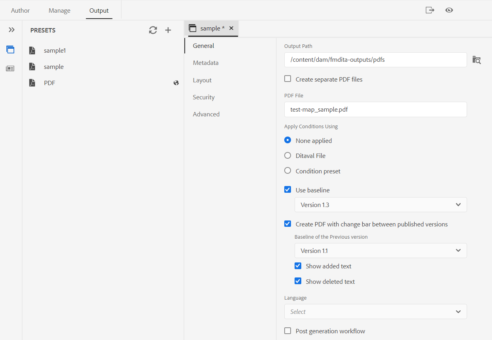

# Versão de novembro do Adobe Experience Manager Guides as a Cloud Service

## Atualização para a versão de novembro

Atualize seus Guias do Adobe Experience Manager atuais as a Cloud Service (mais tarde chamados de *Guias de AEM as a Cloud Service*), executando as seguintes etapas:
1. Confira o código Git do Cloud Service e alterne para a ramificação configurada no pipeline Cloud Service correspondente ao ambiente que você deseja atualizar.
1. Atualizar `<dox.version>` propriedade no `/dox/dox.installer/pom.xml` arquivo do seu código Git Cloud Service para 2022.11.198.
1. Confirme as alterações e execute o pipeline do Cloud Service para atualizar para a versão de novembro do AEM Guides as a Cloud Service.

## Etapas para indexar o conteúdo existente (somente se você estiver em uma versão anterior à versão de setembro do AEM Guides as a Cloud Service)

Execute as seguintes etapas para indexar o conteúdo existente e usar o novo texto de localização e substituição no nível do mapa:

* Execute uma solicitação POST no servidor (com a autenticação correta) - `http://<server:port>/bin/guides/map-find/indexing`.
(Opcional: é possível passar caminhos específicos dos mapas para indexá-los; por padrão, todos os mapas serão indexados || Exemplo: `https://<Server:port>/bin/guides/map-find/indexing?paths=<map_path_in_repository>`)

* A API retornará um jobId. Para verificar o status do trabalho, você pode enviar uma solicitação de GET com id de trabalho para o mesmo ponto de extremidade - `http://<server:port>/bin/guides/map-find/indexing?jobId={jobId}`
(Por exemplo: http://&lt;_localhost:8080_>/bin/guides/map-find/indexing?jobId=2022/9/15/7/27/7dfa1271-981e-4617-b5a4-c18379f11c42_678)

* Quando o trabalho for concluído, a solicitação do GET acima responderá com sucesso e mencionará se algum mapa falhou. Os mapas indexados com êxito podem ser confirmados nos logs do servidor.

## Matriz de compatibilidade

Esta seção lista a matriz de compatibilidade dos aplicativos de software compatíveis com os Guias do AEM as a Cloud Service na versão de novembro de 2022.

### FRAMEMAKER e FRAMEMAKER PUBLISHING SERVER

| FMPS | FrameMaker |
| --- | --- |
| Não compatível | Atualização 4 e superior para 2020 |
| | |

*A linha de base e as condições criadas no AEM são compatíveis com as versões do FMPS a partir de 2020.2.

### Conector de oxigênio

| Versão do AEM Guides as a Cloud | Janelas do conector Oxygen | Conector Oxygen Mac | Editar no Oxygen Windows | Editar no Oxygen Mac |
| --- | --- | --- | --- | --- |
| 2022.11.0 | 2.7.13 | 2.7.13 | 2,3 | 2,3 |
|  |  |  |  |

## Novos recursos e melhorias

O AEM Guides as a Cloud Service oferece aprimoramentos e novos recursos na versão de novembro:

### Excluir arquivos do painel de repositório

Agora é possível excluir facilmente arquivos (um único arquivo por vez) do **Opções** do arquivo selecionado no painel repositório.

Um prompt de confirmação é exibido antes de excluir o arquivo. Se o arquivo não for referenciado a partir de outro arquivo, ele será excluído e uma mensagem de sucesso será exibida.

Se o arquivo selecionado estiver com check-out, não será possível excluí-lo e uma mensagem de erro será exibida. Se o arquivo selecionado for adicionado a uma coleção de favoritos ou for referenciado de qualquer outro arquivo, os guias do AEM verificarão sua confirmação e oferecerão a opção de excluí-lo à força. Se você excluir um tópico referenciado e tiver aberto o arquivo contendo referências para edição, ele mostrará o link corrompido para o arquivo referenciado.

**Nota**: também é possível excluir o arquivo selecionado usando a tecla Delete do teclado.

### Remoção de versões selecionadas de arquivos

À medida que você cria e mantém seu conteúdo, muitas versões podem ser criadas para seus arquivos DITA no repositório. Guias do AEM permitem que você remova do repositório versões anteriores dos arquivos DITA e libere espaço em disco.

As Guias do AEM não excluem a primeira versão do arquivo ou uma versão que esteja incluída em uma linha de base, ou tenha um rótulo aplicado a ela. A operação de limpeza nem mesmo exclui arquivos incluídos em uma tradução ou em um fluxo de trabalho de revisão. Você pode escolher o número de versões a serem mantidas e também decidir excluir os arquivos mais antigos que o número definido de dias.

Antes de iniciar a operação de expurgação, você pode visualizar o relatório para ver as versões que serão expurgadas. Você pode decidir iniciar ou cancelar a operação de expurgação.

Quando a operação de expurgação estiver concluída, você poderá verificar o relatório de expurgação para ver os arquivos expurgados.

### Gerenciar predefinições de saída de perfil global e de pasta

Os Guias do AEM fornecem o recurso para criar e gerenciar predefinições de saída para Perfis globais e de pastas. Em seguida, é possível usar facilmente essas predefinições de saída para gerar saída para todos os mapas relacionados a esse perfil Global ou de Pasta.

**Nota** Somente usuários administrativos no nível da pasta podem criar predefinições Globais e de Perfil de Pasta.

Essas predefinições globais aparecem sob a tag **Output** de todos os mapas relacionados. Você pode usá-los para gerar a saída para todos os mapas relacionados. É possível selecionar a predefinição como predefinição de PDF padrão para gerar a saída de PDF. Também é possível **Editar**, **Renomear**, **Duplicar** ou **Excluir** uma predefinição de saída existente do **Opções** menu.

### Coluna Rótulo da versão adicionada ao painel de tradução

No painel de tradução, também é possível ver a coluna Rótulo da versão. Isso exibe o Rótulo da versão selecionada do arquivo de origem. Isso pode ajudá-lo a selecionar todos os arquivos com um rótulo específico e traduzi-los de uma só vez.

### PDF nativo | PDF com barra de alterações que mostra a diferença entre as versões do documento

Agora você pode criar um PDF que mostra as diferenças no conteúdo entre duas versões usando a barra de alteração. Você pode optar por comparar a versão atual com uma linha de base da versão anterior ou comparar entre as duas versões de linha de base selecionadas.

Uma barra de alteração aparece no PDF para indicar o conteúdo modificado, inserido ou excluído. Você também tem as opções para fazer o seguinte:
* Mostrar o conteúdo inserido em verde e sublinhado
* Mostrar o conteúdo excluído em vermelho e marcado com um tachado

### PDF nativo | Suporte de variável para caminho de saída e nome do arquivo PDF

Agora, você também pode usar as variáveis prontas para uso a seguir para definir o Caminho de saída e o Arquivo PDF. Você pode usar uma única variável ou uma combinação de variáveis para definir essas opções:
* `${map_filename}`
* `${map_title}`
* `${preset_name}`
* `${language_code}`
* `${map_parentpath}` (Somente para Caminho de saída)
* `${path_after_langfolder}` (Somente para Caminho de saída)

### PDF nativo | Gerar sumário para mapas DITA e reordenar layouts de página

Agora, você também pode gerar o índice em mapas DITA usando uma configuração de PDF avançada do modelo. Você pode optar por ativar ou desativar a exibição dos vários layouts de página e também reordenar sua posição.

## Problemas corrigidos

Os bugs corrigidos em várias áreas estão listados abaixo:

* PDF nativo | `conkeyref` não é resolvido na saída de PDF gerada. (10564)
* PDF nativo | Ocorrem problemas ao acessar metadados de um mapa na saída do PDF. (10556)
* PDF nativo | O estilo incorporado é usado para gerar tags em vez do nome da classe.  (10498)
* O Editor da Web carrega a página em branco intermitentemente. (10678)
* A publicação de PDF falha se criarmos uma predefinição duplicando uma predefinição existente. (10584)
* **Exibir registro** O botão não funciona quando a geração de PDF falha para uma predefinição. (10576)
* A observação dentro de uma tag para, que é um conref, não é exibida na pré-visualização. (10559)
* Acertar o espaço traseiro no final de um item de lista remove a lista inteira. (10540)
* Ao usar uma exportação de PDF nativa, os objetos `<indexterm>` não estão aninhados no índice. (10521)
* **Recuo Automático** botão na barra de ferramentas está ausente na Exibição de origem. (10448)
* O primeiro caractere de um item de lista é perdido enquanto a lista está sendo criada no editor. (10447)
* Vários pop-ups são exibidos se qualquer versão de ativo DITA for alterada e salva na janela de edição da linha de base. (10399)
* Ocorre um erro de aplicativo ao clicar **Editar** depois de selecionar todas as predefinições de Saída no painel Geração rápida. (10388)
* Os metadados personalizados para o tópico DITA não são retidos quando uma ação de copiar e colar é executada na interface do usuário do Assets. (10367)
* O pós-processamento está bloqueado para toda a pasta de idioma cujos ativos estão presentes em um projeto de tradução ativo. (10332)
* A guia Modelo no Editor de XML não está visível para administradores de perfil de pasta. (10266)
* Problemas de navegação ocorrem no Editor da Web após a atualização 4.0. (10159)
* Os arquivos SVG não são exibidos no modo Visualização. (10010)
* Se a guia Saída do editor contiver mais predefinições, a seção predefinições não poderá ser rolada e todas as predefinições não serão exibidas. (9787)
* **Editar** e **Anotar** as opções de uma imagem não estão funcionando corretamente na exibição de coluna. (8758)
* O link peer não é resolvido e é exibido como um texto normal na saída gerada. (7774)
