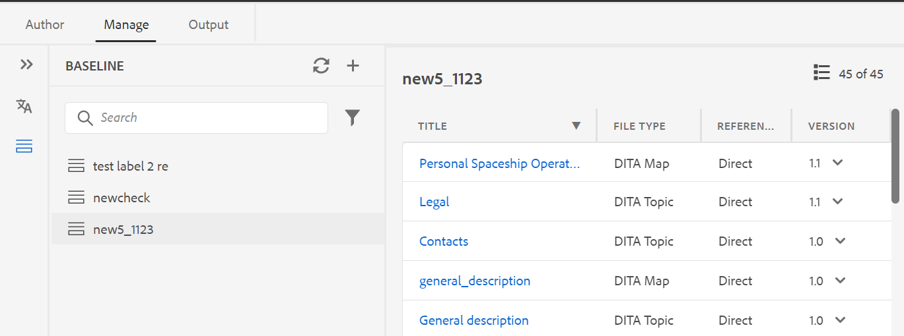

# Versão de março do as a Cloud Service [!DNL Adobe Experience Manager Guides]

## Atualização para a versão de março

Atualize sua configuração atual do [!DNL Adobe Experience Manager Guides] as a Cloud Service (mais tarde chamada de *[!DNL AEM Guides]as a Cloud Service*) executando as seguintes etapas:
1. Confira o código Git do Cloud Services e alterne para a ramificação configurada no pipeline do Cloud Services correspondente ao ambiente que você deseja atualizar.
1. Atualize a propriedade `<dox.version>` no arquivo `/dox/dox.installer/pom.xml` do seu código Git do Cloud Services para 2022.3.123.
1. Confirme as alterações e execute o pipeline de Serviços em Nuvem para atualizar para a versão de março do as a Cloud Service [!DNL AEM Guides].

## Matriz de compatibilidade

Esta seção lista a matriz de compatibilidade dos aplicativos de software compatíveis com a versão de março de 2022 do [!DNL AEM Guides] as a Cloud Service.

### FRAMEMAKER e FRAMEMAKER PUBLISHING SERVER

| FMPS | FrameMaker |
| --- | --- |
| Não compatível | Atualização 4 e superior para 2020 |
| | |

### Conector de oxigênio

| Versão da nuvem do [!DNL AEM Guides] | Janelas do conector Oxygen | Conector Oxygen Mac |
| --- | --- | --- |
| 2022.3.0 | 2.4.0 | 2.4.0 |
|  |  |  |

*A linha de base e as condições criadas no AEM são compatíveis com as versões do FMPS a partir de 2020.2.

## Novos recursos e melhorias

### Novo painel Linha de base

A versão de março do as a Cloud Service [!DNL AEM Guides] fornece o recurso de Linha de Base integrado ao Editor da Web. Agora você pode criar linhas de base no Editor da Web e usá-las para publicar ou traduzir tópicos de diferentes versões.

Observação: para um sistema atualizado, atualize o **ui_config.json** mais recente para o Perfil de Pasta.

Use este recurso para criar uma linha de base com uma versão específica dos tópicos disponíveis em uma data e hora específicas. Além disso, você obtém o suporte da API para criar ou atualizar uma linha de base com um rótulo definido para uma versão de tópicos.

Você pode pesquisar os arquivos com base nos nomes ou no local dos arquivos. Você também pode filtrar os tópicos a serem exibidos na janela de edição da linha de base e classificá-los com base em colunas específicas.

O desempenho do processo de criação da linha de base foi melhorado. O processo para criar linhas de base é assíncrono, assim, você pode continuar editando outros arquivos no Editor da Web enquanto a linha de base está sendo criada. Para obter mais detalhes, consulte *Criar e gerenciar linhas de base do Editor da Web* no Guia do Usuário.

Observação: A guia Linha de Base no painel de mapa fica oculta por padrão. O administrador pode habilitar a guia Linha de base no painel do mapa.

### Comportamento de atualização do Editor da Web aprimorado

Os seguintes aprimoramentos estão disponíveis com a operação de atualização do navegador no Editor da Web:

* Agora você obtém o suporte para atualizar o navegador enquanto edita seu
conteúdo no Editor da Web. Se você clicar no ícone de atualização do navegador enquanto um ou mais arquivos
as alterações não salvas forem abertas para edição, você será solicitado a salvar seus arquivos ou cancelar a ação de atualização.

* Mesmo ao atualizar o navegador, as exibições do painel esquerdo e do painel direito são mantidas.

* O tópico ativo ou mapa DITA é reaberto na área de edição de conteúdo.

### Aprimoramentos de publicação

O processo de publicação foi aprimorado ainda mais com a versão de março do [!DNL AEM Guides] as a Cloud Service:

* As linhas de base foram respeitadas para os metadados de saída do site do AEM. Você também pode processar as propriedades de uma versão de linha de base como metadados. Se nenhuma linha de base for definida, as propriedades da versão mais recente serão processadas como metadados.

* As opções **Nome do Arquivo** e **Argumentos de Linha de Comando DITA-OT** foram adicionadas para predefinições de saída HTML5, EPUB e Personalizada. Agora você pode especificar o nome do arquivo com o qual deseja salvar a saída. Você também pode especificar os argumentos adicionais que deseja que o DITA-OT processe ao gerar saída.

## Problemas corrigidos

Os bugs corrigidos em várias áreas estão listados abaixo:

* Não é possível adicionar elementos de primeiro plano e de segundo plano em um mapa usando a exibição Autor do Editor da Web. (7652)
* A árvore de referência é interrompida após a remoção de um tópico e a execução de uma operação de movimentação. (8804)
* Uma exceção é recebida ao visualizar o conteúdo após fazer upload de um ativo. (3638)
* O erro ocorre quando os arquivos cuja pasta pai tem caracteres especiais no nome do arquivo são abertos no Oxygen (usando o botão **Editar no Oxygen**). (8918)
* A opção **Localizar no Repositório** não localiza e realça o mapa DITA no Editor de XML. (8796)
* A filtragem não mostra os resultados apropriados quando vários atributos são adicionados ao conteúdo no Editor de XML. (8795)
* Ocorre um erro ao adicionar um usuário como administrador no perfil da pasta quando a ID do usuário é numérica. (8908)

## Problemas conhecidos

A Adobe identificou o seguinte problema conhecido na versão de março do as a Cloud Service [!DNL AEM Guides].

* A remoção de rótulos em referências diretas também remove os rótulos de referências indiretas.

* Não é possível refletir o título da linha de base atualizado sem atualizar manualmente o painel da linha de base.

* O recurso de visualização de versão no painel Histórico de Versões não mostra a visualização de um tópico selecionado.
