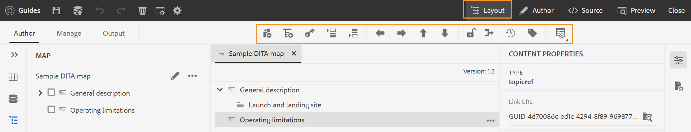

# Versão de agosto do Adobe Experience Manager Guides as a Cloud Service

## Atualização para a versão de agosto

Atualize seus Guias do Adobe Experience Manager atuais as a Cloud Service (mais tarde chamados de *Guias de AEM as a Cloud Service*), executando as seguintes etapas:
1. Confira o código Git do Cloud Service e alterne para a ramificação configurada no pipeline Cloud Service correspondente ao ambiente que você deseja atualizar.
1. Atualizar `<dox.version>` propriedade no `/dox/dox.installer/pom.xml` arquivo do seu código Git Cloud Service para 2022.8.167.
1. Confirme as alterações e execute o pipeline do Cloud Service para atualizar para a versão de agosto do AEM Guides as a Cloud Service.

## Matriz de compatibilidade

Esta seção lista a matriz de compatibilidade dos aplicativos de software compatíveis com os Guias do AEM as a Cloud Service na versão de agosto de 2022.

### FRAMEMAKER e FRAMEMAKER PUBLISHING SERVER

| FMPS | FrameMaker |
| --- | --- |
| Não compatível | Atualização 4 e superior para 2020 |
| | |

*A linha de base e as condições criadas no AEM são compatíveis com as versões do FMPS a partir de 2020.2.

### Conector de oxigênio

| Versão do AEM Guides as a Cloud | Janelas do conector Oxygen | Conector Oxygen Mac |
| --- | --- | --- |
| 2022.8.0 | 2.7.5 | 2.7.5 |
|  |  |  |

## Novos recursos e melhorias

O AEM Guides as a Cloud Service oferece muitas melhorias e novos recursos na versão de agosto:

### Exibição de layout no Editor de mapa

Agora é possível exibir o layout completo de um mapa DITA no Editor de mapas. Quando você abre um mapa para edição, ele abre a variável **Layout** exibição do Editor de Mapas. Nesta exibição, é possível ver a hierarquia de mapa em uma exibição em árvore e também organizar ou estruturar os tópicos em um mapa.

A exibição de layout contém uma barra de ferramentas separada que ajuda a executar muitas tarefas nos tópicos presentes em um mapa.
Você pode inserir referências de tópico, grupo de tópicos, definições de chave em um mapa. Você pode reorganizar os tópicos presentes em um mapa movendo-os para cima, para baixo, para a esquerda ou para a direita. Você também pode arrastar e soltar os tópicos para movê-los em um mapa. O Editor de mapa também fornece os ícones para bloquear ou desbloquear arquivos, verificar o histórico da versão e fazer um gerenciamento de rótulo de versão.

A exibição de layout também fornece a **Opções de exibição** para mostrar ou ocultar o número da linha, mostrar ou ocultar a caixa de seleção ou mostrar o nome de arquivo ou título dos tópicos em um mapa.

Você também pode exibir os tópicos com base nos filtros condicionais aplicados neles.

Além de organizar tópicos no arquivo de mapa, também é possível adicionar, mover, copiar, colar ou excluir referências usando o **Opções** menu disponível para um elemento na exibição de layout. Você também pode arrastar e soltar um tópico ou um mapa do painel do repositório no mapa aberto no Editor de Mapas.

O painel direito exibe as Propriedades do Conteúdo e as Propriedades do Mapa na exibição de Layout do Editor de Mapas. Os Atributos em Linha definidos para o tópico selecionado são exibidos em relação ao tópico na exibição de Layout. Por exemplo, você pode localizar rapidamente todos os tópicos que têm o atributo de plataforma definido como `IOS`.

Agora, também é possível definir as informações de metadados dos tópicos ou do mapa. Você pode definir o Título de navegação, Texto do link, Descrição curta e Palavras-chave para o tópico ou mapa selecionado.

Para obter mais detalhes, consulte *Exibição de layout* seção em Uso do Adobe Experience Manager Guides as a Cloud Service.

### Atributos em linha nas configurações do editor

Guias de AEM agora permitem a configuração de **Atributos em linha** pelo administrador no **Configurações do editor**. Você também pode adicionar novos atributos em linha ou excluir os existentes da **Atributos em linha** em Configurações do editor.
Os Atributos em Linha configurados definidos para um tópico são exibidos em relação ao tópico na exibição de Layout.

### Filtros adicionais na visualização de Repositório

Agora, a pesquisa por filtro na visualização de repositório ficou mais eficiente. Dois novos critérios de pesquisa, **Última modificação** e **Tags** foram adicionadas para filtrar os arquivos e restringir sua pesquisa no repositório AEM:
* **Última modificação**: é possível procurar arquivos que foram modificados pela última vez após uma data selecionada, mas antes de uma data selecionada. Você também tem a opção de usar os critérios predefinidos e procurar arquivos que foram modificados pela última vez nas últimas 2 horas, semana passada, mês passado ou ano passado.
* **Tags**: também é possível procurar arquivos que tenham tags específicas aplicadas. Você pode digitar a tag ou selecioná-la na lista suspensa.

## Problemas corrigidos

Os bugs corrigidos em várias áreas estão listados abaixo:

* Índice Lucene obsoleto usado em /core/article-publish/src/main/java/com/adobe/dxml/article/publish/util/DoxUtils.java (9291)
* O Node.js atualizado não é usado para publicação. (9835)
* O tópico DITA não é atualizado automaticamente com as alterações feitas no **Propriedades** página. (8745)
* O elemento Frontmatter, quando adicionado a um mapa DITA, não funciona corretamente. (9507)
* PDF nativo | Um PDF em branco é gerado ao usar **Geração rápida** para vários arquivos quando um elemento vazio é selecionado. (9822)
* PDF nativo | O apêndice é publicado como um capítulo na saída do PDF. (9829)
* PDF nativo | Quando uma imagem de SVG é editada, ela não é mostrada atualizada no layout da página. (9069)
* Um caractere de hífen regular é inserido quando um `Nonbreaking Hyphen` caractere é inserido usando o **Inserir caractere especial** diálogo. (8919)
* O Editor de XML não mostra imagens atualizadas nos tópicos se elas tiverem sido editadas. (9500)
* Ao publicar a saída por meio do Editor, as predefinições não podem ser excluídas do **Output** guia. (9100)
* Os submapas de um mapa DITA não são verificados usando o **Selecionar tudo** no menu de reticências. (9814)
* Não é possível arrastar e soltar o mapa ou os modelos de tópico da **Modelos** para o modelo de mapa personalizado no editor da Web. (9846)
* Não é possível criar um novo tópico ou modelo de mapa na subpasta de um mapa ou modelo de tópico. (9888)
* Nenhuma opção está presente para procurar os tópicos ou mapas presentes nas subpastas de um mapa ou modelo de tópico. (9889)
* Quando um arquivo do Schematron é atualizado e salvo junto com o arquivo DITA, o painel direito não é exibido (se o arquivo DITA quebrar as validações presentes no arquivo do Schematron). (9986)
* Uma nova predefinição de saída duplicada poderá ser criada se o nome for igual a uma predefinição existente. (9997)
* As imagens de SVG são corrompidas e não são publicadas corretamente ao gerar a saída de HTML. (9949)

## Problemas conhecidos

O Adobe identificou os seguintes problemas conhecidos para os Guias do AEM as a Cloud Service na versão de agosto de 2022.

### Problemas conhecidos com a solução alternativa

Use a solução alternativa fornecida para os seguintes problemas conhecidos:

* A exibição de layout não está visível no Editor de mapa.

  **Solução alternativa**: atualize o ui_config.json no Perfil da pasta.

* Symbols.json é substituído, portanto, o problema 8919 ocorre.

  **Solução alternativa**: o symbol.json atualizado deve ser mesclado com o symbol.json substituído.

### Outros problemas conhecidos

* Se vários arquivos forem selecionados na seção de resultados exibida ao executar uma pesquisa no repositório e arrastar e soltar na visualização do autor, somente um único arquivo será adicionado.
