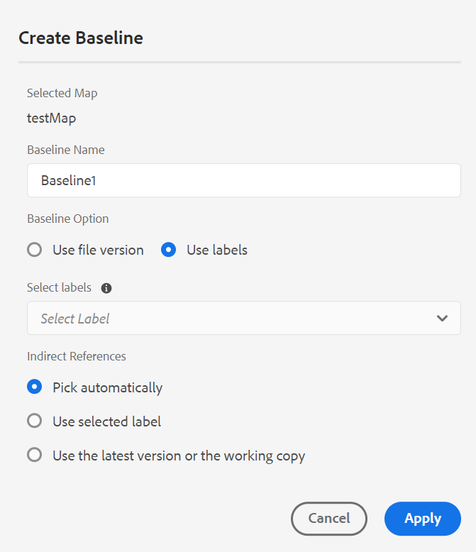

# Versão de setembro do Adobe Experience Manager Guides as a Cloud Service

## Atualização para a versão de setembro

Atualize seus Guias do Adobe Experience Manager atuais as a Cloud Service (mais tarde chamados de *Guias de AEM as a Cloud Service*), executando as seguintes etapas:
1. Confira o código Git do Cloud Service e alterne para a ramificação configurada no pipeline Cloud Service correspondente ao ambiente que você deseja atualizar.
1. Atualizar `<dox.version>` propriedade no `/dox/dox.installer/pom.xml` arquivo do seu código Git Cloud Service para 2022.9.178.
1. Confirme as alterações e execute o pipeline do Cloud Service para atualizar para a versão de setembro do AEM Guides as a Cloud Service.

## Etapas para indexar o conteúdo existente

Execute as seguintes etapas para indexar o conteúdo existente e usar o novo texto de localização e substituição no nível do mapa:
* Execute uma solicitação POST no servidor (com a autenticação correta) - `http://<server:port>/bin/guides/map-find/indexin`.
(Opcional: é possível passar caminhos específicos dos mapas para indexá-los; por padrão, todos os mapas serão indexados || Exemplo:   `https://<Server:port>/bin/guides/map-find/indexing?paths=<map_path_in_repository>`)
* A API retornará um jobId. Para verificar o status do trabalho, você pode enviar uma solicitação de GET com id de trabalho para o mesmo ponto de extremidade - `http://<server:port>/bin/guides/map-find/indexing?jobId={jobId}`
(Por exemplo: `http://<_localhost:8080_>/bin/guides/map-find/indexing?jobId=2022/9/15/7/27/7dfa1271-981e-4617-b5a4-c18379f11c42_678)`
* Quando o trabalho for concluído, a solicitação do GET acima responderá com sucesso e mencionará se algum mapa falhou. Os mapas indexados com êxito podem ser confirmados nos logs do servidor.

## Matriz de compatibilidade

Esta seção lista a matriz de compatibilidade dos aplicativos de software compatíveis com os Guias do AEM as a Cloud Service na versão de setembro de 2022.

### FRAMEMAKER e FRAMEMAKER PUBLISHING SERVER

| FMPS | FrameMaker |
| --- | --- |
| Não compatível | Atualização 4 e superior para 2020 |
| | |

*A linha de base e as condições criadas no AEM são compatíveis com as versões do FMPS a partir de 2020.2.

### Conector de oxigênio

| Versão do AEM Guides as a Cloud | Janelas do conector Oxygen | Conector Oxygen Mac | Editar no Oxygen Windows | Editar no Oxygen Mac |
| --- | --- | --- | --- | --- |
| 2022.9.0 | 2.7.13 | 2.7.13 | 2,3 | 2,3 |
|  |  |  |  |

## Novos recursos e melhorias

O AEM Guides as a Cloud Service oferece muitas melhorias e novos recursos na versão de setembro:

### Criar uma linha de base dinâmica com base em rótulos

Agora, o AEM Guides fornece o recurso para criar linhas de base dinâmicas com base em rótulos. Se você gerar uma linha de base, baixar uma linha de base ou criar um projeto de tradução usando uma linha de base, os arquivos serão selecionados dinamicamente com base nos rótulos atualizados. Esse recurso é útil, pois não é necessário modificar a linha de base ao atualizar os rótulos.
Você também pode exportar o instantâneo da linha de base como um CSV.

### Localizar e substituir o texto no nível do mapa

Agora é possível pesquisar arquivos em um mapa que contenha texto específico. O texto pesquisado é destacado nos arquivos. Você também pode substituir a palavra ou frase pesquisada por outra palavra ou frase dentro dos arquivos.
Selecione o **Substituir** ícone para substituir a ocorrência atual e o **Substituir tudo no arquivo** ícone para substituir todas as ocorrências no arquivo selecionado.

Por padrão, as opções **Fazer check-out do arquivo antes de substituir** e **Criar nova versão após substituir** são selecionados, portanto, um arquivo é submetido a check-out antes da substituição do texto e uma nova versão é criada depois que o texto é substituído.

### Visualizar diferença de versão para arquivos Fora de sincronização no painel de tradução

Agora você pode optar por traduzir a **Fora de sincronia** arquivos com base nas alterações feitas entre as duas versões de um tópico.\

No painel de tradução, é possível ver facilmente as diferenças entre a última versão traduzida e a versão atual do arquivo selecionado.

Com base nas diferenças, você pode decidir se deseja traduzir um tópico ou não.

### Interface de metadados disponível para predefinições de PDF

É possível definir os metadados na predefinição de saída de um mapa DITA. É possível definir os metadados de Título, Autor, Assunto e Palavras-chave. Esses metadados são mapeados para os metadados nas Propriedades do arquivo do PDF de saída.
Esses metadados substituem os definidos no nível de livro. Você pode definir os metadados especificamente em cada predefinição de saída e passá-los para o PDF de saída.

## Problemas corrigidos

Os bugs corrigidos em várias áreas estão listados abaixo:

* Editor da Web | Ao mover elementos em um tópico, as IDs atribuídas nos elementos são substituídas pelas IDs atribuídas automaticamente. (7895)
* Controlar alterações | O conteúdo é perdido quando um novo elemento é inserido usando a tecla Enter. (10246)
* Submapa referido ao mapa principal em dita-templates não está sendo criado. (10231)
* Editor XML | O comando copiar-colar não funciona no modo de autor. (10309)
* Vários rótulos de versão, uma vez selecionados, não são desmarcados. (9561)
* A navegação automática para o caminho na caixa de diálogo de navegação do site não funciona como a navegação de arquivo. (9920)
* O painel Estrutura de Tópicos não exibe conteúdo quando alternado de **Autor** para **Origem** modo. (10319)
* O Conref em um novo tópico criado usando um conteúdo no modelo de tópico não funciona. A ID de hash copiada não é atualizada na cópia de conteúdo. (9890)
* Editor da Web | Não existe carregador ao criar um mapa a partir do modelo de mapa. (9891)
* Novo Editor de Mapa | O texto em negrito ou itálico adicionado no título do mapa não será retido se alternarmos de **Autor** para o **Layout** exibição. (10218)
* Novo Editor de Mapa | As condições aplicadas em qualquer referência não podem ser removidas da exibição de layout. (10213)
* Novo Editor de Mapa | A aplicação de referências de condições não funciona na exibição de layout como na exibição de autor. (10198)
* Novo Editor de Mapa | Mover para a esquerda no menu de contexto remove a referência se ela não puder ser movida para a esquerda. (10219)
* Novo Editor de Mapa |O ícone é exibido incorretamente para as referências em um mapa criado usando o modo Layout. (10197)
* Painel Repositório | O clique com o botão direito do mouse no painel repositório fornece um erro de aplicativo. (10123)
* Localizar e substituir | O modo escuro não é legível para Resultados de pesquisa no Editor da Web. (9978)
* Tradução | Os metadados e as tags não são propagados para as cópias traduzidas. (4696)
* O conteúdo de copiar e colar (ctrl+c/ctrl+v) gera um erro no modo de autor. (10304)
* Modelo PDF | A adição de imagens de plano de fundo a qualquer layout de página exibe Caminho da imagem absoluto e as imagens não são exibidas no PDF de saída. (10297)
* PDF nativo | O título do capítulo e o cabeçalho do capítulo não estão funcionando na publicação do PDF. (9947)
* PDF nativo | `xref` para um conceito não é resolvido corretamente para um tópico DITA específico. (10229)
* PDF nativo | Não é possível exibir o texto de legenda de uma tabela na saída de PDF gerada. (9827)
* PDF nativo | As referências nos apêndices não são exibidas como apêndices na saída de PDF. (10182)
* PDF nativo | O atributo de quadro de uma tabela não é propagado para o HTML temporário (como classe). (10353)
* PDF nativo | os arquivos de HTML temporários adicionam as classes colsep e rowsep a td e o mesmo se o valor for 0 no DITA de origem. (10352)
* PDF nativo | Os metadados para o critério adicionado no layout da página não estão sendo respeitados. (10377)
* PDF nativo | A geração de PDF falha para um conteúdo específico. (9927)
* PDF nativo | O conteúdo via conkeyref não é exibido na saída do PDF. (9836)
* PDF nativo | As principais referências de Keydefs com imagens ou links externos não são resolvidas. (10063)
* A visualização de autor de um mapa não exibe o texto do espaço reservado para a lista de tabelas e a lista de figuras. (10330)
* Quando criamos uma nova linha de base, o filtro de linha de base já selecionado não é aplicado. (9954)
* O arquivo de vídeo está ausente na linha de base se o nome da pasta pai tiver um caractere de espaço. 10031)
* A criação de linha de base não escolhe a versão mais recente quando o fuso horário do usuário é diferente do fuso horário do servidor. (10190)
* O atalho Control + F não abre o modal de pesquisa do navegador no console de Ativos depois de instalar os Guias do AEM 4.1 no AEM 6.5.12. (10189)

## Problemas conhecidos

O Adobe identificou os seguintes problemas conhecidos para os Guias do AEM as a Cloud Service na versão de setembro de 2022.

* A linha de base dinâmica não está integrada à publicação da base de dados de conhecimento.

* Tradução | O ícone de diferença de versão é exibido para o conteúdo de origem devido a qualquer alteração no conteúdo de destino.
