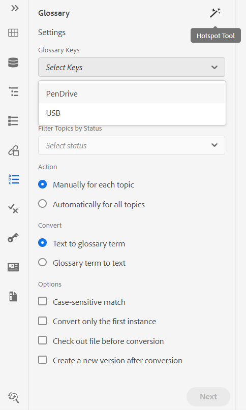
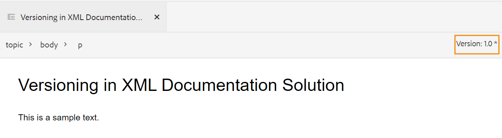

# Notas de versão | Adobe Experience Manager Guides 4.0.x

**Isenção de responsabilidade**:

A *Adobe Experience Manager Guides* era anteriormente conhecida como *XML Documentation para Adobe Experience Manager*. Observe que algumas referências contidas na documentação ainda podem se referir a marcas anteriores, mas ainda se aplicam à oferta atual.

Estas notas de versão abordam as instruções de atualização, os novos recursos e os aprimoramentos na versão 4.0.x do Adobe Experience Manager Guides (conhecido como AEM Guides mais recente).

## 4.0.3 | Notas de versão

### Matriz de compatibilidade

Esta seção lista a matriz de compatibilidade dos aplicativos de software compatíveis com o AEM Guides versão 4.0.3.

#### Adobe Experience Manager

- Versão 6.5 Service Pack 12, 10, 11 ou 9

Para obter mais detalhes, consulte a seção *Requisitos técnicos* no Guia de Instalação e Configuração.

#### FRAMEMAKER e FRAMEMAKER PUBLISHING SERVER

| Versão | FMPS 2020 | FMPS 2019 | Fm 2020 | Fm 2019 |
|---|---|---|---|---|
| Não UUID | 2020.2 ou superior* | 2019 | 2020.3 ou superior | 2019.8 (atualização mais recente) |
| UUID | 2020.2 ou superior* | Não compatível | 2020.4 ou superior | Não compatível |

*A linha de base e as condições criadas na solução XML Documentation têm suporte no FMPS versão 2020.2 em diante.*

#### Conector de oxigênio

| Versão | Janelas do conector Oxygen | Conector Oxygen Mac | Editar no Oxygen Windows | Editar no Oxygen Mac |
|---|---|---|---|---|
| Não UUID | 1.6.8 | 1.6.8 | 1.5 | 1.5 |
| UUID | 2.3.8 | 2.3.8 | 2,2 | 2,2 |

### Problemas corrigidos

Os bugs corrigidos em várias áreas estão listados abaixo:

- O Oxygen verifica uma versão incorreta de um tópico depois de reverter uma versão de arquivo no AEM. (9661)
- Diferenças incorretas de carimbo de data e hora são exibidas na interface do usuário do Assets ao reverter uma versão de arquivo. (9662)
- O check-out dos arquivos é feito automaticamente ao reverter para qualquer versão. (9663)
- O conteúdo traduzido é interrompido se o código de idioma for mencionado como fr-fr ou en-us. (9665)
- Na versão não UUID, a tradução aprovada não se integra ao idioma de destino quando o código do idioma de destino contém cinco caracteres como fr_ca. (9666)
- A versão de destino da imagem é exibida como jcr:root, depois que a tradução é concluída com a habilitação da criação de nova versão. (9668)
- Quando a tradução é feita usando a linha de base, a versão incorreta da imagem é enviada para tradução. (9669)

## 4.0.2 | Notas de versão

### Matriz de compatibilidade

Esta seção lista a matriz de compatibilidade dos aplicativos de software compatíveis com o AEM Guides versão 4.0.2.

#### Adobe Experience Manager

- Versão 6.5 Service Pack 12, 10, 11 ou 9

Para obter mais detalhes, consulte a seção *Requisitos técnicos* no Guia de Instalação e Configuração.

#### FRAMEMAKER e FRAMEMAKER PUBLISHING SERVER

| Versão | FMPS 2020 | FMPS 2019 | Fm 2020 | Fm 2019 |
|---|---|---|---|---|
| Não UUID | 2020.2 ou superior* | 2019 | 2020.3 ou superior | 2019.8 (atualização mais recente) |
| UUID | 2020.2 ou superior* | Não compatível | 2020.4 ou superior | Não compatível |

*A linha de base e as condições criadas na solução XML Documentation têm suporte no FMPS versão 2020.2 em diante.*

#### Conector de oxigênio

| Versão | Janelas do conector Oxygen | Conector Oxygen Mac | Editar no Oxygen Windows | Editar no Oxygen Mac |
|---|---|---|---|---|
| Não UUID | 1.6.8 | 1.6.8 | 1.5 | 1.5 |
| UUID | 2.3.8 | 2.3.8 | 2,2 | 2,2 |

### Problemas corrigidos

Os bugs corrigidos em várias áreas estão listados abaixo:

- A posição do texto inserido ou excluído não está correta em um documento de revisão recém-criado. (9454)
- A versão 1.0 não está listada em determinados casos no painel **Histórico de Versão** após a atualização 4.0.1. (9441)
- O rótulo e os comentários não são exibidos para a versão atual na Versão 1.0 e não estão listados em determinados casos no painel **Histórico de Versão**. (9440)
- O editor congela quando determinados arquivos de conteúdo são abertos no editor. (9433)
- A pesquisa no painel de repositório e na caixa de diálogo de navegação *topicref* congela ao pesquisar arquivos de conteúdo grandes. (9432)
- Duas versões são criadas para um arquivo ao salvá-lo uma vez no Editor da Web. (9428)
- Não é possível inserir ativos não DITA e ditaval em topicref. (9363)
- O editor trava ao carregar a pré-visualização de um mapa com um grande número de chaves. (9332)
- As referências quebram ao mover os ativos nos arquivos de origem durante a criação usando a atualização FM 4. (9177)

### Problemas conhecidos

- Se a configuração **Criar Nova Versão para Arquivo Carregado** estiver ATIVADA, uma nova versão será criada ao escolher **Salvar Tudo** intermitentemente em determinados casos.
- A funcionalidade Excluir usuários no Perfil de pasta não funciona intermitentemente no navegador do Chrome. **Solução alternativa**: atualize o navegador Chrome.

## 4.0.1 | Notas de versão

### Matriz de compatibilidade

Esta seção lista a matriz de compatibilidade dos aplicativos de software compatíveis com a solução XML Documentation versão 4.0.1.

#### Adobe Experience Manager

- Versão 6.5 Service Pack 12, 11 ou 10
- Java: 11

#### FRAMEMAKER e FRAMEMAKER PUBLISHING SERVER

| Versão | FMPS 2020 | FMPS 2019 | Fm 2020 | Fm 2019 |
|---|---|---|---|---|
| Não UUID | 2020.2 ou superior* | 2019 | 2020.3 ou superior | 2019.8 (atualização mais recente) |
| UUID | 2020.2 ou superior* | Não compatível | 2020.4 ou superior | Não compatível |

*A linha de base e as condições criadas na solução XML Documentation têm suporte no FMPS versão 2020.2 em diante.*

#### Conector de oxigênio

| Versão | Janelas do conector Oxygen | Conector Oxygen Mac | Editar no Oxygen Windows | Editar no Oxygen Mac |
|---|---|---|---|---|
| Não UUID | 1.6.8 | 1.6.8 | 1.5 | 1.5 |
| UUID | 2.3.8 | 2.3.8 | 2,2 | 2,2 |

### Problemas corrigidos

Os bugs corrigidos em várias áreas estão listados abaixo:

- A árvore de referências é quebrada para um mapa quando referências de tópico duplicadas são adicionadas/removidas. (8922)
- Vários problemas presentes na seção **Versões atuais** do **Histórico de Versões.** (8909)
- As referências são interrompidas ao usar **Selecionar tudo** e mover os arquivos multimídia ou o conteúdo DITA para outra pasta. (8897)
- Vários problemas de interface do usuário em **Inserir Referência Cruzada** > **Referência de Arquivo** > **Arquivo de Pesquisa** > **Filtros** > **Alterar Caminho de Pesquisa** na caixa de diálogo no Editor da Web. (8889)
- Pesquise problemas com *topicref* e *ditavalref* no Editor de Mapas (8983).
- A pesquisa à medida que você digita faz com que solicitações de pesquisa indesejadas sejam exibidas na exibição Repositório. (8982)
- Não é possível excluir os usuários administradores no perfil de pasta. (8926)
- A nota de rodapé de uso por referência não é rolada até a seção de nota de rodapé na saída do site do AEM. (9061)
- Não foi possível publicar os artigos atualizados no Salesforce. (9008)
- A posição do realce está incorreta na exibição lado a lado. (9009)
- Não é possível arrastar e soltar condições em tópicos DITA. (9031)
- css_layout.css não pode ser sobreposto no perfil da pasta. (9032)
- Uma exceção é recebida ao visualizar um ativo após o upload. (9068)
- A personalização de caracteres especiais permitidos no Editor de XML não está funcionando corretamente. (9075)
- No fluxo de trabalho de tradução, uma versão adicional é criada para o ativo traduzido. (9107)
- Publicação de linha de base com um tópico usando uma imagem como *conref* de outro tópico, a imagem não aparece na saída. (9172)
- Ao usar a API de mapa de download, os diretórios temporários não são limpos em caso de falha no download. (9176)
- O alinhamento horizontal não está disponível para uma tabela na versão 4.0. (9207)
- O atributo Keys não é exibido para *glossref*, portanto, o formulário abreviado não pode ser inserido por meio de referências de inserção. (9213)
- Criar um *keydef* permite apenas a seleção de um link no 4.0. (9214)
- O comportamento da funcionalidade Inserir definição de chave/*keyref* é diferente no 4.0 em comparação ao 3.8.10. (9215)
- Correção de problemas do Editor da Web presentes nas versões 3.8.6 a 3.8.10. (9219)
- Problemas ocorrem quando qualquer palavra-chave é usada no título da guia. (9317)
- A visualização Source exibe vários erros para atributos não condicionais. (9278)
- Problemas presentes na caixa de diálogo de navegação de **Selecionar caminho**. (9289)

## 4.0 | Notas de versão

### Matriz de compatibilidade

Esta seção lista a matriz de compatibilidade dos aplicativos de software compatíveis com a solução XML Documentation versão 4.0.

#### Adobe Experience Manager

- Versão 6.5 Service Pack 11, 10 ou 9

#### FRAMEMAKER e FRAMEMAKER PUBLISHING SERVER

| Versão | FMPS 2020 | FMPS 2019 | Fm 2020 | Fm 2019 |
|---|---|---|---|---|
| Não UUID | 2020.2 ou superior* | 2019 | 2020.3 ou superior | 2019.8 (atualização mais recente) |
| UUID | 2020.2 ou superior* | Não compatível | 2020.4 ou superior | Não compatível |

*A linha de base e as condições criadas na solução XML Documentation têm suporte no FMPS versão 2020.2 em diante.*

#### Conector de oxigênio

| Versão | Janelas do conector Oxygen | Conector Oxygen Mac | Editar no Oxygen Windows | Editar no Oxygen Mac |
|---|---|---|---|---|
| Não UUID | 1.6.8 | 1.6.8 | 1.5 | 1.5 |
| UUID | 2.3.8 | 2.3.8 | 2,2 | 2,2 |

### Novos recursos e melhorias

#### Publicação baseada em artigo

Com a versão 4.0, introduzimos um recurso de publicação baseado em artigos integrado ao Editor da Web. Você pode usar o recurso de publicação baseado em artigos para gerar de forma incremental a saída de um ou mais tópicos ou publicar seu conteúdo em uma plataforma da base de conhecimento.

Esse recurso permite que os usuários criem o mapa DITA de forma aditiva e publiquem tópicos quando e quando estiverem prontos. Depois de publicar o mapa, use o recurso de publicação baseado em artigo para obter uma publicação incremental somente para os artigos atualizados.

Além do AEM, você pode usar esse recurso exclusivo para publicar seus artigos em qualquer portal da base de conhecimento, como o Salesforce. Esse recurso também vem com um modelo de conteúdo OOTB, criado sobre os componentes principais do AEM, que permite criar um repositório baseado em conhecimento do conteúdo técnico. O interessante desse modelo é que ele é completamente personalizável para atender aos seus requisitos organizacionais e também oferece suporte a casos de uso como portais corporativos de intranet.

Essa publicação de artigos contínua e baseada na necessidade não somente oferece controle total sobre a publicação de conteúdo, como também reduz o tempo geral de publicação do conteúdo atualizado.

Para obter mais detalhes, consulte *Publicação baseada em artigo do Editor da Web* no Guia do Usuário.

#### Editor da Web aprimorado

Há várias melhorias e novos recursos introduzidos no Editor da Web:

- Alterada a estrutura principal da interface baseada em Coral para a interface baseada em Espectro. Isso fornece uma interface de usuário muito padronizada e intuitiva.
- O novo recurso Propriedades do arquivo foi introduzido no painel direito. Você pode verificar as propriedades de um documento ativo. As informações são categorizadas em duas seções:
   - *Geral*: contém os detalhes gerais do arquivo, como nome do arquivo, UUID, marcas de metadados, idioma, data de criação, status de check-out e estado do documento.
   - *Reference*: contém referências de entrada e saída.

     

- O suporte para esquema de assunto também foi adicionado no Editor da Web. Agora você pode criar e usar o esquema de assunto usando o painel Esquema de assunto. Com a adição do esquema de assunto, agora é possível usar seus próprios metadados corporativos e taxonomia.

  

- Uma nova ferramenta de hotspot de glossário foi introduzida nesta versão para gerenciar glossários em massa. Com essa ferramenta, você pode converter rapidamente o texto em glossário e o glossário em termos em massa para um mapa selecionado ou abrir tópicos.

  

- Adição da funcionalidade de atualização no painel Conteúdo reutilizável, que permite atualizar rapidamente o conteúdo reutilizável nos arquivos de referência.
- O indicador de nova atualização de arquivo mostra se a sua cópia atual (cópia de trabalho) do arquivo está sincronizada ou não com a versão salva.

  

- O filtro de pesquisa no Painel do repositório e a caixa de diálogo Procurar arquivo foram aprimorados para fornecer mais opções de filtragem, que podem ser personalizadas ainda mais.

  

- Agora você pode fazer upload de arquivos .docx no Editor da Web.
- As preferências do usuário agora são armazenadas no perfil do usuário, e não nos cookies do navegador. Isso ajuda os usuários a manter suas preferências nos navegadores ou sessões do usuário.

#### Novo painel de tradução

Um novo painel de tradução foi introduzido no Editor da Web com os seguintes recursos:

- Classificação, pesquisa e filtragem da lista de tópicos.
- Filtrar conteúdo por tipo de referência - referências diretas ou indiretas.
- Navegação fácil para encontrar um projeto existente ao iniciar uma solicitação de tradução.
- Introduziu um mecanismo de tradução em vários idiomas para evitar a criação de vários projetos para cada idioma quando a solicitação de tradução for iniciada para mais de um idioma.
- Introdução de uma configuração para ocultar a guia de tradução no painel do mapa. Por padrão, está visível. Você pode optar por traduzir o conteúdo usando o painel de mapa ou o Editor da Web.

#### Publicação aprimorada

Os seguintes aprimoramentos estão disponíveis no processo de publicação:

- A geração de PDF por meio do FrameMaker Publishing Server agora é compatível com linhas de base e predefinições de condição.
- Os autores agora podem transmitir metadados no nível de mapa e tópico para publicação DITA-OT. Isso é útil quando modelos personalizados do PDF são projetados para usar propriedades de metadados de arquivo, como tags, autor, estado do documento e muito mais.

  

- Uma nova configuração foi adicionada ao configMgr para permitir que os usuários retenham ou excluam as versões dos tópicos que estão sendo excluídos quando a opção **Excluir e Criar** é usada na geração de saída do Site do AEM.

#### Manuseio de arquivos aprimorado

Os seguintes aprimoramentos agora podem ser vistos ao trabalhar com arquivos no AEM Assets:

- Foi introduzida uma nova experiência de carregamento de ficheiros e um novo diálogo para a escolha de uma estratégia de resolução de conflitos.

  

- Capacidade de criar uma nova versão do arquivo carregado com a capacidade de impedir a substituição de um arquivo com check-out.
- Agora é possível visualizar imagens diretamente na visualização do Histórico de versões. Além disso, para arquivos DITA e não DITA, o Histórico de versões mostra as informações da versão atual separadamente.

  

#### Novo recurso de exportação de relatório

Os relatórios são muito úteis para identificar a integridade do seu conteúdo. A solução XML Documentation fornece vários relatórios para assumir o controle do seu conteúdo. Agora, você pode não apenas visualizar os relatórios, mas também exportar os dados do relatório em um arquivo CSV para visualizar e compartilhar com sua equipe maior. Os dados do relatório podem fornecer uma rápida visão de todos os links quebrados ou imagens ausentes.

#### Experiência de atualização aprimorada do Oxygen DAM

Ao atualizar os arquivos do AEM Server no Oxygen, uma mensagem de aviso será exibida se você tiver arquivos não salvos na sessão atual do Oxygen. Você pode optar por cancelar a operação de renovação para salvar os arquivos não salvos. Sem esse recurso, os usuários perdiam todas as informações não salvas nos documentos.

#### Outras melhorias de recursos

- De acordo com as práticas recomendadas da AEM, os dados de aplicativos agora foram migrados de /content/fmdita, /etc/fmdita/ e /content/dxml/ para um local mais recente.
- O fluxo de trabalho de atualização do ativo DAM foi reintroduzido com melhor manipulação e desempenho otimizado para ser executado junto com o fluxo de trabalho de pós-processamento XML.
- O pacote da API do XML Documentation agora está disponível em um repositório Maven acessível publicamente.
- Agora você pode criar um novo modelo de Projeto Dita no caminho /apps/projects/templates.
- Agora baixe o arquivo ui_config.json padrão dos perfis de pasta. Isso pode ser usado para mesclar alterações personalizadas do arquivo ui_config.json existente durante a atualização.

### Problemas corrigidos

Os bugs corrigidos em várias áreas estão listados abaixo:

#### Editor da Web

- os conrefs aparecem na cor vermelha mesmo quando não estão quebrados. (8239)
- O valor do atributo condicional não é preenchido automaticamente quando **Adicionar Todas as Propriedades** é selecionado no editor DITAVAL. (8234)
- Os autores não podem inserir uma imagem em um tópico usando um caminho relativo. (8112)
- Ph conref adicionado na célula da tabela são exibidos na cor vermelha. (8083)
- No caso de sistemas baseados em UUID, os links em uma tarefa de revisão não são atualizados quando os arquivos em revisão são movidos. (8080)
- O Editor da Web não renderiza corretamente imagens com propriedade de dimensionamento definida como 75% ou superior. (8073)
- As imagens do GIF são renderizadas como imagens estáticas no Editor da Web. (8024)
- Um conkeyref em um elemento de nota não é exibido na pré-visualização do Editor da Web nem na saída. (8006)
- xref para um elemento que é um conref não é resolvido no editor. (7933)
- O título com a chave não é renderizado corretamente na visualização do editor e no painel Repositório. (7909)
- Os trechos com caracteres especiais não são armazenados corretamente. (7908)
- Mesmo quando há um problema de validação JS, a solicitação POST ainda é enviada para o servidor. (7989)
- Salvar um tópico após formatar as equações do MathML resulta em um erro. (7954)
- keydef having (tm) não é renderizado corretamente no editor e a saída do site do AEM continha símbolos TM duplicados. (7859)
- Arrastar e soltar um trecho não funciona conforme os DTDs. (7758)
- O HTML está ignorando as dimensões definidas personalizadas para gráficos. (7718)
- o atributo conrefend não é atualizado quando o arquivo de origem é movido. (7698)
- Trabalhar com documentos de tipo de tópico de referência gera vários problemas com a interface do usuário. (7656)
- Os arquivos DITAVAL não são exibidos quando o autor adiciona ditavalref em um mapa. (7594)
- Há espaço inesperado em cada elemento `<entry>` em branco quando o atributo outputclass é adicionado ao elemento `<tgroup>`. (7532)
- O botão Source não funciona para tópicos abertos pelo painel do mapa. (7465)
- O modelo Pretty print insere linhas e espaços em branco que podem ser vistos quando o arquivo é aberto no FrameMaker ou no Oxygen. (7408)
- Mapas com href=&quot;/&quot; em qualquer um dos tópicos não são publicados nos sites do AEM (7405)
- Problemas de desempenho encontrados no editor quando o mapa raiz tem um grande número de keydefs. (7400)
- O estado do documento de um mapa com modelo personalizado não está sendo herdado do perfil de estados correspondente. (7359)
- `<tm>` elemento renderizado incorretamente como um elemento de bloco. (7286)
- Modelos duplicados são exibidos no painel de modelos do editor quando um novo modelo é criado. (5814)
- Os modelos definidos em ui_config para imagens para definir atributos adicionais não se aplicam a casos de arrastar/soltar. (5713)
- Aparência padrão incorreta de uicontrol em menucascade. (5483)
- Os modelos personalizados para Tópico/Mapa não mostram o novo nome na interface. Ele mostra o nome como &quot;Tópico&quot;/&quot;Mapa&quot; em vez de mostrar o nome configurado (4958)

#### Conector de oxigênio

- Os arquivos cuja pasta principal tem caracteres especiais geram um erro ao serem carregados no Oxygen. (8054)
- Quando um documento recém-criado é aberto no Oxygen, ele emite o erro &quot;Não é possível encontrar o GUID&quot;. (7856)
- A opção de check-in é desativada depois que o arquivo é retirado do AEM usando Editar no Oxygen. (7471)

#### Revisar

- Quando as tarefas de revisão estão sendo reatribuídas a partir da caixa de entrada do AEM, as cargas associadas às tarefas não são visualizáveis pelos atribuídos. (8003)
- Se um nome de arquivo tiver espaço, a página Revisar tarefa não mostrará o conteúdo do arquivo (multimídia). (8111)

#### Mapear painel

- Não é possível ver o conteúdo conref no título de um tópico nos tópicos do painel do mapa ou na guia de relatórios. (8263)
- Saída do AEM Sites | jcr:title da página de site gerada não é atualizado quando o título do tópico DITA é atualizado. (8131)
- Baixar MAPA não baixa os arquivos de vídeo usados nos tópicos. (8070)
- O download do AEM bookmap falhará para a hierarquia simples se o bookmap tiver dois tópicos com o mesmo nome em pastas diferentes. Se houver arquivos com o mesmo nome, mas com caracteres maiúsculos ou minúsculos, eles serão tratados como arquivos duplicados. (8058)
- Os arquivos de mídia não são baixados quando a tag do objeto é usada por meio da API de download de mapa. (8057)
- Um relatório incorreto é mostrado na guia Relatórios se qualquer tópico tiver conref para o arquivo cujo título começa com conref. (4698)

#### Publicação

- A criação do PDF falha pela primeira vez quando Ativar controle de versão é selecionado. (8053, 8294)
- Para conteúdo não UUID, as imagens conref não são mostradas na saída do site do AEM. (7907)
- O caractere de espaço em branco é adicionado automaticamente após uma tag &#39;tm; na saída do site do AEM. (7964)
- Não é possível exibir vídeos do YouTube na saída do AEM Site. (7401)
- Falha ao filtrar por rótulo para conteúdo referenciado depois que o usuário clica em procurar todos os tópicos na guia Linha de base do painel do mapa. (7388)
- A publicação de tópico com elemento `<tm>` com valor de propriedade SM ou reg é exibida incorretamente na saída gerada. (7239)
- A publicação de linha de base com imagem não está escolhendo a versão mais recente da imagem na saída publicada. (7231)
- Os tópicos referenciados relacionados são mostrados na guia Linha de base. (5424)
- A publicação incremental de um tópico com conkeyref no título não funciona conforme esperado. (4474)
- O título da página não é usado para geração de URL de saída mesmo que essa configuração esteja marcada. (8257)
- Publicação de linha de base selecionando a versão atual das imagens em vez do nó congelado. Isso também é visto se uma imagem tiver espaço ou caracteres especiais no nome do arquivo. (8274, 8322)
- Falha na publicação incremental do mapa DITA com esquema de assunto do tipo com mapref. (8218)

#### AEM Assets

- Problemas de desempenho encontrados ao executar a seleção/exclusão em um grande conjunto de conteúdo na interface do Assets. (8238)
- O recurso de pesquisa salva (coleção inteligente) é interrompido se o predicado DITA for adicionado aos filtros de pesquisa. (8048)
- A reversão da imagem para a versão mais antiga não funciona. (DXML-7903)
- A opção de exclusão também está visível para autores que não têm permissão para exclusão. (7322)
- A sobreposição CCMS para o Editor do Assets interrompe a renderização da opção Excluir. (8093)

#### Importação de conteúdo

- Conversão do HTML em DITA | A tabela com &#39;tr&#39; com entradas &#39;td&#39; vazias causa linhas adicionais na saída. (8132)
- Conversão do HTML em DITA | O HTML que tem uma tabela com vários corpos falha, com exceção. (7940)
- Conversão do HTML em DITA | erros serão excluídos se o HTML de origem tiver comentários. (7937)
- A importação de arquivos DITA 1.3 DITA faz com que alguns href se transformem em links malformados. (8019)

#### Outros

- Na visualização Histórico de versões, a miniatura de imagens está ausente ou corrompida. (7948, 8008)
- A API zipMapWithDependents não fornece informações relevantes em caso de referências com falha no conteúdo. (7521)
- Para clientes UUID, os valores de configuração padrão foram alterados para algumas configurações, como regex para identificar arquivos UUID, usar o título da página para gerar a saída e muito mais. (8301, 8305)

## Instruções de atualização {#upgrade-instructions}

Você pode atualizar facilmente sua versão atual do AEM Guides para a versão 4.0.3. Antes de prosseguir com a atualização para a versão 4.0.3 do AEM Guides, você deve considerar os seguintes pontos:

- Se você estiver usando a versão 4.0.2, é possível atualizar diretamente para a versão 4.0.3. Você precisa atualizar para a versão 4.0.2 antes de atualizar para a 4.0.3.
- Se você estiver usando a versão 4.0, é possível atualizar diretamente para a versão 4.0.2.
- Se você estiver usando a versão 4.0.1, será necessário desinstalá-la.
- Se você estiver usando a versão 3.8.5, será necessário atualizar para a versão 4.0 antes de atualizar para a 4.0.2.
- Se você estiver usando uma versão anterior à 3.8.5, consulte a seção de atualização no guia de instalação específico do produto.

Para obter detalhes, consulte [Instruções de atualização](https://helpx.adobe.com/content/dam/help/en/xml-documentation-solution/4-0-3/Adobe-Experience-Manager-Guides_Upgrade-Instructions_EN.pdf).

