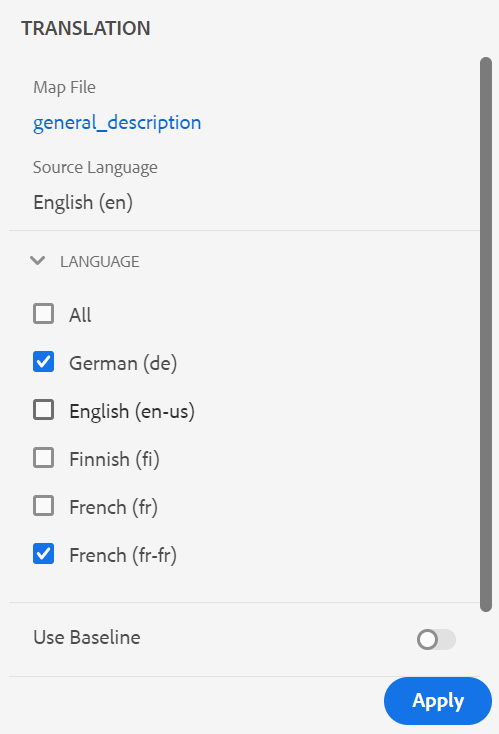

# Versão 4.1.x do Adobe Experience Manager Guides

Estas notas de versão abordam as instruções de atualização, os novos recursos e os aprimoramentos da versão 4.1.x do Adobe Experience Manager Guides (mais tarde chamada de *AEM Guides*).

## Atualizar para a versão mais recente

Você pode atualizar facilmente sua versão atual do AEM Guides para a versão 4.1.3. Antes de prosseguir com a atualização para a versão 4.1.3 do AEM Guides, você deve considerar os seguintes pontos:

* Se você estiver usando a versão 4.1 ou 4.1.x, é possível atualizar diretamente para a versão 4.1.3.
* Se você estiver usando a versão 4.0.x, será necessário atualizar para a versão 4.1 ou 4.1.x antes de atualizar para a 4.1.3.
* Se você estiver usando a versão 3.8.5, será necessário atualizar para a versão 4.0.x antes de atualizar para a 4.1.
* Se você estiver usando uma versão anterior à 3.8.5, consulte a seção de atualização no guia de instalação específico do produto.

Para obter detalhes, consulte [Instruções de atualização](assets/Adobe-Experience-Manager-Guides-Upgrade-Instructions-EN.pdf).

## 4.1.3 | Notas de versão

## Matriz de compatibilidade

Esta seção lista a matriz de compatibilidade dos aplicativos de software compatíveis com a versão 4.1.3 do AEM Guides.

### ADOBE EXPERIENCE MANAGER

**Não UUID**
Versão 6.5 Service Pack 13, 12, 11 ou 10

**UUID**
Versão 6.5 Service Pack 13, 12, 11 ou 10

Para obter mais detalhes, consulte a seção Technical requirements no guia Install and configure Adobe Experience Manager Guides.

### FRAMEMAKER e FRAMEMAKER PUBLISHING SERVER

| Versão | FMPS 2020 | FMPS 2019 | Fm 2020 | Fm 2019 |
| --- | --- | --- | --- | --- |
| 4.1.3 (Não UUID) | 2020.2 ou superior* | 2019 | 2020.3 ou superior | 2019.8 (atualização mais recente) |
| 4.1.3 (UUID) | 2020.2 ou superior* | Não compatível | 2020.4 ou superior | Não compatível |
| | | | |

*A linha de base e as condições criadas no AEM são compatíveis com as versões do FMPS a partir de 2020.2.

### Conector de oxigênio

| Versão | Janelas do conector Oxygen | Conector Oxygen Mac | Editar no Oxygen Windows | Editar no Oxygen Mac |
| --- | --- | --- |--- |--- |
| 4.1.3 (Não UUID) | 2.0 | 2.0 | 1,6 | 1,6 |
| 4.1.3 (UUID) | 2,7 | 2,7 | 2,3 | 2,3 |
|  |  |   |

## Problemas corrigidos

O erro corrigido está listado abaixo:

* O Editor da Web carrega a página em branco intermitentemente. (10678)

## 4.1.2 | Notas de versão

## Matriz de compatibilidade

Esta seção lista a matriz de compatibilidade dos aplicativos de software compatíveis com a versão 4.1.2 do AEM Guides.

### ADOBE EXPERIENCE MANAGER

**Não UUID**
Versão 6.5 Service Pack 13, 12, 11 ou 10

**UUID**
Versão 6.5 Service Pack 13, 12, 11 ou 10

Para obter mais detalhes, consulte a seção Technical requirements no guia Install and configure Adobe Experience Manager Guides.

### FRAMEMAKER e FRAMEMAKER PUBLISHING SERVER

| Versão | FMPS 2020 | FMPS 2019 | Fm 2020 | Fm 2019 |
| --- | --- | --- | --- | --- |
| 4.1.2 (Não UUID) | 2020.2 ou superior* | 2019 | 2020.3 ou superior | 2019.8 (atualização mais recente) |
| 4.1.2 (UUID) | 2020.2 ou superior* | Não compatível | 2020.4 ou superior | Não compatível |
| | | | |

*A linha de base e as condições criadas no AEM são compatíveis com as versões do FMPS a partir de 2020.2.

### Conector de oxigênio

| Versão | Janelas do conector Oxygen | Conector Oxygen Mac | Editar no Oxygen Windows | Editar no Oxygen Mac |
| --- | --- | --- |--- |--- |
| 4.1.2 (Não UUID) | 2.0 | 2.0 | 1,6 | 1,6 |
| 4.1.2 (UUID) | 2,7 | 2,7 | 2,3 | 2,3 |
|  |  |   |

## Problemas corrigidos

Os bugs corrigidos em várias áreas estão listados abaixo:

* Ao selecionar todos os perfis de pasta, um perfil de pasta invisível (que está incorreto) é exibido. (10393)
* A criação de linha de base não escolhe a versão mais recente quando o fuso horário do usuário é diferente do fuso horário do servidor. (10336)
* O atalho Control+F não abre o modal de pesquisa do navegador no Console do Assets após a instalação do AEM Guides 4.1. (10339)
* Ocorre um erro de criação de linha de base para o tópico que tem a referência a uma pasta. (10383)
* A guia Predefinições de saída mostra uma tela em branco intermitentemente e, em alguns casos, predefinições não editáveis são exibidas. (10390)
* O gerenciamento de espaço de chave está levando a exceções e erros. (10449)

### Problemas conhecidos com a solução alternativa

* A linha de base exportada durante a tradução não carrega na guia Linha de base do editor.

  **Solução alternativa**: use a guia de linha de base do painel de mapa DITA.

## 4.1 | Notas de versão

Estas notas de versão abordam as instruções de atualização, os novos recursos e os aprimoramentos da versão 4.1.x do Adobe Experience Manager Guides (mais tarde chamada de *AEM Guides*).

## Matriz de compatibilidade

Esta seção lista a matriz de compatibilidade dos aplicativos de software compatíveis com a versão AEM Guides 4.1.

### ADOBE EXPERIENCE MANAGER

**Não UUID**
Versão 6.5 Service Pack 13, 12, 10 ou 11

**UUID**
Versão 6.5 Service Pack 13, 12, 10 ou 11

Para obter mais detalhes, consulte a seção Technical requirements no guia Install and configure Adobe Experience Manager Guides.

### FRAMEMAKER e FRAMEMAKER PUBLISHING SERVER

| Versão | FMPS 2020 | FMPS 2019 | Fm 2020 | Fm 2019 |
| --- | --- | --- | --- | --- |
| 4.1 (Não UUID) | 2020.2 ou superior* | 2019 | 2020.3 ou superior | 2019.8 (atualização mais recente) |
| 4.1 (UUID) | 2020.2 ou superior* | Não compatível | 2020.4 ou superior | Não compatível |
| | | | |

*A linha de base e as condições criadas no AEM são compatíveis com as versões do FMPS a partir de 2020.2.

### Conector de oxigênio

| Versão | Janelas do conector Oxygen | Conector Oxygen Mac | Editar no Oxygen Windows | Editar no Oxygen Mac |
| --- | --- | --- |--- |--- |
| 4.1 (Não UUID) | 2.0 | 2.0 | 1,6 | 1,6 |
| 4.1 (UUID) | 2,7 | 2,7 | 2,3 | 2,3 |
|  |  |  |

## Novos recursos e melhorias

O AEM Guides fornece muitos aprimoramentos e novos recursos na versão 4.1:

### Publicação de PDF nativo

O suporte para a criação de um PDF nativo também foi adicionado na versão 4.1 do AEM Guides. Um novo mecanismo de publicação foi introduzido com os seguintes recursos:
* Criar um modelo CSS
* Criar modelos de página diferentes
* Criar modelos de PDF compreendendo CSS e modelos de página
* Conteúdo do mapa e do tópico do Publish no formato PDF

### Suporte para caminho do site da base de dados de conhecimento na publicação baseada em artigo

O AEM Guides fornece o recurso de publicação baseado em artigos para gerar de forma incremental uma saída de um ou mais tópicos ou publicar seu conteúdo em uma plataforma da base de conhecimento. Com a versão 4.1, você tem uma opção adicional para escolher o caminho do site da Base de conhecimento no qual o tópico/mapa precisa ser publicado. Após selecionar o caminho, a saída é gerada no caminho especificado.

### Editor da Web aprimorado

* **Resolução de chave aprimorada**

Uma referência de chave de conteúdo DITA insere uma parte do conteúdo de um tópico em outro. Ele usa uma chave para localizar o conteúdo. As principais referências associadas a um tópico DITA precisam ser resolvidas. O mapa raiz selecionado tem a precedência mais alta para resolver referências principais.

Agora, as principais referências são resolvidas com base no mapa raiz definido na seguinte ordem de prioridade:

1. Preferências de usuário
1. Painel Exibição de mapa
1. Perfil da pasta

Para obter mais detalhes, consulte a seção *Resolver referências de chave* no guia Uso do Adobe Experience Manager Guides.

* **Adicionar um painel personalizado no painel esquerdo**

Agora é possível adicionar um painel personalizado no painel esquerdo do Editor da Web. Você pode usar um painel personalizado para várias finalidades, como fornecer ajuda ou fazer o teste de um projeto. Se um painel personalizado foi configurado, ele também aparece na lista de painéis nas **Configurações do Editor**. Você pode alternar o botão para mostrar ou ocultar o painel personalizado.

* **Capacidade de alterar o estado dos tópicos do documento em um mapa DITA**

Agora é possível alterar facilmente o estado do documento de tópicos selecionados em um mapa DITA. Você também pode abrir e editar as propriedades dos tópicos selecionados em um mapa DITA no menu **Mais Opções**, na parte inferior do painel Exibição de Mapa.

* **Informações de versão exibidas no modo de Visualização**

O Editor da Web ajuda você a gerenciar suas versões. Agora você também pode ver a versão do tópico ativo ou o mapa DITA no canto superior direito da guia Arquivo do tópico no modo Visualização de um tópico.

* **Comportamento de atualização aprimorado do Editor da Web**

Os seguintes aprimoramentos estão disponíveis com a operação de atualização do navegador no Editor da Web:

* Agora você obtém o suporte para atualizar o navegador enquanto edita seu
conteúdo no Editor da Web. Se você clicar no ícone de atualização do navegador enquanto um ou mais arquivos
as alterações não salvas forem abertas para edição, você será solicitado a salvar seus arquivos ou cancelar a ação de atualização.

* Mesmo ao atualizar o navegador, as exibições do painel esquerdo e do painel direito são mantidas.

* O tópico ativo ou mapa DITA é reaberto na área de edição de conteúdo.

* **Criar mapas com base em modelos personalizados**

Agora você tem o recurso poderoso para criar modelos de mapa personalizados. Você pode usá-los para criar mapas DITA juntamente com os modelos de tópico e de mapa referenciados no modelo de mapa.

Também é possível consultar outros modelos de mapa e modelos de tópico do modelo de mapa personalizado. Os modelos de mapa referenciados podem se referir a vários modelos de mapa, modelos de tópico, tópicos, mapas, imagens, vídeos e outros ativos.

O modelo de mapa personalizado pode ajudá-lo a replicar com facilidade os modelos de mapa e toda a estrutura de pastas indicada. Esses modelos personalizados são especialmente úteis para criar e recriar vários mapas que têm estruturas e referências recursivas.

* **Suporte a esquemas**
&quot;Esquematron&quot; refere-se a uma linguagem de validação baseada em regras usada para definir testes para um arquivo XML. Usando um arquivo de Esquematron, você pode definir determinadas regras e depois validá-las para um tópico DITA ou um mapa. O editor da Web é compatível com arquivos do Schematron. É possível importar os arquivos do Schematron e editá-los no Editor da Web. O suporte ao Schematron no Editor da Web ajuda a validar os arquivos em relação a um conjunto de regras e a manter a consistência e a correção nos tópicos.

* **Caixa de diálogo aprimorada no fechamento do arquivo**

O AEM Guides solicita que você salve suas alterações e desbloqueie os arquivos bloqueados ao tentar fechar um arquivo aberto no Editor da Web. Os prompts são exibidos com base nas configurações **Solicitar check-in ao fechar** e **Solicitar nova versão ao fechar** definidas pelo administrador.

Com base na configuração, você tem a opção de salvar as alterações e criar uma nova versão do documento. Ou você também pode fazer check-in do arquivo e salvar as alterações na versão atual.

Para obter mais detalhes, consulte a seção *Cenários de fechamento e salvamento de arquivos* no guia Uso do Adobe Experience Manager Guides.* O recurso **Inserir Palavra-chave** foi aprimorado. Agora é possível encontrar mais facilmente uma Palavra-chave a ser inserida, pois as palavras-chave são listadas em ordem alfabética. Você também pode pesquisar palavras-chave digitando uma string de pesquisa na caixa Pesquisar.

* **Suporte para documentos do Markdown**
O Markdown é uma linguagem de marcação simples que pode ajudar você a adicionar elementos de formatação a documentos de texto simples. O Editor da Web permite usar documentos do Markdown (.md) junto com seus documentos DITA. Você pode criar e visualizar facilmente um documento do Markdown no Editor da Web e também adicioná-lo ao arquivo de mapa por meio do editor de mapa DITA.  Para obter mais detalhes, consulte a seção *Documentos do Author Markdown do Editor da Web*, no guia Uso do Adobe Experience Manager Guides.

* **Capacidade de configurar uma exibição de marcas padrão**
Se um usuário ativar a Exibição de tags no Editor da Web, ela permanecerá ativada mesmo nas sessões.  Isso significa que não é necessário ativar a Exibição de tags novamente para acessá-la posteriormente. Seu administrador pode configurar o estado padrão para a exibição de tags no editor da Web. O valor padrão para a Exibição de tags da sessão de um novo usuário é determinado pela propriedade tagsView no arquivo ui_config.json.

* Agora, na Exibição do repositório, os arquivos são carregados em lotes. Todos os arquivos presentes no principal ou `/content/dam folder` estão listados. Mas, a partir do próximo nível ou da pasta secundária, 75 arquivos são carregados de cada vez. Esse carregamento em lote é eficiente, e você pode acessar os arquivos mais rapidamente em comparação ao carregamento de todos os arquivos existentes em uma pasta.

### Novo painel Linha de base

A versão 4.1 do AEM Guides fornece o recurso de linha de base integrado ao Editor da Web. Agora você pode criar linhas de base no Editor da Web e usá-las para publicar ou traduzir tópicos de diferentes versões.

**Observação**: para um sistema atualizado, atualize o **ui_config.json** mais recente para o Perfil de Pasta.

Use este recurso para criar uma linha de base com uma versão específica dos tópicos disponíveis em uma data e hora específicas. Além disso, você obtém o suporte da API para criar ou atualizar uma linha de base com um rótulo definido para uma versão de tópicos.

Você pode pesquisar os arquivos com base nos nomes ou no local dos arquivos. Você também pode filtrar os tópicos a serem exibidos na janela de edição da linha de base e classificá-los com base em colunas específicas.

O desempenho do processo de criação da linha de base foi melhorado. O processo para criar linhas de base é assíncrono, assim, você pode continuar editando outros arquivos no Editor da Web enquanto a linha de base está sendo criada. Para obter mais detalhes, consulte *Criar e gerenciar linhas de base do Editor da Web* no guia Usando o Adobe Experience Manager Guides.

Observação: A guia Linha de Base no painel de mapa fica oculta por padrão. O administrador pode habilitar a guia Linha de base no painel do mapa.

* O parâmetro de linha de base nas APIs para baixar o mapa agora usa o título da linha de base para recuperar o conteúdo com versão.

### Processo de tradução aprimorado

* **Capacidade de criar um projeto de tradução de escopo**
Se precisar criar somente o escopo para que um projeto seja traduzido, você pode selecionar **Criar um novo projeto de tradução de escopo**. Isso não enviará as cópias para tradução e o status original da tradução dos arquivos será mantido.

* A lista **Idiomas** exibe as pastas de idioma junto com seus códigos de idioma. Por exemplo, francês (fr) e alemão (de).

Para obter mais detalhes sobre tradução, consulte a seção *Traduzir documentos do Editor da Web* em Uso do guia do Adobe Experience Manager Guides.

### Publicação aprimorada

* Você também pode acessar o **Painel do Publish** na guia Saídas enquanto gera a saída do painel do mapa. Uma lista de todas as tarefas de publicação ativas está disponível no Painel do Publish.

* No painel de mapa, é possível selecionar vários arquivos DITAVAL para gerar conteúdo condicional. É possível manter a ordem dos arquivos adicionando ou excluindo arquivos. Você também pode passar o mouse sobre o nome do arquivo para ver o caminho no repositório AEM onde o arquivo está armazenado.

* Linhas de base foram honradas para os metadados de saída do site AEM. Você também pode processar as propriedades de uma versão de linha de base como metadados. Se nenhuma linha de base for definida, as propriedades da versão mais recente serão processadas como metadados.

* As opções **Nome do Arquivo** e **Argumentos de Linha de Comando DITA-OT** foram adicionadas para predefinições de HTML5, EPUB e Saída personalizada. Agora você pode especificar o nome do arquivo com o qual deseja salvar a saída. Você também pode especificar os argumentos adicionais que deseja que o DITA-OT processe ao gerar saída.

### Mapear painel

Quando você seleciona baixar o mapa DITA, a solicitação é enfileirada e você recebe uma notificação quando o mapa estiver pronto para download. Você pode optar por baixar o arquivo de mapa imediatamente ou baixá-lo posteriormente a partir do link fornecido na Caixa de entrada de notificação do AEM.

### Outras melhorias de recursos

* O AEM Guides agora é compatível com o Oxygen XML Author versão 24.1.
* O parâmetro de linha de base nas APIs para baixar o mapa agora usa o título da linha de base para recuperar o conteúdo com versão.

### Recurso obsoleto

O AEM Guides não oferece mais suporte à geração de formato de saída DITA para documentos do FrameMaker. Essa opção DITA também foi removida das Predefinições de saída do painel Mapa.

## Problemas corrigidos

Os bugs corrigidos em várias áreas estão listados abaixo:

* O suporte à criação não está disponível como uma alternativa para a referência baseada em caminho de arquivo para publicação. (8076)
* O pacote de complemento DITA impede a detecção de ativos duplicados do DAM. (8417)
* Após o check-in de um documento do Oxygen para o AEM, o conteúdo em japonês no documento é substituído por pontos de interrogação (???). (9124)
* A atualização de arquivos obtidos não está funcionando no logon com autenticação da Web no Oxygen. (9179)
* O check-out do arquivo não é feito quando aberto no Oxygen. (9192)
* Após o check-in de um documento do Oxygen para o AEM, o conteúdo em japonês no documento é substituído por pontos de interrogação (???). (9276)
* A autenticação da Web não está funcionando no Oxygen. (9296)
* O recarregamento falha no Oxygen quando os arquivos já existem no AEM no mesmo local. (9328)
* Opção não disponível para a sincronização forçada do conteúdo entre o AEM e o sistema local. (9439)
* A ID não é gerada automaticamente para o elemento adicionado usando a caixa de diálogo **Inserir Conteúdo Reutilizável** da barra de ferramentas secundária. (5826)
* Nenhuma caixa de diálogo de confirmação é exibida ao fazer upload de uma imagem com o mesmo nome de um arquivo existente, por meio do editor. (6011)
* Um espaço sem quebra não disponível no palete de caracteres. (7523)
* A lista de elementos (Alt+Enter) aparece esmaecida no tema Escuro/Escuro. (7913)
* A versão não é atualizada ao salvar a revisão de um tópico na barra de ferramentas do painel de mapa. (8228)
* xref não pode ser inserido mesmo em locais válidos. (8354)
* A operação &#39;getversionlabels&#39; tem limitações e não fornece o desempenho esperado. (8513)
* Ocorrem problemas com a caixa de diálogo de confirmação ao fechar um arquivo bloqueado ou editado que não está aberto no editor no momento. (8692)
* Ocorre um erro ao adicionar um usuário como administrador no perfil da pasta quando a ID do usuário é numérica. (8908)
* O painel Tradução fica visível mesmo ao abrir o mapa DITA no Editor de mapa. (9053)
* O código de idioma não é exibido com o idioma no painel Tradução. (9108)
* As guias Tradução e Linha de base ficam visíveis por algum tempo no painel Mapa. (9146)
* Quando a tradução for concluída, uma versão adicional será criada para o ativo traduzido. (9310)
* A tradução aprovada não é integrada ao idioma de destino quando o código do idioma de destino contém cinco caracteres como `fr_ca`. (9357)
* O conteúdo traduzido é corrompido quando o código de idioma de destino criado é mencionado como `fr-fr, `, `en-us`. (9527)
* Ao carregar um mapa DITA que esteja fora da pasta de idioma, uma exceção é registrada no back-end.(9543)
* Não é possível criar o arquivo DITA usando o modelo DITA personalizado do editor. (7262)
* O mapa DITA é perdido ao publicar um mapa UUID DITA via FMPS. (7278)
* O AEM Guides não copia as propriedades não exclusivas de um ativo quando ele é copiado e colado. (8241)
* O nome de arquivo do mapa DITA não é convertido em minúsculas na criação. (8383)
* A descrição da tarefa de revisão não aparece na notificação por email que está sendo enviada quando uma nova tarefa de revisão está sendo atribuída. (8507)
* Baixar API do mapa | As pastas temporárias não são limpas em caso de erros no processo de download. (8523)
* `columnpreview.jsp` é dependente do SP.  (8543)
* Os trabalhos de saída com status como &quot;Aguardando&quot; ou &quot;Executando&quot; não são limpos no Painel do Publish.  (8569)
* Ícone padrão escolhido na geração de um relatório usando o botão Gerar, mesmo quando a propriedade do ícone é definida. (8573)
* Problemas ocorrem no processo de revisão durante a atualização de 3.8.X para 4.0. (8788)
* No painel Revisão do Editor da Web, se um nome de usuário for longo, os ícones para aceitar/rejeitar não serão exibidos claramente. (8793)
* A árvore de referência é interrompida após a remoção de um tópico e a execução de uma operação de movimentação. (8804)
* O DTD personalizado definido pelo usuário não tem precedência sobre o DTD DITA padrão incorporado no DITA-OT. (9104)
* A posição do realce está incorreta na exibição lado a lado. (9305)
* A nota de rodapé de uso por referência não rola até a seção de nota de rodapé na saída do site AEM. (9061)
* A ordem das notas de rodapé está incorreta na saída do site AEM. (9327)
* Os ativos DITA recém-criados sempre passam por check-out por outro usuário. (9387)
* O erro sempre é registrado na criação de novo conteúdo. (9388)
* A terceira tela no processo de criação da tarefa de revisão não mostra a lista de glossários. (4558)
* Referências UUID incorretas atribuídas ao carregar vários arquivos do Conector FrameMaker/Oxygen. (8269)
* A notificação por email não é enviada quando uma tarefa de revisão é reatribuída na Caixa de entrada. (8376)
* O segundo usuário administrador não pode ser adicionado como o primeiro usuário administrador a uma pasta. (8430)
* A caixa de diálogo **Aplicar rótulos** na guia Linha de Base não exibe rótulos na lista suspensa. (8455)
* Ao usar a publicação de linha de base com imagem como conref no tópico, a imagem não é publicada na saída. (8564)
* O recurso de limpeza de saída falhará se um grande número de nós de histórico de saída restantes estiverem presentes. (8568)
* No painel Histórico de versão, a seção versão atual mostra um carimbo de data e hora incorreto e modificado pelas informações. (8765)
* Linha de base não atualizada com base no rótulo definido. (8799)
* O erro ocorre quando os arquivos cuja pasta pai tem caracteres especiais no nome do arquivo são abertos no Oxygen (usando o botão **Editar no Oxygen**). (8918)
* O upload de arquivos do Oxygen para o AEM falha. (9157)
* Baixar o mapa com a linha de base inoperante se o conteúdo for movido para outra pasta. (9331)
* O Oxygen verifica uma versão incorreta de um tópico após uma reversão de versão no AEM. (9411)
* Pesquisar no painel Repositório e a caixa de diálogo Procurar topicref congela a tela quando o conteúdo é grande. (9432)
* Se a configuração **Criar nova versão para arquivo carregado** estiver ATIVADA, uma nova versão será criada ao reverter e salvar em qualquer nó congelado. (9473)
* Diferenças incorretas de carimbo de data e hora são exibidas na interface do usuário do Assets ao reverter uma versão de arquivo. (9480)
* O check-out dos arquivos é feito automaticamente ao reverter para qualquer versão. (9482)
* O ícone de bloqueio é exibido na visualização de repositório mesmo quando o arquivo é submetido a check-in pelo editor.  (5756)
* Não é possível adicionar elementos de primeiro plano e de segundo plano em um mapa usando a exibição Autor do Editor da Web. (7652)
* O modo de Visualização não oferece suporte ao atributo de processamento condicional `deliveryTarget` em DITA. (7685)
* Ao abrir um tópico de glossário no editor XML, o AEM força o salvamento, mesmo que ele não tenha sido modificado. (8105)
* A caixa de diálogo Inserir referências é aberta ao adicionar subjectref a um mapa usando a interface do usuário. (8212)
* Reutilizar falhas do painel de conteúdo ao pesquisar caracteres especiais `[` ou `*`.(8279)
* Ao criar Glossentry, o Editor da Web mostra o conteúdo como uma Nota. (8384)
* O Editor de XML remove a nova linha no bloco de código. (8522)
* Alternar entre o modo de origem e o modo de autor marca o tópico como sujo e requer que o conteúdo seja salvo novamente.(8524)
* Não é possível fechar um tópico desbloqueado. (8545)
* Não há opção para escolher o caminho da Base de dados de conhecimento nas predefinições de publicação baseadas em artigo. (8636)
* Os atributos estão ausentes ao adicionar um capítulo no bookmap usando a função Arrastar e soltar da exibição Favoritos. (8746)
* A caixa de diálogo Inserir palavra-chave não tem a capacidade de pesquisa e as palavras-chave não são listadas em ordem de classificação. (9094)
* Fazer uma pesquisa no Editor de XML faz com que a página congele. (9452)
* Os sites estão ausentes nas predefinições de AEM na guia Saída. (9567)
* Imagens SVG que não são renderizadas corretamente nos modos do autor do Editor XML. (9426)
* A linha de base não está sendo aplicada durante a publicação pelo Salesforce. (8953)
* A capacidade de limpar o mapa de roteiros das configurações de preferências do usuário não está presente. (8534)
