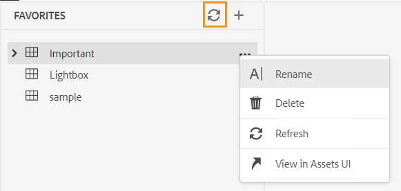

# Novidades da versão de junho de 2023 do Adobe Experience Manager Guides as a Cloud Service

Este artigo aborda os recursos novos e aprimorados da versão de junho de 2023 do Adobe Experience Manager Guides (mais tarde conhecido como *AEM Guides as a Cloud Service*).

Para obter mais detalhes sobre as instruções de atualização, a matriz de compatibilidade e os problemas corrigidos nesta versão, consulte as [Notas de versão](release-notes-2023-6-0.md).

## Relatório de Links quebrados no Editor da Web

O AEM Guides permite verificar a integridade geral dos documentos técnicos e gerar relatórios do Editor da Web. Agora, na versão de junho de 2023, o AEM Guides fornece o recurso para visualizar e corrigir links com falha. Esse é um relatório útil que ajuda a gerenciar links com falha. É possível visualizar facilmente os links corrompidos presentes no mapa DITA e corrigi-los.
{width="800" align="left"}

Depois de corrigir um link, ele não é exibido abaixo da lista de links quebrados.

Para obter mais detalhes, consulte [Exibir e corrigir links corrompidos](../user-guide/reports-web-editor.md#report-broken-links).

## Renomear e mover arquivos na visualização Repositório

Agora, você também pode renomear ou mover um arquivo do painel do repositório. Esse recurso é útil e ajuda a gerenciar os arquivos facilmente no painel Repositório. Você pode selecionar um arquivo e renomeá-lo ou movê-lo usando o menu **Opções** para o arquivo selecionado. O AEM Guides exibe uma mensagem de sucesso ao mover ou renomear um arquivo.

{width="650" align="left"}

Para obter mais detalhes sobre o menu Opções de um arquivo, consulte a descrição do recurso **Exibição do repositório** na seção [Painel esquerdo](../user-guide/web-editor-features.md#id2051EA0M0HS).

## Aprimoramentos de PDF nativo

### Adicionar uma marca d&#39;água à saída do PDF para documentos de rascunho

Agora você pode adicionar uma marca d&#39;água à saída em PDF do documento que ainda não foi aprovado. Essa marca d&#39;água não aparecerá se você gerar o PDF para o documento no estado de documento &#39;Aprovado&#39;. Por exemplo, você pode adicionar um Rascunho de marca d&#39;água para a saída de PDF.

Para obter mais detalhes, consulte [Adicionar uma marca d&#39;água à saída de PDF para documentos de rascunho](../native-pdf/use-javascript-content-style.md#watermark-draft-document).

### Suporte para variáveis de idioma

O AEM Guides oferece suporte para variáveis de idioma. Você pode usar variáveis de idioma para definir uma versão localizada dos rótulos prontos para uso como Observação, Cuidado e Aviso ou texto estático na saída de PDF.
Você pode adicionar as variáveis de idioma ou a versão localizada dos rótulos às seções apropriadas na saída de PDF e nos modelos de saída.

#### Variáveis de linguagem na saída do PDF

Você pode usar as variáveis de idioma para definir rótulos localizados para elementos como Nota, Cuidado e Aviso. Você pode atualizar o valor dessas variáveis em um ou mais idiomas e, em seguida, o valor localizado é escolhido automaticamente na saída do PDF.
Por exemplo, você pode apresentar o rótulo Observação na saída de PDF das seguintes maneiras:

* Inglês: Note
* Francês: Remarque
* Alemão: Hinweis

#### Variáveis de idioma nos modelos de saída

Se você quisesse criar a saída de PDF em vários idiomas, seria necessário criar diferentes modelos de PDF contendo texto localizado para cada idioma. Agora, com o recurso de variáveis de idioma, é necessário criar o modelo apenas uma vez. Em seguida, para qualquer texto estático que precise localizar, é possível criar variáveis de idioma correspondentes e usá-las no modelo.
É possível criar variáveis de idioma para textos mais longos, como uma frase inteira ou até mesmo um parágrafo. Também é possível aplicar estilos e usar a marcação HTML para formatar essas variáveis de idioma.

Para obter mais detalhes, consulte [Suporte para variáveis de idioma](../native-pdf/native-pdf-language-variables.md).

### Capacidade de usar metadados de AEM em layouts de PDF

Os metadados são a descrição ou definição do seu conteúdo. Esses metadados são armazenados no conteúdo do mapa DITA de origem.

Agora, no AEM Guides, também é possível selecionar as propriedades de metadados dos ativos e adicioná-las ao layout da página. Em seguida, o AEM Guides escolhe essas propriedades de metadados de seus ativos e as publica na saída de PDF.

{width="550" align="left"}

>[!NOTE]
>
> O AEM Guides também é compatível com as propriedades de metadados dos mapas DITA.

Para obter mais detalhes, consulte [Adicionar campos e metadados](../native-pdf/design-page-layout.md#add-fields-metadata).

## Aprimoramentos do esquema

### Usar instruções de relatório para verificar regras no Schematron

O AEM Guides agora também oferece suporte às instruções de relatório com o Schematron. Uma instrução de relatório gera uma mensagem quando uma instrução de teste é avaliada como verdadeira. Por exemplo, se você quiser que a descrição curta tenha 150 caracteres ou menos, poderá definir uma instrução de relatório para verificar os tópicos em que a descrição curta tem mais de 150 caracteres.

Para obter mais detalhes, consulte [Usar instruções assert e report para verificar as regras](../user-guide/support-schematron-file.md#schematron-assert-report).

### Usar expressões Regex

Também é possível usar expressões Regex para definir uma regra com a função matches() e executar a validação usando o arquivo Schematron.

Para obter mais detalhes, consulte [Usar expressões Regex](../user-guide/support-schematron-file.md#schematron-assert-report).

### Definir padrões abstratos

O AEM Guides também oferece suporte a padrões abstratos no Schematron. Você pode definir padrões abstratos genéricos e reutilizar esses padrões abstratos. Padrões abstratos podem simplificar seu esquema Schematron e também ajudar a gerenciar e atualizar sua lógica de validação.

Para obter mais detalhes, consulte [Definir padrões abstratos](../user-guide/support-schematron-file.md#schematron-abstract-patterns).

## Navegar do Editor da Web para a página inicial do AEM

Agora você pode navegar facilmente do Editor da Web para a página inicial do AEM.

{width="800" align="left"}

* Clique no ícone **Guias** ( ) para voltar à página de Navegação por AEM.

Para obter mais detalhes, consulte [página de Navegação por AEM](../user-guide/web-editor-launch-editor.md#id2056BG00RZJ).

## Lidar com definições hierárquicas de definições e enumerações de assunto

O AEM Guides vem com o recurso poderoso para criar mapas de esquema de Assunto, que são uma forma especializada de mapas DITA usados para definir assuntos taxonômicos e valores controlados. Agora, o AEM Guides também permite definir a definição de assunto em um mapa e as definições de enumeração em outro mapa. Em seguida, você pode adicionar a referência do mapa e usar o esquema de assunto.
As referências de enumeração de assunto são resolvidas no mesmo mapa ou no mapa referenciado.

Para obter mais detalhes sobre como manipular definições hierárquicas de definições de assunto e enumerações, consulte a descrição do recurso **Esquema de assunto** na seção [Painel esquerdo](../user-guide/web-editor-features.md#id2051EA0M0HS).

## Suporte para o formato XLIFF na tradução

O AEM Guides também oferece suporte ao formato XML Localization Interchange File Format (XLIFF) na tradução. Agora você também pode optar por **Criar um novo projeto de tradução XLIFF** para converter o conteúdo XML no formato XLIFF.
Usando esse formato, você pode exportar o conteúdo para o formato XLIFF padrão do setor e, em seguida, fornecer o mesmo aos fornecedores de tradução. Para obter mais detalhes, consulte [Criar um projeto de tradução](../user-guide/translate-documents-web-editor.md#create-translation-project).

{width="350" align="left"}

## Painel Favoritos aprimorado

O AEM Guides ajuda você a criar uma coleção ou lista de favoritos de seus arquivos e pastas e usá-los facilmente. Agora o menu **Opções** também está disponível no painel **Favoritos**. Você pode renomear ou excluir a coleção selecionada no menu **Opções**. Você pode selecionar a opção **Atualizar** para obter uma lista atualizada de arquivos ou pastas do repositório. Também é possível visualizar o conteúdo da pasta na interface do usuário do Assets.

{width="650" align="left"}

>[!NOTE]
>
> Você também pode atualizar a lista usando o ícone **Atualizar** na parte superior.

Para obter mais detalhes sobre o menu **Opções** de uma coleção Favoritos, consulte a descrição do recurso **Favoritos** na seção [Painel Esquerdo](../user-guide/web-editor-features.md#id2051EA0M0HS).

## Mudar para o tema do sistema

Agora, também é possível usar o tema do dispositivo. Usando as **Preferências do Usuário**, você pode configurar o AEM Guides para alternar automaticamente entre temas claros e escuros com base no tema do seu dispositivo.

{width="550" align="left"}

Para obter mais detalhes, consulte a descrição do recurso **Preferências do Usuário** na seção [Barra de ferramentas principal](../user-guide/web-editor-features.md#id2051EA0G05Z).
