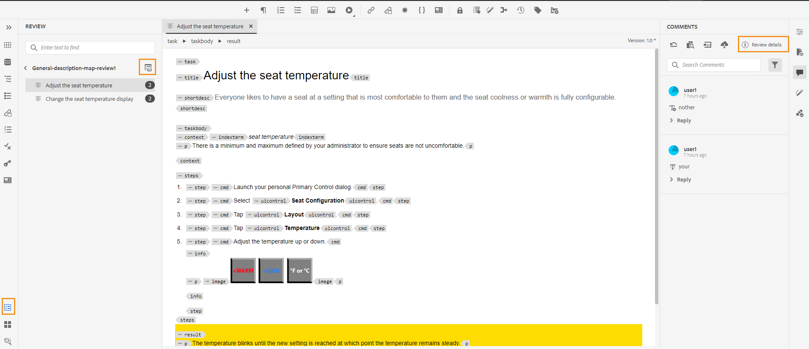

# Novidades da versão de julho de 2023 do Adobe Experience Manager Guides as a Cloud Service

Este artigo aborda os recursos novos e aprimorados da versão de julho de 2023 do Adobe Experience Manager Guides (mais tarde conhecido como *AEM Guides as a Cloud Service*).

Para obter mais detalhes sobre as instruções de atualização, a matriz de compatibilidade e os problemas corrigidos nesta versão, consulte as [Notas de versão](release-notes-2023-7-0.md).

## Conecte-se a uma fonte de dados e insira dados em seus tópicos

Agora você pode se conectar rapidamente às fontes de dados usando conectores prontos para uso da AEM Guides. A conexão com uma fonte de dados permite manter suas informações em sincronia com a fonte, e qualquer atualização nos dados é refletida automaticamente, tornando o AEM Guides um verdadeiro hub de conteúdo. Esse recurso ajuda a economizar tempo e esforço para adicionar ou copiar os dados manualmente.

Agora, o AEM Guides permite que o administrador configure os conectores prontos para uso para bancos de dados JIRA e SQL (MySQL, PostgreSQL, SQL Server, SQLite). Eles também podem adicionar outros conectores estendendo as interfaces padrão.

Depois de adicionado, você pode exibir os conectores configurados listados no painel **Fontes de Dados** no Editor da Web.

{width="300" align="left"}

Você pode criar um gerador de snippet de conteúdo para buscar os dados de uma fonte de dados conectada. Em seguida, você pode inserir os dados em seus tópicos e editá-los.

Depois de criar um gerador de snippet de conteúdo, você pode reutilizá-lo para inserir os dados em qualquer tópico. Para obter mais detalhes, exiba [Inserir um trecho de conteúdo da sua fonte de dados](../user-guide/web-editor-content-snippet.md).

## Painel de revisão para mostrar os projetos de revisão e as tarefas de revisão ativas

Agora, o AEM Guides torna suas análises mais simples. Ele fornece o painel Revisões no Editor da Web. O painel Revisões exibe todos os projetos de revisão e as tarefas de revisão ativas nos projetos de revisão dos quais você faz parte.

Como autor, esse recurso ajuda você a abrir facilmente as tarefas de revisão, exibir os comentários e endereçar rapidamente os comentários em uma exibição centralizada.
{width="800" align="left"}
Para obter mais detalhes, consulte a descrição do recurso **Revisão** na seção [Painel esquerdo](../user-guide/web-editor-features.md#id2051EA0M0HS).

## Melhorias na coleção de mapas

Uma Coleção de mapas ajuda a organizar vários mapas e a publicá-los em lote. Muitos aprimoramentos novos foram feitos na Coleção de mapas:

- Agora, você também pode adicionar predefinições de saída de PDF nativo a uma coleção de mapas e usá-las para gerar a saída de PDF.
- É possível visualizar as predefinições de perfil global e de pasta criadas pelo administrador e usá-las para gerar a saída do PDF.
- Agora, é possível não apenas selecionar uma predefinição individual, mas também ativar todas as predefinições de perfil de pasta para um mapa DITA de uma só vez.
  {width="800" align="left"}

Para obter mais detalhes, consulte [Usar Coleção de Mapas para geração de saída](../user-guide/generate-output-use-map-collection-output-generation.md).

## Capacidade de acessar arquivos de HTML temporários ao gerar a saída de PDF nativa

Agora, o AEM Guides permite baixar os arquivos de HTML temporários criados ao gerar a saída de PDF nativa. Nas configurações de predefinição de saída, selecione a opção para baixar os arquivos temporários.  O AEM Guides permite baixar os arquivos temporários criados ao gerar a saída usando essa predefinição.

Esse recurso permite obter melhores insights sobre o processo de geração, com acesso a estilos e layouts provisórios, e ajuda a corrigir ou alterar os estilos CSS de acordo com os requisitos.

{width="800" align="left"}

Para obter mais detalhes, consulte [Criar uma predefinição de saída de PDF](../web-editor/native-pdf-web-editor.md#create-output-preset).

## Publicação baseada em microsserviços para gerar HTML5 e saída personalizada

O novo microsserviço de publicação permite executar grandes cargas de trabalho de publicação simultaneamente no AEM Guides as a Cloud Service e aproveitar a plataforma Adobe I/O Runtime sem servidor, líder do setor. Agora, usando o microsserviço, você também pode gerar o HTML5 e a saída Personalizada.
Você pode executar várias solicitações de publicação e obter um desempenho aprimorado para gerar esses formatos de saída.
Para obter mais detalhes, consulte [Configurar publicação baseada em microsserviço para o AEM Guides as a Cloud Service](../knowledge-base/publishing/configure-microservices.md).

## Exibir detalhes da versão do AEM Guides nas informações Sobre

Agora, juntamente com as informações de AEM **Sobre**, você também pode exibir os detalhes da versão do AEM Guides. Você pode exibir os detalhes da versão atual na opção **Sobre** da **Ajuda** da página Navegação por AEM.

(width=&quot;800&quot; align=&quot;left&quot;)
