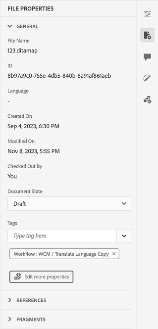

# Novidades da versão de dezembro de 2023 do Adobe Experience Manager Guides as a Cloud Service

Este artigo aborda os recursos novos e aprimorados da versão de dezembro de 2023 do Adobe Experience Manager Guides (mais tarde conhecido como *Guias do Experience Manager as a Cloud Service*).

Para obter mais detalhes sobre as instruções de atualização, a matriz de compatibilidade e os problemas corrigidos nesta versão, consulte [Notas de versão](release-notes-2023.12.0.md).

## Usar variáveis na saída do PDF

Você pode usar variáveis para inserir e gerenciar dinamicamente informações reutilizáveis. Os Guias de Experience Manager ajudam a criar, editar e pré-visualizar variáveis enquanto você gera a saída de PDF. Você pode modificar rapidamente os valores das variáveis e tornar seus documentos portáteis e fáceis de atualizar.

{width="800" align="left"}

*Criar e gerenciar variáveis no Editor da Web.*

Você também pode criar conjuntos de variáveis que substituam os valores padrão e atribuam valores alternativos às variáveis. Insira essas variáveis no layout da página e use o mesmo layout de PDF, não é necessário criar layouts separados para cada conjunto de valores. Por exemplo, é possível criar um conjunto de variáveis para cada versão do produto. Esse conjunto de variáveis pode consistir em variáveis para diferentes detalhes do produto, como nome do produto, número da versão e data de lançamento. Em seguida, é possível adicionar valores diferentes para essas variáveis.

**Conjunto de variáveis 1: Adobe-set1**

* Nome do produto: Guias do Experience Manager
* VersionNumber: 2311
* Data de lançamento: 02/11/2023

**Conjunto de variáveis 2: Adobe-set2**

* Nome do produto: Guias do Experience Manager
* VersionNumber: 2310
* Data de lançamento: 27/09/2023

*Gere a saída de PDF usando variáveis no layout de PDF.*

Aplique estilos e use a marcação HTML para formatar as variáveis.  Você também pode atualizar rapidamente os valores de qualquer variável sempre que necessário e gerar novamente a saída. Por exemplo, se você precisar atualizar os detalhes de uma versão, poderá editar o valor da versão na variável VersionNumber e gerar novamente a saída.

Saiba mais sobre como usar [variáveis na saída do PDF](../native-pdf/native-pdf-variables.md).

## Experiência remodelada para editar os atributos

Agora você obtém uma experiência renovada para adicionar ou editar os atributos de um elemento da **Propriedades de conteúdo** no Editor da Web.

{width="300" align="left"}

*Adicione atributos no painel Propriedades de conteúdo.*

Também é possível editar e excluir facilmente os atributos.

Para obter mais detalhes, consulte **Propriedades de conteúdo** descrição do recurso na [Painel direito](../user-guide/web-editor-features.md#id2051EB003YK) seção.

## Editar metadados durante a criação

Agora, durante a criação, é possível atualizar as tags de metadados do arquivo usando a lista suspensa do **Propriedades do arquivo** no painel direito. Também é possível selecionar **Editar mais propriedades** para atualizar mais metadados.

{width="300" align="left"}

*Atualize os metadados e edite as propriedades do arquivo no painel direito.*

Para obter mais detalhes, consulte **Propriedades do arquivo** descrição do recurso na [Painel direito](../user-guide/web-editor-features.md#id2051EB003YK) seção.

## Capacidade de publicar conteúdo na base de conhecimento do ServiceNow

Agora você também pode publicar seu conteúdo na plataforma da base de conhecimento ServiceNow.

Com a versão de dezembro de 2023, como administrador, você pode criar um perfil de publicação para o servidor da base de conhecimento ServiceNow. Em seguida, como autor ou editor, você pode escolher esse perfil de publicação do ServiceNow na predefinição de saída para publicar a saída na base de conhecimento especificada.

Esse recurso ajuda a publicar conteúdo, como texto, vídeos e imagens, na plataforma da base de conhecimento ServiceNow e manter um repositório abrangente.

{width="300" align="left"}

*Criar uma predefinição de saída para a base de conhecimento ServiceNow.*

Saiba mais sobre o [Knowledge base](../user-guide/generate-output-knowledge-base.md) predefinições de saída.

## Painel de coleção do mapa aprimorado

O Experience Manager Guides fornece um painel de coleção de mapa aprimorado. Em uma coleção de mapas, é possível configurar rapidamente as propriedades de metadados em massa para os mapas DITA. Esse recurso é útil, pois não é necessário atualizar as propriedades de metadados de cada mapa DITA individualmente.

Agora é possível exibir o nome do arquivo do mapa DITA. Também é possível exibir as Linhas de Base. Isso ajuda a localizar rapidamente a linha de base usada para uma predefinição.

{width="800" align="left"}

*Exiba, edite e gere saída a partir do painel da coleção de mapas.*

Saiba como [usar a Coleção de mapas para geração de saída](../user-guide/generate-output-use-map-collection-output-generation.md).

## Exibir atributos-chave na Exibição de Mapa

Ao definir atributos principais para o tópico ou referências de mapa, você também pode visualizar o título, o ícone correspondente e a chave no painel esquerdo. A chave é exibida como `key=<key-name>`.

Para obter mais detalhes, consulte **Exibição de mapa** descrição do recurso na [Painel esquerdo](../user-guide/web-editor-features.md#id2051EA0M0HS) seção.

 {width="300" align="left"}

*Exiba o atributo de chave na Exibição de Mapa.*

## Capacidade de duplicar uma linha de base com base no rótulo

Os Guias do Experience Manager agora oferecem uma experiência do usuário aprimorada para criar as linhas de base do Editor da Web.\
 {width="300" align="left"}
*Criar linha de base no Editor da Web.*

Também permite duplicar uma linha de base com base no rótulo. A versão de referência é separada com base no rótulo fornecido (se existir) durante a duplicação, ou então escolhe a versão da linha de base duplicada.

 {width="300" align="left"}

*Duplique uma linha de base com base em um rótulo ou crie uma cópia exata.*

Saiba como [criar e gerenciar linhas de base no Editor da Web](../user-guide/web-editor-baseline.md).

## Processo aprimorado para a criação de coleção de mapas de ativação em massa

O processo de criação de uma coleção de mapas de ativação em massa agora é mais harmonioso. Agora, quando a página Resultados da ativação for exibida, você poderá visualizar os resultados da ativação e os logs.
Para obter mais detalhes, consulte [Criar uma coleção de mapas de ativação em massa](../user-guide/conf-bulk-activation-create-map-collection.md).

## Resolver links entre mapas na saída do site AEM

Links entre mapas (XREF com peer de escopo) sendo renderizados na saída do site AEM agora são resolvidos de acordo com o título do arquivo do conjunto de contexto de publicação do mapa gerado.

## Configure o URL da saída do site AEM para usar o título do documento

O Experience Manager Guides permite que você, como administrador, configure o URL da saída do site AEM. Se o nome do arquivo não existir ou contiver todos os caracteres especiais, você pode configurar o para substituí-los por um separador no URL da saída do site AEM. Você também pode substituí-los pelo nome do primeiro tópico filho. Saiba como [configure o URL da saída do site AEM para usar o título do documento](../cs-install-guide/conf-output-generation.md#configure-the-url-of-the-aem-site-output-to-use-the-document-title).

