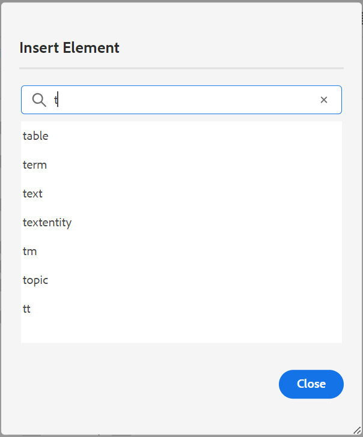
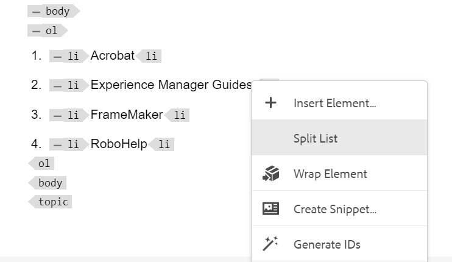

# Novidades da versão 2024.2.0

Este artigo aborda os recursos novos e aprimorados da versão 2024.2.0 do Adobe Experience Manager Guides.

Para obter a lista de problemas corrigidos nesta versão, consulte [Problemas corrigidos na versão 2024.2.0](fixed-issues-2024-2-0.md).

Saiba mais sobre [as instruções de atualização para a versão 2024.2.0](upgrade-instructions-2024-2-0.md).

## Sugestões inteligentes habilitadas por IA para adicionar referências de conteúdo durante a criação de conteúdo

Agora, você pode aprimorar sua jornada de criação com as Sugestões inteligentes, um novo recurso baseado em IA no Editor da Web. Enquanto você cria seu conteúdo, esse recurso inteligente fornece sugestões em tempo real para referências de conteúdo, melhorando seu fluxo de trabalho, adicionando precisão e garantindo uma eficiência inigualável.

Para manter o conteúdo correto e consistente, a pesquisa e as sugestões estão limitadas ao conteúdo de propriedade da organização e correspondem estreitamente às palavras-chave que você pesquisa.

 {width="800"}

*Exiba as Sugestões Inteligentes para localizar e adicionar referências de conteúdo correspondentes a partir do seu repositório de conteúdo.*

Você também pode comparar o conteúdo atual com conteúdo semelhante nos outros tópicos. Em seguida, você pode selecionar facilmente as partes do conteúdo de vários tópicos e adicioná-las como referências de conteúdo ao tópico atual. Adicionar as referências de conteúdo torna as atualizações mais gerenciáveis, especialmente em projetos de documentação maiores. Por exemplo, você está criando um folheto sobre os recursos mais recentes do seu produto. Nesse caso, você pode adicionar rapidamente as especificações atualizadas como referências de conteúdo dos documentos de recursos relacionados.

Usar esse recurso inteligente reduz o esforço manual de pesquisa de conteúdo relacionado e ajuda você a se concentrar na criação de novo conteúdo.  Também ajuda a manter a consistência e também facilita uma melhor colaboração em equipe.

Saiba mais sobre [Sugestões inteligentes habilitadas por IA para criar conteúdo](../user-guide/authoring-ai-based-smart-suggestions.md).

## Recurso de histórico de versão remodelado no Editor da Web

Agora, o Experience Manager Guides fornece um recurso aprimorado de histórico de versões que permite comparar as alterações feitas em um documento ao longo do tempo. Na nova visualização lado a lado, é possível comparar facilmente o conteúdo e os metadados da versão atual com qualquer versão anterior do mesmo documento. Também é possível exibir os rótulos e comentários das versões comparadas. Como administrador, você pode controlar os metadados de versão do tópico e seus valores a serem exibidos na caixa de diálogo **Histórico de Versão**.

{width="800"}
*Visualize as alterações nas diferentes versões de um tópico.*

Saiba mais sobre a descrição do recurso **Histórico de Versões** na seção [Painel Esquerdo](../user-guide/web-editor-features.md#id2051EA0M0HS).

## Experiência do usuário aprimorada no painel Tradução

O painel **Tradução** foi aprimorado.  Você pode exibir a lista **Idiomas disponíveis** e selecionar rapidamente a localidade em que deseja traduzir o projeto. Com uma única seleção, você também pode escolher **Selecionar tudo** para traduzir seu projeto para todos os idiomas disponíveis.

{width="300"}

*Selecione as localidades nas quais deseja traduzir o projeto. Escolha o padrão, a linha de base ou a versão mais recente dos arquivos para tradução.*

Saiba como [traduzir conteúdo](../user-guide/translation.md).

## Lógica de pesquisa aprimorada na caixa de diálogo Inserir elemento

Agora é possível encontrar facilmente os elementos na caixa de diálogo Inserir elemento.  Você pode digitar uma string na caixa de pesquisa e obter uma lista de todos os elementos válidos que começam com a string inserida.

Por exemplo, ao editar um parágrafo em que você deseja inserir um elemento, é possível pesquisar um caractere &quot;t&quot; para obter
todos os elementos válidos que começam com ‘t’.

{width="300"}

*Digite um caractere para procurar todos os elementos válidos que comecem com o caractere.*

Para obter mais detalhes, exiba a descrição do recurso **Inserir Elemento** na seção [Painel Esquerdo](../user-guide/web-editor-features.md#id2051EA0M0HS).

## Capacidade de dividir a lista atual e iniciar com um novo item de lista no mesmo nível

Agora, você pode dividir facilmente sua lista no Editor da Web. Selecione a opção **Dividir Lista** no menu de contexto de um item de lista para dividir a lista atual. Uma nova lista é criada no mesmo nível, começando com o item de lista selecionado para a divisão.

{width="300"}

*Selecione a opção para dividir a lista atual.*

Para obter mais detalhes, exiba a descrição do recurso **Inserir Lista** na seção [Painel Esquerdo](../user-guide/web-editor-features.md#id2051EA0M0HS).

## Acessar propriedades de arquivo no modo de criação de origem

Agora, você pode acessar o recurso **Propriedades de arquivo** do painel direito em todos os quatro modos ou modos de exibição: Layout, Autor, Source e Visualização.  Isso ajuda a visualizar as propriedades do arquivo, mesmo quando você alterna entre os diferentes modos.

Para obter mais detalhes, exiba a descrição do recurso **Propriedades do Arquivo** na seção [Painel Direito](../user-guide/web-editor-features.md#id2051EB003YK).

## Capacidade de publicar várias predefinições de saída com linhas de base dinâmicas em paralelo

O Experience Manager fornece o recurso para criar linhas de base ao selecionar automaticamente os tópicos de acordo com o rótulo aplicado a eles. Agora, você também pode publicar facilmente várias predefinições de saída com linhas de base automáticas do mesmo mapa DITA. Não é necessário publicar apenas uma predefinição por vez, mas é possível publicar facilmente várias predefinições de saída em paralelo.

## Aprimoramentos no PDF nativo

Os seguintes aprimoramentos do PDF nativo foram feitos na versão 2024.2.0:

### Envio de metadados de ativos para a saída do PDF

O Experience Manager agora fornece a capacidade de passar as propriedades de metadados dos ativos do mapa DITA para a saída do PDF.
Na predefinição de saída nativa do PDF, é possível escolher os metadados que deseja transmitir ao processo de publicação do PDF. Você pode selecionar as propriedades personalizadas e padrão.  As propriedades de metadados selecionadas são passadas para o arquivo PDF gerado usando o PDF Nativo.

Esse recurso é útil, pois ajuda a manter as propriedades do ativo, como autor, data de criação ou título de documento consistente. Isso facilita a organização, pesquisa e categorização de documentos.

Para obter mais detalhes, exiba as configurações **Avançadas** na [Saída de publicação do PDF](../web-editor/native-pdf-web-editor.md).

### Usar metadados adicionados ao elemento `topicmeta` para a saída do PDF

O recurso de metadados na publicação do PDF nativo ajuda no gerenciamento de conteúdo e na pesquisa de arquivos na Internet.

*Selecione uma opção para adicionar e personalizar opções de metadados.*

Agora, o Experience Manager Guides fornece a opção de usar os metadados adicionados ao elemento `topicmeta` do mapa DITA para preencher os campos de metadados da saída do PDF. Essa opção é selecionada por padrão.

Esse recurso ajuda no melhor gerenciamento de documentos, garante a consistência e torna os documentos pesquisáveis.

Para saber mais, exiba a guia **Metadados** na [Saída de publicação do PDF](../web-editor/native-pdf-web-editor.md).
