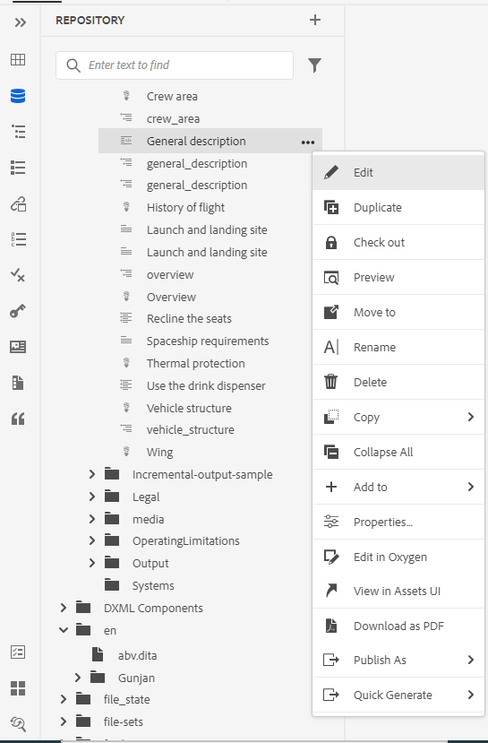

# Novidades da versão 4.3.1 do Adobe Experience Manager Guides (outubro de 2023)

Este artigo aborda os recursos novos e aprimorados da versão 4.3.1 do Adobe Experience Manager Guides (mais tarde conhecido como *Guias do Experience Manager*).

Para obter mais detalhes sobre as instruções de atualização, a matriz de compatibilidade e os problemas corrigidos nesta versão, consulte [Notas de versão](./release-notes-4-3-1.md).

## Conectar a uma fonte de dados e inserir os tópicos

Os Guias de Experience Manager fornecem conectores prontos para uso que ajudam você a se conectar com suas fontes de dados, tornando os Guias de Experience Manager um verdadeiro hub de conteúdo. Isso oferece a vantagem de economizar seu tempo e esforço que, de outra forma, seriam gastos na adição ou replicação manual de dados.

Juntamente com os conectores prontos para uso existentes, como JIRA e SQL (MySQL, PostgreSQL, SQL Server, SQLite), o administrador também pode configurar conectores para bancos de dados MariaDB, H2DB, AdobeCommerce e Elasticsearch. Eles também podem adicionar outros conectores estendendo as interfaces padrão.

Você pode visualizar os conectores configurados na **Fontes de dados** no Editor da Web.

*Exibir as fontes de dados conectadas.*

Agora também é possível criar um tópico a partir de uma fonte de dados conectada. Um tópico pode conter dados em vários formatos, como tabelas, listas e parágrafos. Também permite criar um mapa DITA para todos os tópicos. Você pode associar metadados ao tópico ao extrair de uma fonte de dados.

Para obter mais detalhes, consulte [Usar dados da sua fonte de dados](../user-guide/web-editor-content-snippet.md).

## Configurar um conector de fonte de dados na interface do usuário

Os Guias do Experience Manager agora também fornecem um **Fontes de dados** ferramenta que ajuda a configurar conectores prontos para uso para fontes de dados. Você pode criar facilmente os conectores para bancos de dados JIRA, SQL (MySQL, PostgreSQL, Microsoft SQL Server, SQLite, MariaDB, H2DB), AdobeCommerce e Elasticsearch.

Você também pode editar, reconectar, duplicar ou excluir facilmente um conector de origem de dados. Saiba como [configurar facilmente um conector de fonte de dados na interface do usuário](../install-guide/conf-data-source-connector-tools.md).

{width="550" align="left"}

*Crie e visualize os conectores de fonte de dados no painel fontes de dados.*

## Exibir logs do gerador de tópico

Agora você também pode exibir o arquivo de log da geração de conteúdo. Este arquivo de log ajuda a verificar avisos, erros e exceções.  Saiba mais sobre como o [opções para um gerador de tópico](../user-guide/web-editor-content-snippet.md#options-for-a-topic-generator) O ajuda a gerar e gerenciar facilmente os geradores de tópicos.

## Compatibilidade com ferramentas do Velocity em modelos de fonte de dados

Agora você pode usar as ferramentas do Velocity nos modelos de Guias de Experience Manager. Essas ferramentas ajudam a aplicar várias funções aos dados obtidos nas fontes de dados. Você pode usar os modelos ao criar um trecho de conteúdo ou um tópico. Esse recurso ajuda a economizar tempo e esforço para aplicar manualmente a mesma função a cada conjunto de dados.  Também garante resultados precisos.
Por exemplo, você pode usar a $mathTool para executar funções matemáticas.
Saiba como [usar ferramentas do Velocity nos modelos de fonte de dados](../user-guide/web-editor-content-snippet.md#use-velocity-tools).

## Aprimoramentos de PDF nativo

Os seguintes aprimoramentos do PDF nativo foram feitos na versão de outubro de 2023:

### Redefinir o número de página para a primeira página de um layout

Na saída de PDF nativa, é possível reiniciar os números de página e especificar o número a partir do qual a numeração começa. Agora, você também pode iniciar a numeração somente para a primeira ocorrência de uma seção.
Saiba como [trabalhar com as propriedades de página de um layout de página](../native-pdf/design-page-layout.md#page-props-page-layout).

### Exibir capítulos sem números automáticos no sumário

Os Guias de Experience Manager exibem os números de capítulo juntamente com os nomes de capítulo no Índice. Agora você pode optar por publicar somente os nomes dos capítulos sem os números dos capítulos. Exibir mais detalhes sobre como configurar o [configurações avançadas de PDF de um modelo](../native-pdf/components-pdf-template.md#advanced-pdf-settings).

## Baixar um mapa no Editor da Web

Agora, você não pode apenas editar um mapa na exibição de mapa do Editor da Web, mas também baixá-lo. Você pode optar por baixar o mapa usando uma linha de base específica. Você também tem a opção de nivelar a hierarquia e salvar todos os arquivos e pastas em uma única pasta.

Para obter mais detalhes, consulte **Exibição de mapa** descrição do recurso na [Painel esquerdo](../user-guide/web-editor-features.md#id2051EA0M0HS) seção.

{width="550" align="left"}

*Selecione um arquivo na exibição de repositório e escolha a opção para executar uma ação no arquivo.*

## Suporte para várias definições de assunto em uma única definição de lista discriminada

Agora é possível definir uma ou mais definições de assunto em um mapa e as definições de enumeração em outro mapa e, em seguida, adicionar a referência do mapa. As referências de enumeração de assunto são resolvidas no mesmo mapa ou no mapa referenciado.

Agora você também pode definir condições e aplicá-las a alguns elementos específicos em um tópico.  As condições são visíveis apenas para esses elementos específicos e não para todos os outros elementos.

Para obter mais detalhes sobre como lidar com definições hierárquicas de definições e enumerações de assunto, consulte a descrição do recurso Esquema de assunto na [Painel esquerdo](../user-guide/web-editor-features.md#id2051EA0M0HS) seção.

## Experiência de visualização aprimorada no menu de contexto

Use o menu de contexto para visualizar rapidamente o arquivo (.dita, .xml, áudio, vídeo ou imagem) sem abri-lo. Agora é possível redimensionar o painel de visualização e, se o conteúdo contiver qualquer link de referência, você poderá selecioná-lo para abri-lo em uma nova guia.

{width="800" align="left"}

*Visualize o arquivo no painel.*

Para obter mais detalhes sobre o menu de contexto, consulte **Opções de um arquivo** descrição do recurso na [Painel esquerdo](../user-guide/web-editor-features.md#id2051EA0M0HS) seção.

## Editar um arquivo no plug-in do conector Oxygen

O Experience Manager Guides agora permite que você selecione um arquivo no Editor da Web e, em seguida, escolha editar o arquivo no plug-in do conector Oxygen. Essa opção não está ativada como parte do suporte pronto para uso.

Para obter mais detalhes, consulte **Opções de um arquivo** descrição do recurso na [Painel esquerdo](../user-guide/web-editor-features.md#id2051EA0M0HS) seção.

## Usar variáveis para data e hora atuais nas opções Caminho de destino, Nome do site ou Nome do arquivo

Ao gerar saídas no site ou PDF AEM, é possível usar variáveis para definir o **Caminho de destino**, **Nome do site** ou **Nome do arquivo** opções. Agora você também pode usar o `${system_date}`e `${system_time}` variáveis. Essas variáveis ajudam a anexar a data e a hora atuais a essas opções.

Saiba como [use variáveis para definir as opções Caminho de destino, Nome do site ou Nome do arquivo](../user-guide/generate-output-use-variables.md).

## Atalhos de teclado para mover o cursor no Editor da Web

O Experience Manager Guides agora também permite que você use atalhos de teclado para mover o cursor no Editor da Web. Você pode usar os atalhos de teclado para mover rapidamente uma palavra para a esquerda ou direita. Também é possível mover para o início ou o fim da linha com a ajuda de atalhos de teclado.

Saiba mais sobre o [atalhos de teclado no Editor da Web](../user-guide/web-editor-keyboard-shortcuts.md).
