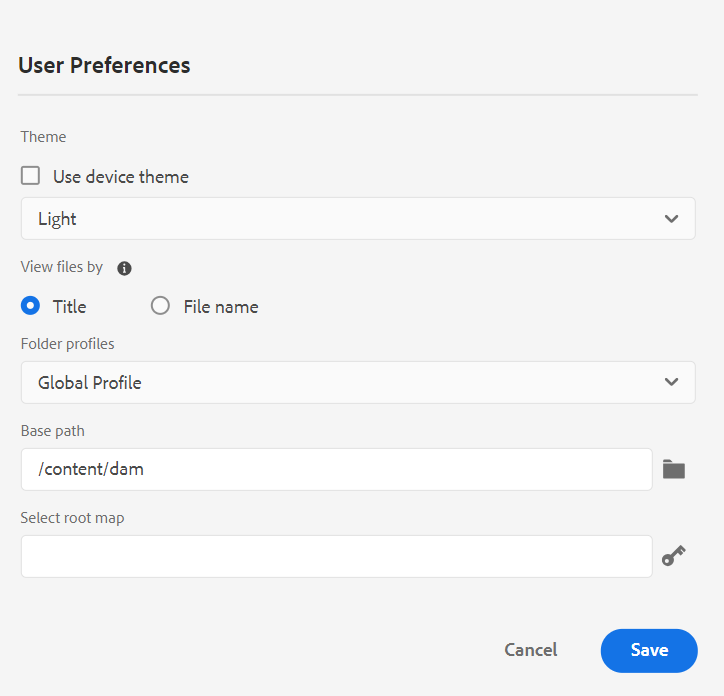

# Novidades da versão 4.4.0 (janeiro de 2024)

Este artigo aborda os recursos novos e aprimorados da versão 4.4.0 do Adobe Experience Manager Guides.

Para obter a lista de problemas que foram corrigidos nesta versão, consulte [Problemas corrigidos na versão 4.4.0](../release-info/fixed-issues-4-4.md).

Saiba mais sobre [as instruções de atualização para a versão 4.4.0](../release-info/upgrade-instructions-4-4.md).

## Recurso de histórico de versão remodelado no Editor da Web

Agora, o Experience Manager Guides fornece um recurso aprimorado de histórico de versões que permite comparar as alterações feitas em um documento ao longo do tempo. Na nova visualização lado a lado, é possível comparar facilmente o conteúdo e os metadados da versão atual com qualquer versão anterior do mesmo documento. Também é possível exibir os rótulos e comentários das versões comparadas. Como administrador, você pode controlar os metadados de versão do tópico e seus valores a serem exibidos na caixa de diálogo **Histórico de Versão**.

{width="800" align="left"}
*Visualize as alterações nas diferentes versões de um tópico.*

Saiba mais sobre a descrição do recurso **Histórico de Versões** na seção [Painel Esquerdo (herdado)](/help/legacy-product-guide/user-guide/web-editor-features.md#id2051EA0M0HS).

## Gerenciar predefinições de condição

Você pode definir atributos de condição em seus tópicos DITA. Em seguida, use os atributos de condição na predefinição de condição para publicar o conteúdo em um mapa DITA. O Experience Manager Guides agora também oferece uma experiência aprimorada no Editor da Web, que ajuda a criar e gerenciar predefinições de condição com mais eficiência. Também é possível editá-los, duplicá-los ou excluí-los facilmente.

{width="550" align="left"}

Para obter mais detalhes, consulte [Usar predefinições de condição](../user-guide/generate-output-use-condition-presets.md).

## Experiência remodelada para editar os atributos

Agora, você obtém uma experiência renovada para adicionar ou editar os atributos de um elemento no painel **Propriedades de conteúdo** no Editor da Web.

{width="300" align="left"}

*Adicionar atributos do painel Propriedades de Conteúdo.*

Também é possível editar e excluir facilmente os atributos.
Para obter mais detalhes, consulte a descrição do recurso **Propriedades de Conteúdo** na seção [Painel Direito](../user-guide/web-editor-features.md#id2051EB003YK).

## Editar metadados durante a criação

Agora, durante a criação, você pode atualizar as marcas de metadados do arquivo usando a lista suspensa das **Propriedades do arquivo** no painel direito. Você também pode selecionar **Editar mais propriedades** para atualizar mais metadados.

{width="300" align="left"}

*Atualize os metadados e edite as propriedades do arquivo no painel direito.*

Para obter mais detalhes, consulte a descrição do recurso **Propriedades do Arquivo** na seção [Painel Direito](../user-guide/web-editor-features.md#id2051EB003YK).

## Exibir atributos-chave na Exibição de Mapa

Ao definir atributos principais para o tópico ou referências de mapa, você também pode visualizar o título, o ícone correspondente e a chave no painel esquerdo. A chave é exibida como `key=<key-name>`.

 {width="300" align="left"}

*Exibir o atributo de chave na Exibição de Mapa.*

Para obter mais detalhes, consulte a descrição do recurso **Exibição de Mapa** na seção [Painel Esquerdo](../user-guide/web-editor-features.md#id2051EA0M0HS).

## Capacidade de duplicar uma linha de base com base no rótulo

O Experience Manager Guides agora fornece uma experiência do usuário aprimorada para criar as linhas de base no Editor da Web.
As opções **Atualização manual** e **Atualização automática** são mais intuitivas e ajudam você a escolher facilmente entre criar uma linha de base estática ou atualizá-la automaticamente de acordo com os rótulos.

 {width="300" align="left"}
*Criar linha de base a partir do Editor da Web.*

Também permite duplicar uma linha de base com base no rótulo. A versão de referência é separada com base no rótulo fornecido (se existir) durante a duplicação, ou então escolhe a versão da linha de base duplicada.

 {width="300" align="left"}

*Duplique uma linha de base com base em um rótulo ou crie uma cópia exata.*

Saiba mais sobre como [criar e gerenciar linhas de base do Editor da Web](../user-guide/web-editor-baseline.md).

## Painel de coleção do mapa aprimorado

O Experience Manager Guides fornece um painel de coleção de mapa aprimorado. Em uma coleção de mapas, é possível configurar rapidamente as propriedades de metadados em massa para os mapas DITA. Esse recurso é útil, pois não é necessário atualizar as propriedades de metadados de cada mapa DITA individualmente.

Agora é possível exibir o nome do arquivo do mapa DITA. Também é possível exibir as Linhas de Base. Isso ajuda a localizar rapidamente a linha de base usada para uma predefinição.

{width="800" align="left"}

*Exiba, edite e gere saída a partir do painel da coleção de mapas.*

Saiba como [usar a Coleção de Mapas para geração de saída](../user-guide/generate-output-use-map-collection-output-generation.md).

## Painel Tradução aprimorada

O painel **Tradução** foi aprimorado.  Você pode exibir a lista **Idiomas disponíveis** e selecionar rapidamente a localidade em que deseja traduzir o projeto. Com uma única seleção, você também pode escolher **Selecionar tudo** para traduzir seu projeto para todos os idiomas disponíveis.

{width="300" align="left"}

*Selecione as localidades nas quais deseja traduzir o projeto. Escolha o padrão, a linha de base ou a versão mais recente dos arquivos para tradução.*

Saiba como [traduzir conteúdo](../user-guide/translation.md).

## Lógica de pesquisa aprimorada na caixa de diálogo Inserir elemento

Agora é possível encontrar facilmente os elementos na caixa de diálogo Inserir elemento.  Você pode digitar uma string na caixa de pesquisa e obter uma lista de todos os elementos válidos que começam com a string inserida.

Por exemplo, ao editar um parágrafo em que você deseja inserir um elemento, é possível pesquisar um caractere &quot;t&quot; para obter
todos os elementos válidos que começam com &#39;t&#39;.

{width="300" align="left"}

*Digite um caractere para procurar todos os elementos válidos que comecem com o caractere.*

Para obter mais detalhes, exiba a descrição do recurso **Inserir Elemento** na seção [Painel Esquerdo](../user-guide/web-editor-features.md#id2051EA0M0HS).

## Capacidade de dividir uma lista no mesmo nível

Agora, você pode dividir facilmente sua lista no Editor da Web. Selecione a opção **Dividir Lista** no menu de contexto de um item de lista para dividir a lista atual. Uma nova lista é criada no mesmo nível, começando com o item de lista selecionado para a divisão.

{width="300" align="left"}

*Selecione a opção para dividir a lista atual.*

Para obter mais detalhes, exiba a descrição do recurso **Inserir Lista** na seção [Painel Esquerdo](../user-guide/web-editor-features.md#id2051EA0M0HS).

## Decodificar elementos DITA facilmente

Agora é possível decodificar facilmente um elemento usando a opção do menu de contexto de um elemento no Editor da Web. Isso ajuda a mesclar facilmente o texto do elemento com seu elemento principal.
Para obter mais detalhes, exiba a seção **Decodificar um elemento** dos [outros recursos no Editor da Web](../user-guide/web-editor-other-features.md).

## Acessar propriedades de arquivo no modo de criação de origem

Agora, você pode acessar o recurso **Propriedades de arquivo** do painel direito em todos os quatro modos ou modos de exibição: Layout, Autor, Source e Visualização.  Isso ajuda a visualizar as propriedades do arquivo, mesmo quando você alterna entre os diferentes modos.

Para obter mais detalhes, exiba a descrição do recurso **Propriedades do Arquivo** na seção [Painel Direito](../user-guide/web-editor-features.md#id2051EB003YK).

## Visualizar arquivos por título ou nome de arquivo

Agora você pode escolher a maneira padrão de exibir os arquivos no Editor da Web. Você pode visualizar a lista de arquivos por títulos ou nomes de arquivo dos vários painéis na visualização Autor.

{width="550" align="left"}

*Altere a maneira padrão de exibir os arquivos na caixa de diálogo **Preferências do Usuário**.*

## Restaurar guias de arquivo ao atualizar o navegador

O Experience Manager Guides restaura o estado das guias de arquivo abertas no Editor da Web quando você atualiza o navegador. Para obter mais detalhes, exiba a seção **Atualizar navegador ao editar os arquivos** em [Editar tópicos no Editor da Web](../user-guide/web-editor-edit-topics.md).

## Capacidade de navegar usando atalhos de teclado

O Experience Manager Guides agora também permite usar atalhos de teclado para mover o cursor no Editor da Web. Você pode usar os atalhos de teclado para mover rapidamente uma palavra para a esquerda ou direita. Também é possível mover para o início ou o fim da linha com a ajuda de atalhos de teclado.
Agora, você também pode usar atalhos de teclado para mover o cursor para o início do próximo elemento ou para o fim do elemento anterior.
Saiba mais sobre os [atalhos de teclado no Editor da Web](../user-guide/web-editor-keyboard-shortcuts.md).

## Resolver links entre mapas na saída do site AEM

Links entre mapas (XREF com peer de escopo) sendo renderizados na saída do site AEM agora são resolvidos de acordo com o título do arquivo do conjunto de contexto de publicação do mapa gerado.

## Configure o URL da saída do site AEM para usar o título do documento

O Experience Manager Guides permite que você, como administrador, configure o URL da saída do site AEM. Se o nome do arquivo não existir ou contiver todos os caracteres especiais, você pode configurar o para substituí-los por um separador no URL da saída do site AEM. Você também pode substituí-los pelo nome do primeiro tópico filho. Saiba como [configurar a URL de saída do site AEM para usar o título do documento](../cs-install-guide/conf-output-generation.md#configure-the-url-of-the-aem-site-output-to-use-the-document-title).

## Várias predefinições de saída do Publish em paralelo

Experience Manager fornece o recurso para criar linhas de base ao selecionar automaticamente os tópicos de acordo com o rótulo aplicado a eles. Agora, você também pode publicar facilmente várias predefinições de saída com linhas de base automáticas do mesmo mapa DITA. Não é necessário publicar apenas uma predefinição por vez, mas é possível publicar facilmente várias predefinições de saída em paralelo.

Saiba mais sobre como [criar e gerenciar linhas de base do Editor da Web](../user-guide/web-editor-baseline.md).

## Aprimoramentos de PDF nativo

Os seguintes aprimoramentos do PDF nativo foram feitos na versão 4.4.0:

### Usar variáveis na saída do PDF

Você pode usar variáveis para inserir e gerenciar dinamicamente informações reutilizáveis. O Experience Manager Guides ajuda a criar, editar e pré-visualizar variáveis enquanto você gera a saída de PDF. Você pode modificar rapidamente os valores das variáveis e tornar seus documentos portáteis e fáceis de atualizar.

{width="800" align="left"}

*Criar e gerenciar variáveis no Editor da Web.*

Você também pode criar conjuntos de variáveis que substituam os valores padrão e atribuam valores alternativos às variáveis. Insira essas variáveis no layout da página e use o mesmo layout de PDF, não é necessário criar layouts separados para cada conjunto de valores. Por exemplo, é possível criar um conjunto de variáveis para cada versão do produto. Esse conjunto de variáveis pode consistir em variáveis para diferentes detalhes do produto, como nome do produto, número da versão e data de lançamento. Em seguida, é possível adicionar valores diferentes para essas variáveis.

**Conjunto de variáveis 1: Adobe-set1**

* ProductName: Experience Manager Guides
* VersionNumber: 2311
* Data de lançamento: 02/11/2023

**Conjunto de variáveis 2: Adobe-set2**

* ProductName: Experience Manager Guides
* VersionNumber: 2310
* Data de lançamento: 27/09/2023

*Gerar a saída de PDF usando variáveis no layout de PDF.*

Aplique estilos e use a marcação HTML para formatar as variáveis.  Você também pode atualizar rapidamente os valores de qualquer variável sempre que necessário e gerar novamente a saída. Por exemplo, se você precisar atualizar os detalhes de uma versão, poderá editar o valor da versão na variável VersionNumber e gerar novamente a saída.

Saiba mais sobre como usar [variáveis na saída do PDF](../native-pdf/native-pdf-variables.md).

### Propagar metadados de ativos para a saída do PDF

O Experience Manager agora fornece a capacidade de transferir as propriedades de metadados dos ativos do mapa DITA para a saída do PDF.
Na predefinição de saída de PDF nativo, é possível escolher os metadados que deseja propagar para o processo de publicação de PDF. Você pode selecionar as propriedades personalizadas e padrão.  As propriedades de metadados selecionadas são transferidas para o arquivo de PDF gerado usando o PDF nativo.

Esse recurso é útil, pois ajuda a manter as propriedades do ativo, como autor, data de criação ou título de documento consistente. Isso facilita a organização, pesquisa e categorização de documentos.

Para obter mais detalhes, exiba as configurações **Avançadas** na [saída de PDF Publish](../web-editor/native-pdf-web-editor.md).

### Usar metadados adicionados ao elemento `topicmeta` para a saída do PDF

O recurso de metadados na publicação de PDF nativo ajuda na gestão de conteúdo e na pesquisa de arquivos na Internet.

*Selecione uma opção para adicionar e personalizar opções de metadados.*

Agora, o Experience Manager Guides fornece a opção de usar os metadados adicionados ao elemento `topicmeta` do mapa DITA para preencher os campos de metadados da saída do PDF. Essa opção é selecionada por padrão.

Esse recurso ajuda no melhor gerenciamento de documentos, garante a consistência e torna os documentos pesquisáveis.

Para saber mais, exiba a guia **Metadados** na [saída do PDF Publish](../web-editor/native-pdf-web-editor.md).

### Usar e duplicar modelos de PDF prontos para uso

A Experience Manager Guides fornece modelos de PDF de fábrica ou prontos para uso. Duplique os modelos de PDF de fábrica para criar os modelos de PDF personalizados.

Agora, você também pode visualizar a imagem em miniatura de um modelo ao criar e duplicar um modelo. Também é possível editar ou excluir essa imagem. Esse recurso é útil para marcar ou distinguir templates com nomes semelhantes.
Saiba mais sobre o [modelo de PDF](../native-pdf/pdf-template.md).

{width="550" align="left"}

*Duplicar um modelo de PDF existente.*

### Alterar a ordem das páginas e publicar várias páginas por folha

Além de publicar as páginas de acordo com o documento de origem, você também pode alterar a ordem das páginas no PDF ao publicar um documento de várias páginas.  Isso oferece a flexibilidade de publicar as páginas em várias ordens, como todas ímpares ou todas as páginas pares primeiro. Você também pode publicar como um livreto e ler as páginas como um livro. Você também pode decidir o número de páginas que deseja publicar em uma única folha de papel. Para obter mais detalhes, consulte a seção [Organização da página](../native-pdf/components-pdf-template.md#page-organization).

### Classificar termos do glossário com base nas chaves de classificação

Agora, você também pode classificar os termos do glossário com base nas teclas de classificação. Você pode usar a tag &#39;sort-as&#39; para definir uma chave de classificação para os termos do glossário. Em seguida, você pode classificá-los com base nas teclas de classificação no lugar dos termos. Isso permite classificar os termos do glossário de acordo com os termos usados em diferentes idiomas. Você também pode definir uma única chave de classificação para um termo do glossário com uma frase ou um grupo de palavras.
Para obter mais detalhes, consulte as [Configurações avançadas do PDF](../native-pdf/components-pdf-template.md#advanced-pdf-settings).

### Gerenciamento de recursos aprimorado para modelos de PDF nativos

A Experience Manager Guides agora melhorou o gerenciamento de recursos para modelos de PDF nativo. Agora é possível compartilhar e reutilizar recursos, como imagens, arquivos CSS e arquivos de fontes, em vários modelos de PDF nativos. Com essa melhoria, gerenciar os recursos de um grande conjunto de modelos é muito mais simples. Não é necessário criar recursos duplicados para cada modelo, e você pode mantê-los em uma pasta compartilhada e usá-los em todos os modelos de PDF nativo.
Para obter mais detalhes, consulte [Modelo de PDF](../native-pdf/pdf-template.md).
