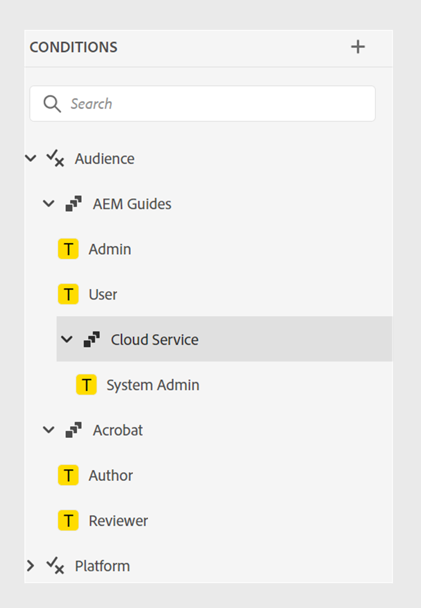

# Novidades da versão 4.6.0 (setembro de 2024)

Este artigo aborda os recursos novos e aprimorados introduzidos na versão 4.6.0 do Adobe Experience Manager Guides.

Para obter a lista de problemas que foram corrigidos nesta versão, consulte [Problemas corrigidos na versão 4.6.0](../release-info/fixed-issues-4-6-0.md).

Saiba mais sobre [as instruções de atualização para a versão 4.6.0](../release-info/upgrade-instructions-4-6-0.md).

## Aprimoramentos de publicação

Os seguintes aprimoramentos de publicação de conteúdo foram feitos na versão 4.6.0:

### Publish um tópico ou seus elementos em um fragmento de experiência

Um Fragmento de experiência é uma unidade de conteúdo modular no Adobe Experience Manager que integra conteúdo e layout. Fragmentos de experiência são fundamentais para criar experiências consistentes e envolventes, que podem ser reutilizadas em vários canais. Por exemplo, você pode criar fragmentos de experiência para cabeçalhos ou rodapés com elementos de marca, banners promocionais, depoimentos de clientes e promoções de eventos.

 {width="300" align="left"}

*Publish e exiba os Fragmentos de Experiência de um tópico da seção **Saídas**&#x200B;em **Propriedades do Arquivo**.*

O Experience Manager Guides agora permite publicar um tópico ou seus elementos em um Fragmento de experiência. Você pode criar um mapeamento baseado em JSON entre um tópico ou seus elementos e um modelo de Fragmento de experiência. Você também pode criar variações de Fragmento de experiência usando os filtros de condição.

Saiba mais sobre como [Fragmentos de experiência do Publish](../user-guide/publish-experience-fragment.md).

### Melhorias na publicação do fragmento de conteúdo

O Experience Manager Guides também fornece algumas melhorias úteis nos Fragmentos de conteúdo:

- O Experience Manager Guides permite publicar um tópico ou seus elementos em um fragmento de conteúdo.

- Você pode publicar e exibir os Fragmentos de Conteúdo de um tópico da seção **Saídas** em **Propriedades do Arquivo**.

- Você pode criar facilmente variações de fragmentos de conteúdo filtrando o conteúdo com condições enquanto publica em um fragmento de conteúdo.

- Use a nova interface de mapeamento para selecionar e publicar facilmente os elementos em um Fragmento de conteúdo.

Agora, a publicação do Fragmento de conteúdo substitui somente o conteúdo mapeado, em vez de substituir o Fragmento de conteúdo completo. Esse recurso permite que um fragmento de conteúdo contenha dados de várias fontes, como vários tópicos ou o editor de fragmento de conteúdo.

Para obter mais detalhes, consulte [Fragmentos de conteúdo do Publish](../user-guide/publish-content-fragment.md).

### Predefinição do AEM Sites reorganizada para facilitar o uso

As configurações foram reorganizadas para ajudar você a configurar rapidamente a predefinição de saída e gerar a saída do AEM Sites.
Você pode criar as predefinições existentes do AEM Sites selecionando a opção **Usar mapeamento de componente herdado** na caixa de diálogo **Nova predefinição de saída**.

Exiba as guias **Geral**, **Conteúdo** e **Referência de mapa cruzado** nas predefinições do AEM Sites:
- **Geral**: contém as configurações gerais para gerar a saída. Você pode especificar o site e o caminho de saída, excluir ou substituir páginas de saída existentes, excluir as páginas geradas anteriormente para tópicos removidos, selecionar o modelo de design, reter os arquivos temporários e especificar o fluxo de trabalho de pós-geração.
- **Conteúdo**: contém as configurações aplicáveis ao conteúdo para geração de saída. É possível selecionar os filtros, a linha de base do mapa DITA e as propriedades de metadados para publicação.
- **Referências de mapa cruzado**: esta lista contém tópicos que contêm referências de mapa cruzado com escopo =&quot;par&quot;. É possível especificar o contexto de publicação para uma lista de referências de mapa cruzado com scope=&quot;peer&quot; para tópicos disponíveis em outros mapas DITA. Essa guia será exibida se você usar a versão do Experience Manager Guides (UUID).

### Referências de mapa cruzado de predefinições do AEM Sites no Editor da Web

O aprimoramento mais recente do Experience Manager Guides introduz referências de mapa cruzado nas predefinições de AEM Sites do Editor da Web.
As referências entre mapas no Experience Manager Guides ajudam a melhorar a navegação do conteúdo, aumentar a reutilização do conteúdo e aprimorar a experiência do usuário.

É possível especificar o contexto de publicação para uma lista de referências entre mapas a tópicos disponíveis em outros mapas DITA com scope=&quot;peer&quot;. Por exemplo, o Tópico 1 no Mapa A contém uma referência ao Tópico 2. O tópico 2 pode estar presente em mapas únicos ou múltiplos.  Você pode selecionar o mapa principal e uma predefinição específica ou a saída publicada mais recentemente para cada link.

Se o mesmo tópico for referido mais de uma vez em um arquivo, será possível adicionar um contexto de publicação diferente para cada instância. Isso proporciona maior flexibilidade e controle sobre o conteúdo. Por exemplo, o Tópico 3 está presente no Mapa B e no Mapa C. O Tópico 1 contém duas referências ao Tópico 3. Você pode escolher o Mapa B como o mapa principal do primeiro link e o Mapa C como principal do segundo link.

*Especifique o contexto de publicação para os tópicos vinculados da guia **Referências entre mapas**&#x200B;da predefinição **AEM Sites**.*

### Capacidade de transmitir metadados das propriedades do arquivo de tópico para a saída do PDF nativo

Agora, o Experience Manager Guides permite adicionar os metadados das propriedades de arquivo de um tópico aos layouts de página ao gerar a saída em PDF nativo. Use esse recurso para adicionar metadados específicos do tópico, como título, tags e descrição aos layouts de página. Você também pode personalizar o PDF publicado com base nos metadados do tópico, como adicionar uma marca d&#39;água ao plano de fundo do tópico com base no estado do documento do tópico.

 {width="300" align="left"}

*Adicione metadados aos campos nos seus layouts de página.*

Saiba como [adicionar campos e metadados](../native-pdf/design-page-layout.md#add-fields-metadata) em um layout de página.

### Suporte para documentos do Markdown na publicação de PDF nativo

O Experience Manager Guides também oferece suporte a documentos do Markdown na publicação de PDF nativo. Esse recurso é útil e ajuda a gerar PDF para os arquivos do Markdown no mapa DITA.

Para obter mais detalhes, consulte o [suporte para documentos do Markdown](../web-editor/native-pdf-web-editor.md#support-for-markdown-documents).

### Baixar o arquivo temporário ao gerar a saída pelo DITA-OT

Você também pode baixar os arquivos temporários gerados ao publicar a saída AEM Sites, HTML, Custom, JSON ou PDF por meio do DITA-OT. Esse recurso ajuda você a analisar quaisquer problemas que possam ocorrer durante o processo de geração de saída e solucionar problemas com eficiência.  
Você também pode baixar o arquivo metadata.xml se tiver selecionado quaisquer propriedades de metadados que foram passados para a saída gerada usando DITA-OT. 

Para obter mais detalhes sobre as predefinições, consulte [Noções básicas sobre as predefinições de saída](../user-guide/generate-output-understand-presets.md).

### Opção para escolher uma hierarquia de arquivos simples ou aninhada para saída HTML5

Agora, o Experience Manager Guides permite que você mantenha a hierarquia de pastas simples para os arquivos temporários em que todo o conteúdo é publicado no formato de saída HTML5 e salvo em uma única pasta.
Se você não optar por nivelar a hierarquia de arquivos, a saída HTML5 será gerada em uma hierarquia de pastas aninhada. Isso significa que a estrutura de pastas original do conteúdo, com arquivos organizados em subpastas, é replicada na saída. Essa hierarquia de pastas aninhada permite uma organização mais complexa e a categorização de arquivos, facilitando o gerenciamento e a navegação de grandes volumes de dados.

Saiba mais sobre como [gerar saída de HTML5](../user-guide/generate-output-html5.md)

## Aprimoramentos do editor

Os seguintes aprimoramentos do editor foram adicionados na versão 4.6.0:

### Acesso somente leitura ao modo Autor e Source para arquivos bloqueados

Se outro usuário bloquear ou fizer check-out de um arquivo DITA ou Markdown, você não poderá editar nem alterar o conteúdo. Além da Visualização, também é possível exibi-lo como um arquivo somente leitura no modo Autor ou Source.
No modo somente leitura, você pode exibir o conteúdo junto com as marcas e os atributos no modo **Autor** ou **Source** e editar as propriedades do arquivo.

Você também pode acessar o modo de exibição **Layout** para mapas DITA somente leitura.
>[!NOTE]
>
> Os administradores do perfil da sua pasta devem atualizar o *ui_config.json* para que você possa acessar harmoniosamente os arquivos somente leitura nos modos Autor, Source e Layout.

*Exibir os arquivos bloqueados no modo Autor e Source.*

Saiba como [abrir arquivos bloqueados nos modos Autor e Source](../user-guide/web-editor-edit-topics.md#open-locked-files-in-author-and-source-modes).

### Selecionar conteúdo parcial entre elementos para operações

O Experience Manager Guides aprimora sua experiência de seleção do conteúdo nos elementos no Editor da Web. É possível selecionar facilmente o conteúdo em diferentes elementos e executar operações, como negrito, itálico e sublinhado.

Esse recurso permite aplicar ou remover facilmente a formatação do conteúdo parcialmente selecionado. Você também pode excluir rapidamente o conteúdo selecionado entre os elementos. Depois que o conteúdo for excluído, se necessário, o conteúdo restante será mesclado automaticamente em um único elemento válido. Você também pode selecionar um conteúdo parcial entre elementos e cercá-lo com um elemento DITA válido.

Em geral, esses aprimoramentos fornecem uma experiência melhor e ajudam a melhorar a eficiência na edição de documentos.
Para obter mais detalhes, exiba [Seleção parcial de conteúdo no elemento](../user-guide/web-editor-edit-topics.md#partial-selection-of-content-across-elements).

### Lista segmentada para exibir e inserir elementos válidos de acordo com sua posição

Ao editar um documento no Editor da Web, agora é possível exibir uma lista separada de elementos válidos no local atual e fora dele. Com base nas suas necessidades, você escolhe um elemento entre as seguintes opções:

- **Elementos válidos no local atual** que você pode inserir no próprio local do cursor atual.
- **Elementos válidos fora do local atual** que você pode inserir depois de qualquer um dos pais para o elemento atual na hierarquia de elementos.

{width="300" align="left"}

*Exiba as listas segregadas de elementos válidos para inserir um elemento no local atual.*

Essa lista dividida de elementos válidos ajuda a manter a estrutura de conteúdo e a seguir os padrões DITA.

Saiba mais sobre o recurso **Inserir Elemento** na seção [Barra de ferramentas secundária](../user-guide/web-editor-features.md#2051ea0j0y4).

### Experiência renovada para pesquisar e filtrar arquivos na visualização de repositório

Agora, você tem uma experiência aprimorada ao filtrar arquivos. A funcionalidade renovada para filtrar arquivos fornece uma maneira aprimorada de pesquisar e navegar facilmente pelos arquivos.

{width="300" align="left"}

*Pesquisar os arquivos que contêm o texto`general purpose.`*

Aproveite benefícios como acesso mais rápido a arquivos relevantes e uma interface do usuário mais intuitiva, tornando sua experiência de pesquisa mais estável e eficiente.

 {width="300" align="left"}

*Use os filtros rápidos para procurar arquivos DITA e não DITA.*

>[!NOTE]
>
> Os administradores do perfil da sua pasta devem atualizar *ui_config.json* para que você possa acessar esse recurso de forma harmoniosa.

Saiba mais sobre o recurso **Pesquisa de filtro** na seção [Painel esquerdo](../user-guide/web-editor-features.md#id2051EA0M0HS).

### Condições agrupadas para a organização aprimorada de conteúdo

O Experience Manager Guides agora permite agrupar condições e apresentá-las em uma hierarquia aninhada, permitindo adicionar várias condições a um único grupo. Ao agrupar condições, é possível organizá-las e aplicá-las melhor em todo o conteúdo.

{width="300" align="left"}

Saiba mais sobre a descrição do recurso **Condições** na seção [Painel esquerdo](../user-guide/web-editor-features.md#id2051EA0M0HS).

### Personalizar sua experiência no Editor da Web com uma nova interface de preferências do usuário

A caixa de diálogo **Preferências do Usuário** no Editor da Web agora inclui uma nova guia **Aparência**. Esta nova guia permite configurar convenientemente as preferências mais comuns de aparência na interface do Editor da Web.

Você pode configurar a exibição dos arquivos por título ou nome de arquivo e alterar o tema do aplicativo e a exibição do código-fonte. Também ajuda a definir as configurações para localizar um arquivo aberto na exibição de repositório e lidar com espaços não separáveis.

{width="550" align="left"}

*Personalize a aparência de acordo com suas preferências.*

Saiba mais sobre a descrição do recurso **Preferências do usuário** na seção [Painel esquerdo](../user-guide/web-editor-features.md#id2051EA0M0HS).

### Localizar um arquivo aberto na visualização de repositório do Editor da Web

Selecione a opção **Sempre localizar arquivos no repositório** em **Preferências do Usuário** para navegar rapidamente e localizar seu arquivo na exibição do repositório. Não é necessário pesquisar manualmente por ele.

Ao editar, esse recurso também ajuda a visualizar facilmente o local do arquivo na hierarquia do repositório.

Para obter mais detalhes, exiba [localizar um arquivo aberto na exibição de repositório](../user-guide/web-editor-edit-topics.md#locate-an-open-file-in-the-repository-view).

### Manuseio aprimorado de espaços não separáveis no Editor da Web

O Experience Manager Guides permite que você mostre um indicador de espaço sem quebra ao editar documentos no Editor da Web. Também melhora o manuseio de espaços não separáveis.
Ele converte vários espaços em branco consecutivos em um único espaço para preservar a visualização WYSIWYG do documento no Editor da Web. Esse recurso também ajuda a melhorar a aparência geral e o profissionalismo do documento.

Para obter mais detalhes, exiba os [outros recursos do Editor da Web](../user-guide/web-editor-other-features.md).

### Capacidade de exibir propriedades de qualquer elemento da hierarquia de elementos

Agora, as Propriedades de Conteúdo **Tipo** aparecem como um menu suspenso. Você pode visualizar e selecionar as tags da hierarquia completa para a tag atual na lista suspensa.

Esse menu suspenso ajuda a acessar rapidamente as propriedades de conteúdo da tag selecionada.

{width="300" align="left"}

*Selecione uma marca da hierarquia para a marca atual.*

Saiba mais sobre o recurso **Propriedades de Conteúdo** na seção [Painel Direito](../user-guide/web-editor-features.md#id2051eb003yk).

### Desempenho aprimorado ao fazer check-in dos arquivos em massa no Editor de mapas

O Experience Manager Guides melhora o desempenho e a experiência do recurso de check-in de arquivos em massa do Editor de mapas. Essa melhoria ajuda a fazer o check-in dos arquivos em massa com mais rapidez.
Você também pode visualizar o progresso da operação de check-in para os arquivos da caixa de diálogo **Salvar como nova versão e Desbloquear**. Por fim, a mensagem de sucesso é exibida após a conclusão da operação e o check-in de todos os arquivos com check-out selecionados.

{width="300" align="left"}

*Exiba a lista e o status dos arquivos com check-in em massa do Editor de Mapas.*

Saiba como [trabalhar com o Editor de Mapa Avançado](../user-guide/map-editor-advanced-map-editor.md)

## Aprimoramentos no gerenciamento do ciclo de vida do conteúdo

O gerenciamento do ciclo de vida do conteúdo foi aprimorado das seguintes maneiras:

### Capacidade de traduzir conteúdo em vários idiomas usando grupos de idiomas pré-configurados

O Experience Manager Guides agora permite criar grupos de idiomas e traduzir facilmente seu conteúdo em vários idiomas. Esse recurso ajuda a organizar e gerenciar traduções de acordo com as necessidades da organização.

Por exemplo, se você precisar traduzir o conteúdo para alguns países na Europa, é possível criar um grupo de idiomas para idiomas europeus, como inglês (EN), francês (FR), alemão (DE), espanhol (ES) e italiano (IT).

{width="300" align="left"}

*Selecione os grupos de idiomas ou idiomas para tradução dos documentos.*

>[!NOTE]
>
>Se a pasta de destino de um idioma estiver ausente ou se o idioma de destino for o mesmo da origem, ele ficará esmaecido e exibirá um sinal de aviso.

Como administrador, você pode criar grupos de idiomas e configurá-los para vários perfis de pasta. Como autor, você pode exibir os grupos de idiomas configurados no perfil da pasta.

De modo geral, a criação de grupos de idiomas aumenta a eficiência e a produtividade dos projetos de tradução, melhorando, em última análise, o processo de localização em vários idiomas.

Saiba como [traduzir documentos do Editor da Web](../user-guide/translate-documents-web-editor.md).

### Desempenho e escalabilidade aprimorados para grandes projetos de tradução

O recurso de tradução é mais rápido e escalável do que nunca. Ele vem com uma nova arquitetura que oferece desempenho aprimorado. O tempo de criação do projeto agora é mais rápido do que antes, e os conflitos durante o processo são quase inexistentes. Esse desempenho aprimorado ajuda com traduções mais rápidas, garantindo uma operação tranquila mesmo para projetos de tradução grandes.

Essa melhoria é muito benéfica, pois melhora a produtividade e a experiência geral.

Saiba mais sobre como [traduzir documentos do Editor da Web](../user-guide/translate-documents-web-editor.md).

### Excluir ou desabilitar o projeto de tradução automaticamente após a tradução

Agora, como administrador, você pode configurar os projetos de tradução para serem desativados ou excluídos automaticamente após concluir a tradução. Esse recurso ajuda você a usar os recursos e gerenciar arquivos com eficiência após concluir a tradução.

Excluir um projeto remove permanentemente todos os arquivos e pastas presentes no projeto. A exclusão dos projetos de tradução também permite liberar o espaço em disco ocupado.

Você pode desativar os projetos de tradução se desejar usá-los posteriormente.

{width="550" align="left"}

*Defina os grupos de idiomas e as configurações de limpeza para projetos de tradução.*

Saiba mais sobre como [excluir ou desabilitar automaticamente o projeto de tradução](../user-guide/translate-documents-web-editor.md#automatically-delete-or-disable-a-completed-translation-project).

### Desative o pós-processamento para pastas seletivas no Adobe Experience Manager Assets

Como administrador, agora você pode desativar o pós-processamento e a geração de UUIDs para pastas seletivas no Experience Manager Assets. Essa configuração pode ser útil, especialmente ao lidar com muitos ativos ou estruturas de pastas complexas. Também ajuda vários usuários a fazer upload dos ativos simultaneamente rapidamente, sem interferir uns nos outros.  

Desativar o pós-processamento para uma pasta também afeta todas as suas pastas secundárias. No entanto, o Experience Manager Guides agora oferece a capacidade de ativar seletivamente o pós-processamento para pastas secundárias individuais na pasta ignorada.

Saiba como [desabilitar o pós-processamento para uma pasta](../cs-install-guide/conf-folder-post-processing.md).

## Aprimoramentos nos conectores de fonte de dados

Os seguintes aprimoramentos foram feitos nos conectores de fonte de dados da versão 2024.4.0:

### Conecte-se às fontes de dados do Salsify, Akeneo e Microsoft Azure DevOps Boards (ADO)

Além dos conectores prontos para uso existentes, o Experience Manager Guides também fornece conectores para fontes de dados do Salsify, Akeneo e Microsoft Azure DevOps Boards (ADO). Como administrador, você pode baixar e instalar esses conectores. Em seguida, configure os conectores instalados.

### Copie e cole o exemplo de consulta para criar um trecho de conteúdo ou tópico

Você pode copiar e colar facilmente uma amostra de consulta de dados no gerador para criar um trecho de conteúdo ou tópico. Com esse recurso, não é necessário lembrar a sintaxe ou criar um query manualmente. Em vez de digitar manualmente a consulta, você pode copiar e colar uma consulta de exemplo, editá-la e usá-la para buscar os dados de acordo com suas necessidades.

{width="800" align="left"}

*Copie e edite uma consulta de exemplo para criar o trecho de conteúdo.*

### Conectar-se a arquivos de dados JSON usando um conector de arquivos

Agora, como administrador, você pode configurar um conector de arquivo JSON para usar arquivos de dados JSON como fonte de dados. Use o conector para importar os arquivos JSON do seu computador ou do Adobe Experience Manager Assets. Em seguida, como autor, você pode criar fragmentos de conteúdo ou tópicos usando os geradores.

Esse recurso ajuda você a usar os dados armazenados em seus arquivos JSON e reutilizá-los em vários snippets. O conteúdo também é atualizado dinamicamente sempre que você atualiza os arquivos JSON.

### Configure vários URLs de recursos para um conector criar trechos de conteúdo ou tópicos

Como administrador, você pode configurar vários URLs de recursos para alguns conectores, como Cliente REST genérico, Salsify, Akeneo e placas DevOps (ADO) do Microsoft Azure.

Em seguida, como autor, conecte-se às fontes de dados para criar trechos de conteúdo ou tópicos usando os geradores. Esse recurso é útil, pois você não precisa criar uma fonte de dados para cada URL. Ele ajuda a buscar dados rapidamente de qualquer um dos recursos de uma fonte de dados específica em um único trecho de conteúdo ou tópico.

Exibir mais detalhes sobre os conectores de fonte de dados e como [configurar um conector de fonte de dados na interface do usuário](../cs-install-guide/conf-data-source-connector-tools.md).

Saiba como [usar dados da sua fonte de dados](../user-guide/web-editor-content-snippet.md).

