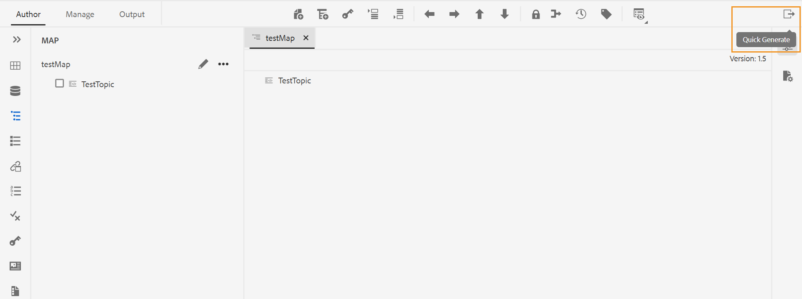

# Novidades da versão 4.2 do Adobe Experience Manager Guides (fevereiro de 2023)

Este artigo aborda os recursos novos e aprimorados da versão 4.2 do Adobe Experience Manager Guides (mais tarde conhecido como *Guias do AEM*).

Para obter mais detalhes sobre as instruções de atualização, a matriz de compatibilidade e os problemas corrigidos nesta versão, consulte [Notas de versão](release-notes-4.2.md) artigo.

## Gerar relatórios pelo Editor da Web

O AEM Guides vem com um recurso no Editor da Web que permite verificar a integridade geral de seus documentos técnicos e gerar relatórios para eles.
Você pode exibir a lista de tópicos e gerenciar os metadados de todas as referências para o mapa atual no
**Relatórios** no Editor da Web.

**Gerar a exibição da Lista de tópicos**

Você pode gerar a Lista de tópicos que fornece informações detalhadas sobre os tópicos, como tipo de referência, estado do documento e autor. Você também pode gerar o CSV para baixar o instantâneo atual dos tópicos no mapa DITA.

**Gerenciar metadados e alterar estado do documento**

Você pode aplicar tags a um tópico individual ou usar o recurso de marcação em massa para aplicar várias tags a vários tópicos, um mapa DITA ou um submapa. Você também pode alterar o estado do documento de todos os tópicos selecionados para o próximo estado de documento comum possível.

## UX renovado para a funcionalidade de revisão

Agora, os guias de AEM fornecem um UX aprimorado que ajuda a analisar os tópicos compartilhados para análise. Na experiência mais recente, a funcionalidade de revisão tem as seguintes melhorias:

* Interface do usuário atualizada
* Painel Condições que permite realçar o conteúdo de acordo com as condições disponíveis no tópico.
* Cada comentário no painel de comentários é vinculado ao texto correspondente no tópico atual. Isso ajuda a identificar o texto comentado.
* Os comentários são exibidos na ordem do texto comentado no documento.
* O nome da tarefa de revisão é exibido no workflow de revisão.
* Selecione o roteiro da tarefa de revisão que é usado para resolver todas as referências principais e termos de glossário usados no conteúdo da revisão.
* Barra de ferramentas contextual que ajuda a destacar ou tachar rapidamente o texto.
* Menu Opções para editar ou excluir seus próprios comentários.
* Para comentários desatualizados, você tem acesso à visualização lado a lado, o que ajuda a comparar a versão anterior do tópico com a versão de revisão atual
* Ao usar os filtros, os comentários no painel direito são filtrados de acordo com a seleção e o número de comentários no painel esquerdo é atualizado adequadamente.

Para obter mais detalhes, consulte *Revisar tópicos ou mapas* no guia Uso dos guias do Adobe Experience Manager.

## Aprimoramentos de tradução

Agora você tem aprimoramentos mais fáceis de usar no painel Tradução que ajudam a traduzir facilmente seus documentos do Editor da Web.

**Coluna Rótulo da versão adicionada ao painel de tradução**

No painel de tradução, também é possível ver a coluna Rótulo da versão. Isso exibe o Rótulo da versão selecionada do arquivo de origem. Isso pode ajudá-lo a selecionar todos os arquivos com um rótulo específico e traduzi-los de uma só vez.

**Visualizar diferença de versão para arquivos Fora de sincronização no painel de tradução**

Agora você pode verificar as diferenças entre a versão selecionada e a última versão de origem traduzida dos tópicos. Você também pode optar por traduzir a variável **Fora de sincronia** arquivos com base nas alterações feitas entre as duas versões de um tópico.

**Passar o rótulo da versão para a versão de destino**

Guias do AEM permitem passar o rótulo do arquivo de origem para o arquivo de destino. Isso ajuda a identificar facilmente a versão de origem do arquivo traduzido.

Por exemplo, se você tiver alguns arquivos de origem com o rótulo da versão Release 1.0 aplicado a eles, também será possível passar o rótulo de origem (Release 1.0) para o arquivo traduzido.

**Forçar sincronização para ativos fora de sincronização**

Se você fizer alterações em alguns ativos, os Guias do AEM os marcará como Fora de sincronia. Você pode traduzir novamente os ativos modificados ou optar por descartar o status Fora de sincronização. Por exemplo, se você tiver feito algumas pequenas alterações que realmente não precisam de uma tradução, poderá marcar o status delas como Em sincronia.

**Exibir projetos de tradução em andamento para um tópico ou mapa**

Algumas das referências no painel de tradução podem estar em andamento. Agora, o AEM Guides fornece um recurso para ajudar você a visualizar a lista de todos os projetos de tradução em andamento (juntamente com o idioma de destino) que contêm a referência selecionada.

Para obter mais detalhes, consulte *Traduzir documentos do Editor da Web* no guia Uso dos guias do Adobe Experience Manager.

## Gerar saída em vários formatos no Editor da Web

Agora é possível gerar facilmente a saída dos tópicos ou do mapa DITA no Editor da Web. Você pode configurar várias predefinições de saída, como AEM Site, PDF, HTML5, JSON (um formato de saída headless) e saída personalizada. Use-os para gerar as respectivas saídas. Você pode definir atributos em seus tópicos DITA e, em seguida, usar a predefinição de condição para aplicar uma condição ao publicar a saída. Você também pode usar o recurso de publicação de linha de base para publicar seletivamente uma versão específica do mapa ou tópico DITA.

**Gerenciar predefinições de saída de perfil global e de pasta**

Os Guias do AEM fornecem o recurso para criar e gerenciar predefinições de saída para Perfis globais e de pastas. Em seguida, é possível usar facilmente essas predefinições de saída para gerar saída para todos os mapas relacionados a esse perfil Global ou de Pasta.

Essas predefinições globais aparecem sob a tag **Output** de todos os mapas relacionados. Você pode usá-los para gerar a saída para todos os mapas relacionados. É possível selecionar a predefinição como a predefinição de PDF padrão para gerar a saída de PDF. Também é possível **Editar**, **Renomear**, **Duplicar** ou **Excluir** uma predefinição de saída existente do **Opções** menu.

>[!NOTE]
>
>Somente usuários administrativos no nível da pasta podem criar predefinições Globais e de Perfil de Pasta.

## Localizar e substituir o texto no nível do mapa

Agora é possível pesquisar arquivos em um mapa que contenha texto específico. O texto pesquisado é destacado nos arquivos. Você também pode substituir a palavra ou frase pesquisada por outra palavra ou frase dentro dos arquivos. Selecione o **Substituir ocorrência única** ícone para substituir a ocorrência atual e o **Substituir tudo no arquivo** ícone para substituir todas as ocorrências no arquivo selecionado. É possível selecionar **Substituir tudo** ícone para substituir todas as ocorrências do termo pesquisado em todos os arquivos.

Por padrão, as opções **Fazer check-out do arquivo antes de substituir** e **Criar nova versão após substituir** são selecionados, portanto, um arquivo é submetido a check-out antes da substituição do texto e uma nova versão é criada depois que o texto é substituído. Também é possível pesquisar a string nas referências indiretas no mapa DITA. Por padrão, isso fica desativado para que a pesquisa seja executada somente nas referências diretas.

## Exibição de layout no Editor de mapa

Agora é possível exibir o layout completo de um mapa DITA no Editor de mapas. Quando você abre um mapa para edição, ele abre a exibição de Layout do Editor de Mapas. Nesta exibição, é possível ver a hierarquia de mapas em uma exibição em árvore. Também é possível editar e organizar ou estruturar os tópicos em um mapa.

A exibição de layout contém uma barra de ferramentas separada que ajuda a executar muitas tarefas nos tópicos presentes em um mapa.
Você pode inserir referências de tópico, grupo de tópicos, definições de chave em um mapa. Você pode reorganizar os tópicos presentes em um mapa movendo-os para cima, para baixo, para a esquerda ou para a direita. Você também pode arrastar e soltar os tópicos para movê-los em um mapa. O Editor de mapa também fornece os ícones para bloquear ou desbloquear arquivos, verificar o histórico da versão e fazer um gerenciamento de rótulo de versão.

A exibição de layout também fornece a **Opções de exibição** para mostrar ou ocultar o número de linha, mostrar ou ocultar a caixa de seleção ou mostrar o nome de arquivo ou título dos tópicos em um mapa.
Você também pode exibir os tópicos com base nos filtros condicionais aplicados neles.

Além de organizar tópicos no arquivo de mapa, também é possível adicionar, mover, copiar, colar ou excluir referências usando o **Opções** menu disponível para um elemento na exibição de layout.

O painel direito exibe as Propriedades do Conteúdo e as Propriedades do Mapa na exibição de Layout do Editor de Mapas. Agora, também é possível definir as informações de metadados dos tópicos ou do mapa. Você pode definir o Título de navegação, Texto do link, Descrição curta e Palavras-chave para o tópico ou mapa selecionado.

Para obter mais detalhes, consulte *Exibição de layout* no guia Uso dos guias do Adobe Experience Manager.

## Painel Geração rápida

Agora, o AEM Guides fornece o painel Geração rápida, que ajuda a gerar e visualizar rapidamente a saída das predefinições criadas para o mapa DITA.

No **Geração rápida** é possível ver a lista de todas as predefinições de saída criadas para o mapa DITA. Também é possível visualizar rapidamente a saída gerada para as predefinições. Uma mensagem de sucesso ou falha é exibida na conclusão da geração de saída. Você também pode exibir o log de erros, que contém detalhes do erro que ocorreu no processo de geração.

## Criar uma linha de base dinâmica com base em rótulos

Agora, o AEM Guides fornece o recurso para criar linhas de base dinâmicas com base em rótulos. Se você gerar uma linha de base, baixar uma linha de base ou criar um projeto de tradução usando uma linha de base, os arquivos serão selecionados dinamicamente com base nos rótulos atualizados. Esse recurso é útil, pois você não precisa modificar a linha de base ao atualizar os rótulos.

## Excluir e duplicar arquivos no painel de repositório

Agora é possível excluir facilmente arquivos (um único arquivo por vez) do **Opções** do arquivo selecionado no painel repositório. Um prompt de confirmação é exibido antes de excluir o arquivo. Se o arquivo não for referenciado a partir de outro arquivo, ele será excluído e uma mensagem de sucesso será exibida.

Você também pode criar uma duplicata ou uma cópia do arquivo selecionado. Por padrão, o arquivo é criado com um sufixo (como filename_1.extension).

## Outras melhorias no Editor da Web

* Nos Guias do AEM, você pode executar algumas operações comuns para imagens e arquivos de mídia usando o menu de contexto. Agora, também é possível localizar a imagem ou mídia selecionada no repositório ou visualizar o arquivo na interface do usuário do Assets.

* O nome do Perfil de pasta atual é exibido como um rótulo para o ícone Preferências do usuário na barra de ferramentas principal. Isso ajuda a identificar o perfil da pasta em que você está trabalhando.

* Quando você abre um mapa na exibição de mapa, o título do mapa atual é exibido no centro da barra de ferramentas principal. Isso é útil para informar aos usuários qual mapa está aberto no momento.

## Remoção de versões selecionadas de arquivos

À medida que você cria e mantém seu conteúdo, muitas versões podem ser criadas para seus arquivos DITA no repositório. Guias do AEM permitem que você remova do repositório versões anteriores dos arquivos DITA e libere espaço em disco.

As Guias do AEM não excluem a primeira versão do arquivo ou uma versão que esteja incluída em uma linha de base, ou tenha um rótulo aplicado a ela. A operação de limpeza nem mesmo exclui arquivos incluídos em uma tradução ou em um fluxo de trabalho de revisão. Você pode escolher o número de versões a serem mantidas e também decidir excluir os arquivos mais antigos que o número definido de dias.

Antes de iniciar a operação de expurgação, você pode visualizar o relatório para ver as versões que serão expurgadas. Você pode decidir iniciar ou cancelar a operação de expurgação.

Quando a operação de expurgação estiver concluída, você poderá verificar o relatório de expurgação para ver os arquivos expurgados.

## Visualizar o título no lugar da UUID no editor de oxigênio

Agora o AEM Guides permite que você escolha **Usar Título no Editor e no Gerenciador de Mapas** em Configurações. Se você selecionar essa opção, o título do arquivo será exibido na guia do arquivo quando aberto no Editor ou no Gerenciador de mapas DITA. Se você não selecionar essa opção, a UUID do arquivo será exibida na guia do arquivo.

## Interface de metadados disponível para predefinições de PDF

É possível definir os metadados na predefinição de saída de um mapa DITA. É possível definir os metadados de Título, Autor, Assunto e Palavras-chave. Esses metadados são mapeados para os metadados nas Propriedades do arquivo do PDF de saída. Esses metadados substituem os definidos no nível de livro. Você pode definir os metadados especificamente em cada predefinição de saída e passá-los para o PDF de saída.

## PDF nativo | PDF com barra de alterações que mostra a diferença entre as versões do documento

Agora você pode criar um PDF que mostra as diferenças no conteúdo entre duas versões usando a barra de alteração. Você pode optar por comparar a versão atual com uma linha de base da versão anterior ou comparar entre as duas versões de linha de base selecionadas.

Uma barra de alteração aparece no PDF para indicar o conteúdo modificado, inserido ou excluído. Você também tem as opções para fazer o seguinte:
* Mostrar o conteúdo inserido em verde e sublinhado
* Mostrar o conteúdo excluído em vermelho e marcado com um tachado

## PDF nativo | Suporte de variável para caminho de saída e nome do arquivo PDF

Agora, você também pode usar as variáveis prontas para uso a seguir para definir o Caminho de saída e o Arquivo PDF. Você pode usar uma única variável ou uma combinação de variáveis para definir essas opções:
* `${map_filename}`
* `${map_title}`
* `${preset_name}`
* `${language_code}`
* `${map_parentpath}` (Somente para Caminho de saída)
* `${path_after_langfolder}` (Somente para Caminho de saída)

## PDF nativo | Gerar sumário para mapas DITA e reordenar layouts de página

Agora, você também pode gerar o índice em mapas DITA usando uma configuração de PDF avançada do modelo. Você pode optar por ativar ou desativar a exibição dos vários layouts de página e também reordenar sua posição.

## PDF nativo | Adicionar um marcador personalizado na saída do PDF

Agora é possível adicionar um marcador personalizado em um conteúdo específico na saída final do PDF para facilitar a navegação. Isso seria adicionado ao índice criado a partir dos títulos de tópico ou seção no mapa DITA.

## PDF nativo | Aplicar estilo personalizado em entradas de índice e conteúdo de tópico

Guias de AEM fornecem o recurso para aplicar um estilo personalizado nas entradas do índice ou em um tópico específico na saída do PDF. Por exemplo, é possível alterar a cor do texto no índice e no título do tópico. Também é possível aplicar estilos a todo o conteúdo do tópico.
