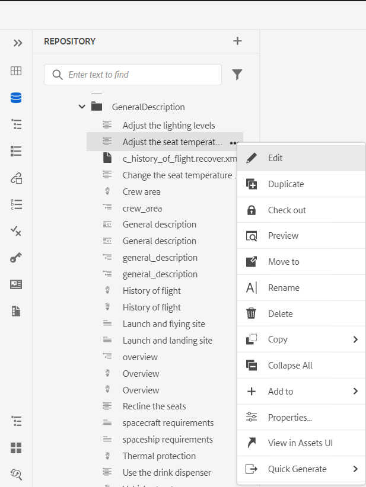
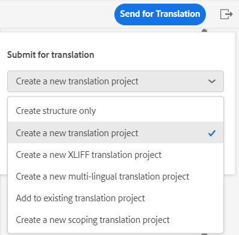

# Novidades da versão 4.3.0 do Adobe Experience Manager Guides (julho de 2023)

Este artigo aborda os recursos novos e aprimorados da versão 4.3.0 do Adobe Experience Manager Guides (mais tarde conhecido como *Guias do AEM*).

Para obter mais detalhes sobre as instruções de atualização, a matriz de compatibilidade e os problemas corrigidos nesta versão, consulte [Notas de versão](./release-notes-4.3.md).

## Conecte-se a uma fonte de dados e insira dados em seus tópicos

Agora você pode se conectar rapidamente às suas fontes de dados usando conectores prontos para uso do AEM Guides. Conectar-se a uma fonte de dados permite manter suas informações sincronizadas com a fonte, e qualquer atualização dos dados é refletida automaticamente, tornando os Guias AEM um verdadeiro hub de conteúdo. Esse recurso ajuda a economizar tempo e esforço para adicionar ou copiar os dados manualmente.

O AEM Guides permite que o administrador configure os conectores prontos para uso para bancos de dados JIRA e SQL (MySQL, PostgreSQL, SQL Server, SQLite). Eles também podem adicionar outros conectores estendendo as interfaces padrão.
Depois de adicionado, você pode visualizar os conectores configurados listados no painel Fontes de dados no Editor da Web.

Crie um trecho de conteúdo para buscar os dados de uma fonte de dados conectada. Em seguida, você pode inserir os dados em seus tópicos e editá-los. Depois de criar um gerador de snippet de conteúdo, você pode reutilizá-lo para inserir os dados em qualquer tópico.

Agora você também pode criar um tópico de uma fonte de dados conectada. Um tópico pode conter dados em vários formatos, como tabelas, listas e parágrafos. Também permite criar um mapa DITA para todos os tópicos. Você pode associar metadados ao tópico ao extrair de uma fonte de dados.

Para obter mais detalhes, consulte [Usar dados da sua fonte de dados](../user-guide/web-editor-content-snippet.md).

## Adicionar citações ao seu conteúdo

Citações são referências à fonte de informações adicionada ao conteúdo. Citações ajudam a estabelecer credibilidade e evitar plágios. As citações ajudam os leitores a localizar a fonte e verificar as informações apresentadas no texto.

Nos Guias do AEM, é possível adicionar citações ou importar citações e aplicá-las ao conteúdo. É possível adicionar essas citações de qualquer fonte de livros, sites e diários.

Depois de inserir as citações nos tópicos, você pode visualizá-las no Editor da Web. Você também pode publicar conteúdo com citações usando o PDF nativo.

{width="300" align="left"}

Para obter mais detalhes, consulte [Adicionar e gerenciar citações no seu conteúdo](../user-guide/web-editor-apply-citations.md).

## Publicar em um fragmento de conteúdo

Fragmentos de conteúdo são partes distintas do conteúdo no AEM. São conteúdos estruturados com base em um modelo de conteúdo. Fragmentos de conteúdo são conteúdo puro sem informações de design ou layout. Eles podem ser criados e gerenciados independentemente dos canais compatíveis com o AEM. A modularidade e a reutilização dos fragmentos de conteúdo levam a maior flexibilidade, consistência, eficiência e gerenciamento mais simples.

Agora, os Guias do AEM oferecem uma maneira de publicar um tópico ou os elementos dentro de um tópico em um fragmento de conteúdo. Você pode criar um mapeamento baseado em JSON entre um tópico e um modelo de fragmento de conteúdo. Use esse mapeamento para publicar em um fragmento de conteúdo o conteúdo presente em alguns ou todos os elementos de um tópico.

Aproveite o potencial do AEM Guides e fragmentos de conteúdo e use fragmentos de conteúdo em qualquer site de AEM. Também é possível extrair os detalhes por meio de APIs compatíveis com fragmentos de conteúdo.

{width="550" align="left"}

## Revisar melhorias

Os Guias do AEM agora oferecem um recurso aprimorado de revisão com as seguintes funcionalidades:

### Painel de revisão para mostrar os projetos de revisão e as tarefas de revisão ativas

Agora o AEM Guides torna suas análises mais simples. Ele fornece o painel Revisões no Editor da Web. O painel Revisões exibe todos os projetos de revisão e as tarefas de revisão ativas nos projetos de revisão dos quais você faz parte.

Como autor, esse recurso ajuda você a abrir facilmente as tarefas de revisão, exibir os comentários e endereçar rapidamente os comentários em uma exibição centralizada.
{width="800" align="left"}
Para obter mais detalhes, consulte **Revisão** descrição do recurso na [Painel esquerdo](../user-guide/web-editor-features.md#id2051EA0M0HS) seção.

### Pesquisar tópicos de revisão

Realizar revisões é um recurso essencial dos Guias do AEM. Ajuda os revisores a revisar os documentos atribuídos a eles .
Agora é possível pesquisar um tópico inserindo alguma parte do texto do título ou caminho de arquivo na barra de pesquisa da exibição de tópicos do painel de revisão. Você também pode optar por exibir todos os tópicos ou exibir tópicos com comentários. Por padrão, é possível exibir todos os tópicos presentes na tarefa de revisão.

{width="800" align="left"}

Para obter mais detalhes, consulte [Revisar tópicos](../user-guide/review-topics.md).

## Estrutura de extensão do Guides

Crie pacotes personalizados sobre os Guias do AEM para fornecer extensibilidade usando a Estrutura de extensão dos Guias do AEM. Esses pacotes são úteis para desenvolvedores e consultores e fornecem extensibilidade aos componentes no Editor. Eles podem direcionar botões, caixas de diálogo e listas suspensas e adicionar JavaScript personalizado que pode interoperar facilmente com a interface do usuário dos Guias AEM.

## Aprimoramentos de PDF nativo

As seguintes melhorias de PDF nativo foram feitas na versão 4.3.0 para tornar os Guias de AEM um produto mais robusto:

### Suporte para variáveis de idioma

Os Guias do AEM fornecem suporte para variáveis de idioma. Você pode usar variáveis de idioma para definir uma versão localizada dos rótulos prontos para uso como Observação, Cuidado e Aviso ou texto estático na saída de PDF.
Você pode adicionar as variáveis de idioma ou a versão localizada dos rótulos às seções apropriadas na saída de PDF e nos modelos de saída.

#### Variáveis de linguagem na saída do PDF

Você pode usar as variáveis de idioma para definir rótulos localizados para elementos como Nota, Cuidado e Aviso. Você pode atualizar o valor dessas variáveis em um ou mais idiomas e, em seguida, o valor localizado é escolhido automaticamente na saída do PDF.
Por exemplo, você pode apresentar o rótulo Observação na saída de PDF das seguintes maneiras:

* Inglês: Note
* Francês: Remarque
* Alemão: Hinweis

#### Variáveis de idioma nos modelos de saída

Se você quisesse criar a saída de PDF em vários idiomas, seria necessário criar diferentes modelos de PDF contendo texto localizado para cada idioma. Agora, com o recurso de variáveis de idioma, é necessário criar o modelo apenas uma vez. Em seguida, para qualquer texto estático que precise localizar, é possível criar variáveis de idioma correspondentes e usá-las no modelo.
É possível criar variáveis de idioma para textos mais longos, como uma frase inteira ou até mesmo um parágrafo. Também é possível aplicar estilos e usar a marcação HTML para formatar essas variáveis de idioma.

Para obter mais detalhes, consulte [Suporte para variáveis de idioma](../native-pdf/native-pdf-language-variables.md).

### Adicionar uma marca d&#39;água à saída do PDF para documentos de rascunho

Agora você pode adicionar uma marca d&#39;água à saída em PDF do documento que ainda não foi aprovado. Essa marca d&#39;água não aparecerá se você gerar o PDF para o documento no estado de documento ‘Aprovado’. Por exemplo, você pode adicionar um Rascunho de marca d&#39;água para a saída de PDF.

Para obter mais detalhes, consulte [Adicionar uma marca d&#39;água à saída do PDF para documentos de rascunho](../native-pdf/use-javascript-content-style.md#watermark-draft-document).

### Capacidade de usar metadados de AEM em layouts de PDF

Os metadados são a descrição ou definição do seu conteúdo. Esses metadados são armazenados no conteúdo do mapa DITA de origem.

Agora, em Guias AEM, você também pode selecionar as propriedades de metadados de seus ativos e adicioná-los ao layout da página. Em seguida, o AEM Guides escolhe essas propriedades de metadados de seus ativos e as publica na saída de PDF.

{width="300" align="left"}

>[!NOTE]
>
> O Guia AEM também é compatível com as propriedades de metadados dos mapas DITA.

Para obter mais detalhes, consulte [Adicionar campos e metadados](../native-pdf/design-page-layout.md#add-fields-metadata).

### Ordenar páginas na saída do PDF

Você pode mostrar ou ocultar as seguintes seções no PDF e também organizar a ordem em que elas devem aparecer na saída final do PDF:

* TOC
* Capítulos e tópicos
* Lista de figuras
* Lista de tabelas
* Índice
* Glossário
* Citação
* Layouts de página

Se você não quiser mostrar uma seção específica na saída do PDF, oculte isso desativando o botão de alternância.

Para obter mais detalhes, consulte [Ordem da página](../native-pdf/components-pdf-template.md#page-order).

### Mesclar páginas

Em uma saída de PDF nativo por padrão, todas as seções começam em uma nova página. Agora é possível mesclar uma seção com sua página anterior ou com a próxima página. Isso publica a seção em continuação com a página selecionada na saída do PDF e não há quebra de página entre elas.

Para obter mais detalhes, consulte a descrição do recurso Mesclar páginas em [Ordem da página](../native-pdf/components-pdf-template.md#page-order) seção.

### Páginas estáticas

Você também pode criar layouts de página personalizados e publicá-los como páginas estáticas na saída do PDF. Isso ajuda a adicionar qualquer conteúdo estático, como Notas ou páginas em branco.

Para obter mais detalhes, consulte a descrição do recurso Páginas estáticas em [Ordem da página](../native-pdf/components-pdf-template.md#page-order) seção.

### Variáveis em referências cruzadas

Você pode usar variáveis para definir uma referência cruzada. Quando você usa uma variável, seu valor é extraído das propriedades.

Agora você também pode usar {figure} e {table}.
Uso {figure}para adicionar uma referência cruzada ao número da figura. Ele escolhe o número de figura a partir dos estilos de numeração automática que você definiu para legenda digital.

Uso {table} para adicionar uma referência cruzada ao número da tabela. Ele escolhe o número da tabela a partir dos estilos de numeração automática definidos para a legenda.

Para obter mais detalhes, consulte [Referências cruzadas](../native-pdf/components-pdf-template.md##cross-references).

### Iniciar qualquer capítulo da página atual

É possível definir as configurações básicas para iniciar um capítulo a partir de uma página ímpar ou par, a estrutura do sumário e definir o formato da linha de chamada para as entradas do sumário.

Agora, você também pode iniciar um capítulo da página atual. Se você optar por fazer isso, todos os capítulos serão publicados sem nenhuma quebra de página. Por exemplo, se um capítulo terminar no meio da página 15, o próximo capítulo também começará a partir da própria 15ª página.

### Capacidade de acessar arquivos de HTML temporários ao gerar a saída de PDF nativa

Agora, o AEM Guides permite baixar os arquivos de HTML temporários criados ao gerar a saída de PDF nativa. Nas configurações de predefinição de saída, selecione a opção para baixar os arquivos temporários.  Os Guias do AEM permitem baixar os arquivos temporários criados ao gerar a saída usando essa predefinição.

Esse recurso permite obter melhores insights sobre o processo de geração, com acesso a estilos e layouts provisórios, e ajuda a corrigir ou alterar os estilos CSS de acordo com os requisitos.

{width="800" align="left"}

Para obter mais detalhes, consulte [Criar uma predefinição de saída de PDF](../web-editor/native-pdf-web-editor.md#create-output-preset).

### Reformulação do editor de CSS

Agora, o editor de CSS foi reprojetado para obter uma melhor experiência do usuário com seletores e propriedades de estilo.

#### Aprimoramento da caixa de diálogo Adicionar estilo

Agora é possível usar seletores personalizados para adicionar estilos complexos. O novo campo Seletor ajuda você a adicionar seletores personalizados além da combinação Classe, Tag e Pseudo Classe. Por exemplo, você pode criar `table a.link` estilo para todos os hiperlinks dentro de uma tabela.

{width="300" align="left"}

#### Personalizar propriedades de estilo

Agora, o AEM Guides apresenta a você um novo painel de propriedades na seção de visualização para estilos. É possível editar as propriedades dos estilos de forma mais eficiente e rápida no painel de propriedades.

## Renomear e mover arquivos na visualização Repositório

Agora, você também pode renomear ou mover um arquivo do painel do repositório. Esse recurso é útil e ajuda a gerenciar os arquivos facilmente no painel Repositório. É possível selecionar um arquivo e renomeá-lo ou movê-lo usando a **Opções** para o arquivo selecionado. O Guias do AEM exibe uma mensagem de sucesso quando você move ou renomeia um arquivo.

{width="550" align="left"}

Para obter mais detalhes sobre o menu Opções de um arquivo, consulte **Exibição de repositório** descrição do recurso na [Painel esquerdo](../user-guide/web-editor-features.md#id2051EA0M0HS) seção.

## Relatório de Links quebrados no Editor da Web

O Guia AEM permite verificar a integridade geral de seus documentos técnicos e gerar relatórios do Editor da Web. Agora, na versão de junho de 2023, o Guia AEM fornece o recurso para visualizar e corrigir links com falha. Esse é um relatório útil que ajuda a gerenciar links com falha. É possível visualizar facilmente os links corrompidos presentes no mapa DITA e corrigi-los.
{width="800" align="left"}

Depois de corrigir um link, ele não é exibido abaixo da lista de links quebrados.

Para obter mais detalhes, consulte [Exibir e corrigir links corrompidos](../user-guide/reports-web-editor.md#report-broken-links).

## Aprimoramentos do esquema

### Usar instruções de relatório para verificar regras no Schematron

Os Guias do AEM agora também oferecem suporte às instruções de relatório com o Schematron. Uma instrução de relatório gera uma mensagem quando uma instrução de teste é avaliada como verdadeira. Por exemplo, se você quiser que a descrição curta tenha 150 caracteres ou menos, poderá definir uma instrução de relatório para verificar os tópicos em que a descrição curta tem mais de 150 caracteres.

Para obter mais detalhes, consulte [Usar instruções assert e report para verificar regras](../user-guide/support-schematron-file.md#schematron-assert-report).

### Usar expressões Regex

Também é possível usar expressões Regex para definir uma regra com a função matches() e executar a validação usando o arquivo Schematron.

Para obter mais detalhes, consulte [Usar expressões Regex](../user-guide/support-schematron-file.md#schematron-assert-report).

### Definir padrões abstratos

Guias AEM também suporta padrões abstratos no Schematron. Você pode definir padrões abstratos genéricos e reutilizar esses padrões abstratos. Padrões abstratos podem simplificar seu esquema Schematron e também ajudar a gerenciar e atualizar sua lógica de validação.

Para obter mais detalhes, consulte [Definir padrões abstratos](../user-guide/support-schematron-file.md#schematron-abstract-patterns).

## Suporte para o formato XLIFF na tradução

Guias do AEM também oferecem suporte para o formato XML Localization Interchange File Format (XLIFF) na tradução. Agora você também pode optar por **Criar um novo projeto de tradução XLIFF** para converter o conteúdo XML no formato XLIFF. O AEM Guides é compatível com a versão 1.2 do XLIFF.

Usando esse formato, você pode exportar o conteúdo para o formato XLIFF padrão do setor e, em seguida, fornecer o mesmo aos fornecedores de tradução. Para obter mais detalhes, consulte [Criar um projeto de tradução](../user-guide/translate-documents-web-editor.md#create-translation-project).

{width="350" align="left"}

## Melhorias na coleção de mapas

Uma Coleção de mapas ajuda a organizar vários mapas e a publicá-los em lote. Muitos aprimoramentos novos foram feitos na Coleção de mapas:

* Agora é possível adicionar predefinições de saída de PDF nativo a uma coleção de mapas e usá-las para gerar a saída de PDF.
* É possível visualizar as predefinições de perfil global e de pasta criadas pelo administrador e usá-las para gerar a saída do PDF.
* Agora, é possível não apenas selecionar uma predefinição individual, mas também ativar todas as predefinições de perfil de pasta para um mapa DITA de uma só vez.
  {width="800" align="left"}

Para obter mais detalhes, consulte [Usar coleção de mapas para geração de saída](../user-guide/generate-output-use-map-collection-output-generation.md).

## Suporte nativo ao PDF no painel de publicação em massa

Com o recurso de ativação em massa dos Guias do AEM, você pode ativar rápida e facilmente seu conteúdo, desde a criação até a instância de publicação. No mapa de Ativação em massa, é possível incluir a predefinição de saída de PDF nativo, o site AEM, PDF, HTML5, Personalizado e saída JSON.
Para obter mais detalhes, consulte [Ativação em massa de conteúdo publicado](../user-guide/conf-bulk-activation.md).

## Ferramenta de movimentação em massa aprimorada

Agora, como administrador, você pode usar a aprimorada Ferramenta de movimentação em massa para mover pastas com muitos arquivos de um local para outro.
Você pode usar a caixa de diálogo Procurar arquivo para selecionar as pastas de origem que deseja mover. Você também pode procurar e selecionar o local de destino para mover as pastas de origem. Selecionar  {width="25" align="left"} próximo a um campo para exibir mais informações sobre ele.

Para obter mais detalhes, consulte [Mover arquivos em massa](../user-guide/authoring-file-management.md#move-files-bulk).

## Painel Favoritos aprimorado

O Guia AEM ajuda você a criar uma coleção ou lista de favoritos de seus arquivos e pastas e usá-los facilmente. Agora **Opções** O menu também está disponível no **Favoritos** painel. É possível renomear a coleção selecionada ou excluí-la da **Opções** menu. É possível selecionar a variável **Atualizar** opção para obter uma nova lista de arquivos ou pastas do repositório. Também é possível exibir o conteúdo da pasta na interface do usuário do Assets.

{width="650" align="left"}

>[!NOTE]
>
> Também é possível atualizar a lista usando o **Atualizar** ícone na parte superior.

Para obter mais detalhes sobre o **Opções** de uma coleção Favoritos, exiba a **Favoritos** descrição do recurso na [Painel esquerdo](../user-guide/web-editor-features.md#id2051EA0M0HS) seção.

## Mudar para o tema do sistema

Agora, também é possível usar o tema do dispositivo. Usar o **Preferências do usuário**, você pode configurar o AEM Guides para alternar automaticamente entre temas claros e escuros com base no tema do seu dispositivo.

{width="550" align="left"}

Para obter mais detalhes, consulte **Preferências do usuário** descrição do recurso na [Barra de ferramentas principal](../user-guide/web-editor-features.md#id2051EA0G05Z) seção.
