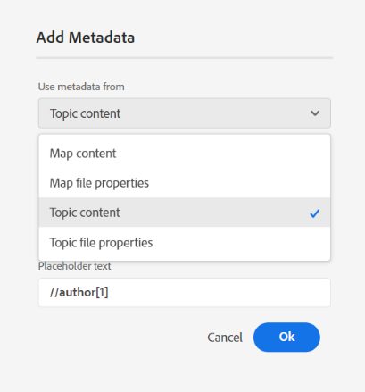

# Novidades da versão 5.0.0 (março de 2025)

Este artigo aborda os recursos novos e aprimorados introduzidos na versão 5.0.0 do Adobe Experience Manager Guides.

Para obter a lista de problemas que foram corrigidos nesta versão, consulte [Problemas corrigidos na versão 5.0.0](../release-info/fixed-issues-5-0-0.md).

Saiba mais sobre as [instruções de atualização para a versão 5.0.0](../release-info/upgrade-instructions-5-0-0.md).

## Interface do usuário do Experience Manager Guides remodelada para melhorar a produtividade e a experiência

O Adobe Experience Manager Guides agora apresenta um design renovado e recursos aprimorados para ajudá-lo a trabalhar com mais rapidez e eficiência do que nunca. A nova interface do usuário oferece uma experiência do usuário intuitiva e aprimorada, com uma página inicial totalmente nova, uma barra de ferramentas do editor mais limpa e organizada, console de mapa dedicado e recursos aprimorados.

Os principais destaques são os seguintes:

- **Apresentação da Página Inicial**: o Experience Manager Guides agora apresenta uma Página Inicial que oferece uma experiência de tela de boas-vindas intuitiva, incluindo uma exibição rápida dos arquivos acessados recentemente, coleções e muito mais.

  Para obter mais detalhes, consulte [Experiência da página inicial do Adobe Experience Manager Guides](../user-guide/intro-home-page.md).

  {width="800" align="left"}

- **Nova experiência do Editor**: agora, experimente o Editor com uma nova aparência. A interface do editor renovada apresenta uma barra de ferramentas mais limpa e organizada, navegação contínua e uma experiência intuitiva geral para ajudar a criar documentos com mais rapidez e eficiência.

  Acessar [conhecer os recursos do Editor](../user-guide/web-editor-features.md).

  {width="800" align="left"}

- **Console de mapas dedicados**: apresenta o console de mapas, um console dedicado onde todos os recursos de gerenciamento e publicação de mapas são agrupados. Agora, você tem opções para gerar saída, traduzir conteúdo, criar relatórios e muito mais, tudo em uma interface.

  Saiba mais sobre [gerenciamento e publicação de mapas](../user-guide/map-console-overview.md).

  {width="800" align="left"}

## Integração com o Adobe Workfront para recursos robustos de gerenciamento de trabalho

O Experience Manager Guides agora se integra perfeitamente ao Adobe Workfront, fornecendo acesso a recursos robustos de gerenciamento de projetos além dos recursos principais de CCMS do Experience Manager Guides.

Com essa integração, você pode criar e gerenciar tarefas do Adobe Workfront diretamente da Experience Manager Guides. Por exemplo, como autor, você pode criar uma tarefa de revisão (com um ou mais tópicos ou mapas DITA adicionados) diretamente na interface do Experience Manager Guides e atribuí-la a um revisor. Como revisor, você pode trabalhar nas tarefas atribuídas na interface do usuário do Experience Manager Guides Review e retorná-las ao autor com comentários. Da mesma forma, é possível criar uma tarefa de publicação e tradução e atribuí-la aos usuários necessários para trabalhar nela.

A integração também oferece a capacidade de monitorar suas filas de trabalho, garantindo que você permaneça organizado e no topo de todas as suas tarefas (tarefas atribuídas). Ela também permite que os gerentes de projeto aproveitem o potencial do Adobe Workfront para um gerenciamento de projetos detalhado no Experience Manager Guides.

Para obter mais detalhes, consulte [integração com o Workfront](../user-guide/workfront-integration.md).

{width="800" align="left"}

## Novo mecanismo de publicação do AEM Sites mais rápido e escalável

Experimente uma publicação mais rápida e escalável no AEM Sites com o novo mecanismo de publicação, otimizado com mapeamento de componente composto para proporcionar uma criação e renderização de página mais rápidas. Ele está disponível com modelos editáveis novos e prontos para uso, que podem ser personalizados de acordo com seus requisitos usando o editor de modelos do AEM. Os modelos utilizam uma combinação de componentes principais do WCM e componentes especializados de guias para garantir que os usuários finais obtenham a melhor experiência em suas páginas do AEM Sites. Você também pode personalizar seus modelos existentes para aproveitar o potencial desse novo mecanismo de publicação.

Saiba mais sobre a [publicação do AEM Sites](../user-guide/generate-output-aem-site-web-editor.md).

{width="500" align="left"}

## Publicar conteúdo independente no AEM Sites de maneira contínua com publicação de um único tópico

Introdução à publicação de um único tópico para páginas do AEM Sites, permitindo que você publique tópicos individuais diretamente nas páginas do AEM Sites sem precisar publicar um mapa inteiro.  Isso simplifica o processo de publicação, tornando-o mais eficiente ao trabalhar com conteúdo independente, como conteúdo de marketing, boletins técnicos ou qualquer outro conteúdo independente. Também simplifica a manutenção do conteúdo, eliminando a necessidade de criar mapas para publicação de tópicos únicos.

Para obter mais detalhes, exiba [Publicar páginas do AEM Sites](../user-guide/publish-aem-sites.md).

{width="500" align="left"}

## O novo editor do Markdown para uma experiência de criação avançada

Agora, experimente uma maneira mais limpa, eficiente e eficiente de criar tópicos de marcação. O Experience Manager Guides apresenta uma nova interface de editor do Markdown com uma barra de ferramentas bem organizada e recursos avançados, incluindo uma visualização **lado a lado** para criar e visualizar conteúdo ao mesmo tempo. Ela também permite a publicação contínua de tópicos do Markdown que fazem parte de um mapa em vários canais.

Para obter mais detalhes, consulte [Criação no Markdown](../user-guide/web-editor-markdown-topic.md).

{width="800" align="left"}

## Aprimoramentos do editor

Os seguintes aprimoramentos do Editor foram feitos como parte da nova versão:

**Melhorias na inserção da tabela**

- Capacidade de configurar os valores padrão para linhas de cabeçalho, linhas de corpo e colunas na tabela ou na caixa de diálogo de inserção simplificável.
- Capacidade de definir as configurações da tabela para colar tabelas copiadas de fontes externas como uma tabela simples.

  Para obter mais detalhes, consulte a seção Tabelas em [Conhecer os recursos do Editor](../user-guide/web-editor-features.md#content-insertion-options).

**Recurso de nome amigável aprimorado para elementos DITA**

O recurso de nome amigável para elementos DITA foi aprimorado. Agora, os valores enumerados padrão são retidos quando um nome amigável é atribuído a um elemento e o nome atualizado é refletido na navegação estrutural, nas propriedades de conteúdo, no painel de conteúdo reutilizável, no painel Glossário e em outros locais relevantes.

**Experiência aprimorada para pesquisas filtradas**

O limite de exibição de ativos para resultados de pesquisa filtrados no Repositório do Adobe Experience Manager Guides foi aumentado. Os resultados da pesquisa agora retornam todos os ativos ou arquivos relevantes que correspondem aos critérios da pesquisa. Você pode percorrer a lista para carregar mais resultados, eliminando a necessidade de realizar pesquisas repetidas para localizar os ativos necessários.

**Texto alternativo para imagens agora adicionado como um elemento**

As imagens agora usam o elemento `<alt>` para texto alternativo, de acordo com os padrões DITA mais recentes. O uso do atributo `@alt` para texto alternativo foi descontinuado mas permanece suportado em versões DITA anteriores.

**Personalizando referência cruzada na barra de ferramentas do editor**

Agora, crie um botão personalizado da barra de ferramentas para **Referência cruzada** para acessar diretamente uma das opções do menu. Por exemplo, você pode configurar essa opção para ir diretamente para um link da Web, link de email, referência de arquivo ou qualquer outra opção disponível de acordo com o requisito.

Para obter mais detalhes, consulte [personalizando a barra superior e a barra de ferramentas](../guides-ui-extensions/customisations/toolbar-topbar.md).

## Revisar melhorias

Os seguintes aprimoramentos de revisão foram feitos como parte da nova versão:

- Agora, ao criar uma tarefa de revisão, você pode digitar um nome de projeto para localizá-lo e selecioná-lo rapidamente na lista suspensa Projeto. Esse aprimoramento elimina a necessidade de percorrer listas de projetos longas, tornando mais rápido e eficiente atribuir tarefas de revisão, especialmente ao gerenciar vários projetos.

- Na interface do Editor e na interface de Revisão, a caixa revisar **Responder** agora oferece suporte a entradas de várias linhas. Você pode usar **Shift**+**Enter** para ir para a próxima linha. Você também pode expandir a caixa de comentário enquanto escreve o comentário.

  Para obter mais detalhes, consulte [Tópicos da revisão](../user-guide/review-topics.md).

- Agora, os autores podem acessar os comentários de revisão no Editor mesmo quando a tarefa de revisão está marcada como fechada. Com os aprimoramentos mais recentes, o painel Revisão apresenta tarefas de revisão ativas e fechadas para cada projeto no Editor. Quando você seleciona uma tarefa de revisão fechada, os comentários correspondentes são exibidos no painel Comentários à direita, garantindo acesso contínuo a comentários de revisão importantes mesmo após o fechamento de uma tarefa.

  Para obter mais detalhes, consulte a seção Revisar de [Conhecer os recursos do Editor](../user-guide/web-editor-features.md).

## Aprimoramentos de publicação

Os seguintes aprimoramentos de publicação foram feitos como parte da nova versão:

**Melhorias no PDF Nativo**

- Capacidade de incluir os metadados do elemento `prolog` de um tópico, como direitos autorais, autor e outros detalhes, nos layouts de página ao gerar uma saída nativa do PDF. Isso garante que os PDFs gerados sejam mais detalhados e forneçam o contexto essencial, tornando-os mais informativos para o leitor.

  Para obter mais detalhes, consulte [Adicionar campos e metadados no layout da página](../native-pdf/design-page-layout.md#add-fields-and-metadata-add-fields-metadata).

  {width="300" align="left"}

- Introdução de uma opção para ativar ou desativar o pré-processamento DITA-OT para a saída do PDF nativo. Ative essa opção se o conteúdo exigir normalização baseada em DITA-OT ou plug-ins DITA-OT personalizados durante o processamento. Isso oferece maior controle sobre como o conteúdo é processado para geração de PDF. Por padrão, a configuração está definida como **Habilitada**.

  Para obter mais detalhes, consulte [Trabalho com a predefinição de saída do PDF](../user-guide/generate-output-pdf.md)

  {width="500" align="left"}

- As configurações de Impressão para geração de saída do PDF Nativo foram movidas da configuração **Modelos** para a **predefinição de Saída do PDF Nativo** para melhor usabilidade. Agora é possível usar o mesmo modelo para PDFs online e de impressão com diferentes configurações de impressão, como perfil de cores.

  Para obter mais detalhes, exiba [predefinição de saída nativa do PDF](../web-editor/native-pdf-web-editor.md)

- Capacidade de adicionar um marcador para a página de índice na saída do PDF nativo para uma navegação de página contínua, especialmente em PDFs longos.

  Para obter mais detalhes, exiba [Adicionar um marcador personalizado na saída do PDF](../native-pdf/add-custom-bookmark.md).

## Melhorias no gerenciamento de conteúdo

As seguintes melhorias de gerenciamento de conteúdo foram feitas como parte da nova versão:

**Campos de metadados personalizados em relatórios**

Este recurso permite configurar campos de metadados personalizados para relatórios por meio de **Configurações**. Após a configuração, é possível exibir esses campos em **Colunas** no painel Filtro dos Relatórios, onde você pode marcá-los ou desmarcá-los para controlar sua visibilidade.

Para obter mais detalhes, consulte o [relatório de mapa DITA do Console de Mapa](../user-guide/reports-web-editor.md).

**Botão Atualizar na interface de tradução**

Apresentando um botão Atualizar na interface de tradução, que permite atualizar o painel de tradução com arquivos e status atualizados.

**Aprimoramento do fluxo de trabalho de pós-processamento de ativos**

O suporte para o pós-processamento de ativos foi fornecido por meio da API REST, bem como pela API SDK. Agora, o evento de processamento de ativos seria acionado e pode ser ouvido para definir mais fluxos de trabalho.

Para obter mais detalhes, consulte [Manipulador de eventos pós-processamento](../api-reference/post-process-event.md).

## Recursos obsoletos

**Geração rápida**

O Experience Manager Guides não oferece mais suporte ao recurso **Geração Rápida** para gerar saída diretamente do modo de exibição Repositório ou Mapa.

Esse recurso foi removido dos painéis de exibição Repositório e Mapa. É recomendável usar o **Console de mapas** para todas as ações relacionadas ao gerenciamento de mapas e à publicação.

Para obter mais detalhes, consulte [Gerenciamento e publicação de mapas](../user-guide/map-console-overview.md).

**Passar argumentos de metadados do mapa raiz para a linha de comando DITA-OT**

A capacidade de transmitir argumentos de metadados do mapa raiz por meio da linha de comando DITA-OT foi descontinuada como parte da versão. Agora, é recomendável usar o campo **Propriedade do arquivo** ou **Metadados** na Predefinição para transmitir os metadados DITA-OT necessários.

Para continuar transmitindo os metadados na linha de comando DITA-OT, é necessário atualizar o `pass.metadata.args.cmd.line` no `Config.Manager`.

Para obter mais detalhes, consulte [Definir configurações de geração de saída](../cs-install-guide/conf-output-generation.md#configure-the-dita-ot-command-line-argument-field-to-accept-root-map-metadata).
