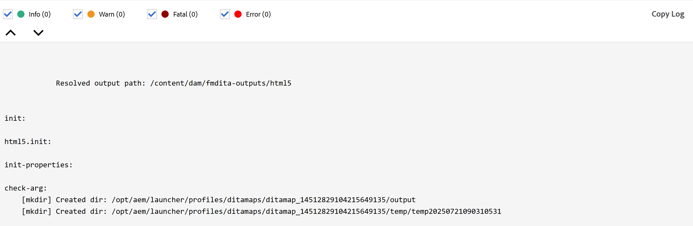

# Novidades da versão 5.1.0 (setembro de 2025)

Este artigo aborda os recursos novos e aprimorados introduzidos na versão 5.1.0 do Adobe Experience Manager Guides.

Para obter a lista de problemas que foram corrigidos nesta versão, consulte [Problemas corrigidos na versão 5.1.0](fixed-issues-5-1-0.md).

Saiba mais sobre [as instruções de atualização para a versão 5.1.0](../release-info/upgrade-instructions-5-1-0.md).

## Fluxo de trabalho de revisão aprimorado

Com esta versão, o fluxo de trabalho de revisão foi significativamente aprimorado para oferecer melhor suporte à comunicação contínua entre autores e revisores. As principais atualizações incluem:

- Fluxos de trabalho de gerenciamento de tarefas com notificações acionáveis
- Capacidade de marcar usuários para buscar atenção imediata
- Acesso aos detalhes do projeto e da tarefa no painel de revisão para facilitar o uso

Com esses aprimoramentos, os usuários agora podem esperar:

- Ciclos de revisão eficientes e oportunos
- Esforço manual reduzido durante trocas de feedback

Para obter mais detalhes, exiba [Introdução à revisão](../user-guide/review.md)

## Experiência aprimorada para criar e usar arquivos DITAVAL

Esta atualização apresenta vários aprimoramentos que simplificam a criação, o gerenciamento e a aplicação de arquivos DITAVAL, permitindo um melhor controle sobre o conteúdo condicional e o estilo em todas as saídas.

Os principais destaques são os seguintes:

- **Suporte aprimorado para sinalização na criação de arquivos DITAVAL:** o Experience Manager Guides oferece novos recursos para personalizar a publicação de conteúdo por meio do suporte aprimorado à sinalização em arquivos DITAVAL. Agora é possível aplicar sinalizadores de início e término ao redor de um conteúdo específico, incluindo imagens, e enriquecer as seções sinalizadas com opções de formatação como negrito, itálico e muito mais. Para lidar com sobreposições de condição, o **conflito de estilo** pode ser configurado, o que inclui a definição de uma cor de fundo e texto padrão, garantindo clareza e consistência na saída. Esses sinalizadores são totalmente compatíveis na geração do PDF nativo, e a saída resultante reflete de forma precisa e abrangente todos os elementos de estilo aplicados.
Para obter mais detalhes, consulte [Usar o Editor DITAVAL](../user-guide/ditaval-editor.md).

  {width="350"}

- **Suporte a vários arquivos DITAVAL para PDF Nativo:** Agora, vários arquivos DITAVAL podem ser adicionados para que cada um seja exibido como uma entrada marcada, facilitando a identificação e a remoção, oferecendo maior flexibilidade e controle sobre o conteúdo condicional nas saídas do PDF

  Além disso, essa atualização melhora a criação de predefinições de saída, permitindo campos DITAVAL editáveis em todos os formatos, permitindo que os usuários especifiquem manualmente os caminhos DITAVAL.

  Para obter mais detalhes, consulte [Entender as predefinições de saída](../user-guide/generate-output-understand-presets.md) no Experience Manager Guides.

## Aprimoramentos de publicação

Os seguintes aprimoramentos de publicação foram feitos como parte da nova versão:

### Filtragem de log de geração de saída aprimorada

Essa versão traz melhorias na interface do usuário para o recurso de filtragem de log de geração de saída. Agora você pode filtrar melhor os logs de geração de saída para todos os quatro níveis distintos; **Info**, **Warn**, **Error** (incluindo erros e exceções) e **Fatal**; com indicadores de código de cores aprimorados e intuitivos que simplificam a análise e tornam mais nítida a visibilidade em todo o fluxo de log. Essa melhoria permite que você navegue pelos registros com mais eficiência e localize os problemas críticos com precisão.

Para obter mais detalhes, consulte [Solução de problemas básica](../user-guide/generate-output-basic-troubleshooting.md).

### Os arquivos temporários para saída publicada agora incluem Autor e URLs de publicação em um novo arquivo de configuração

Os últimos aprimoramentos de publicação no Experience Manager Guides agora adicionam um novo arquivo `system_config.xml` aos arquivos temporários gerados ao publicar saídas do HTML, PDF e JSON usando DITA-OT, bem como saída do PDF nativo. Este arquivo é incluído automaticamente no trabalho de publicação e também pode ser acessado por meio de arquivos temporários quando você habilita a opção **Reter arquivos temporários** para as predefinições e gera a saída.

O arquivo `system_config.xml` contém detalhes da instância do AEM, incluindo a URL do Autor, a URL Local e a URL de Publicação, que fornecem um contexto mais claro e melhoram a rastreabilidade das URLs baixadas.

Para obter mais detalhes, consulte [Compreender as predefinições de saída](../user-guide/generate-output-understand-presets.md).

### Novo suporte à variável de caminho de saída para geração de saída

Esta atualização apresenta a configuração `output path` dinâmica para predefinições de saída como PDF Nativo, DITA-OT PDF, JSON, HTML5 e Personalizado. Em vez de usar um caminho fixo, os usuários agora podem definir o local de saída usando a variável `${base_output_path}` durante a instalação, oferecendo maior flexibilidade. O caminho padrão anterior `/content/dam/fmdita-outputs` não é mais obrigatório.

Todos os caminhos de saída associados às predefinições de perfil de pasta global serão migrados automaticamente para utilizar a nova variável de caminho de saída base. No entanto, para perfis de pastas personalizados, a migração não é automática; aconselhamos entrar em contato com a equipe de Sucesso do cliente para obter assistência.

Para obter mais detalhes, consulte [Compreender as predefinições de saída](../user-guide/generate-output-understand-presets.md).

### A Linha de base exportada agora inclui o estado do Documento

O recurso Exportar Linha de Base agora inclui o **estado do documento** junto com detalhes importantes, como título, nome de arquivo, tipo de arquivo e número de versão no instantâneo da linha de base. Esse aprimoramento melhora o gerenciamento da linha de base, fornecendo uma visão geral mais abrangente da linha de base.

Para obter mais detalhes, exiba [Criar e gerenciar linhas de base do Console de mapa](../user-guide/web-editor-baseline.md#manage-baselines).

### Suporte para publicação incremental orientada por linha de base por meio do painel de mapas para saída do AEM Sites usando mapeamento de componentes herdados

O processo de geração de saída incremental foi aprimorado para oferecer suporte à publicação de versões específicas de tópicos definidas na linha de base selecionada para sites do AEM usando o mapeamento de componentes herdados, garantindo a propagação precisa do conteúdo na saída.

Para obter mais detalhes, exiba [Geração de saída incremental](../user-guide/generate-output-aem-site.md).

## Aprimoramentos do editor

Os seguintes aprimoramentos do Editor foram feitos como parte da nova versão:

### Experiência de pesquisa aprimorada para o painel Conteúdo reutilizável

O Experience Manager Guides apresenta uma experiência de pesquisa aprimorada no Painel de conteúdo reutilizável. Com essa atualização, a pesquisa de qualquer palavra-chave agora verifica todos os arquivos adicionados como conteúdo reutilizável, e não apenas os abertos, garantindo que você encontre a posição exata da palavra-chave em todas as ocorrências, independentemente de os contêineres estarem abertos ou recolhidos. Além disso, ao limpar a barra de pesquisa, o estado original de todos os contêineres é mantido, fornecendo uma funcionalidade de pesquisa mais eficiente e fácil de usar.

Para obter mais detalhes, consulte [Conteúdo reutilizável](../user-guide/web-editor-features.md#reusable-content).

### Atributo &quot;Formato&quot; adicionado para links de referência

O Adobe Experience Manager Guides agora adiciona um atributo **format** para links de referência no Editor. Este atributo é exibido na **exibição do Source** e indica claramente o tipo de arquivo, como:

- Para arquivos com extensão **.pdf**, o formato será definido como **pdf**
- Para arquivos com uma extensão **.html**, o formato será definido como **html**
- Para arquivos com arquivos **.dita** ou **.ditamap**, o formato será definido como **dita**

Além disso, arquivos com uma extensão **.xml** também terão seu formato definido como **dita**. Para arquivos sem qualquer extensão, o formato será deixado em branco. Além disso, para qualquer link de referência com um escopo definido como **externo**, o formato será definido como **html** independentemente da extensão de arquivo nos links de referência.

### Opções aprimoradas de download de mapa no Editor

O Experience Manager Guides apresenta uma nova opção **Usar nomes de arquivos reais** na caixa de diálogo **Baixar mapa**. Agora, ao baixar arquivos de mapa, você pode optar por manter os nomes de arquivo originais em vez dos UUIDs padrão, facilitando muito o reconhecimento e o gerenciamento dos arquivos. Esta opção só estará disponível se você selecionar **Manter hierarquia de arquivos** e estiver desabilitada ao escolher **Nivelar hierarquia de arquivos**, dando a você mais flexibilidade na organização dos mapas baixados.

Para obter mais detalhes, consulte [Baixar arquivos](../user-guide/authoring-download-assets.md#download-a-dita-map-file-from-the-editor).

{width="300"}

### Solicitação de tempo limite da sessão para evitar perda acidental de conteúdo

Uma mensagem pop-up agora o notifica quando a sessão do Adobe Experience Manager expira e você é desconectado devido a inatividade. Essa mensagem é disparada quando você tenta editar o conteúdo no Experience Manager Guides após o término da sessão. O recurso ajuda a reduzir o risco de perda de trabalho não salvo e melhora a confiabilidade e a fluidez gerais da experiência, mesmo durante períodos de inatividade.

Saiba mais sobre [prompt de tempo limite de sessão](../user-guide/session-timeout-prompt.md) no Experience Manager Guides.

### Manuseio de `navref` aprimorado no Editor

Os últimos aprimoramentos do Editor melhoram a manipulação de elementos `navref` em um mapa DITA. Agora, quando você adiciona um elemento `navref` a um mapa, a caixa de diálogo **Selecionar caminho** é aberta, permitindo que você escolha facilmente as referências de mapa a serem incluídas como links de navegação em seu mapa. Depois de adicionado, o título do mapa adicionado é exibido na exibição Autor e Layout, fornecendo melhor visibilidade da navegação incluída durante a criação.  Além disso, o elemento `navref` adicionado é resolvido automaticamente para exibir o mapa referido no Editor.

Para obter mais detalhes, consulte [Adicionar referências de navegação](../user-guide/map-editor-other-features.md#add-navigation-references).

### Melhorias na interface na barra de ferramentas do Editor e preferências do usuário

Com esta versão, as configurações em **Preferências do usuário** na página inicial das guias Geral e Aparência foram reestruturadas. Inclui renomear o rótulo **Abrir preferências para Mapas** e mover a opção Espaços não separáveis para a barra de ferramentas do Editor.

Além disso, na barra de ferramentas do Editor, alguns alternadores de acesso rápido para habilitar ou desabilitar o Controle de Alterações, Marcas e Espaços Não Separáveis agora estão agrupados na opção **Mostrar** na lista suspensa Menu para melhor usabilidade.

Para obter mais detalhes, exiba [Barra de ferramentas no Editor](../user-guide/web-editor-toolbar.md#menu-dropdown).
