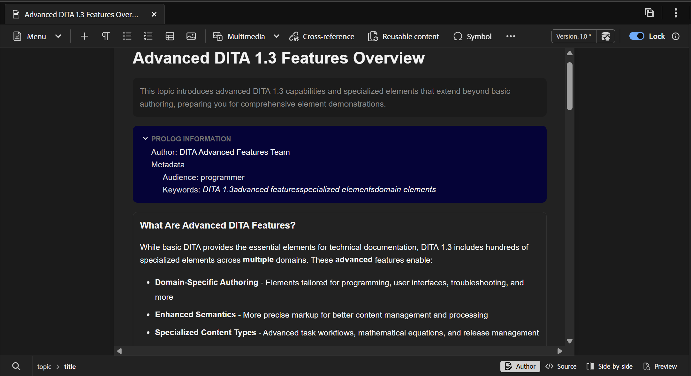
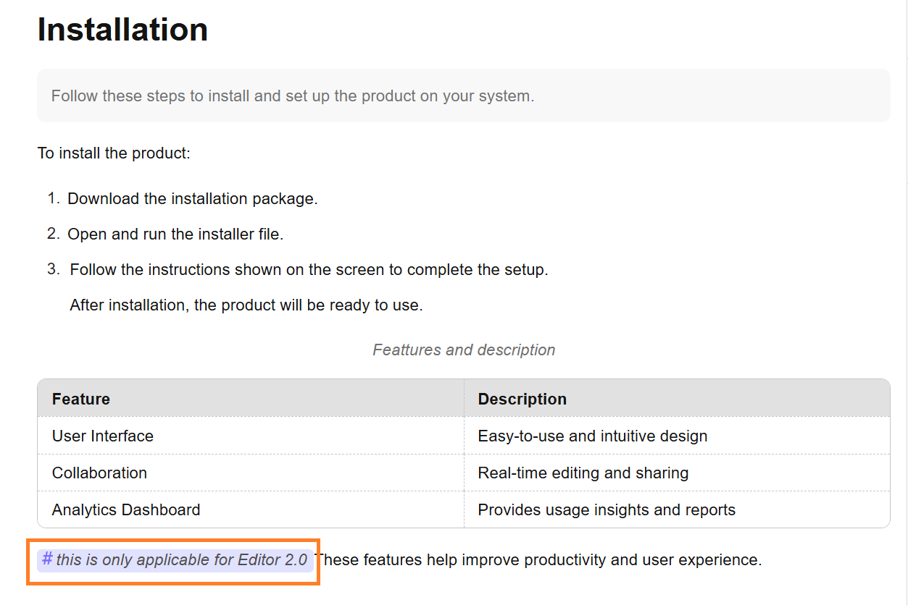
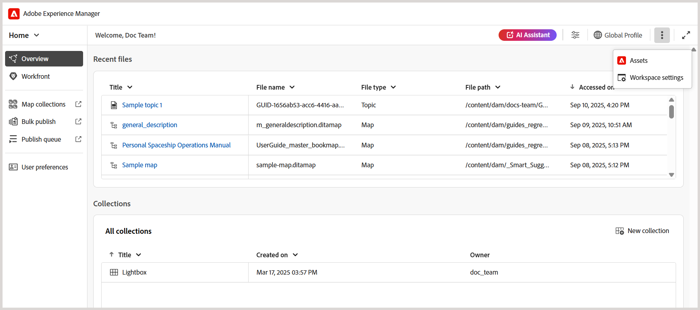

# Novidades da versão 5.2.0 (maio de 2026)

Este artigo aborda os recursos novos e aprimorados introduzidos com a versão 5.2.0 do Adobe Experience Manager Guides as a Cloud Service.

Para obter a lista de problemas corrigidos nesta versão, consulte [Problemas corrigidos na versão 5.2.0](../release-info/fixed-issues-5-2-0.md).

Saiba mais sobre as [instruções de atualização para a versão 5.2.0](../release-info/upgrade-instructions-5-2-0.md).

## Introdução ao Editor 2.0

O Editor 2.0 (também conhecido como Novo editor) oferece criação simplificada, permitindo que você crie conteúdo com mais eficiência nos modos de tag e não tag por meio de uma experiência mais intuitiva. A versão traz melhor desempenho, com carregamentos de página mais rápidos e edição mais suave, mesmo para tópicos grandes e complexos. Ele também oferece estabilidade aprimorada ao solucionar as principais lacunas de criação, especialmente em relação à navegação e ao comportamento do cursor. Além disso, uma interface moderna oferece uma interface do usuário atualizada e fácil de usar que equilibra a funcionalidade com a facilidade de uso. Para obter detalhes, consulte [Introdução ao Editor](../user-guide/web-editor.md).

Veja um vídeo de visão geral destacando os recursos do Editor 2.0.

>[!VIDEO](https://video.tv.adobe.com/v/3484007)

Veja a seguir as melhorias que tornam a criação mais fácil e eficiente.

### Interface e experiência do usuário reprojetadas

Uma interface atualizada melhora a usabilidade geral, tornando a navegação e a criação de conteúdo mais intuitivas e consistentes.

- **CSS mais avançado para elementos no modo Autor e Visualização**: o CSS padrão aprimorado para elementos fornece estilo aprimorado e melhor consistência visual em ambos os modos, de criação e de visualização.

  {width="650"}

- **Suporte para temas escuros**: o suporte para um tema escuro na área de edição de conteúdo aprimora a experiência de criação para usuários que preferem trabalhar com uma interface escura.

  {width="650"}

- **Configurações consolidadas do Editor em nível de usuário**: um novo painel de configurações centralizado que oferece aos Autores um melhor controle sobre o comportamento do editor, permitindo que os usuários gerenciem preferências com mais facilidade a partir de um único local. As opções de configuração incluem, capacidade de ativar/desativar:

   - Espaços ininterruptos no modo Autor
   - Configurações de visibilidade de tag com ou sem atributos
   - Comentários XML no modo Autor
   - Menu de inserção rápida para inserção de elemento no editor

  {width="350"}

  Para obter mais informações sobre como definir as configurações do Editor, consulte [Configurações do Editor](../user-guide/config-editor-settings.md).

- **Melhor representação do conteúdo condicional no modo Autor**: o conteúdo condicional é exibido com mais clareza no modo Autor, ajudando os autores a identificar e gerenciar variações com mais eficiência. Para obter detalhes, consulte [Condições](../user-guide/web-editor-left-panel.md#conditions) no painel esquerdo do Editor.

  {width="650"}

### Recursos de criação aprimorados

Fornece ferramentas aprimoradas e flexibilidade para simplificar a criação e edição de conteúdo nos fluxos de trabalho.

- **Exibir atributos junto com elementos no modo de marca**: os autores agora podem exibir atributos de elemento com o modo de marca, oferecendo melhor visibilidade e controle sobre o conteúdo estruturado. Para configurar este recurso, exiba [Configurações do editor](../user-guide/config-editor-settings.md).

  {width="650"}

- **Menu de inserção rápida**: permite adicionar elementos diretamente ao editar no modo Autor, na posição do cursor, sem navegar até a barra de ferramentas. Os elementos usados com frequência também podem ser configurados na seção Favoritos por meio das configurações do Editor para agilizar o acesso. Para obter detalhes, exiba [Editar tópicos](../user-guide/web-editor-edit-topics.md).

  {width="650"}

- **Capacidade de exibir, editar e inserir comentários XML no modo Autor**: permite que os autores exibam, editem e insiram comentários XML diretamente no modo Autor, para melhor visibilidade do conteúdo. Para configurar este recurso, exiba [Configurações do editor](../user-guide/config-editor-settings.md).

  {width="650"}

- **Modo lado a lado**: permite a exibição simultânea dos modos Autor e Source, com ambas as exibições permanecendo em perfeita sincronização para facilitar a comparação, edição e validação de alterações de conteúdo. Para obter detalhes, consulte [Exibições do editor](../user-guide/web-editor-views.md).

  {width="650"}

- **Criação de tabela aprimorada**: melhora a experiência geral de criação de tabela com interações mais intuitivas e eficientes para criar e gerenciar tabelas.

   - Interações fluidas e intuitivas: insira facilmente linhas e colunas, juntamente com suporte de arrastar e soltar para reordenar linhas e colunas.
   - Barra de ferramentas contextual: Acesse ações específicas da tabela, como formatação, alinhamento, mesclagem e outras ações adicionais diretamente na tabela.
   - Configuração de tabelas: adicione várias linhas ou colunas em uma única ação, reduzindo etapas repetitivas e melhorando a eficiência.

  {width="650"}

  Para obter detalhes, exiba [Trabalhar com tabelas](../user-guide/web-editor-other-features.md#work-with-tables-in-the-new-editor).

### Desempenho aprimorado para tópicos grandes

O novo editor aprimora a experiência de trabalhar com tópicos grandes e complexos fornecendo renderização mais rápida do conteúdo, funcionalidade de desfazer e refazer mais confiável e um marcador sujo para indicar claramente as alterações não salvas.

## Introdução de um novo repositório na página inicial e experiência de pesquisa aprimorada

O Repositório, agora acessível diretamente da página inicial, serve como um espaço centralizado para a descoberta aprimorada de pastas e arquivos. Ele apresenta o **painel de navegação de pasta** dedicado e uma **exibição tabular do Repositório** personalizável. A experiência de pesquisa e filtro renovada facilita significativamente a localização e a localização de arquivos. Para obter mais detalhes, consulte [Conhecer a interface do Repositório](../user-guide/home-page-repository-view.md).

No Editor, a experiência de Pesquisa e filtro para arquivos agora é consistente com a Página inicial. Um novo [painel de Pesquisa](../user-guide/search-panel-explorer.md), localizado na parte inferior da interface do Editor, foi introduzido para exibir resultados de pesquisa. Além disso, o Repositório agora é renomeado para **Explorer** no Editor, permitindo que você procure pastas e arquivos como antes.

### Suporte para filtro de estado do documento

Você também pode filtrar os resultados da pesquisa do Repositório com base no estado atual do documento dos arquivos. Com o filtro de estado do Documento, você pode restringir sua pesquisa usando os valores de filtro disponíveis definidos no arquivo `ui_config.json` no perfil de Pasta.

Os valores de filtro padrão disponíveis para o estado do Documento são: Rascunho, Editar, Em revisão, Aprovado, Revisado e Concluído.

<!-- For details on customizing the default document state filters values, view [Configure document state filters](../install-conf-guide/conf-doc-state-filters.md).  -->

>[!NOTE]
>
> Se você estiver usando configurações personalizadas para `ui_config.json`, certifique-se de fazer um backup delas antes de atualizar. Após a atualização, revise e ajuste suas configurações para alinhar-se às alterações introduzidas na versão mais recente.

### Ícone de miniatura para multimídia

Todos os arquivos multimídia são exibidos com ícones de miniatura, facilitando a identificação visual e a localização de imagens no **Repositório**. Esse aprimoramento também se aplica à pesquisa de arquivos no **painel Pesquisar**, ajudando você a distinguir rapidamente os ativos multimídia de outros tipos de arquivos.

## Introdução à pesquisa no modo Source em Localizar e substituir

O Experience Manager Guides introduziu várias melhorias no recurso Localizar e substituir, disponível no painel Esquerdo da interface do Editor. Juntamente com uma interface aprimorada para melhor usabilidade, esta versão introduz um novo botão de alternância **Usar modo de origem** no painel **Localizar e substituir**.

Ativar esse modo permite executar uma pesquisa global não apenas no conteúdo visível, mas também no conteúdo original subjacente (estrutura XML, incluindo elementos, tags e valores de atributo) da string pesquisada. Esse modo garante uma pesquisa abrangente em todo o conteúdo.

{width="650"}

Nesse modo, é possível aplicar filtros para restringir a pesquisa por Tipo de arquivo, Estado do documento, Data da última modificação e muito mais. Você também tem a opção de baixar um relatório CSV detalhado após executar a operação Substituir tudo, que fornece um instantâneo de todas as ações de substituição executadas, juntamente com seus status de sucesso e falha.

Para obter mais detalhes, exiba a seção [Localizar e substituir](../user-guide/web-editor-left-panel.md#find-and-replace) no _painel esquerdo do Editor_.

>[!NOTE]
>
> Para o recurso **Usar modo de origem** no painel Localizar e substituir, a reindexação deve ser concluída primeiro.

## Experiência aprimorada de navegação em arquivos e pastas

Esta versão apresenta uma interface mais limpa e intuitiva para navegar pelos arquivos e caminhos de pastas no Experience Manager Guides.

Ao navegar pelos arquivos, a caixa de diálogo **Selecionar arquivo** renovada agora apresenta um layout com guias com duas exibições - **Repositório** para navegar por todo o repositório de conteúdo em um formato tabular e **Coleções** para acesso rápido a tópicos, mapas e imagens usados com frequência.

{width="650"}

Os principais aprimoramentos incluem:

- Exibição tabular de arquivos e pastas para navegação organizada.
- Navegação estrutural e painel de navegação da pasta para mover-se facilmente pelas pastas.
- Suporte para seleção de vários arquivos para conteúdo reutilizável, referências de tópico, esquema, predefinições de saída (usando DITAVAL) e Workfront.
- Visualize os arquivos selecionados para facilitar a revisão; para várias seleções, visualize todos os arquivos e remova qualquer arquivo do painel Visualização, conforme necessário.
- Opções de pesquisa e filtragem para restringir os resultados por nome, título, tipo de arquivo, estado do documento e tags.

A caixa de diálogo **Selecionar caminho** também apresenta uma exibição estruturada em árvore aprimorada para navegação de pastas, garantindo uma maneira mais organizada e eficiente de selecionar caminhos no repositório de conteúdo.

{width="350"}

Para obter mais detalhes, exiba [seção Procurar arquivos e pastas no Experience Manager Guides](../user-guide/web-editor-other-features.md#browse-files-and-folders-in-experience-manager-guides) em _Outros recursos no Editor_.

## Aprimoramentos de criação

Os seguintes aprimoramentos de criação foram feitos como parte desta versão:

### Acesse o Caminho e a UUID das referências nos arquivos a partir do painel Propriedades de conteúdo

Agora você pode usar o **Caminho do link** para exibir o caminho relativo da referência selecionada e o **UUID do link** para exibir seu identificador exclusivo no painel Propriedades de conteúdo. Também é possível copiar o caminho absoluto completo e a UUID associada diretamente da interface usando os ícones ao lado de Caminho do link e UUID do link, facilitando o rastreamento e a reutilização de ativos vinculados.

Para obter detalhes, exiba [Propriedades do conteúdo](../user-guide/web-editor-right-panel.md#content-properties).

### Indicador de cópia de trabalho para alterações de metadados

Qualquer alteração nos campos de metadados disponíveis em **Propriedades do arquivo** ou aplicado no back-end também acionará o asterisco (*) na versão do documento. Uma versão do documento é marcada como _suja (*)_ sempre que você adiciona, exclui ou modifica campos de metadados padrão ou personalizados. Para evitar que atualizações de metadados geradas pelo sistema afetem esse indicador, os administradores podem configurar uma lista de itens a serem ignorados para propriedades de metadados. Para obter detalhes sobre como configurar propriedades de metadados, consulte [Configurar a lista para ignorar de propriedades de metadados](../install-conf-guide/conf-metadata-prop.md).

### Melhorias no painel de validação do Schematron

Os seguintes aprimoramentos foram feitos na interface do usuário do Schematron para obter mais clareza, usabilidade e resultados de validação:

- No painel Validação, uma mensagem de estado vazio é exibida quando nenhum arquivo do Schematron é adicionado, fornecendo melhor clareza e direção para as próximas etapas.

  {width="350"}

- Quando vários arquivos do Schematron são adicionados, eles são organizados em uma opção consolidada, fornecendo melhor visibilidade dos arquivos do Schematron configurados.

  {width="350"}

- Com base no atributo de função definido no arquivo Schematron, os resultados da validação agora são categorizados como: `Fatal`, `Error`, `Warn` ou `Info`. Cada categoria inclui uma contagem visível juntamente com uma dica de ferramenta contextual para uma interpretação mais clara.

  {width="350"}

Para obter mais detalhes sobre como usar arquivos Schematron no Experience Manager Guides, exiba [Suporte para arquivos Schematron](../user-guide/support-schematron-file.md).

### As cópias de idioma de tradução agora estão disponíveis no painel Direito da interface do editor

Uma nova seção **Traduções** está disponível no painel direito em *Propriedades do arquivo*, no Editor. Esta seção fornece acesso direto a todas as cópias de idioma disponíveis para o ativo aberto no momento (mapa, tópico, imagem etc.). Não é mais necessário navegar para a interface do usuário do Assets para exibir ou acessar essas cópias de idioma.

{width="350"}

Para cada cópia de idioma, é possível passar o mouse sobre o arquivo para localizar seu caminho no repositório ou simplesmente selecioná-lo para abri-lo no Editor. Além de abrir arquivos, você também pode executar muitas ações usando o menu **Opções**. Algumas das ações que você pode executar incluem Editar, Visualizar, Copiar UUID, Copiar caminho, Adicionar às coleções e Propriedades.

Para obter mais detalhes, consulte [Painel direito no Editor](../user-guide/web-editor-right-panel.md#file-properties).

### Atualizar tópicos ou mapear no modo de Visualização

>[!NOTE]
>
>Esse comportamento se aplica somente ao Editor antigo. No Novo editor, o conteúdo de Visualização é atualizado automaticamente.

Apresentando a nova funcionalidade **Atualizar** para mapas que já estão abertos no modo de Visualização. Com esse novo recurso, você pode atualizar facilmente o conteúdo do mapa inteiro ou de tópicos individuais presentes nele.

- Para atualizar o mapa inteiro (incluindo todos os tópicos), um novo botão **Atualizar** é introduzido no canto superior esquerdo do Editor.

  {width="600"}

- Para atualizar o conteúdo de tópicos individuais, uma nova opção **Atualizar tópico** é introduzida no menu de contexto.

  {width="600"}

Para obter mais detalhes, consulte [Recursos do editor de mapas](../user-guide/map-editor-advanced-map-editor.md).

### Contagem de palavras para tópicos e mapas

Agora é possível rastrear a contagem de palavras presente em um mapa ou arquivo de tópico. O novo campo **Contagem de palavras** do painel direito exibiria o número total de palavras presentes em um tópico (ou mapa), onde as palavras separadas por espaços são contadas como palavras individuais. Ele é atualizado automaticamente sempre que você salva as alterações. Para referências cruzadas, somente o texto de exibição é incluído, enquanto as teclas são excluídas.

{width="350"}

Para obter detalhes, exiba [painel direito no Editor](../user-guide/web-editor-right-panel.md#file-properties).

### Identifique e corrija facilmente IDs duplicadas em tópicos e mapas na exibição Autor

O Experience Manager Guides agora inclui um botão **IDs duplicadas** no Editor para ajudar você a identificar e corrigir rapidamente as IDs duplicadas presentes em um único tópico ou mapa. Quando IDs duplicadas são detectadas, este botão aparece no canto inferior esquerdo da interface do Editor na exibição **Autor**. Ao selecionar o botão, uma lista de todas as instâncias com IDs duplicadas é exibida em um popover. A seleção de uma ocorrência destaca o conteúdo correspondente no tópico ou mapa, permitindo que você localize e corrija as IDs duplicadas no painel direito.

Para obter mais detalhes, exiba [Recursos adicionais no Editor](../user-guide/web-editor-other-features.md).

{width="350"}

### Melhorias nos filtros de Repositório e Relatórios

O filtro **Bloqueado por** nos filtros Avançado do Repositório e **Autor** nos Relatórios de mapa DITA agora carregam listas de usuários gradualmente conforme você rola a tela, em vez de carregar tudo de uma vez. Esse carregamento paginado melhora a velocidade e torna o trabalho com grandes conjuntos de dados de usuários mais eficiente e simples.

### Pesquisar citações em todos os campos de diário

Agora você pode pesquisar citações em todos os campos do Diário, como *Título*, *Título do diário*, *Autor*, *Ano*, *Volume*, *Número* e *Páginas*, usando a opção **Qualquer campo** na caixa de diálogo **Adicionar citação**. A pesquisa retorna a citação mais próxima com base no texto inserido.

Para obter mais detalhes sobre como adicionar citações no Experience Manager Guides, exiba [Adicionar e gerenciar citações em seu conteúdo](../user-guide/web-editor-apply-citations.md).

{width="350"}

### Agora, as configurações do são renomeadas para Configurações do Workspace e podem ser acessadas na Página inicial

Para melhorar a navegação e a usabilidade, foram introduzidos os seguintes aprimoramentos:

- As **Configurações** no menu **Mais ações** do Editor foram renomeadas para **configurações do Workspace**.
- O menu **Mais ações** (o menu de três pontos), anteriormente disponível apenas na interface do Editor e do console de Mapa, agora pode ser acessado na [Página inicial](../user-guide/intro-home-page.md).

  

### Indexação aprimorada para sugestões inteligentes no Assistente de IA

Agora é possível rastrear facilmente o status de cada tentativa de indexação para Sugestões inteligentes no Assistente do AI com novos indicadores de status: Indexação concluída, Não sincronizado, Em andamento e Indexação com falha. O último carimbo de data e hora de indexação agora é gravado no nível do perfil da pasta para melhorar a rastreabilidade. Além disso, as restrições de pasta pai-filho são aplicadas ao especificar uma pasta ou caminho de arquivo para indexação.

Para obter mais detalhes, consulte [Configurar o Assistente de IA para ajuda inteligente e criação](../install-conf-guide/conf-profiles.md#configure-ai-assistant-for-smart-help-and-authoring-only-for-cloud-service).

## Revisar melhorias

Os seguintes aprimoramentos de revisão foram feitos como parte desta versão:

### Lembretes automatizados para tarefas de revisão

Agora você pode habilitar **Lembretes automatizados** para agendar notificações do AEM e lembretes de email para revisores, antes da data de vencimento de uma tarefa de revisão e depois dela se tornar vencida. Você pode configurar vários lembretes em cada caso, com lembretes de atraso enviados em uma sequência definida e lembretes de atraso acionados depois que a tarefa é marcada como vencida, com base no agendamento de lembrete configurado. Para obter detalhes, exiba [Enviar tópicos para revisão](../user-guide/review-send-topics-for-review.md).

### Histórico da versão

Os revisores agora podem acessar o Histórico de versão para tópicos em revisão, permitindo visualizar e comparar versões revisadas e atualizadas anteriormente do mesmo tópico em tarefas de revisão anteriores. Isso ajuda os revisores a validar as alterações feitas desde ciclos de revisão anteriores e manter a continuidade, revisando comentários, rótulos e outros detalhes relacionados no contexto de revisão atual. Para obter detalhes, exiba o [Histórico de versões do Revisor](../user-guide/review-topics.md#version-history-for-the-reviewer).

### Acessar o status de tarefas de revisão diretamente do painel Revisão

Como iniciador de uma tarefa de revisão, agora é possível verificar o status da tarefa de revisão diretamente do painel Revisão. Com os últimos aprimoramentos, a caixa de diálogo **Atualizar tarefa** no painel Revisão inclui uma nova opção **Verificar status da revisão**. A seleção dessa opção leva você diretamente ao painel de revisão, onde é possível visualizar o status da tarefa para cada revisor, permitindo um acesso mais rápido ao progresso da tarefa sem a necessidade de alternar contextos.

Para obter mais detalhes, exiba [Solicitar uma revisão ou feche uma tarefa de revisão como um Autor](../user-guide/review-close-review-task.md).

{width="350"}

### Atribuição do revisor com base na seleção de projeto ativa

- Atribuir um Revisor a uma tarefa de revisão agora depende de uma seleção de projeto ativa. O campo **Atribuir a** na página *Criar Tarefa de Revisão* permanece desabilitado até que um projeto ativo seja selecionado. Depois que um projeto é selecionado, o campo **Atribuir a** é habilitado e lista somente os usuários e grupos de usuários associados a esse projeto. Isso garante que as tarefas de revisão sejam atribuídas somente a membros válidos do projeto e impede a seleção não intencional do Revisor.

  

- O campo **Atribuir a** agora oferece suporte à pesquisa com digitação antecipada, permitindo que você localize usuários ou grupos de usuários rapidamente digitando texto.

Juntos, esses aprimoramentos tornam a seleção do Revisor mais precisa, eficiente e alinhada aos fluxos de trabalho de revisão específicos do projeto.

Para obter mais detalhes, exiba [Enviar tópicos para revisão](../user-guide/review-send-topics-for-review.md).

### Modificar tarefas de revisão em andamento

Você pode adicionar novos tópicos a uma tarefa de revisão em andamento (se eles não tiverem sido enviados anteriormente para revisão) ou remover tópicos de uma tarefa de revisão em andamento sem afetar o fluxo de trabalho de revisão. Na página **Detalhes da Tarefa**, você pode simplesmente selecionar ou desmarcar tópicos para modificar a lista de tópicos. Os revisores são notificados (via AEM e email) sobre qualquer alteração nos tópicos atribuídos por meio de notificações do AEM e por email. Para obter mais detalhes, exiba [Enviar tópicos para revisão](../user-guide/review-send-topics-for-review.md).

{width="650"}

## Aprimoramentos de tradução

Os seguintes aprimoramentos de Tradução foram feitos como parte desta versão:

### Indicador de ativos sem versão enviados para tradução

Ao gerenciar traduções, é importante garantir que todo o conteúdo seja versionado antes de enviá-lo para processamento. Para ajudar nisso, o Experience Manager Guides agora fornece um indicador claro para tópicos que salvaram alterações, mas ainda não têm controle de versão.

Se um arquivo contiver alterações sem controle de versão (não salvas como uma nova versão no mapa), um ícone _info_ será exibido ao lado do arquivo, indicando que existem atualizações. Para focalizar rapidamente nesses arquivos, habilite a opção **Mostrar ativos somente com alterações sem controle de versão** no painel Filtros.

Para obter mais detalhes, exiba [Traduzir documentos do Console de Mapa](../user-guide/translate-documents-web-editor.md).

{width="650"}

## Aprimoramentos no gerenciamento de ativos

Esta versão apresenta os seguintes aprimoramentos ao gerenciamento de ativos:

### Usar Nivelar hierarquia de arquivos para baixar mapas com nomes de arquivos originais e metadados associados

Agora, você pode usar a opção Nivelar hierarquia de arquivos para baixar um mapa com seu nome de arquivo original. Além disso, o pacote baixado inclui um arquivo `metadata.json`, tornando os metadados associados facilmente acessíveis e reutilizáveis fora do Experience Manager Guides.

Para obter mais detalhes sobre como baixar arquivos no Experience Manager Guides, consulte [Baixar arquivos](../user-guide/authoring-download-assets.md).

### As propriedades de metadados não são mais editáveis para arquivos somente leitura

Com esta versão, quando a configuração `Disable edit without locking the file` está habilitada, as propriedades do arquivo não podem mais ser editadas se um arquivo estiver no modo **Somente leitura**.

Essa limitação se aplica a todos os pontos de entrada nos quais as propriedades podem ser modificadas para arquivos DITA e Markdown, incluindo:

- O **painel direito** da interface do Editor
- A opção **Propriedades** do menu de contexto do arquivo
- O Relatório de Metadados de um mapa
- A interface do usuário do Assets

Para ativos que não são DITA (como imagens e multimídia), as propriedades dos metadados permanecem editáveis mesmo no modo somente leitura.

Se um arquivo for Somente leitura, você deverá primeiro fazer check-out do arquivo antes de fazer qualquer alteração nas propriedades dele. Essa alteração impõe controles de permissão mais rígidos e garante que as atualizações de propriedade sigam as mesmas regras de check-out e bloqueio que as edições de conteúdo.

### Usar regex para ativar ou desativar o pós-processamento

Agora é possível usar o regex para ativar ou desativar o pós-processamento para pastas. Esse aprimoramento permite que os administradores definam regras de pós-processamento que se aplicam a várias pastas ou hierarquias de pastas inteiras usando uma única configuração, em vez de especificar caminhos de pastas individuais.

Para obter mais detalhes, exiba [Usar regex para habilitar ou desabilitar o pós-processamento](../install-conf-guide/conf-folder-post-processing.md).

### Limpeza automatizada da árvore B para desempenho ideal

Para manter a eficiência do sistema e evitar o congestionamento de recursos, um novo processo de segundo plano limpa regularmente as árvores B no nível do sistema. Isso garante que os ativos que não existem mais ou foram adicionados temporariamente não ocupem espaço desnecessário.

O sistema identifica de forma inteligente os candidatos à limpeza e realiza a remoção automática. Além disso, esse recurso é configurável, dando aos administradores controle sobre seu comportamento com base nas necessidades operacionais.

Para obter mais detalhes, exiba [Configurar limpeza da árvore B](../install-conf-guide/conf-btree-cleanup.md).

### Manuseio de mapas DITA aprimorado com grande número de chaves

Agora você pode trabalhar perfeitamente com mapas DITA que contêm um grande número de chaves. Esse aprimoramento garante carregamento mais rápido e melhor desempenho, facilitando o gerenciamento de mapas complexos sem interrupções.

Após a atualização da build, o sistema pode enfrentar um aumento temporário na carga, causando um atraso no pós-processamento de dados recém-carregados. Isso se deve a um OTS (script único) automatizado em execução em segundo plano. Quando o script for concluído, o desempenho do sistema voltará ao normal.

### Processamento de ativos aprimorado

- Um processo automatizado foi introduzido para manter os ativos no `/content/dam` atualizados. O sistema aciona o reprocessamento de ativos a cada 15 minutos. Durante cada ciclo, os ativos que foram adicionados recentemente ou que permaneceram não processados dentro do intervalo de 15 minutos mais recente são coletados e reprocessados, melhorando a eficiência e a consistência em todo o repositório de conteúdo.
- Executar o processamento de ativos nos níveis de pasta e de arquivo individual
- Filtre ativos escolhendo tipos específicos de ativos, como tópicos, mapas, Markdown, HTML/CSS, DITAVAL ou outros arquivos compatíveis, para processar somente os arquivos necessários.
- Aplique filtros com base em data para limitar o escopo de processamento por um período especificado.
- Reprocesse ativos diretamente usando a nova opção (**Reprocessar ativos**) disponível no menu de contexto de arquivos e pastas no modo de exibição Repositório e no painel Explorador.

Para obter detalhes sobre o processamento de ativos, consulte [Processar ativos](../user-guide/asset-processor.md).

## Aprimoramentos de publicação

Os seguintes aprimoramentos de publicação foram feitos como parte desta versão:

### Configurar representações de imagem personalizadas para predefinições de saída específicas

Agora é possível configurar diferentes representações de imagem para predefinições de saída individuais no mesmo tipo de saída usando o atributo `outputName` em `renditionmapping.xml`. Esse aprimoramento oferece maior flexibilidade ao publicar conteúdo que requer várias resoluções de imagem para diferentes cenários. Por exemplo, você pode querer uma imagem de alta resolução para a saída principal do HTML5 ao usar uma miniatura menor para uma predefinição leve.

Para obter mais detalhes, exiba [Manipular representação de imagem na geração de saída](../install-conf-guide/conf-output-generation.md#handle-image-rendition-during-output-generation).

### Baixar logs para saída gerada

Ao gerar saída e exibir logs, um novo botão **Baixar logs** agora está disponível, permitindo baixar o log no dispositivo local para facilitar o acesso e a revisão.

### Variáveis de idioma para referências cruzadas na saída do PDF nativo

Ao publicar a saída do PDF Nativo, você pode usar [variáveis de idioma](../native-pdf/native-pdf-language-variables.md) para traduzir texto estático de referência cruzada, como _Consulte no capítulo_ ou _Consulte na página_. A variável usa o idioma definido no tópico por meio do atributo `xml:lang`.

Para obter detalhes sobre como definir a predefinição de saída nativa do PDF e as configurações de referência cruzada, exiba a [predefinição de saída nativa do PDF](../web-editor/native-pdf-web-editor.md).

### Suporte para mapeamento de componentes no nível do elemento na publicação do AEM Sites (usando mapeamento de componentes compostos)

O Experience Manager Guides agora oferece suporte ao mapeamento de componentes no nível do elemento na saída do AEM Sites (usando o mapeamento de componentes compostos), fornecendo às equipes controle preciso sobre como os elementos DITA são renderizados usando o `componentmapping.json`. Mapeando `topicref`, títulos, imagens, tabelas e muito mais para os Componentes principais apropriados do AEM, você obtém uma estrutura mais limpa em vez de tudo padronizado para o componente de Texto. Isso resulta em melhor desempenho e desbloqueia experiências mais ricas e modernas do Sites.

Para obter mais detalhes, exiba [Mapeamento de componentes para o AEM Sites](../install-conf-guide/component-mapping.md).

## Nova experiência de linha de base introduzida no Experience Manager Guides

O gerenciamento de linhas de base grandes e complexas agora é mais rápido, estável e fácil de dimensionar com a **nova experiência de linha de base**, criada em uma arquitetura de linha de base reprojetada. Essa atualização soluciona desafios de desempenho e confiabilidade duradouros, preservando os fluxos de trabalho existentes.

Disponível como um aprimoramento beta, essa atualização fornece solução para pontos problemáticos comuns, como carregamento lento, estados de linha de base inconsistentes e capacidade de gerenciamento limitada, fornecendo uma experiência de linha de base mais rápida, estável e previsível, com suporte adicional para operações de automação e linha de base em grande escala. As principais melhorias são:

- Desempenho e escalabilidade aprimorados
- Interface de usuário e consistência de back-end mais fortes
- Visibilidade de filtragem, navegação e dependência ampliada

Para obter detalhes, exiba [Nova experiência de linha de base (Beta) no Experience Manager Guides](../user-guide/web-editor-baseline-v2.md).

## Aprimoramentos na API

As seguintes melhorias na API foram feitas como parte desta versão:

- Novas APIs são introduzidas para criar um novo projeto de tradução e rastrear seu status. Essas APIs ajudam a automatizar o processo de tradução, reduzindo o esforço manual e melhorando a eficiência. Para obter detalhes, exiba [Criar projeto de tradução](../api-reference/translation-project.md)
- APIs de processamento de ativos aprimoradas com capacidade de filtragem aprimorada para arquivos e pastas. Para obter detalhes, consulte [Processar ativos](../api-reference/bulk-assets-processing.md).
- A nova API está disponível para rastrear o status de pós-processamento de ativos e pastas individuais. Isso é especialmente útil para equipes que usam fluxos de trabalho automatizados, em que a publicação precisa ocorrer somente após o conteúdo ser totalmente processado. A API oferece uma maneira confiável de confirmar a prontidão, reduzindo o risco de falhas de publicação causadas por processamento incompleto. Além disso, com a introdução dessa API, os eventos de pós-processamento de ativos não serão acionados automaticamente. Em vez disso, os administradores agora podem habilitar esse evento por meio de uma configuração no `fmdita config manager`.
Para obter detalhes, exiba a [API para rastrear o status pós-processamento de ativos e pastas individuais](../api-reference/track-post-processing-status.md) e a [Configuração do manipulador de eventos pós-processamento no gerenciador de configuração fmdita](../api-reference/post-process-event.md)

## Introdução ao treinamento de produtos e ao conteúdo de aprendizado no Experience Manager Guides

O recurso de conteúdo **Treinamento e Aprendizado de Produtos** no Experience Manager Guides permite que equipes de treinamento e designers de instrução criem cursos interativos de eLearning diretamente da interface do Experience Manager Guides.

Com a criação orientada por modelo, os componentes interativos do curso e o suporte a avaliações, as equipes podem desenvolver conteúdo de treinamento de alta qualidade alinhado aos objetivos organizacionais.

>[!NOTE]
> 
> O recurso de conteúdo de Treinamento e aprendizado do produto permanece desativado por padrão para todas as instâncias do Experience Manager Guides as a Cloud Service. Os administradores podem habilitar este recurso no nível do perfil da pasta em **Configurações do Workspace** > **Geral**.

Os principais recursos são os seguintes:

- Gerenciamento centralizado do conteúdo de aprendizagem
- Criação orientada por modelo
- Suporte para reutilização de conteúdo
- Criação e gerenciamento de avaliação
- Fluxos de trabalho de revisão baseados na Web
- Gerenciamento de tradução líder do setor
- Publicação em vários canais usando formatos de saída prontos para uso SCORM e PDF

Para obter mais detalhes, consulte [Guia de introdução](../learning-content/course-overview.md) e [Guia de configuração](../lc-config-guide/introduction.md).