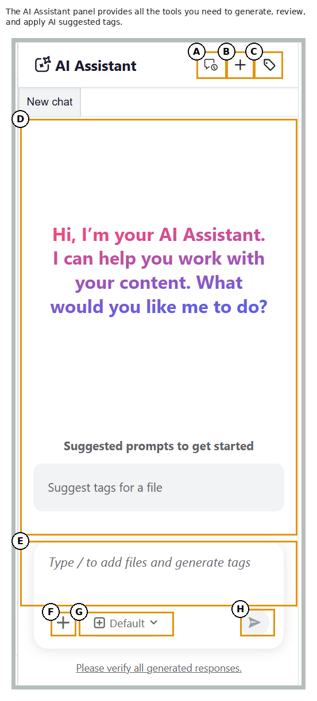

# Usar o Assistente de IA no modo Agente

>[!NOTE]
>
> O Assistente de IA no modo Agente está disponível no Experience Manager Guides as a Cloud Service a partir da versão 2026.09.0. Ela exige que sua organização seja integrada à CX Enterprise Coworker; uma vez integrado, entre em contato com a equipe de Sucesso do cliente para ativar o recurso. Para obter detalhes sobre a configuração, consulte [Configurar o Assistente de IA no Modo Agencial](../install-conf-guide/configure-ai-assistant-agentic-mode-cs.md).

O Assistente de IA no modo Agente torna a marcação de conteúdo mais rápida, fácil e consistente. Usando a habilidade Marcação inteligente agênica da Adobe CX Enterprise Coworker, o Assistente de IA analisa seu conteúdo e recomenda tags relevantes com base na taxonomia de sua organização, em vez de ler manualmente o conteúdo para decidir quais tags se aplicam. Você permanece no controle revisando as tags sugeridas e optando por aplicá-las ou rejeitá-las antes de confirmar sua seleção, reduzindo o esforço manual, melhorando a precisão da marcação e garantindo metadados consistentes em toda a documentação.

## Painel Assistente de IA

O painel Assistente de IA fornece todas as ferramentas necessárias para gerar, revisar e aplicar as tags sugeridas de IA.

{width="650"}

Os seguintes componentes do Assistente de IA no modo Agente ajudam a adicionar arquivos, configurar recomendações de tags e gerenciar o fluxo de trabalho de marcação inteligente:

- **(A)** Histórico da conversa: exibir e reabrir conversas anteriores para analisar recomendações e ações de marcas anteriores.

  {width="350"}

- **(B)** Novo chat: inicia uma nova sessão de marcação para um tópico, mapa ou conjunto de arquivos diferente.
- Namespace da marca **(C)**: selecione os namespaces de taxonomia de onde o Assistente de IA gera recomendações de marca. Somente as tags dos namespaces selecionados são consideradas.

  {width="350"}

- **(D)** Espaço de resposta: revise as recomendações de marcas geradas pela IA e escolha aceitá-las, rejeitá-las ou modificá-las antes de aplicar as marcas.
- **(E)** Espaço de prompt: insira uma solicitação de prompt para gerar recomendações de marca para o conteúdo selecionado.
- **(F)** Anexar arquivos ou adicionar contexto: adiciona tópicos, mapas ou arquivos externos do sistema local para fornecer o conteúdo que o AI Assistant analisa para obter recomendações de marcas.
- Modelo **(G)**: exibe o modelo de IA usado para analisar o conteúdo e gerar recomendações de marca. Vários modelos OpenAI e Anthropic Claude estão disponíveis para seleção. Por padrão, a opção **Usar padrão do manifesto** está selecionada, que usa o modelo configurado para o assistente selecionado.
- **(H)** Enviar: envia seu prompt e o conteúdo anexado para gerar recomendações de marca habilitada por IA.

## Aplicar tags a um ou vários tópicos com a habilidade de marcação inteligente

Execute as seguintes etapas para usar o Assistente do AI para aplicar tags a um ou vários tópicos com a habilidade de marcação inteligente:

1. Faça logon no Experience Manager Guides.
1. Na página inicial, selecione **Assistente de IA** na barra de navegação. Certifique-se de que o Assistente de IA no modo Agente está ativado pelo seu administrador.
1. Adicione o tópico para o qual você deseja gerar recomendações de tag usando um dos seguintes métodos:

   - **Usando prompts sugeridos**: para o primeiro chat na área Resposta, selecione o prompt **Sugerir tags para um arquivo**. O prompt é adicionado automaticamente ao espaço do Prompt. Selecione `[file]` e escolha o tópico no Repositório ou em uma Coleção na caixa de diálogo **Selecionar arquivo**. Você pode selecionar um tópico da caixa de diálogo **Selecionar arquivo**.

     {width="650"}

   - **Usando atalho**: digite `/` no campo Prompt, escolha **Adicionar referência do repositório** para escolher um tópico do Repositório (ou **Adicionar arquivos do dispositivo** para carregar um tópico do seu computador) e digite um prompt como *Sugerir marcas para um arquivo*.

   - **Arrastar e soltar**: arraste e solte um único tópico ou vários tópicos no espaço Solicitação e insira um prompt como *Sugerir marcas para um arquivo*.

     {width="650"}

   - **Especificar caminhos de tópico**: digite `@` seguido pelos caminhos separados por vírgulas para vários tópicos de mapas iguais ou diferentes e insira um prompt como *Sugerir marcas para um arquivo*.

     {width="650"}

1. Selecione **Enviar**.

1. O Assistente de IA analisa o conteúdo do tópico e gera recomendações de tag.

   {width="650"}

1. Revise as tags sugeridas, da seguinte maneira:

   >[!NOTE]
   >
   > Para tópicos que já contêm tags, o Assistente do AI exibe as tags existentes. Essas tags são somente leitura e não podem ser modificadas ou removidas.

   - Para um único tópico, você pode **Aceitar** as recomendações para aplicá-las ou **Rejeitá-las** se elas não forem necessárias.

     {width="650"}

   - Para vários tópicos:
     1. Selecione **Visualizar** para analisar as recomendações de marcas geradas pela IA.

        {width="650"}

     1. Revise as tags sugeridas para cada tópico e escolha uma das seguintes ações:
        - **Aceitar tudo** para aplicar todas as marcas sugeridas para todos os tópicos.
        - **Rejeitar tudo** para descartar todas as marcas sugeridas para todos os tópicos.
        - **Limpar todas as sugestões** para remover todas as marcas sugeridas para um tópico específico.
        - Selecione o ícone **X** ao lado de uma marca para remover uma sugestão de marca individual.

          {width="650"}

1. Quando você aceita as tags sugeridas, a habilidade Marcação inteligente adiciona as tags geradas pela IA às tags já aplicadas ao conteúdo.

Após concluir a revisão, o Assistente do AI exibe um resumo das tags aplicadas ao tópico e qualquer recomendação de tag rejeitada.

{width="650"}

## Aplicar tags a vários tópicos de um mapa usando a habilidade de marcação inteligente

Execute as seguintes etapas para usar o Assistente de IA para aplicar tags a vários tópicos de um mapa com a habilidade de marcação inteligente:

1. Faça logon no Experience Manager Guides.
1. Na página inicial, selecione **Assistente de IA** na barra de navegação. Certifique-se de que o Assistente de IA no modo Agente está ativado pelo seu administrador.
1. Adicione o mapa para o qual você deseja gerar recomendações de tag usando qualquer um dos seguintes métodos, conforme discutido nos tópicos:

   - **Usando prompts sugeridos**: para o primeiro chat na área Resposta, selecione o prompt **Sugerir tags para um arquivo**. O prompt é adicionado automaticamente ao espaço do Prompt. Selecione `[file]` e escolha o mapa no Repositório ou em uma Coleção na caixa de diálogo **Selecionar arquivo**.

   - **Arrastar e soltar**: arraste e solte um mapa no espaço Solicitação e insira um prompt como *Sugerir marcas para um arquivo*.

   - **Usando atalho**: digite `/` no campo Prompt, escolha **Adicionar referência do repositório** para escolher um mapa do Repositório (ou **Adicionar arquivos do dispositivo** para carregar um mapa do seu computador) e digite um prompt como *Sugerir marcas para um arquivo*.

     {width="650"}

1. Selecione **Enviar**.
Uma mensagem indica que o mapa selecionado contém vários tópicos. Selecione **Selecionar tópicos** para escolher os tópicos para os quais deseja fazer recomendações de marca.

   {width="650"}

1. Na caixa de diálogo **Selecionar tópicos**, selecione os tópicos para os quais deseja fazer recomendações de marca.\
   A caixa de diálogo **Selecionar tópicos** fornece o seguinte:

   - **Lista de tópicos:** exibe todos os tópicos do mapa selecionado. Selecione os tópicos para os quais você deseja gerar recomendações de tag.
   - **Painel de visualização:** Exibe uma visualização do tópico selecionado junto com suas marcas existentes.
   - **Filtro:** Filtre os tópicos para exibir somente aqueles com **Marcas adicionadas** ou **Nenhuma marca adicionada**.

     {width="650"}

1. Selecione **Confirmar**. O AI Assistant analisa os tópicos selecionados e exibe o número de recomendações de tag geradas para cada tópico.
1. Selecione **Visualizar** para analisar as recomendações de marcas geradas pela IA.
1. Revise as tags sugeridas para cada tópico e escolha uma das seguintes ações:
   - **Aceitar tudo** para aplicar todas as marcas sugeridas para todos os tópicos.
   - **Rejeitar tudo** para descartar todas as marcas sugeridas para todos os tópicos.
   - **Limpar todas as sugestões** para remover todas as marcas sugeridas para um tópico específico.
   - Selecione o ícone **X** ao lado de uma marca para remover uma sugestão de marca individual.

     >[!NOTE]
     >
     > Para tópicos que já contêm tags, o Assistente do AI exibe as tags existentes. Essas tags são somente leitura e não podem ser modificadas ou removidas.

   {width="650"}

1. Quando você aceita as tags sugeridas, a habilidade de marcação inteligente adiciona as tags geradas pela IA às tags já aplicadas ao conteúdo.

Após concluir a revisão, o AI Assistant exibe um resumo das tags aplicadas a cada tópico e qualquer recomendação de tag rejeitada.

