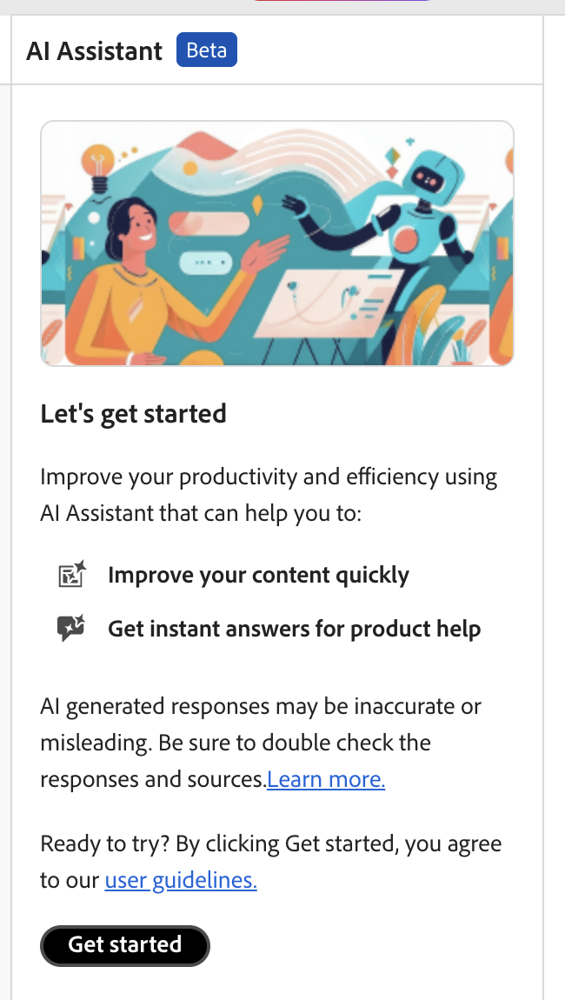

# Assistente de IA (Beta)

O **Assistente de IA** do Adobe Experience Manager Guides é uma ferramenta avançada orientada por IA, projetada para melhorar a produtividade por meio de recursos inteligentes de ajuda e criação. Ele reúne dois recursos robustos de IA — **Criação** e **Ajuda** — na interface do Experience Manager Guides, permitindo que você crie conteúdo e acesse informações da documentação do Experience Manager Guides com mais rapidez e eficiência.

>[!NOTE]
>
> O recurso Assistente de IA está disponível no momento para o Adobe Experience Manager Guides as a Cloud Service.

O recurso **Criação** no Assistente de IA torna o processo de criação mais inteligente e rápido. Ele oferece recursos como geração de sugestões inteligentes para reutilização de conteúdo, tradução de conteúdo, melhoria da qualidade do conteúdo e muito mais, tudo com base no conteúdo selecionado. Esse recurso melhora a experiência geral de criação e a produtividade dos autores.

Para obter mais detalhes, consulte [Criação](./ai-assistant-right-panel.md).

O recurso **Ajuda** do Assistente de IA é uma ferramenta intuitiva baseada em chat, projetada para ajudá-lo a entender melhor o Experience Manager Guides, solucionar problemas e pesquisar informações na Documentação do Adobe Experience Manager Guides. Em vez de pesquisar nos guias de usuário e documentos de referência, você pode usar o recurso **Ajuda** para encontrar rapidamente respostas relevantes para suas consultas. Isso ajuda a economizar tempo e permite que você se concentre na criação de conteúdo, resultando em maior produtividade e eficiência.

Para obter mais detalhes, consulte a [Ajuda](./ai-based-smart-help.md).

## Introdução ao Assistente de IA

Ao usar o **Assistente de IA** pela primeira vez, você será solicitado a enviar seu consentimento antes de usar os recursos de IA gerativa da Experience Manager Guides.

Execute as seguintes etapas para iniciar o Assistente de IA:

1. Fazer logon no Experience Manager Guides
1. Na página inicial, selecione **Assistente de IA** na parte superior.   Certifique-se de que o recurso Assistente de IA esteja ativado pelo administrador.

   A página do Assistente de IA é exibida, destacando seus principais recursos, o link de diretrizes do usuário e um botão **Introdução**.

   

1. Leia as diretrizes de usuário cuidadosamente e selecione **Introdução** para iniciar o Assistente de IA.

**Tópicos relacionados**

[Perguntas frequentes sobre segurança do Assistente de IA](./ai-assistant-faq.md)

[Divulgações da IA geradora da Adobe Experience Manager Guides](./adobe-generative-ai-disclosures.md)

[Configurar o AI Assistant para obter ajuda e criação inteligentes](../cs-install-guide/conf-smart-suggestions.md)
