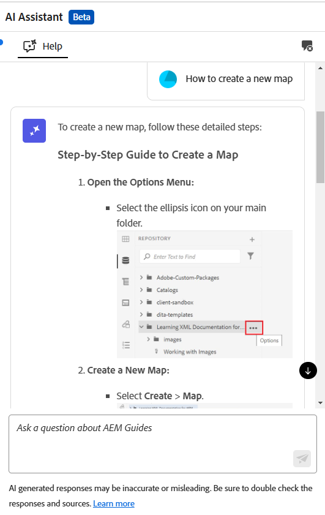
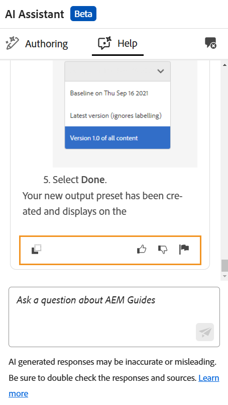

# Aumente a eficiência com a Ajuda inteligente no Assistente de IA (Beta)

O Experience Manager Guides fornece a Ajuda inteligente baseada em GenAI, um recurso de pesquisa conversacional que ajuda a localizar conteúdo relevante na [documentação do Adobe Experience Manager Guides](https://experienceleague.adobe.com/pt-br/docs/experience-manager-guides/using/overview).

Você pode fazer suas perguntas e obter respostas de forma informativa. A resposta à sua consulta baseia-se no conteúdo da documentação do produto. Essa busca é totalmente conversacional. Você pode fazer perguntas sobre os vários recursos do Experience Manager Guides ou optar por fazer consultas de solução de problemas. Com base na resposta, você também pode fazer mais perguntas. A resposta também inclui links para documentos de origem, os quais você pode consultar para obter detalhes.

Por exemplo, você pode fazer perguntas como *Como publicar um mapa?* Você recebe uma resposta e os links para os artigos relacionados. Em seguida, se quiser saber como usar um método específico para publicar o output, você poderá fazer perguntas sobre ele. Por exemplo, *Como publicar um mapa no PDF?*

Quando você abre o **Assistente do AI** na Página Inicial, no console Mapa ou no Editor, o painel **Ajuda** é aberto à direita. No caso do Editor, o painel Criação também é exibido, oferecendo recursos de criação inteligentes. Para obter detalhes, exiba o [Assistente de IA para criar documentos de forma inteligente](./ai-assistant-right-panel.md)

{width="300"}

*Exibir o painel **Ajuda**.*

Execute as seguintes etapas para usar o painel Ajuda para encontrar o conteúdo apropriado e resolver suas consultas:

1. Selecione **Assistente de IA** para abrir o painel da Ajuda.

   >[!NOTE]
   >
   > Nos [perfis globais ou de nível de pasta](../cs-install-guide/conf-folder-level.md#conf-ai-guides-assistant), o administrador precisa definir as perguntas padrão que aparecem no painel.

1. Digite a pergunta para encontrar o conteúdo relacionado na documentação do Experience Manager Guides. Você pode selecionar a pergunta padrão no painel ou digitar a pergunta na caixa de texto.

1. Selecione **Enviar**  ou pressione **Inserir** para exibir a resposta às suas perguntas.

   Dependendo da sua pergunta, você pode visualizar o conteúdo, as imagens aplicáveis e os links para os artigos.

   {width="300"}

   *Selecione a pergunta de exemplo e exiba o conteúdo e as imagens na resposta.*

1. Selecione os links para os artigos no final e exiba informações detalhadas sobre a resposta à sua pergunta.

1. Selecione **Limpar conversa**  para remover o histórico da conversa do painel. Você pode iniciar uma nova conversa e encontrar conteúdo relevante.

Em vez de pesquisar nos guias de usuário e documentos de referência, você pode usar o recurso **Ajuda** para encontrar rapidamente respostas relevantes para suas consultas. Isso ajuda a economizar tempo e permite que você se concentre na criação de conteúdo, resultando em maior produtividade e eficiência.

## Opções disponíveis para respostas da Ajuda do assistente de IA

Ao receber uma resposta do Assistente de IA no painel **Ajuda**, você pode interagir com ele ou fornecer feedback para aprimorar sua precisão e confiabilidade. Seus comentários ajudam a equipe do Experience Manager Guides a aprimorar a precisão e a relevância das respostas do Assistente de IA, melhorando seu desempenho ao longo do tempo.

As seguintes opções estão disponíveis para participação ou para fornecer feedback sobre as respostas fornecidas pelo painel **Ajuda** do Assistente de IA:

{width="300"}

- **Copiar**: copie a resposta para usar em seus documentos.
- **Curtir**: indica que a resposta foi útil ou precisa. Selecione o ícone Curtir para gostar da resposta e use a opção **Conte-nos mais** para fornecer feedback detalhado.
- **Descurtir**: marque a resposta como inútil ou incorreta. Selecione o ícone Descurtir para gostar da resposta e use a opção **Conte-nos mais** para fornecer feedback detalhado.
- **Relatório**: sinalizar a resposta para revisão se contiver erros ou conteúdo impreciso. Selecione o ícone de sinalizador para abrir a caixa de diálogo **Resultados do relatório**. Selecione entre as opções disponíveis ou forneça um feedback personalizado.