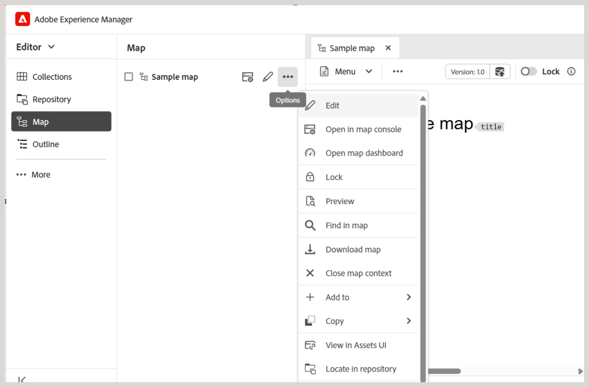

# Baixar arquivos {#id216MC0H0BE8}

Você pode baixar ativos, incluindo arquivos DITA e não DITA. Há várias maneiras de baixar ativos, alguns métodos são nativos do Adobe Experience Manager e outros são compatíveis com o Adobe Experience Manager Guides. Para obter informações sobre o download de ativos nativos do Adobe Experience Manager, consulte [Baixar ativos do Adobe Experience Manager](https://experienceleague.adobe.com/docs/experience-manager-cloud-service/assets/manage/download-assets-from-aem.html) na documentação do Adobe Experience Manager. A seção a seguir explica o mecanismo de download de arquivos no Experience Manager Guides.

## Baixar um arquivo de mapa DITA do Editor

Execute as seguintes etapas para baixar um arquivo de mapa DITA do Editor:

1. Navegue até o mapa DITA que deseja baixar.
1. Selecione o mapa DITA para abri-lo no Editor.

1. Na exibição Mapa, selecione o ícone **Opções** e escolha **Baixar mapa** da lista.

   

   A caixa de diálogo **Baixar mapa** é exibida.

   {width="300" align="left"}

1. Na caixa de diálogo Baixar mapa, escolha as seguintes opções:

   - **Usar linha de base**: selecione esta opção para obter uma lista de Linhas de Base criadas para o mapa DITA. Para baixar o arquivo de mapa e seu conteúdo com base em uma Linha de Base específica, selecione a Linha de Base na lista suspensa. Para obter mais detalhes sobre como trabalhar com Linhas de Base, exiba [Trabalhar com Linha de Base](generate-output-use-baseline-for-publishing.md#).

   - **Opções de hierarquia de arquivo**: você também pode usar a lista suspensa de hierarquia de arquivo para escolher como a estrutura de pastas será tratada para os arquivos de mapa baixados. As opções disponíveis são:

      - **Reter hierarquia de arquivos**: selecione esta opção na lista suspensa para reter a estrutura de pastas existente para os arquivos baixados.

        As opções disponíveis nesse método são as seguintes:

         - **Usar nome de arquivo GUID** - Baixa o arquivo de mapa com GUID como nome de arquivo.

         - **Usar nome de arquivo real** - Baixa o arquivo de mapa com seu nome de arquivo original.

      - **Nivelar hierarquia de arquivos**: selecione esta opção na lista suspensa para baixar todos os tópicos e arquivos de mídia referenciados em uma única pasta. Somente a opção **Usar nome de arquivo GUID** está disponível para arquivos de mapa ao usar este método.

   >[!NOTE]
   >
   > Também é possível baixar o arquivo de mapa sem selecionar nenhuma opção. Nesse caso, a última versão persistente dos tópicos e arquivos de mídia referenciados é baixada.

1. Selecione **Baixar**.

   A solicitação de download de mapa está na fila.

   

   Você receberá a seguinte notificação assim que o mapa estiver pronto para download.

   {width="550" align="left"}

1. Selecione **Baixar** para baixar o arquivo de mapa no formato `.zip`. Ou baixe depois na caixa de entrada do AEM.

   >[!NOTE]
   >
   > Por padrão, os mapas baixados permanecem por cinco dias na Caixa de entrada de notificação do Adobe Experience Manager.

## Baixar um arquivo de mapa DITA no painel Mapa

Depois de ter o arquivo de mapa DITA no repositório do Adobe Experience Manager, você pode baixar o arquivo de mapa junto com seus dependentes. Isso proporciona a flexibilidade de compartilhar o arquivo de mapa completo para edição, validação, revisão ou simplesmente criação de um backup offline.

Execute as seguintes etapas para baixar um arquivo de mapa DITA junto com seus arquivos dependentes:

1. Na interface do usuário do Assets, navegue até o mapa DITA que deseja baixar.

1. Selecione o mapa DITA para abri-lo no console do mapa DITA.

1. Selecione a guia **Tópicos** para exibir a lista de tópicos disponíveis no mapa DITA.

1. Na barra de ferramentas principal, selecione **Baixar mapa**.

   A caixa de diálogo Baixar mapa é exibida.

   {width="300" align="left"}

1. Selecione **Baixar**. Na caixa de diálogo Baixar mapa, escolha as seguintes opções:

   - **Usar Linha de Base**: selecione esta opção para obter uma lista de Linhas de Base criadas para o mapa DITA. Para baixar o arquivo de mapa e seu conteúdo com base em uma Linha de Base específica, selecione a Linha de Base na lista suspensa. Para obter mais detalhes sobre como trabalhar com Linhas de Base, exiba [Trabalhar com Linha de Base](generate-output-use-baseline-for-publishing.md#).

   - **Nivelar Hierarquia de Arquivos**: selecione esta opção para salvar todos os tópicos e arquivos de mídia referenciados em uma única pasta.

   >[!NOTE]
   >
   > Também é possível baixar o arquivo de mapa sem selecionar nenhuma opção. Nesse caso, a última versão persistente dos tópicos e arquivos de mídia referenciados é baixada.

1. Após selecionar o botão **Baixar**, a solicitação de download de mapa é enfileirada. Você receberá a seguinte notificação assim que o mapa estiver pronto para download.

   {width="550" align="left"}

   - Selecione **Baixar** para baixar o arquivo de mapa no formato .zip.

   - Selecione **Baixar Mais Tarde** para baixar o arquivo de mapa mais tarde. O link de download pode ser acessado na Caixa de entrada de notificação do Adobe Experience Manager. Selecione a notificação de mapa gerada na Caixa de entrada para baixar o mapa no formato .zip.

   >[!NOTE]
   >
   > Por padrão, os mapas baixados permanecem por cinco dias na Caixa de entrada de notificação do Adobe Experience Manager.

{width="300" align="left"}

Depois que o mapa for baixado, você poderá selecionar o mapa e usar o ícone Abrir na parte superior para abrir o relatório selecionado.

**Tópico pai:**&#x200B;[ Gerenciar conteúdo](authoring.md)
